# 1. Getting Ready

## 1.1 JetAcker Version Description

JetAcker is a ROS-based development robot, fully open-source, and uses an Ackermann steering structure suspension chassis.

The main controller supports **Jetson Nano, Jetson Orin Nano, Jetson Orin NX, and Raspberry Pi 5**. The chassis uses an STM32 controller, and the robot is equipped with high-performance hardware such as a LiDAR, depth camera, and microphone array. It is capable of applications including mapping and navigation, path planning, human-machine interaction, autonomous driving, deep learning, and voice interaction.

The packing list for each version is outlined below:

(1) Starter Packing List

<table class="docutils-nobg" border="1">
  <thead>
    <tr>
      <th style="text-align:center;">No.</th>
      <th style="text-align:center;">Product Name</th>
      <th style="text-align:center;">Quantity</th>
      <th style="text-align:center;">Picture</th>
    </tr>
  </thead>
  <tbody>
    <tr>
      <td style="text-align:center;">1</td>
      <td style="text-align:center;">JetAcker</td>
      <td style="text-align:center;">1</td>
      <td style="text-align:center;"></td>
    </tr>
    <tr>
      <td style="text-align:center;">2</td>
      <td style="text-align:center;">12.6V Lipo battery charger</td>
      <td style="text-align:center;">1</td>
      <td style="text-align:center;"></td>
    </tr>
    <tr>
      <td style="text-align:center;">3</td>
      <td style="text-align:center;">Card Reader</td>
      <td style="text-align:center;">1</td>
      <td style="text-align:center;"></td>
    </tr>
    <tr>
      <td style="text-align:center;">4</td>
      <td style="text-align:center;">Wireless handle</td>
      <td style="text-align:center;">3</td>
      <td style="text-align:center;">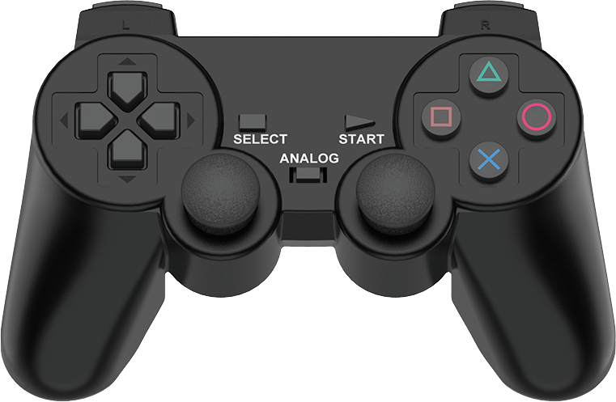</td>
    </tr>
    <tr>
      <td style="text-align:center;">5</td>
      <td style="text-align:center;">Screwdriver + Screw bag</td>
      <td style="text-align:center;">1</td>
      <td style="text-align:center;"></td>
    </tr>
    <tr>
      <td style="text-align:center;">6</td>
      <td style="text-align:center;">User Manual</td>
      <td style="text-align:center;">1</td>
      <td style="text-align:center;"></td>
    </tr>
  </tbody>
</table>

(2) Standard Packing list

<table class="docutils-nobg" border="1" style="text-align:center;">
  <thead>
    <tr>
      <th style="text-align:center;">No.</th>
      <th style="text-align:center;">Product Name</th>
      <th style="text-align:center;">Quantity</th>
      <th style="text-align:center;">Picture</th>
    </tr>
  </thead>
  <tbody>
    <tr>
      <td style="text-align:center;">1</td>
      <td style="text-align:center;">JetAcker</td>
      <td style="text-align:center;">1</td>
      <td style="text-align:center;"></td>
    </tr>
    <tr>
      <td style="text-align:center;">2</td>
      <td style="text-align:center;">12.6V Lipo battery charger</td>
      <td style="text-align:center;">1</td>
      <td style="text-align:center;"></td>
    </tr>
    <tr>
      <td style="text-align:center;">3</td>
      <td style="text-align:center;">Card Reader</td>
      <td style="text-align:center;">1</td>
      <td style="text-align:center;"></td>
    </tr>
    <tr>
      <td style="text-align:center;">4</td>
      <td style="text-align:center;">Wireless handle</td>
      <td style="text-align:center;">3</td>
      <td style="text-align:center;"></td>
    </tr>
    <tr>
      <td style="text-align:center;">5</td>
      <td style="text-align:center;">Screwdriver + Screw bag</td>
      <td style="text-align:center;">1</td>
      <td style="text-align:center;"></td>
    </tr>
    <tr>
      <td style="text-align:center;">6</td>
      <td style="text-align:center;">User Manual</td>
      <td style="text-align:center;">1</td>
      <td style="text-align:center;"></td>
    </tr>
    <tr>
      <td style="text-align:center;">7</td>
      <td style="text-align:center;">3D depth camera</td>
      <td style="text-align:center;">1</td>
      <td style="text-align:center;"></td>
    </tr>
    <tr>
      <td style="text-align:center;">8</td>
      <td style="text-align:center;">Tags(6.5*6.5cm)</td>
      <td style="text-align:center;">1</td>
      <td style="text-align:center;"></td>
    </tr>
    <tr>
      <td style="text-align:center;">9</td>
      <td style="text-align:center;">Blocks(3*3cm)</td>
      <td style="text-align:center;">1</td>
      <td style="text-align:center;"></td>
    </tr>
  </tbody>
</table>

(3) Advanced Packing list

<table class="docutils-nobg" border="1" style="text-align:center;">
  <thead>
    <tr>
      <th style="text-align:center;">No.</th>
      <th style="text-align:center;">Product Name</th>
      <th style="text-align:center;">Quantity</th>
      <th style="text-align:center;">Picture</th>
    </tr>
  </thead>
  <tbody>
    <tr>
      <td style="text-align:center;">1</td>
      <td style="text-align:center;">JetAcker</td>
      <td style="text-align:center;">1</td>
      <td style="text-align:center;"></td>
    </tr>
    <tr>
      <td style="text-align:center;">2</td>
      <td style="text-align:center;">12.6V Lipo battery charger</td>
      <td style="text-align:center;">1</td>
      <td style="text-align:center;"></td>
    </tr>
    <tr>
      <td style="text-align:center;">3</td>
      <td style="text-align:center;">Card Reader</td>
      <td style="text-align:center;">1</td>
      <td style="text-align:center;"></td>
    </tr>
    <tr>
      <td style="text-align:center;">4</td>
      <td style="text-align:center;">Wireless handle</td>
      <td style="text-align:center;">3</td>
      <td style="text-align:center;"></td>
    </tr>
    <tr>
      <td style="text-align:center;">5</td>
      <td style="text-align:center;">Screwdriver + Screw bag</td>
      <td style="text-align:center;">1</td>
      <td style="text-align:center;"></td>
    </tr>
    <tr>
      <td style="text-align:center;">6</td>
      <td style="text-align:center;">User Manual</td>
      <td style="text-align:center;">1</td>
      <td style="text-align:center;"></td>
    </tr>
    <tr>
      <td style="text-align:center;">7</td>
      <td style="text-align:center;">3D depth camera</td>
      <td style="text-align:center;">1</td>
      <td style="text-align:center;"></td>
    </tr>
    <tr>
      <td style="text-align:center;">8</td>
      <td style="text-align:center;">Tags(6.5*6.5cm)</td>
      <td style="text-align:center;">1</td>
      <td style="text-align:center;"></td>
    </tr>
    <tr>
      <td style="text-align:center;">9</td>
      <td style="text-align:center;">Blocks(3*3cm)</td>
      <td style="text-align:center;">1</td>
      <td style="text-align:center;"></td>
    </tr>
    <tr>
      <td style="text-align:center;">10</td>
      <td style="text-align:center;">7-inch LCD screen</td>
      <td style="text-align:center;">1</td>
      <td style="text-align:center;"></td>
    </tr>
    <tr>
      <td style="text-align:center;">11</td>
      <td style="text-align:center;">HDMI cable</td>
      <td style="text-align:center;">1</td>
      <td style="text-align:center;"></td>
    </tr>
    <tr>
      <td style="text-align:center;">12</td>
      <td style="text-align:center;">Data cable</td>
      <td style="text-align:center;">1</td>
      <td style="text-align:center;"></td>
    </tr>
  </tbody>
</table>

(4) Ultimate Packing List

<table class="docutils-nobg" border="1" style="text-align:center;">
  <thead>
    <tr>
      <th style="text-align:center;">No.</th>
      <th style="text-align:center;">Product Name</th>
      <th style="text-align:center;">Quantity</th>
      <th style="text-align:center;">Picture</th>
    </tr>
  </thead>
  <tbody>
    <tr>
      <td style="text-align:center;">1</td>
      <td style="text-align:center;">JetAcker</td>
      <td style="text-align:center;">1</td>
      <td style="text-align:center;"></td>
    </tr>
    <tr>
      <td style="text-align:center;">2</td>
      <td style="text-align:center;">12.6V Lipo battery charger</td>
      <td style="text-align:center;">1</td>
      <td style="text-align:center;"></td>
    </tr>
    <tr>
      <td style="text-align:center;">3</td>
      <td style="text-align:center;">Card Reader</td>
      <td style="text-align:center;">1</td>
      <td style="text-align:center;"></td>
    </tr>
    <tr>
      <td style="text-align:center;">4</td>
      <td style="text-align:center;">Wireless handle</td>
      <td style="text-align:center;">3</td>
      <td style="text-align:center;"></td>
    </tr>
    <tr>
      <td style="text-align:center;">5</td>
      <td style="text-align:center;">Screwdriver + Screw bag</td>
      <td style="text-align:center;">1</td>
      <td style="text-align:center;"></td>
    </tr>
    <tr>
      <td style="text-align:center;">6</td>
      <td style="text-align:center;">User Manual</td>
      <td style="text-align:center;">1</td>
      <td style="text-align:center;"></td>
    </tr>
    <tr>
      <td style="text-align:center;">7</td>
      <td style="text-align:center;">3D depth camera</td>
      <td style="text-align:center;">1</td>
      <td style="text-align:center;"></td>
    </tr>
    <tr>
      <td style="text-align:center;">8</td>
      <td style="text-align:center;">Tags(6.5*6.5cm)</td>
      <td style="text-align:center;">1</td>
      <td style="text-align:center;"></td>
    </tr>
    <tr>
      <td style="text-align:center;">9</td>
      <td style="text-align:center;">Blocks(3*3cm)</td>
      <td style="text-align:center;">1</td>
      <td style="text-align:center;"></td>
    </tr>
    <tr>
      <td style="text-align:center;">10</td>
      <td style="text-align:center;">7-inch LCD screen</td>
      <td style="text-align:center;">1</td>
      <td style="text-align:center;"></td>
    </tr>
    <tr>
      <td style="text-align:center;">11</td>
      <td style="text-align:center;">HDMI cable</td>
      <td style="text-align:center;">1</td>
      <td style="text-align:center;"></td>
    </tr>
    <tr>
      <td style="text-align:center;">12</td>
      <td style="text-align:center;">Data cable</td>
      <td style="text-align:center;">1</td>
      <td style="text-align:center;"></td>
    </tr>
    <tr>
      <td style="text-align:center;">13</td>
      <td style="text-align:center;">Circular 6-Microphone Array</td>
      <td style="text-align:center;">1</td>
      <td style="text-align:center;"></td>
    </tr>
  </tbody>
</table>

## 1.2 Hardware Installation and Power-on Preparation

### 1.2.1 Install Depth Camera

Align camera bracket's holes with those on 3D depth camera. Then secure these two components together with M3*6 flat-head machine screw.

:::{Note}
The lens is facing the front of robot.
:::


### 1.2.2 Install Control Board (Applicable to the robot version without Controller)

* **Jetson Nano Control Board**

(1) Fix the main control board with M2.5 * 8+6 single-pass copper columns and M2.5 * 12 double-pass copper columns, then attach the antennas and expansion board to the main control board with M2.5 * 6 round head machine screws.


(2) Use a screwdriver to remove four M4 * 6 round head screws on the main control board adapter plate, as shown on the right figure below.

(3) control adapter plate, as shown on the right figure below.


(4) Attach the main control board to the adapter plate with M2.5 * 6 round head screws.


(5) Use the M4 * 6 round head screws removed in step 2) to secure the adapter plate to the single-pass nylon columns.


* **Jetson Orin Nano/Jetson Orin NX Control Board**

(1) Attach the expansion board onto the main control board using M2.5 * 8+6 single-pass copper columns, M2.5 * 12 double-pass copper column and M2.5 * 6 round head screws.


(2) Secure the antennas with M2.5 * 8+6 single-pass copper columns, M2.5 * 12 double-pass copper columns and M2.5 * 6 round head screws.


(3) Use a screwdriver to remove the four M4 * 6 round head screws on the adapter plate.


(4) Attach the main control board to the adapter plate with M2.5 * 6 round head screws.


(5) Use the M4 * 6 round head screws removed in step 3) to secure the adapter plate to the single-pass nylon columns.


* **Raspberry Pi5 Control Board**

(1) Use a screwdriver to remove the four M4 * 6 round head screws on the adapter plate.


(2) Mount the M2.5 * 12 double-pass copper columns on the adapter plate with M2.5 * 6 round head screws.


(3) Use the M4 * 6 round head screws removed in step 1) to secure the adapter plate to the single-pass nylon columns.


(4) Secure the four M2.5 * 5+6 singe-pass nylon columns to the adapter plate suing M2.5 * 6 round head screws.


(5) Press down firmly on the push-type screw of the heat sink to mount it on the main board.


(6) Attach the main board to the adapter plate using double-pass nylon columns.


(7) Insert the expansion board into the pins of Raspberry Pi 5.

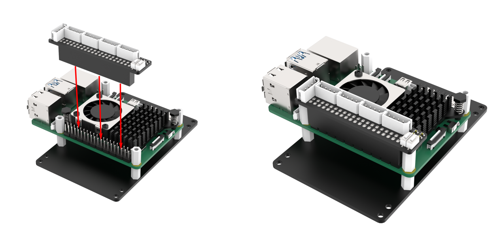

(8) Attach the adapter plate to the robot with M2.5 * 6 round head screws.


### 1.2.3 Install 7-inch LCD Screen

(1) Install 7-inch LCD screen to columns with M4 * 20 round machine screws.


(2) Connect HDMI cable to HDMI interface on the 7-inch LCD screen, and connect power cable to CTOUCH port.

:::{Note}
7-inch LCD screen doesn't support touch control if the cable is not connected to CTOUCH port.
:::


### 1.2.4 Wiring Instructions (Key Points)

:::{Note}
Upon receiving the robot, it is necessary to follow the wiring tutorials below to connect the control board. Each accessory must be properly connected its corresponding port; otherwise, the robot's functions will not work properly.
:::

* **Wiring Instructions（Jetson Nano Controller）**

Please refer to the table below and connect each accessory to its corresponding port on Jetson Nano board. If any of the listed accessories are not included in your kit, please ignore the corresponding port number.


| **NO.** | **Name** |
|:--:|:--:|
| 1 | Jetson Nano Main Controller Power Supply Interface (DC round head cable) |
| 2 | Display HDMI Interface |
| 3 | Reserved Custom Expansion Interface |
| 4 | USB Hub Communication Interface |
| 5 | Display Power Supply Interface |
| 6 | Depth Camera Interface |

* **USB HUB**


| **NO.** | **Name** |
|:--:|:--:|
| 7 | Lidar port |
| 8 | Speaker port |
| 9 | Communication port of Mini STM32 controller |
| 10 | Microphone array port |
| 11 | Jetson Nano communication port (connected to port 4) |
| 12 | USB HUB power supply port (supplied by mini STM32 controller) |

* **Wiring Instructions（Jetson Orin Nano/Jetson Orin NX Control Board）**

Please refer to the table below and connect each accessory to its corresponding port on Jetson Orin Nano board and USB hub. If any of the listed accessories are not included in your kit, please ignore the corresponding port number.


| **NO.** | **Name** |
|:--:|:--:|
| 1 | Jetson Orin Nano/ Jetson Orin NX Main Controller Power Supply Interface **(DC round head cable)** |
| 2 | Display HDMI (convert to DP) Interface |
| 3 | Reserved Custom Expansion Interface |
| 4 | USB Hub Communication Interface |
| 5 | Display Power Supply Interface |
| 6 | Depth Camera Interface |


| **NO.** | **Name** |
|:--:|:--:|
| 7 | Lidar port |
| 8 | Speaker port |
| 9 | Communication port of Mini STM32 controller |
| 10 | Microphone array port |
| 11 | Jetson Orin Nano communication port (connected to port 4) |
| 12 | USB HUB power supply port (powered by mini STM32 controller) |

* **Wiring Instructions（Raspberry Pi 5 Control Board）**

Please refer to the table below and connect each accessory to its corresponding port on Raspberry Pi 5 board and USB hub. If any of the listed accessories are not included in your kit, please ignore the corresponding port number.


| **NO.** | **Name** |
|:--:|:--:|
| 1 | Reserved Custom Expansion Interface |
| 2 | USB Hub Communication Interface |
| 3 | Display Power Supply Interface |
| 4 | Depth Camera Interface |
| 5 | Ethernet Interface |


| **NO.** | **Name** |
|:--:|:--:|
| 6 | Lidar port |
| 7 | Speaker port |
| 8 | Communication port of mini STM32 controller |
| 9 | Microphone array port |
| 10 | Raspberry Pi 5 communication port (connected to port 2) |
| 11 | USB HUB power supply port (supplied by mini STM32 controller) |


| **NO.** | **Name** |
|:--:|:--:|
| 12 | Power supply for ROS main controller (Raspberry Pi) |
| 13 | Micro HDMI interface (connect to the HDMI interface of the 7-inch LCD display) |

## 1.3 Charging Instructions and Battery Usage Guide

It is mandatory for the robot to disconnect power cables during transportation, and the battery is not fully charged. Before the first use, users need to connect the battery wires and then proceed with charging. The charging duration is approximately 3 hours. Charging the robot from 10V to 12.3V takes approximately 3 hours.

### 1.3.1 Charging Instructions

(1) Charge battery with the provided charger. Turn off the switch on the power supply board and never use it while charging

(2) Indicator on charger changes green when it connects to battery but not plugged into a power outlet. Indicator turns red

(3) Do not directly connect the charger to DC power port of **Jetson Nano** board, otherwise the board will be burned.


(4) Unplug charger in time to avoid overcharging.

(5) If battery voltage drops below 10V, the buzzer will sound an alarm. Please charge the battery promptly.

(6) In case robot won't be used in a long period of time, please fully charge battery first, then disconnect battery wires.

(7) Always keep battery in cool and dry environment, otherwise battery lifespan gets shortened. Never intentionally hit, throw or step on your Lipo battery.

(8) Avoid using the battery in environments with strong static electricity or a strong magnetic field, as this may damage the safety protection device of the battery.

(9) Do not plug the battery into a power outlet, and do not use metal objects to connect the positive and negative poles of the battery.

(10) If robot won't be used in a long period of time, please fully charge battery.

(11) It is strictly prohibited to modify, weld, or convert battery charger or Lipo battery.

(12) Keep battery away from high temperature and liquid to prevent overheating, fire and damp, which result in function decline.

:::{Note}
Warning tip: please strictly follow the guide. Our company is not responsible for any product damage, economic losses and accident caused by improper use.
:::

### 1.3.2 Charging Operation

(1) Make sure the switch is in the closed position.


(2) Connect the battery wires ensuring that each wire matches its corresponding color.

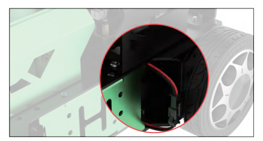

(3) Connect the special charger to DC port of the power supply board.


(4) Red indicator means robot is being charged. It will turn green after robot is fully charged. It takes about 4 hours to fully charge the battery.

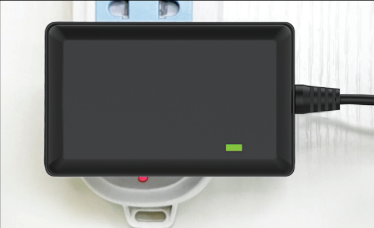

:::{Note}
Please unplug the charger in time once battery is fully charged to avoid overcharging
:::

## 1.4 First Power-on

After the robot installation is finished, this section begins the learning of robot's start-up state and functionality testing of each module. Following by this, you can proceed to the next chapter to learn about with the operations for app control and handle control.

For exploring its functionality and view the program, you need to connect to the robot's system through the remote connection tool, please refer to the subsequent content under [1.6 Development Environment Setup and Configuration](#anchor_1_6).

### 1.4.1 Usage Guideline

(1) To ensure the stable performance of the robot, when the battery voltage is below 10V, charge the robot before proceeding with operations.

(2) Avoid placing the robot at the edge of a high platform to prevent it falling and get damaged.

(3) Using the robot on a flat platform.

(4) Do not stack the servos on robotic arm to avoid the servo damage due to the motor being stuck when powered on.

(5) Maintain a certain safety distance from the robot to prevent injury in case of contact after powering on.

(6) The test should be conducted under the conditions that the wiring is correct, the controller receiver is properly connected, the sound is turned on at the top-right corner of the desktop, and the robot is fully charged.

(7) In terms of Lidar, different Lidar models also have different performances when starting up. The left image below is A1 Lidar and the right is the G4 Lidar:

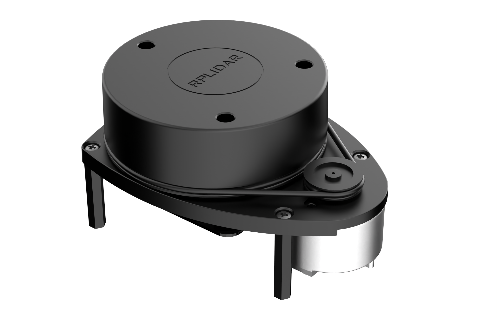


If you choose the ultimate kit with Lidar G4, the Lidar will spin for a few round, then stop until the robot boots up successfully.

For other robot kits with Lidar A1, you need to push the switch to the "**ON**" side. The Lidar will continue to rotating after a short period of time after being turned on.


### 1.4.2 Robot Startup State Instructions

(1) Please the robot on a smooth ground, and press the switch.


(2) The LED1 on expansion board flashes blue. When buzzer emits a beep, this means both ROS configuration and device are ready for use.

* **The LED** **indicator** **for Jetson Nano** **and** **Jetson Orin Nano** **versions** **is** **as pictured:**


* **The LED** **indicator** **for** **Raspberry Pi5** **version is as pictured:**


(3) After robot boots up successfully, robot is default to AP direct connection mode and generates a WiFi starting with **"HW"**. The initial WiFi password is **"hiwonder"**.


:::{Note}
If you can not find the generated WIFI, please troubleshoot from the following:

* Follow above three steps in **"Robot Startup State Instructions"** for troubleshooting.
* If the LED1 on expansion board is flashing blue and keeps on, it may be set to LAN mode. In this case, please press and hold the Key1 button for 5-10 seconds. If LED1 starts flashing, indicating that a WI-Fi starting with **"HW"** is generate
* If the KEY1 button doesn't start flashing after the above operation, SD card or SSD may not be detected, try re-inserting the SD card or SSD.
* he LED1 on expansion board always remains on after re-inserting the SD card or SSD, it may indicate an issue with the SD card or SSD.
* If you have completed all five steps above and the issue persists, it may lie with Raspberry Pi board or Jetson board. Please reach out to our support team via email at **support@hiwonder.com** for further assistance.

:::

(4) After the 7-inch display is installed, it will display the system image after the robot starts up. If you're the user of advanced kit or ultimate kit, you will also hear a **"I'm ready"** broadcast.


After the robot starts up, the normal status for each module it outlined in the table below:

| **Module** | **Operation** | **Outcome** |
|:--:|:--:|:--:|
| LED on expansion board | Observe the LED status | The robot is set to AP direct connection mode by default. The flashing blue LED indicated that the network service configuration has been completed. |
| Buzzer | Examine the short beep | A short beep from the buzzer indicates that the onboard hardware of the expansion board are functional. |
| Lidar | Observe the rotation status | Lidar model: 1) Lidar G4: Upon initial startup, it will rotate for a few round, then stop. After the robot startup is complete, it resumes rotating. 2) Lidar A1: it will keep rotating after a brief wait following startup. |
| 7-inch HD touch screen | 1) Tap the icons on system desktop to confirm the following: 2) Whether the HDMI cable is connected normally. 3) Whether the power cable is connected to the C-TOUCH interface of the screen. | The screen can display the system desktop and can be touched normally. |
| KEY1 button on expansion board | Switch the network status | After connecting to STA LAN mode via app, long press KEY1 and then check if LED1 indicator flashes. |
| Microphone, sound card, speaker | After turning on the robot, say **"Hello, Hiwonder"**. | The robot responds **"I' m here"**. (the voice function is only targeted for the user who purchased advanced kit and ultimate kit.) |
| Depth camera + robotic arm | 1) Connect to the robot via app. 2) Open **"Robot Control"** to view the live camera feed from the depth camera. 3) Swipe the screen to simultaneously control the servo on the pan-tilt. 4) Slide the robot arm control buttons for controlling each joint's servo. | Display the live camera feed and rotate. |
| STM32 controller + DC encoder geared motor | After robot powers on, perform the **"Robot control"** function on app using the wireless handle or mobile phone | Robot is able to operate normally. |

## 1.5 APP Control

Users can control robot using the **WonderAi** mobile app. This chapter will elaborate the app operations.

Reminder: if you purchased the robot kit without Jetson or Raspberry Pi board, please first go through the content from [1.6 Development Environment Setup](#anchor_1_6) and Configuration to [1.6.7 Robot Version Configuration Tool Instructions](#anchor_1_6_7).

### 1.5.1 Preparation

* **APP Installation**

:::{Note}
* Please ensure all permissions are granted for the APP, otherwise certain app functions may be affected or unavailable.
* Turn on location and Wi-Fi before using the APP.

:::

(1) **Android user:** the installation package can be found in [APP Installation Package](https://play.google.com/store/apps/details?id=com.hiwonder.wonder_ai) and please transfer it to your phone for downloading.

(2) **iOS** **user:** you can download **"WonderAi"** in App Store.


* **Connection Mode Introduction**

There are two network modes, including AP direct connection mode and STA LAN mode.

(1) **AP direct connection mode**: Jetson Nano generates a WiFi which can be connected by phones. This WiFi has no internet access.

(2) **STA** **LAN mode**: Jetson Nano actively connects to specific WiFi. You can access Internet in this mode.

The default connection mode is AP direct connection mode. Whether you choose AP direct connection mode or STA LAN mode, robot performs the same.

It is recommended to experience robot games under **Direct Connection Mode**.

* **Direct Connection(Must Read)**

iOS system requires version 11.0 or above, and Android system requires version 5.0 and above

Android users should ensure that all permissions for app must be enabled in your phone settings ; otherwise, it may affect the normal functionalities.

(1) Open **"WonderAi"** APP, then tap **"Advanced->JetAcker"** in sequence


(2) Click **"+"** button, and select **"Direct Connection Mode"**.


(3) Next, click **"Go to connect device hotspots"** to join the WiFi generated by JetAcker.


(4) The device WiFi starts with **"HW"** and the password is **"hiwonder"**.


:::{Note}
For iOS user, please do not return back to the APP until the WiFi icon appears above, otherwise JetAuto cannot be searched. If JetAcker cannot be searched, please click to refresh.
:::

(5) Return to the APP, and click the robotic icon to enter home interface.


:::{Note}

If you are informed of "**No Internet Connection. Whether to keep connection**", just select "**Keep Connection**".

:::

(6) When the following window pops up, it means that you have selected the wrong version. Click **"Confirm"**, then the APP will automatically switch to the home interface of the right version.


(7) The mode selection interface is as pictured:


For detailed usage instructions for each mode, please refer to the content in [1.5.2.APP Function Overview](#anchor_1_5_2).

<p id="anchor_1_5_1_3"></p>

* **LAN Mode Connection (Optional)**

(1) Firstly, join 5G network, for example **"Hiwonder_5G"**. (The router supporting dual-frequency will distinguish the Wi-Fi name by default under the situation that 2.4 G and 5G are separated. For example, Wi-Fi **"Hiwonder"** is 2.4 frequency band while **"Hiwonder_5G"** is 5G frequency band)


Open WonderAi, then click **"Advanced->JetAcker"** in sequence.


(2) Click **"+"** button at the lower right corner, then select **LAN Mode**.

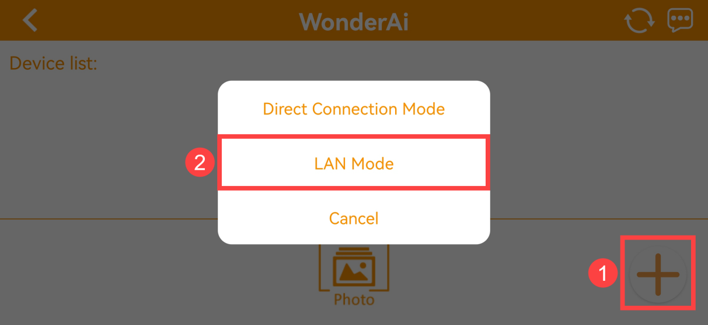

(3) Continue, enter the Wi-Fi password. Having entered the password, click **"OK"**. Please ensure the password you enter is correct.


(4) Click **"Go to connect device hotspots"**.


(5) Join the WiFi starting with HW, and input the password **"hiwonder"**. After connection, return back to the APP interface.


(6) In this point, WonderAi APP is connecting to the robot.


(7) After a while, the robotic icon will show up. And at the same time, LED1 on the expansion board will light up.


(8) By long pressing the robotic icon, you can check the IP address and ID.


(9) You can search for its IP address through the remote connection tool and establish a connection. For detailed instructions, please refer to [**"1.6  Development Environment Setup"**](#anchor_1_6).

(10) To switch from LAN mode back to direct connection mode, press and hold the KEY1 button on the expansion board until the blue light flashes, indicating the switch is complete.

<p id="anchor_1_5_2"></p>

### 1.5.2 APP Function Overview

There are 5 games on APP, including robot control, lidar, object tracking, Intelligent patrolling and AR.


The brief instruction for each game is shown in the table below:

| **Icon** | **Game** | **Description** |
|:--:|:--:|:--:|
|  | Robot Control | Control the movement of the robot. |
|  | Lidar | There are three lidar functions, including avoid obstacle and lidar following. |
|  | Object Tracking | Select the color for the target, allowing the robot to track the target. |
|  | Object Tracking | Pave the line, choose the line color as the recognizable color and the robot will move along the line. |
|  | AR | The tag can display the set 3D image within the live camera feed. |

### 1.5.3 Robot Control


① The buttons on the left side are forward, backward, and speed adjustment from the top to the bottom.

② In the middle is the live camera feed (user can drag the screen to adjust the camera pan-title angle).

③The buttons on the right side are used to control steering and adjusting the pan-tile angle.

The top menu bar icons are used to screenshot, close the navigation bar, and to switch to full-screen mode (this function is typically used with the wireless handle control)

### 1.5.4 Lidar

:::{Note}
* Once the game starts, ensure you place the robot in a spacious area to allow for sufficient motion space.
* In both **"Avoid obstacle"** and **"Lidar following"** modes, the robot will detect obstacles within its frontal 90° sector area.
:::

* **Avoid Obstacle**

Click **"Avoid obstacle"** button to start this game. Then the robot will keep going forward. When detecting the obstacle, the robot will turn automatically to avoid the obstacle.

* **Lidar Following**

Start the game. When detecting the obstacle, the robot will adjust its posture to keep a certain distance between it and the obstacle.


### 1.5.5 Target Tracking

:::{Note}
* Lower the camera and position both the robot and the target on the same surface. Then, move the object around to enable the robot to track it effectively.
* Make sure there are no other obstacles within the camera's field of view to prevent any interference with the game's effectiveness.
:::

(1) Click **"Target Tracking"** on the mode selection screen to enter the operation interface for this activity.


(2) Firstly, click **"pick"**, then drag the red circle on the camera returned image to the target to pick the color.


(3) Then click **"ok"** button. The color you pick will display at the right box.


(4) Click **"Start"** button. Then you can move the object, and JetAcker will move with it.


### 1.5.6 Line Following

:::{Note}
* Before the game starts, paste the tape on the ground to set the path, and place the robot on it.
* After the game starts, please remove other objects in target color from the field of view of the camera, otherwise the game will be influenced.
:::

(1) Click **"Line Following"** on the mode selection screen to enter the operation interface for this activity.


(2) In this case, red tape will be used an example for demonstration. Click **"pick color"**, then drag the red circle on the camera returned image to the path to pick the color.


(3) Next click **"confirm"** button. The color you pick will display at the right box.


(4) Lastly, click **"Start"** button, then the robot will move along the path.


### 1.5.7 AR

Click **"AR"** on the mode selection screen to enter the operation interface for this activity. Place the tag within the field of view, and click the 3D pattern you want, for example **"bicycle"**. Then the 3D bicycle will be overlaid on the April Tag.


<p id="anchor_1_6"></p>

## 1.6 Development Environment Setup and Configuration

### 1.6.1 Remote Connection Tool Introduction & Installation

Regarding the two methods of remote control for the robot: graphical and command-line control.

NoMachine and VNC are graphical remote control software. After installation, you can directly control the robot on the computer by connecting to the robot's hotspot. For the Jetson Nano, Jetson Orin Nano, and Jetson Orin NX main controllers, NoMachine is used for connection, while the Raspberry Pi 5 main controller uses VNC. With these two software options, users can clearly see the robot's system desktop, making it easier to operate intuitively.

In contrast to NoMachine and VNC, MobaXterm is an SSH connection that focuses more on command-line control. It does not display the full desktop of the robot system, only a command-line window. For users who are familiar with command-line operations, MobaXterm allows quicker control of the robot via commands while reducing computational load and memory usage.

MobaXterm also has a built-in lightweight X11 server that can directly display graphical application interfaces. Regardless of which control board you use, MobaXterm's SSH connection method is applicable.

In short, NoMachine and VNC are suitable for scenarios that require intuitive operation, while MobaXterm is better for quickly executing commands. Choose the software that best fits your remote control needs.

**Before operation,** **users with desktop computers should prepare a wireless network card that supports the 5G frequency band.**

* **NoMachine Installation**

:::{Note}
This tool is applicable to Jetson controller versions.
:::

(1) Enter the same directory as this document to open the installation package [nomachine_8.4.2_10_x64](resources_download.md).

(2) Click **"Next"**.

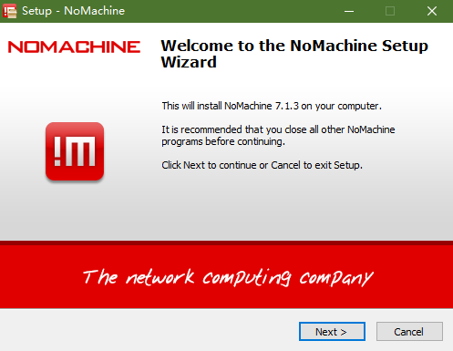

(3) Then click **"I accept the agreement"** in the prompt box, and set the **"Language"** as **"English"**, then click **"Next"**.


(4) Remain the default installation path. Click **"Next"**.


(5) Click **"Yes"** to restart the computer (**Please do not skip this step**).


* **VNC Installation**

:::{Note}
This tool is applicable to Raspberry Pi 5 version.
:::

(1) Enter the same directory as this document to open the installation package [VNC-Viewer-6.17.731-Windows](resources_download.md) . In the pop-up dialog box, select **'English'** as the installation language and click the **'OK'** button.


(2) Click **"Next"**.

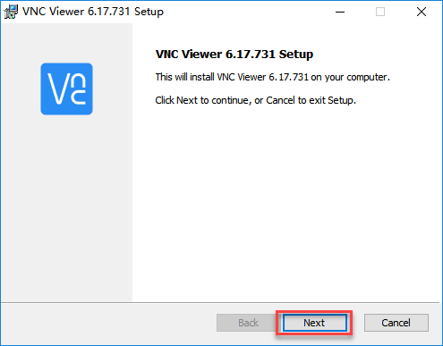

(3) Then click **"I accept the agreement"** in the prompt box, and continue.


(4) Click **"Install"**.


(5) Click **"Finish"** to complete the installation.

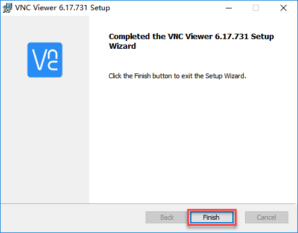

(6) Once VNC is connected, simply click-on to access it.

* **MobaXterm Installation**

:::{Note}
This tool is applicable to any robot version.
:::

(1) Locate the [MobaXterm](resources_download.md) installation package .


(2) Click **"Next"**.


(3) Then click **"I accept the agreement"** in the prompt box, and click **"Next"**.


(4) Keep the default installation position,and click **"Next"**.

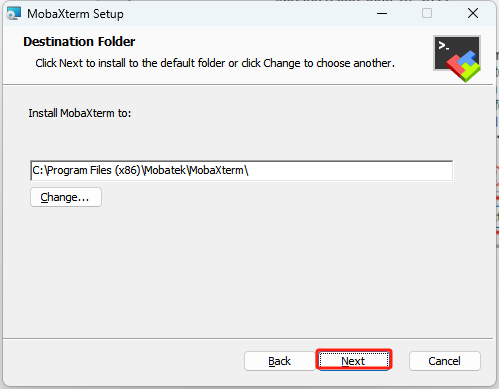

(5) Click **"Install"**.


<p id="anchor_1_6_2"></p>

### 1.6.2 AP Direct Connection Mode Operations

**AP Direct Connection mode:** **The development board** **can** **generate a hotspot** **that can be connected to by your phone (it cannot access the external network).**

* **Establish Connection via NoMachine**

(1) The robot is set to AP direct connection mode by default. After booting up successfully, it will create a hotspot starting with **"HW"**. As the picture shown below, the connection password is **"hiwonder"**.

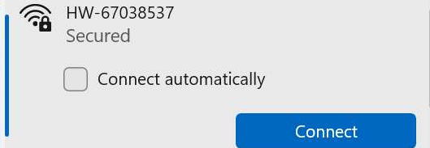

(2) Open NoMachine, input the IP address **"192.168.149.1"** in the search bar in AP mode, and click **"Configure connection to new host 192.168.149.1"**.


(3) After opening, follow these steps: click on **Address -> Name, enter "**robot**" -> Host, enter "**192.168.149.1**" -> click Add**.


(4) Fill in the provided username and password based on the control board version：

* Initial configuration for Jetson Nano board:

username: **hiwonder**, password：**hiwonder**

* Initial configuration for Jetson Orin Nano board:

username: **ubuntu**, password：**ubuntu**

* Initial configuration for Jetson Orin NX board:

username: **ubuntu**, password: **ubuntu**

(5) Check the **"Save this password"** box, then click the **Login** button. Below will take **"Jetson Nano"** version as an example:

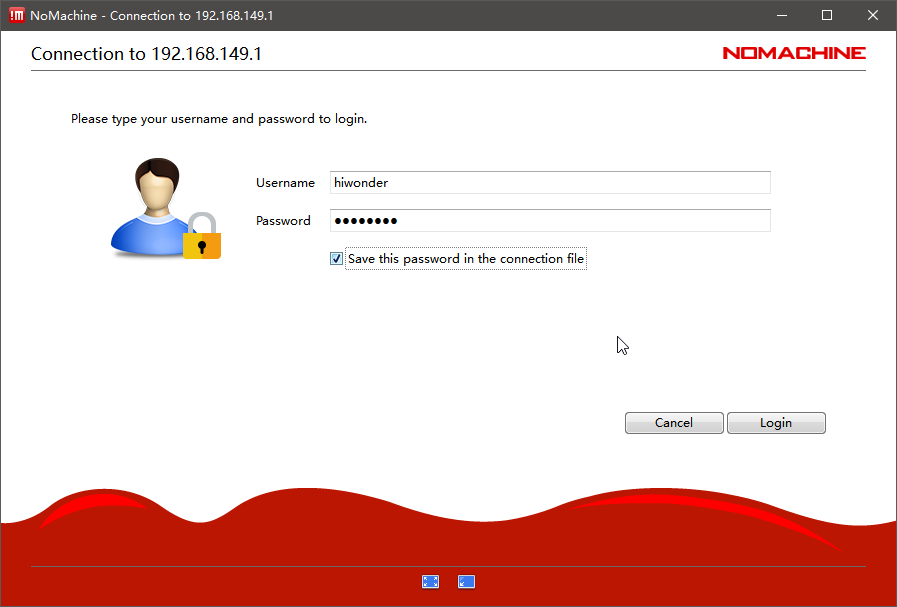

(6) Afterwards, you will see the remote desktop of the Jetson Nano open up.


* **Establish Connection via VNC**

(1) Search for and connect to the hotspot starting with **"HW"**, as shown in the following figure. The password for the connection is **hiwonder**.


(2) Next, open VNC software. In the VNC Viewer, enter the IP address **"192.168.149.1"** in the search bar in AP mode, and press Enter. If you receive a security warning, click **'Continue'**


(3) Wait for the connection window to pop up, then enter the following in order: Username -> Password -> Click **'Remember password'** -> Click **'OK'**:

Username: **pi**

Password: **raspberrypi**


(4) Once connected, the Raspberry Pi's remote desktop will appear as shown in the image below.


* **Establish Connection via MobaXterm**

This section takes **"AP Direct Connection"** as an example to illustrate. The same operation method is applicable to LAN mode. You just need to change the IP address.

(1) In the main interface, click **"Session"** on the top right corner to create a session. In the session interface, enter the recorded Raspberry Pi 5 IP address **"192.168.149.1"**, and then click **"OK"**.

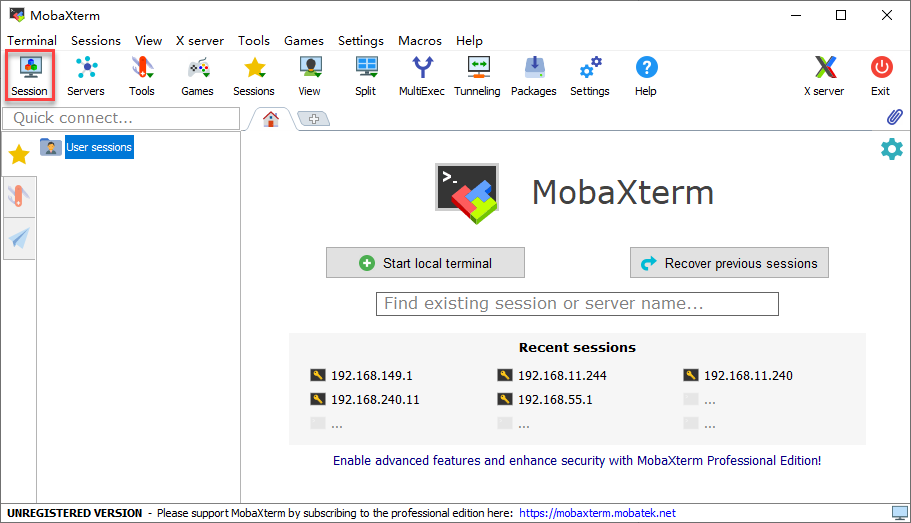

(2) Choose SSH.


(3) Enter the fixed IP address in AP direction connection mode:

**192.168.149.1**


(4) As pictured, you need to select the third option.


(5) The interface will prompt users to enter the login as and password. It is necessary to fill in the username and password based on the control board version (Below will take Jetson Nano version as an example)：

* Initial configuration for Jetson Nano board:

username: **hiwonder**, password：**hiwonder**

* Initial configuration for Jetson Orin Nano board:

username: **ubuntu**, password：**ubuntu**

* Initial configuration for Jetson Orin NX board:

username: **ubuntu**, password: **ubuntu**

* Initial configuration for Raspberry Pi 5 board:

username: **pi**, password: **raspberrypi**


:::{Note}
* The username must be entered in lowercase mode. Even if the username includes uppercase letters during setup, it must be entered in lowercase when logging in.
* The username will be visually displayed. After entering it, press Enter to proceed to the password input.
* The password will not be visually displayed. After entering the password, press Enter to log in.

:::

(6) When the input password is correct, you will get access to the system. The system interface is as pictured:


### 1.6.3 LAN Mode Connection

**STA LAN Mode:** **the development board is able to actively connect to the designated hotpot/ WIFI. (It can connect external network)**

:::{Note}
* If you are uncertain how the robot connect the robot to the STA local network and obtains an IP address, it is recommended to connect via the app.
* The system image has made special configurations for WI-FI, so the WI-FI option cannot be directly selected from the menu bar, as shown in the image below. This does not affect the normal operation of the robot. Users can refer to the  [1.6.4 Method to Restore WI-FI Option in Menu Bar](#anchor_1_6_4)     for the necessary settings.
* This section will use connecting to the **"Hiwonder_5G"** Wi-Fi as an example. Users should refer to the Wi-Fi that you have set up themselves when configuring the local network connection.

:::

* **Establish Connection via Nomachine**

(1) In LAN mode, search for and connect to the Wi-Fi you have set up on the computer, as shown in the image below.

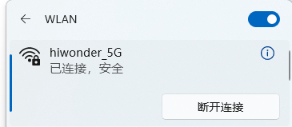

(2) Open NoMachine, input the IP address **"192.168.11.228"** in the search bar in AP mode, and click **"Configure connection to new host 192.168.11.228"**.

:::{Note}
If you are unsure the IP address, please refer to[1.5.1 Preparation/LAN Mode Connection (Optional)](#anchor_1_5_1_3) .
:::


(3) After opening NoMachine, change Name to **"Robot"** and click **"Add"**.


(4) Then double the name **"Robot"**.


(5) Fill in the provided username and password based on the control board version：

* Initial configuration for Jetson Nano board:

username: **hiwonder**, password：**hiwonder**

* Initial configuration for Jetson Orin Nano board:

username: **ubuntu**, password：**ubuntu**

* Initial configuration for Jetson Orin NX board:

username: **ubuntu**, password: **ubuntu**

(6) Check the **"Save this password"** box, then click the Login button.

Below will take **"Jetson Nano"** version as an example:


(7) Afterwards, you will see the remote desktop of the Jetson Nano open up.


* **Establish Connection via VNC**

(1) In LAN mode, search for and connect to the Wi-Fi you have set up on the computer, as shown in the image below.


(2) Next, open VNC software. In the VNC Viewer, enter the IP address **"192.168.11.228"** in the search bar in LAN mode, and press Enter. If you receive a security warning, click **'Continue'**.


(3) Wait for the connection window to pop up, then enter the following in order: Username -> Password -> Click **'Remember password'** -> Click **'OK'**:

**Username: pi**

**Password: raspberrypi**


(4) Once connected, the Raspberry Pi's remote desktop will appear as shown in the image below.


* **Establish Connection via MobaXterm**

(1) n the main interface, click **"Session"** on the top right corner to create a session. In the session interface, enter the recorded robot IP address **"192.168.11.228"**, and then click **"OK"**.


(2) Choose SSH.


(3) Enter the IP address obtained in LAN mode: 192.168.11.228


(4) As pictured, you need to select the third option.


(5) The interface will prompt users to enter the login as and password. It is necessary to fill in the username and password based on the control board version (Below will take Jetson Nano version as an example)：

* Initial configuration for Jetson Nano board:

username: **hiwonder**, password：**hiwonder**

* Initial configuration for Jetson Orin Nano board:

username: **ubuntu**, password：**ubuntu**

* Initial configuration for Jetson Orin NX board:

username: **ubuntu**, password: **ubuntu**

* Initial configuration for Raspberry Pi 5 board:

username: **pi**, password: **raspberrypi**


:::{Note}
* The username must be entered in lowercase mode. Even if the username includes uppercase letters during setup, it must be entered in lowercase when logging in.
* The username will be visually displayed. After entering it, press Enter to proceed to the password input.
* The password will not be visually displayed. After entering the password, press Enter to log in.

:::

(6) When the input password is correct, you will get access to the system. The system interface is as pictured:


<p id="anchor_1_6_4"></p>

### 1.6.4 Method to Restore WI-FI Option in Menu Bar

(1) Double click on to open the command-line terminal.

(2) Enter the command **"cd hiwonder-toolbox/"** and press Enter to access the configuration file directory.

```
cd hiwonder-toolbox/
```


(3) Enter the command **"vim hiwonder_wifi_conf.py"** and press Enter to open the configuration file.

```
vim hiwonder_wifi_conf.py
```

(4) Firstly, you need to change the value of **"HW_WIFI_MODE"** to 2. The value **"1"** represents AP direction connection mode, while **"2"** represents LAN mode.


(5) Then, modify **"HW_WIFI_STA_SSID"** and **"HW_WIFI_STA_PASSWORD"** to match the name and password of your router's WIFI.

:::{Note}
Choosing a 5G Wi-Fi signal will provide higher transmission speeds. If you experience lag when connected to a regular Wi-Fi network, you can switch to a 5G Wi-Fi network for better performance.
:::


(6) Press **"Esc"** and enter **":wq"** to save and exit the file.


(7) Enter the command **"sudo systemctl restart hw_wifi.service"** to restart the robot's Wi-Fi service. After a short wait, the LED1 on the expansion board will remain solid.

```
sudo systemctl restart hw_wifi.service
```

:::{Note}

After restarting the robot's Wi-Fi service, NoMachine will automatically disconnect. This is because the device has been set to LAN mode, and the connection to a different Wi-Fi network causes the IP address to change from the original one.

:::

(8) First, connect your phone to the 5G network. In this case, we will use the **"Hiwonder_5G"** Wi-Fi as an example.


(9) Open **"WonderAi"**. Choose **"Advanced-> JetAcker"** in sequence.


(10) Wait for a moment. The main interface will display the corresponding robot icon and name.


(11) Long and hold the robot icon in app to view the IP address and device ID assigned to the robot.


(12) Enter the obtained IP address into NoMachine to establish a remote connection. For detailed instructions, please refer to the tutorial [1.6.2 AP Direct Connection Mode Operations](#anchor_1_6_2)

(13) To switch to direct connection mode, re-edit the configuration file, comment out all the lines, then save and restart the robot.

### 1.6.5 USB Cable Fixed IP Connection

:::{Note}
This section is only supported for Jetson series main control versions! It is not supported for Raspberry Pi 5 main control versions!
:::

The robot can improve the remote operation smoothness through enabling remote NDIS compatible device, using the fixed IP **"192.168.55.1"**. This method does not require connecting to the robot's hotspot or WiFi in the local network. The specific operation steps are as follows:

(1) Connect the Jetson Nano board to your computer using Micro-USB cable.


(2) For Jetson Orin Nano board, connect it to the computer using a Type-C cable.


(3) Right click **"This computer"** to select **"Manage"**.


(4) Click on **"Device Manager"**. In the **"Network Adapters"** section, locate the NDIS driver. Right-click to select **"Update Driver"**.


(5) After the driver is installed, you need to refer to either [1.6.2 AP Direct Connection Mode Operations](#anchor_1_6_2) to log in the system. You only need to modify the address bar to **"192.168.55.1"**.

<p id="anchor_1_6_6"></p>

### 1.6.6 System Command-line Terminal Introduction

During the subsequent chapters of the course, it is especially important to pay attention to the ROS version corresponding to the command line terminal. If an incompatible terminal is opened, entering commands will result in errors. For example, entering ROS1 commands in a ROS2 terminal, and so on.

The following sections will introduce the terminals for Jetson Nano, Jetson Orin Nano, Jetson Orin NX, and Raspberry Pi 5 versions.

* **Jetson Nano Terminal**


The command-line terminal within the red box is for ROS1 environment :


The command-line terminal within the yellow box is for ROS2 environment :


* **Jetson Orin Nano Version**

Jetson Orin Nano version only has the command-line terminal for ROS2 environment.

* **Jetson Orin NX Version**

Jetson Orin NX version only has the command-line terminal for ROS2 environment.

* **Raspberry Pi5 Version**


The image above shows the ROS2 environment command-line terminal, which includes robot-related functions and features. It will be frequently used in the subsequent courses, and the icon style is shown in the image below:


The box in the above image highlights the system's command-line terminal, which contains system files related to the robot. It is located in the task toolbar at the top of the system interface and is used less frequently.

:::{Note}
In the subsequent operations, please follow the tutorial steps carefully and use the appropriate command-line terminal to execute commands, as failure to do so may affect the robot's functions and features.
:::

<p id="anchor_1_6_7"></p>

### 1.6.7 Robot Version Configuration Tool Instruction

This section will introduce the robot system's built-in version configuration tool, which allows switching between different chassis configurations, Lidar types, camera models, and Chinese/English voice settings.

It is applicable to the following users:

(1) Users who have purchased a robot kit without control board.

(2) Users who have re-flashed the system image.

(3) Users who have replaced other accessories supported by the system, such as switching from a Mecanum wheel chassis to a tracked chassis.

For users who have purchased a complete robot kit with control board, they only need to be aware of the content and do not need to take action. Before learning how to use the tool, you can first confirm the system version configuration based on the control board model you purchased.

* **Tool Introduction and Usage**

(1) Use the Nomachine remote desktop connection tool to connect to the robot. For specific connection methods, refer to section Remote Device Connection.

(2) Once connected to the remote desktop, double-click on  or 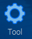 for robot system configuration.

(3) In the interface, select the desired robot type options, as shown in the red-boxed area in the following image.


(4) Users can check your order information to obtain the hardware version. It typically needs to configure the following ares in the tool: Depth Camera, Lidar, Machine, ASR. Please refer to the table below. **Keep the other options at their default settings and avoid** **incorrect** **operation to prevent issues!**

| **Option** | **Configuration** |
|:--:|:--:|
| Depth camera | AstraPro/AstraProPlus/None |
| Lidr | A1/A2/G4/S2L/LD14P |
| Machine | JetAuto/JetAutoPro |
| ASR | Chinese/English |

(5) For instance, you need to switch the Lidar type from A1 to G4.

(6) After selecting, click **Save -> Apply -> Quit** in sequence. It is crucial to follow this order to successfully switch the chassis type.


(7) Wait for the robot body to emit a **"beep"** sound, indicating that the chassis type switch was successful.

* **Configuration Modification Verification**

The following demonstrations are provided for four types of cotrol boards: Jetson Nano, Jetson Orin Nano, Jetson Orin NX, and Raspberry Pi 5. For an introduction to the differences in terminals, please refer to the ["**1.6.6 System Command-line Terminal Introduction**"](#anchor_1_6_6).

**Jetson Nano Control Board：**

(1) If using ROS1, you can verify by clicking on. For ROS2, use the ROS2 command-line terminal.


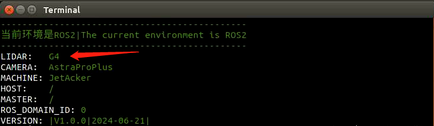

**Jetson Orin Nano/Jetson Orin NX Board**

Verify by clicking on.


**Raspberry Pi 5 Board**

Click on to verify the ROS2 system environment.

### 1.6.8 Remote Desktop Solution Settings

If the robot kit includes a 7-inch touch display or any monitor, using remote connection tools may result in low or blurry screen resolution. You can follow the steps below to adjust the resolution of the remote desktop, typically setting the screen resolution to 1920x1080.

:::{Note}
The Jetson Nano version of JetAcker must disconnect the HDMI cable of the screen before powering on in order to synchronize the correct desktop resolution.
:::

* **Jetson Orin Nano/Jetson Orin NX Control Board**

After establishing remote connection via NoMachine, it's necessary to configure the settings by following the steps below (Repeat these steps are required for Nomachinere re-connection each time).

(1) Move the mouse cursor to the upper right corner of the remote connection tool and wait for the fold-out tab to appear, as shown by the red arrow in the image below:


(2) Then left-click with the mouse, and in the pop-up menu, select **"Display"**.


(3) Click on **"Change settings"**.


(4) Then drag the Resolution slider to 1920x1080 (or adjust it to match your computer's native resolution), and click **"Modify"** to apply the changes.


(5) Continuously click the back button to return to the desktop, and you will notice that the remote desktop resolution has been changed (the screen settings will also be synchronized, but this will reset after a restart, requiring you to follow the steps above to reconfigure the resolution).


* **Raspberry Pi 5 Version**

(1) Locate the Raspberry Pi icon on the upper-left corner, and select **"Preferences -> Screen Configuration"** in sequence.


(2) In the pop-up interface, hit **" Layout -> Screens -> HDMI-1 -> Resolution -> 1920x1080"** in sequence.


(3) This will set the remote desktop resolution to 1920x1080.

## 1.7 Wireless Handle Control

### 1.7.1 Usage Guideline

(1) Please first confirm if the handle receiver is already plugged in before starting the robot. Ignore this step if it is already plugged in. (the USB handle receiver has already been inserted into the robot during installing )

(2) When installing the batteries, please distinguish the positive and negative poles of the battery.


(3) After powering on the robot, the app auto-start service will be automatically enabled (app service includes handle control service). If this service is not disabled, no more operations require for it, the robot is allowed to be controlled directly after connecting the wireless handle.

(4) Due to the interactivity of the handle control, when multiple robots are in the same field, it's not recommended to use this function to avoid accidental connection and control errors.

(5) After turning on the wireless handle, if it does not connect the robot within 30 seconds, or no operations with the handle within 5 minutes after connecting to the robot, it will automatically enter sleep mode. If you need to wake up the handle, please press **"START"** button to exit the sleep mode.

### 1.7.2 Device Connection

(1) After the robot is powered on, turn on the switch of the handle. At this point, two LED lights (red and green lights) on the handle will blink simultaneously.

(2) Wait for a few seconds, and the robot and handle will be paired automatically. When pairing is successful, the green LED light will remain on, and the red LED light will turn off.


### 1.7.3 Button Instructions

The below table will introduce the functions of the buttons and joysticks (take robot as the first person view):

:::{Note}
Gently pushing the joystick in any direction enables low-speed movement.
:::


<table class="docutils-nobg" border="1">
    <tr>
        <th>Button</th>
        <th>Function</th>
        <th>Description</th>
    </tr>
    <tr>
        <td>START</td>
        <td>Stop and reset the device</td>
        <td>Click</td>
    </tr>
    <tr>
        <td>Left stick up</td>
        <td>Move forward</td>
        <td>Push</td>
    </tr>
    <tr>
        <td>Left stick down</td>
        <td>Move backward</td>
        <td>Push</td>
    </tr>
    <tr>
        <td>Right stick left</td>
        <td>Turn left</td>
        <td>Push</td>
    </tr>
    <tr>
        <td>Right stick right</td>
        <td>Turn right</td>
        <td>Push</td>
    </tr>
</table>


## 1.8 Manual Mapping

This section will help you have a quick experience of mapping and navigation functions. No complicated operations are required, users simply click the corresponding icons on the touch screen to perform functions.

The manual mapping requires users to control the movement of the robot using a wireless handle or keyboard. It's recommended you to use wireless handle to control robot if only a single robot appears in the application scenario. If there are multiple robots in the scenario, it's recommended you to a keyboard for control. This is because the wireless handle is interactive, and in environment with multiple robots, it's advisable not to use this function to avoid accidental connections and control errors.

After mapping is complete, the corresponding map is saved. Then, users can activate the autonomous navigation function to view the mapping results. It's important to note that the map opened with the autonomous navigation function will be the last map created. Regardless of which mapping method is used, the newly created map will overwrite the previous one.

### 1.8.1 Preparation for Mapping

Before powering on the robot, it is necessary to ensure that the touch screen is already installed and connected. **Attention: the power cable of the touch screen needs to connect to the C-Touch interface, otherwise, the touch functionality is ineffective.**


Next, you need to confirm whether the handle receiver is securely plugged into the USB port of the robot.

:::{Note}
The handle received is already plugged in the USB hub upon receiving the robot.
:::

### 1.8.2 Operation Steps

* **ROS1 Mapping**

:::{Note}
* This section is applicable to Jetson Nano controller
* In this mode, it's necessary to set up a closed space beforehand on a flat surface. If obstacles are placed, their height should be at least above the radar's horizontal position.

:::

(1) Place the robot inside the constructed space.


(2) Place the robot inside the constructed space.


(3) At this time, Several terminals will be opened to run the program simultaneously. Wait for a while at this point.

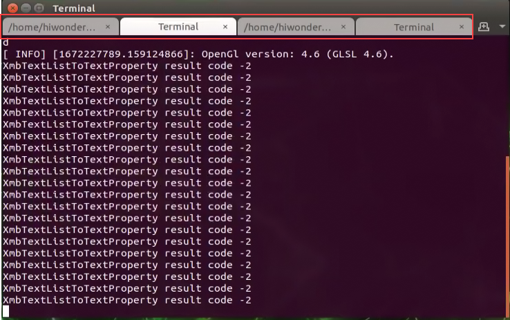

(4) When you see the below interface, it indicated that the function is enabled successfully.

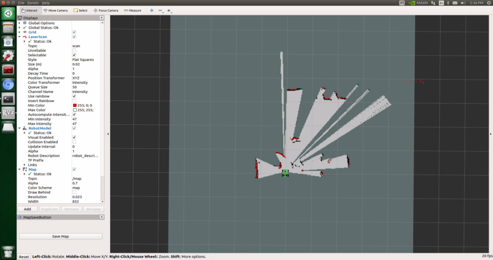

(5) Now, let's use control the robot to map using the wireless handle. The function instruction for each button is as follow:

:::{Note}
When using the handling, keep the distance from the robot not too far to avoid disconnection.
:::

| **Button** | **Function** | **Instruction** |
|:--:|:--:|:--:|
| START | Stop and reset the robot | Short press |
| Left joystick | Move forward | Push upward |
| Left joystick | Move backward | Push downward |
| Right joystick | Steer to left | Push to left |

You can also choose to control the robot using the keyboard, but it's not recommended here. Keyboard control will be introduced in later courses. If you prefer keyboard control, you'll need to connect to the remote desktop and modify the terminal to enable keyboard control.


For the remote system desktop connection, please refer to [**"1.6 Development Environment Setup and Configuration"**](#anchor_1_6).

The button instruction for keyboard control is as follow:

| **Buttons** | **Function** | **Instruction** |
|:--:|:--:|:--:|
| W | Move forward | Short press to this button to forward status. Robot will keep moving forward. |
| S | Move backward | Short press to this button to backward status. Robot will keep moving backward. |
| A | Turn left | Long press to interrupt moving forward or backward and make a counter-clockwise turn to the left in place |
| D | Turn right | Long press to interrupt moving forward or backward and make a right turn. |

When the **"W"** or **"S"** key is pressed, the robot will continue moving forward or backward respectively. When the **"A"** or **"D"** key is pressed, the robot will interrupt the forward or backward motion and rotate counterclockwise or clockwise in place respectively. When the **"A"** or **"D"** key is released, the rotation will stop, and the robot will remain stationary.

(6) After the movement is complete, press the save button in the bottom left corner, and the robot will save the completed map.


The standard for a completed map is as follow:


(7) After the mapping is complete, if you want to close this function, click interface and tap.

* **ROS2 Mapping**

:::{Note}
* This section is applicable to Jetson Orin Nano/Jetson Orin NX and Raspberry Pi 5.
* In this mode, it's necessary to set up a closed space beforehand on a flat surface. If obstacles are placed, their height should be at least above the radar's horizontal position.

:::

(1) Place the robot inside the constructed space.

(2) Click on the screen desktop. Open the SLAM icon.


(3) At this time, Several terminals will be opened to run the program simultaneously. Wait for a while at this point.


(4) When you see the below interface, it indicated that the function is enabled successfully.


(5) Now, let's use control the robot to map using the wireless handle. The function instruction for each button is as follow:

:::{Note}
When using the handling, keep the distance from the robot not too far to avoid disconnection.
:::

| **Button/Joystick** | **Operation** | **Function** |
|:--:|:--:|:--:|
| START | Short press | Exit sleep mode |
| Left joystick | Push forward/backward | Control robot to move forward and backward |
| Left joystick | Push to left/right | Turn left/right |
| Right joystick | Push to left | Control robot to turn left |

You can also choose to control the robot using the keyboard, but it's not recommended here. Keyboard control will be introduced in later courses. If you prefer keyboard control, you'll need to connect to the remote desktop and modify the terminal to enable keyboard control.


For the remote system desktop connection, please refer to [**"1.6 Development Environment Setup and Configuration"**](#anchor_1_6).

The button instruction for keyboard control is as follow:

| **Buttons** | **Function** | **Instruction** |
|:--:|:--:|:--:|
| W | Move forward | Short press to this button to forward status. Robot will keep moving forward. |
| S | Move backward | Short press to this button to backward status. Robot will keep moving backward. |
| A | Turn left | Long press to interrupt moving forward or backward and make a counter-clockwise turn to the left in place |
| D | Turn right | Long press to interrupt moving forward or backward and make a right turn. |

When the **"W"** or **"S"** key is pressed, the robot will continue moving forward or backward respectively. When the **"A"** or **"D"** key is pressed, the robot will interrupt the forward or backward motion and rotate counterclockwise or clockwise in place respectively. When the **"A"** or **"D"** key is released, the rotation will stop, and the robot will remain stationary.

(6) After the movement is complete, press the save button in the bottom left corner, and the robot will save the completed map.


The standard for a completed map is as follow:


(7) After the mapping is complete, if you want to close this function, click interface and tap.


## 1.9 Autonomous Mapping

:::{Note}
* This functionality is only applicable to the Jetson Nano controller.
* Once this function is enabled, JetAuto will directly start to move. In this case, it requires you to place the robot on a flat surface.
* In this mode, users need to set up a closed space in advance, preferably on a flat surface. If obstacles are set inside the space, the minimum height of the obstacle must be higher than the horizontal position of the Lidar. The robot can stop after completing autonomous mapping in the closed space.

:::

(1) Click the SLAM Automatic to start the autonomous mapping.


(2) After opening, the program will automatically run the program in terminal. When the below interface shows up, it indicates that the interface is enabled successfully.


(3) After successful startup, the robot will begin to move autonomously and map its surroundings.

(4) When the robot completes autonomous mapping in this closed space, it will stop and automatically save the map.

## 1.10 Autonomous Navigation

:::{Note}
* Autonomous navigation will read the most recently created map, whether manually and autonomously built. If both methods are used simultaneously, it will save the last map created.
* If you want to learn about how to save multiple maps, please delve into the content in [**"5. Mapping and Navigation Courses"**](5.mapping_&_navigation_course.md) .

:::

### 1.10.1 ROS1 Autonomous Navigation

**Reminder: This section is only applicable to the Jetson Nano controller.**

(1) Start the robot. Click the Navigation icon to experience the quick navigation function.


(2) After opening, the terminal will run the program. When you see the following interface, it indicates that the opening was successful.


(3) In the manual bar, **"2D Pose Estimate"** is used to set the initial position of JetAuto, **"2D Nav Goal"** is used to set a target point and **"Publish Point"** is used to set multiple target points.


(4) Click on to select one point by clicking the map interface as the target destination. If you press and drag with the mouse, you can also select the orientation of the robot after it reaches the target point. After the selection is complete, the robot will automatically generate a route and move to the target point. (Note: changes the initial position of the robot on the map and is the target point for single-point navigation).


(5) Click and press the left mouse at a certain point on the map to set it as the destination point. If you need to perform multi-point navigation, please follow the same operation steps to set multiple destination points.

:::{Note}
You need to click **"Publish Point"** once before setting each destination point.
:::


(6) After setting the destination point, click **"Start Navigation"** in the bottom left corner to start navigation. During navigation, the robot will automatically avoid obstacles. If need to stop navigation, click **"Stop Navigation"**, and then robot will stop after reaching the destination point.

For example, in the multi-point navigation shown in the above figure, marked as 1, 2 and 3 on the map (take three marks as example). If the robot is traveling between marks 1 and 2, and when you press **"Stop Navigation"**, it will stop moving after reaching mark 2.

If clicking **"Clear Goals"**, all marks will be cleared.


### 1.10.2 ROS2 Autonomous Navigation

**Reminder: This section is only applicable to Jetson Orin Nano, Jetson Orin NX and Raspberry Pi controllers.**

(1) Start the robot. Click the Navigation icon to experience the quick navigation function.


(2) After opening, the terminal will run the program. When you see the following interface, it indicates that the opening was successful.


(3) In the manual bar, **"2D Pose Estimate"** is used to set the initial position of the robot, **"2D Nav Goal"** is used to set a target point and **"Publish Point"** is used to set multiple target points, **"Nav2 Gaol"** is used to set more complex navigation targets, such as specifying a target point, a target pose or a target field.


(4) changes the initial position of the robot on the map and mark the robot's actual position.

(5) Click on to select one point by clicking the map interface as the target destination. If you press and drag with the mouse, you can also select the orientation of the robot after it reaches the target point.


(6) Click in the bottom left corner to enable multiple-point navigation. Then click to set a target point. Hold and drag that point to select the target point direction.

:::{Note}
You need to click **"Nav2 Goal"** once before setting each destination point.
:::


(7) After setting the destination point, click **"Start Nav Through Navigation"** in the bottom left corner to start navigation. During navigation, the robot will automatically avoid obstacles.

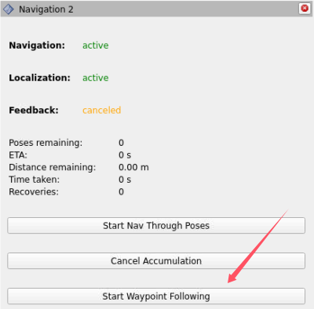

## 1.11 Hardware Introduction

This chapter focuses on the hardware components of ROS robots, including electronic control system, ROS controller, Lidar and depth camera, etc.

### 1.11.1 ROS Controller

The JetAcker robot offers comprehensive ROS main controller support, with similar usage methods across the different controllers. The Raspberry Pi 5 uses the Debian 12 system, while the Jetson series uses the Ubuntu system. Below is a comparison of the main controller specifications for Raspberry Pi 5, Jetson Nano, Jetson Orin Nano, and Jetson Orin NX:


* **Jetson Nano Version：**

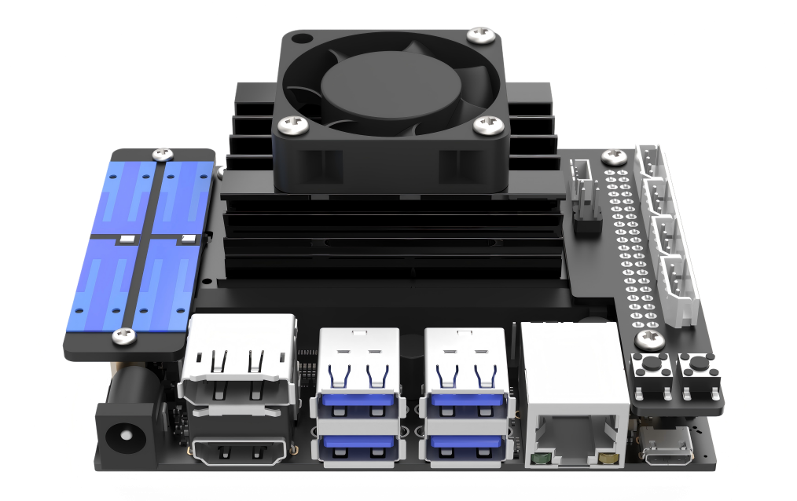

The robot utilizes Jetson Nano as its ROS controller, consisting of the Jetson Nano board and Jetson expansion board. The motherboard is a compact yet powerful computer capable of running the mainstream deep learning frameworks, providing the computational power required for most artificial intelligence projects.

The expansion board features connections for LEDs and buttons, enabling users to monitor network status through LED flashes and switch network modes using the button. It also includes reserved GPIO and I2C interfaces.

**The mainboard is installed with the Ubuntu18.04 system, and establishes the ROS Melodic environment for robot operations. Additionally, the ROS2 Humble environment is deployed within a Docker container.**

* **Jetson Orin Nano Version**


The robot is equipped with the Jetson Orin Nano main controller, which comprises a Jetson Orin Nano motherboard and a Jetson expansion board. The motherboard is a compact yet powerful computer that can run mainstream deep learning frameworks, providing the computational power necessary for most artificial intelligence projects.

The expansion board features connections for LEDs and buttons, enabling users to monitor network status through LED flashes and switch network modes using the button. It also includes reserved GPIO and I2C interfaces. **The controller is installed with Ubuntu 22.04 and features the ROS2 Humble environment for robotic operating systems.**

The Jetson Nano and Jetson Orin Nano controller board with a mini expansion board offers stable performance, low power consumption, and strong expandability. It can run mainstream deep learning frameworks and meets the computational requirements of most artificial intelligence projects.

Jetson Nano and Jteson Orin Nano controller

Reserved interfaces include 2 USB ports, 2 GPIO ports (4-Pin), 2 IIC ports (4-Pin), and 1 UART port. The board is equipped with 5V/3.3V power interfaces, LED indicators, and 2 programmable buttons.


* **Jetson Orin NX Version**


The robot is equipped with the Jetson Orin NX 8/16GB main controller, which comprises a Jetson Orin NX motherboard and a Jetson expansion board. Compared to the Jetson Orin Nano 4GB, the Jetson Orin NX 16GB offers faster processing speeds, improved memory read/write speeds, and a fivefold increase in performance.

The expansion board features connections for LEDs and buttons, enabling users to monitor network status through LED flashes and switch network modes using the button. It also includes reserved GPIO and I2C interfaces. **The controller is installed with Ubuntu 22.04 and features the ROS2 Humble environment for robotic operating systems.**

* **Raspberry Pi5 Version**


The robot uses a Raspberry Pi 5 as its ROS main controller, which includes the Raspberry Pi 5 controller and a mini expansion board. The controller is a compact yet powerful computer capable of running major deep learning frameworks, providing the computational power needed for most AI projects.


The mini expansion board adds functionality with LEDs and buttons, allowing users to monitor network status via LED indicators and switch network modes using a mobile phone. It also features reserved GPIO and I2C interfaces for additional expansion.

**The controller operates with the Raspberry Pi Debian12 official system and has a ROS2 environment set up in Docker.**

Overall, the mini expansion board for the Raspberry Pi 5 is stable, energy-efficient, and highly expandable, capable of supporting mainstream deep learning frameworks and meeting the computational needs of most AI applications.

### 1.11.2 Electronic Control System Introduction

The robot's electronic control system uses a mini STM32 controller (hereafter referred to as the STM32 controller) as the low-level motion controller. It connects multiple DC encoder reduction motors and has a built-in IMU accelerometer and gyroscope sensor. This setup enables the control of the robot's chassis movement and sensor data collection


| **NO.** | **Name** |
|:--:|:--:|
| 1 | The signal receiver of wireless controller |
| 2 | USB Hub Communication |
| 3 | Motor 2 |
| 4 | Motor 4 |
| 5 | Pan-tilt Servo |
| 6 | Hub Power Supply |
| 7 | front steering wheel servo |

For more detailed information, please see below.

* **mini STM32 Robot Controller**

The STM32 robot motion controller is an open-source controller specifically designed for robot development. It is compact and elegantly designed.

The controller uses the STM32F407VET6 as the main controller, which features ARM's Cortex-M4 core, a 168 MHz main frequency, 512K of on-chip FLASH, 192K of on-chip SRAM, and integrates FPU and DSP instructions. The system block diagram of the STM32F40x/41x series is shown below:


* **The resource configuration of the front of the mini STM32 robot controller and power port is as follows:**

**mini STM32 robot controller**


| **Main Control Chip** | **Value** |
|:--:|:--:|
| **Main Control Chip** | STM32F407VET6 (100-pin) |
| **Motor driver chip** | YX4055 (overcurrent protection) |
| **IMU sensor** | 3-axis accelerator; 3-axis gyroscope |
| **Motor port** | 4-channel encoder motor port |
| **Servo port** | 4-channel serial bus servo port |
| **USB HOST** | 1-channel USB HOST port; Supports wireless controller and mouse |
| **USB serial port** | 1-channel USB serial port (Type-C) |
| **Responsive component** | 1 buzzer |
| **I2C Port** | 2-channel 4PIN port |
| **Circuit protection** | overheating, short circuit, and overcurrent protection |
| **Program download** | SWD debugging port |
| **Size** | 78*39mm |
| **Board layers** | Industrial-grade four-layer board |
| **Mounting hole spacing** | 48*32mm |

**Robot Power Module**


| **Switch** | **Value** |
|:--:|:--:|
| **Switch** | push-button switch |
| **Power input** | 6-14V wide voltage interface |
| **Power output ports** | 2 x 5V power output ports, 2 x 12V power output ports |
| **Board layers** | Industrial-grade four-layer board |
| **Size** | 78*39mm |
| **Mounting hole spacing** | 48*32mm |

In the robot, the power module's power interface is connected to the battery, the 5V power output interface supplies power to the Jetson Nano/ Raspberry Pi 5 controller, and the 12V power output interface to Jetson Orin Nano/Jetson Orin NX controller.

* **IMU Sensor**

The 6-axis IMU sensor, MPU6050 (integrated in STM32 controller), includes three-axis acceleration and three-axis gyroscope. It connects to the controller through I2C interface. The definition of the 6-axis IMU accelerometer and gyroscope is shown in the following figure:


* **Power Supply Instruction**

The 11.1V 6000mAh Lithium battery is tailored for the robot, with a charging voltage of 12.6V. It features overcharge protection, overcurrent protection, over-discharge protection, and short-circuit protection.


Please use the special charged provided in the kit to charge the robot. Users can view the charging status by observing the indicator on the charger. The red light indicates that the battery is charging, while the green indicates that the charging is complete. (Green light when idle, red light when charging, and green light when fully charged)


### 1.11.3 Hardware System Wiring Diagram

The hardware connection system diagram of the robot based in the mini STM32 controller is shown below. The specific model and ROS controller may var, and the detailed instructions will be provided in the following content.

* **Jetson Nano Controller Version：**


* **Jetson Orin Nano/Jetson Orin NX Controller Version：**


* **Raspberry Pi 5 Controller Version：**


### 1.11.4 Bus Servo

In the JetAcker robot, two HTS-20H bus servos are used—one for controlling the rotation of the pan-tilt and the other for steering the front wheels


### 1.11.5 Hall Encoder DC Gear Motor

The motors in the robot's chassis use Hall-effect sensors for speed measurement with direct-drive reduction motors. The speed measurement module of the Hall sensor encoder is equipped with a strong magnetic disk,which outputs AB phase pulse signals. The motor operates at 12V voltage. The diagram below illustrates the motors used in the robot along with their pin configuration:


### 1.11.6 Depth Camera


The robot is equipped with a depth camera, the Astra Pro Plus. The camera module (referred to as Astra Pro Plus) is based on 3D structured light technology. Astra Pro Plus is a high-precision, low-power 3D camera designed with monocular structured light technology. It primarily includes an infrared camera (IR camera), an infrared projector (IR projector), and a depth processing unit (depth processor).

### 1.11.7 Lidar

Lidar utilizes laser technology to accurately pinpoint the locations. Its applications extend to various scenarios, including the field of robotics, enabling functions such as Lidar obstacle avoidance, following, SLAM mapping, and navigation.

This robot is compatible with different Lidar models, including A1 Lidar and G4 Lidar. Users can choose Lidar versions according to your requirement. Below are listed two types of Lidar:


### 1.11.8 Others

* **Microphone Array Module**

This module is optional in robot kit. It can allow robot to realize voice wake-up and voice control capabilities.

This robot uses the R818 noise reduction board and a ring-shaped six-way microphone array, which features a planar distribution structure composed of six microphones. It is a system that samples and processes the spatial characteristics of the sound field. It can perform sound source localization, suppress background noise, interference, reverberation, and echo, and achieve 360° equivalent sound reception.


The noise reduction board can suppress background noise, interference, reverberation, and echoes, as shown in the image below:


* **7-inch LCD Screen**

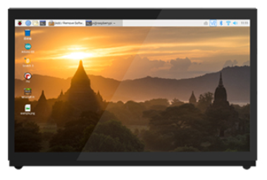

**(The system desktop shown in image is for demonstration purpose only, please rely on the actual product for accuracy.)**

The 7-inch LCD screen is optional hardware with both display and touch functionalities. In addition to directly display the robot's system desktop, it allows for a quick experience of mapping and navigation function by touching icons on the desktop.

* **Wireless Controller**

The STM32 control board has USB PS2 wireless handle receiver connected, allowing chassis movement control through a PS2 controller.


The handle receiver is connected to the position highlighted in the below red box:


## 1.12 ROS Usage Introduction

The core of ROS robot mainly consists of two parts. The first part is the chassis, primarily involving the underlying STM32 controller responsible for robot motion control and sensor data acquisition. The second part is the ROS main control unit (Jetson Nano/Jetson Orin Nano/Jetson Orin NX/RaspberryPi5), running the ROS system and relevant functional routine algorithms.

### 1.12.1 ROS Main Control Hardware Connection

The standard connection method requires a power cable and a USB serial cable to communicate with the ROS main controller via the onboard USB serial port. The STM32 requires a power supply of 9-24V, and the ROS main controllers (Jetson Nano and Raspberry Pi 5) can be directly connected to the STM32's power output port (5V) for power supply through the STM32 power input. The Jetson Orin Nano/Jetson Orin NX requires a 12V power supply.

### 1.12.2 ROS Serial Port Communication Instruction

Serial communication is a common output and transmission method used in microcontroller development and robot manufacturing. This product also utilizes serial communication to communicate with the upper-level machine, Jetson Nano/Jetson Orin Nano/Jetson Orin NX/Raspberry Pi 5, and the lower-level STM32 controller.

In order to facilitate communication between software tools and various products, Hiwonder has standardized a communication protocol based on hexadecimal data transmission called the RRC Communication Protocol. Subsequent Wonder products use this communication protocol for programming and communication between the upper and lower-level machines.

* **Communication Protocol**

The instruction is written in hexadecimal. If you are unfamiliar with the calculation method, you can refer to the following: use a calculator tool for base conversion. For converting negative numbers and floating-point numbers into hexadecimal, please search for tutorials online

Command format:

| Frame header | Function code | Data length | Parameter | Checksum |
|:--:|:--:|:--:|:--:|:--:|
| 0xAA 0x55 | （uint8_t）Function | （uint8_t）Length | Data | （uint8_t）CRC |

**Frame Header**: Receiving consecutive 0xAA and 0x55 indicates that a data packet has arrived.

**Function Code**: Indicates the purpose of an information frame.

**Data Length**: Specifies the number of parameters.

**Parameter**: Additional control information required apart from the function instruction.

**Checksum**: Verifies whether the data is correct, using the CRC check method (calculates the CRC value of Function, Length, and Data, taking the lower 8 bits).

* **User Sending Data to Control Board**

The control board already has a dedicated UART-to-USB circuit. Simply connect the UART3 port to the PC software using a data cable to enable communication. Here, we use LED control as an example.

**LED light control: Command name PACKET_FUNC_LED, value 1**

| **Frame header** | **Function code** | **Data length** | **Parameter** | **Checksum** |
|:--:|:--:|:--:|:--:|:--:|
| 0xAA 0x55 | PACKET_FUNC_LED | 7 | Parameter 1:（uint8_t）led_id Parameter 2: (uint16_t) On duration (ms) Parameter 3: (uint16_t) Off duration (ms) Parameter 4: (uint16_t) Number of cycles | CRC |

For example,

① Control LED light to blink 5 times, with each blink lasting 100ms on and 100ms off:

| **Frame header** | **Function code** | **Data length** | **Parameter** | **Checksum** |
|:--:|:--:|:--:|:--:|:--:|
| 0xAA 0x55 | PACKET_FUNC_LED | 7 | Parameter 1：0x01（1） Parameter 2：0x64 0x00（100） Parameter 3：0x64 0x00（100） Parameter 4：0x05 0x00（5） | CRC |

:::{Note}
This is in little-endian mode. For example, the value 5 (decimal) of uint32_t would be written as 0x00 0x05 in little-endian mode, where the lower byte comes first. Therefore, when sending data, it should be written as 0x05 0x00.
:::

* **Control Board Sending Data to User**

**Bus servo data upload: Command name PACKET_FUNC_BUS_SERVO, value 5**

In this example, we will upload the bus servo position.

| **Frame header** | **Function code** | **Data length** | **Parameter** | **Checksum** |
|:--:|:--:|:--:|:--:|:--:|
| 0xAA 0x55 | PACKET_FUNC_BUS_SERVO | 5 | Parameter 1: (uint8_t) servo_id Parameter 2: (uint8_t) 0x05 (Sub-command) Parameter 3: (int8_t) Success status (0: Success; -1: Failure) Parameter 4: (int16_t) Servo position | CRC |

When a read command is received, the corresponding servo position parameter is read and uploaded to the PC software.

For example,

Upload the angle of servo 5 as 30°, corresponding to a pulse width of 833.

| **Frame header** | **Function code** | **Data length** | **Parameter** | **Checksum** |
|:--:|:--:|:--:|:--:|:--:|
| 0xAA 0x55 | PACKET_FUNC_BUS_SERVO | 5 | Parameter 1: 0x05 (5) Parameter 2: 0x05 (Sub-command) Parameter 3: 0x00 (0 - Success) Parameter 4: 0x41 0x03 (833 in little-endian format) | CRC |

## 1.13 System Software Framework

Before starting this section, you need to use Nomachine remote desktop connection software. For detailed instructions, please refer to [**"1.6 Development Environment Setup and Configuration"**](#anchor_1_6).

### 1.13.1 ROS1 Directory and Functional File Introduction

**Reminder: this section is only applicable to the Jetson Nano controller.**

(1) Click to open the command terminal. Enter the below command, and then press Enter to view each file under the home directory.

```
ls
```


The introduction to each folder is shown in the below table:

| **Directory name** | **Function** |
|:--:|:--:|
| hiwonder-toolbox | Wi-Fi management tool |
| software | Store the software |
| ros_ws | Workspace (including the function of each game) |
| Third_party | Store the functional package, such as the model trained with YOlOv5 |
| Music | Store music files |
| Pictures | Store image files |
| Public | User custom folder |
| Templates | template folder (custom) |
| Videos | Store video files |

Enter the command and press **"Enter"** to access the directory of the functional packages. Then enter **"ls"** to view each file under the directory.

```
cd ros_ws
```

```
ls
```


The introduction of each folder is as follow:

| **Directory/folder** | **Instruction** |
|:--:|:--:|
| build | Compilation space, storing the cache generated during compiling |
| command | Store the commands for each function |
| devel | Store the target file and executable file after compilation |
| logs | Store the logs |
| src | Store the source code of the function packages |

(2) Enter command and press Enter to access the directory for the function packages. Enter **"ls"** command to view each files under the directory.

```
cd src
```

```
ls
```


The introduce of each folder:

| **Directory** | **Type** | **Function** |
|:--:|:--:|:--:|
| hiwonder_app | App function packages storage directory | Gesture control, Lidar, intelligent line patrolling and other game. |
| hiwonder_interfaces | Communication interface file directory | ROS message communication and service communication files |
| hiwonder_slam | Mapping-related function storage directory | Various algorithms for mapping and map saving |
| hiwonder_bringup | System service storage directory | Lunch functions such as app and wireless handle control |
| hiwonder_multi | Multi-robot combination function directory | Multi-robot mapping, multi-robot navigation, etc |
| third_party | Third-party environment function package directory | The ROS function package such as Apriltag, Lidar, depth camera. |
| hiwonder_calibration | Calibration parameter adjustment directory | IMU, linear velocity, angular velocity calibration. |
| hiwonder_navigation | Navigation-related function storage directory | Publishing navigation points, rviz navigation |
| xf_mic_asr_offline | Voice-related storage directory | Voice-controlled games |
| hiwonder_driver | Driving file directory | Kinematics, communicate between Jetson Nano board and STM32 |
| hiwonder_peripherals | Peripheral setting directory | Including different lidar models, handle control and keyboard control |
| hiwonder_example | Game example storage directory | Creative game: gesture control, posture control, color tracking. |
| hiwonder_simulations | Simulation storage directory | Gazebo, moveIt simulation, URDF file |

* **Game File Directory Introduction**

Take the game file in `/ros_ws/src/hiwonder_app` as example to explain.

(1) Enter the following command to access the game file directory. There are two folders, including launch and scripts.

```
cd hiwonder_app
```

```
ls
```


(2) The **"launch"** folder corresponds to the launch files, while the **"scripts"** folder corresponds to the source code of the games.


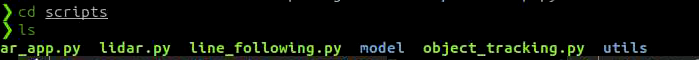

The corresponding launch directory and scripts directory in other function packages are similar as well.

### 1.13.2 ROS2 Directory and Functional File Introduction

**Reminder: This section is only applicable to Jetson Nano in Docker, Jetson Orin Nano, Jetson Orin NX and Raspberry Pi 5 controller.**

* **File Directory Introduction**

(1) Click-on to initiate ROS2 command-line terminal. Then input the following command to check the content contained in the directory.

```
ls
```


| **File Name** | **Function** |
|:--:|:--:|
| noetic_ws | Workspace for bridging with ROS1 |
| ros2_ws | Workspace for ROS2 functions |
| share | Directory shared with the main system（/home/hiwonder/docker/tmp） |
| third_party_ros2 | Relevant third-party software libraries |

(2) Next, enter the command to access the ROS2 workspace and check the file directory distribution.

```
cd ros2_ws
```

```
ls
```

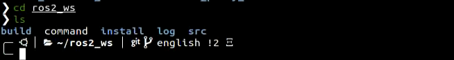

The table below provides detailed introduction to each folder.

| **File name** | **Function** |
|:--:|:--:|
| build | Compilation space, storing cache information during the compilation proces |
| command | Stores instructions that implement various functions for easy lookup |
| install | Stores compiled target files and executable files |
| logs | Folder for storing logs |
| src | Folder for storing the source code of function packages |

(3) Enter the command and press Enter to go to the robot function package directory and check the files in the src directory.

```
cd src
```

```
ls
```


The table below provides an introduction to each folder.

| **Directory Name** | **Type Description** | **Function Description** |
|:--:|:--:|:--:|
| app | Directory for storing various game options for the mobile app | Gesture control, radar, line following, etc. |
| exapmle | Directory for storing related AI visual games | Color sorting, gesture control, waste classification, etc. |
| interfaces | Communication interface file directory | ROS message communication and service communication files |
| slam | Directory for storing mapping-related gameplay | Various mapping algorithms, map saving |
| calibration | Calibration parameter adjustment directory | IMU, linear velocity, angular velocity calibration, etc. |
| navigation | Directory for storing navigation-related gameplay | Publishing navigation points, RViz navigation, etc. |
| xf_mic_asr_offline | Directory for storing voice-controlled gameplay | Voice-controlled gameplay |
| xf_mic_asr_offline_msgs | Directory for storing voice control game messages | Voice-controlled gameplay directory |
| peripherals | External device settings directory | Includes different types of lidar, joystick control, keyboard control, etc. |
| simulations | Directory for storing simulation files | Gazebo, MoveIt simulation, URDF, etc. |
| driver | Driver file directory | Kinematics, communication between Jetson controller and STM32 |

* **Introduction to Function File**

The following explains the game files using `/ros2_ws/src/app` as an example.

(1) Enter the below command to navigate to the directory containing the game files. The launch and app folders are included in it.

```
cd app
```

```
ls
```


(2) **'launch'** folder contains the launch files, and the **'app'** folder contains the game source codes.


The corresponding launch directories and app directories (with the same name as the function packages) for other function packages are similar.

## 1.14 STM32 Source Code Instruction

### 1.14.1 Source Code Introduction

The STM32 controller is used as the robot underlying motion controller for running STM32 code. The robot chassis has already been burned with corresponding code for direct usage.

It supports ISP code updates through the USB serial port and can also be updated or debugged through the SWD interface. As the underlying chassis driver board for the robot, it is primarily responsible for the tasks such as motor PID control, encoder and IMU data acquisition, RGB light control, etc. Various control methods are supported, including PS2 wireless control, app control, and remote control via an RC transmitter. Additionally, it communicates through a serial port with the ROS base layer's chassis control node, receiving target vector velocities from the basic layer and sending the real-time speed, IMU data, and battery voltage data calculated by the odometry. To enhance these functionalities, STM32 controller utilizes the FreeRTOS embedded operating system for software design.

### 1.14.2 Control Principle

The principle of various robot control methods is based on varying robot's velocity. Robot's target velocity is obtained by operating inverse kinematics calculation, which is used as input for the motor velocity PID controller. After PID computation, the STM32 timer outputs PWM motor control signals to the motor driver. The motor driver, in turn, controls the motor's rotation. The encoder collects real-time motor speed, providing feedback to the PID controller, thus realizing closed-loop speed control. The flowchart for the robot's STM32 motor control process is illustrated below:


### 1.14.3 Program Framework

The underlying source code is developed based on FreeRTOS. Unlike interrupt control, RTOS executes tasks in a round-robin fashion, with tasks of higher priority being executed first. Interrupts have a higher priority than task priorities. The robot task allocation is shown in the figure below:


【The main task of the robot is responsible for robot control, kinematics processing, IMU data acquisition, data transmission matters. Additionally, I also need to handle the trivial tasks such as battery level management, IMU calibration, buzzer alarming, and other low-frequency management issues.】

### 1.14.4 Program Analysis

For more detailed STM32 code instructions, you can go through the source code, which contains very detailed comments.

### 1.14.5 Project Compilation

After writing the program, we need to compile it into machine language so that it can run on the embedded system. Keil5 includes a built-in compiler that can compile the source code into an executable file.

The compiler can generate different target files based on different processor architectures and instruction sets. Additionally, the compiler can perform code optimization to make the generated executable files more efficient and stable. The steps for compiling the project are as follows:

(1) Open options for the generated hex file:

In the Keil5 interface, Click the **"Project"** in the menu bar, and then click the **"Options for File 'app.c'"** button.


Click the **"Output"** option, check the three red-marked options below, and then click **"OK"**.

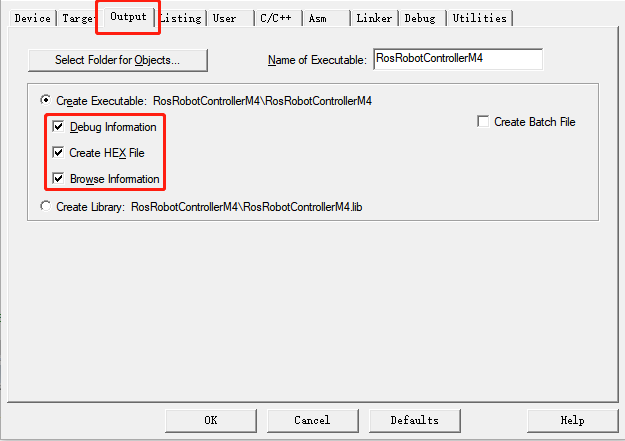

(2) In the Keil5 software interface, click the **"Project"** option in the menu bar, and from the drop-down menu, select **"Build Target"** to compile the project, as shown in the image below:


You can also click the icon on the toolbar in the interface to compile, as shown in the image below:


If the following content appears in the **"Build Output"** window at the bottom of the software, it indicates that the compilation was successful.


:::{Note}
If the **"Build Output"** window shows **"Error(s)"** after compiling the project, you need to double-click on the specific line to jump to the corresponding location and make the necessary corrections, then compile again. If **"Warning(s)"** messages appear, you can ignore them.
:::

### 1.14.6 Download Program Using USB Cable

[Source Code](../_static/source_code/RRC_Mini_20250228.zip)

After compiling the project, you can download the generated hex file to the **STM32 main control board**. The following hardware and software materials are required:

* **Preparations**

**Software**: ATK-XISP (available in [**"Firmware Download Software/ATK-XISP.exe"**](resources_download.md)):


**Hardware**: Type-data cable, STM32 main control board

The Type-C cable is used to connect the computer and the STM32 main control board.

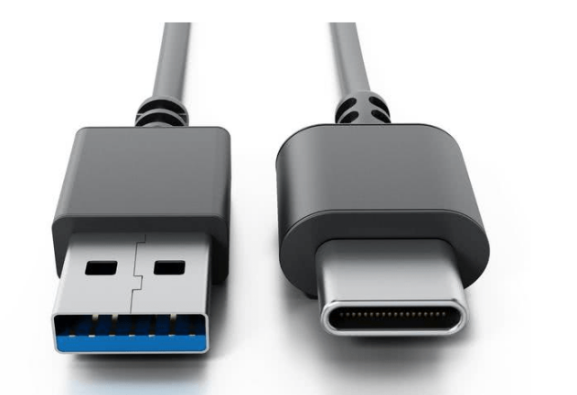

* **Download Steps**

The specific operation steps are as follows, with the example of the program [**"RosRobotControllerM4-ros"**](resources_download.md):

**(1）Hardware Connection：**

Insert the Type-C cable into the Type-C port on the mini STM32 main control board (as shown in the red box in the image below) and connect it to the USB port on the computer:


**(2）Initial Settings：**

Open the **ATK-XISP** software, select the correct **serial port** (Port) in the software, for example, COM22 (which is recognized as starting with USB), and then set the **baud rate (bps)** to **115200**:


In the software interface, select **"Run After Programming,"** **"Verify,"** and **"Perform Full Chip Erase Before Programming,"** as shown in the image below:


Then choose the following option:

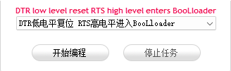

**(3）Software Flashing:**

In the **ATK-XISP** software interface, click the button within the red box in the image below, and then select the hex file that needs to be flashed.


Click the **"Start Programming"** button to flash the generated hex file onto the STM32 main control board:

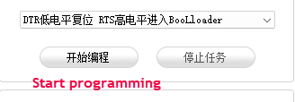


The following prompt indicates that the flashing process is complete.


:::{Note}
The STM32 main control board comes with pre-installed firmware. You can flash the RRC_20240702.hex file located in the [**"Source Code Materials/STM32"**](resources_download.md) folder.
:::

## 1.15 Flash Image

### 1.15.1 Preparations

**Hardware:**

For **Jetson Nano and Raspberry Pi 5** versions, you need to prepare an SD card. (The storage size depends on the size if the image to be flashed. The example below uses a 64GB SD card), a card reader, and a computer (It's recommended to use Windows 10 operating system).


For **Jetson Orin Nano and Jetson Orin NX** versions, you need to prepare a SSD (The storage size depends on the size if the image to be flashed), an SSD flasher (to be prepared separately), and a computer (Windows 10 operating system is recommended).


Solid-state driver

**Software:** Install the SSD initialization tool (DiskGenius.exe) and the image flashing tool (Win32DiskImager).

:::{Note}
* Before flashing the image, you can use the SSD initialization tool (the compressed file can be found in [**"Image Flashing Tools/ SSD Initialization Tool"**](resources_download.md)) to delete any unnecessary partitions on the disk, then proceed with the flashing.
* After the image flashing is complete, multiple independent disk prompts may appear. Do not click **"Format"**; simply cancel the prompts.
:::

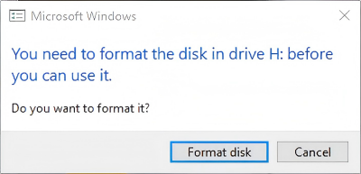

### 1.15.2 SD Card/SSD(Solid-state Drive) Formatting

:::{Note}
If the SD card or SSD is empty, no formatting is required.
:::

(1) Remove the SD card from Jetson Nano or Raspberry Pi 5, and remove the solid-state drive from Jetson Orin Nano or Jetson Orin NX.

**Jetson** **Nano**


**Raspberry Pi5**


**Jetson Orin Nano/Jetson Orin NX**


(2) Locate the compressed file in [**"Image Flashing Tools/1. SSD Initialization Tool"**](resources_download.md). After extracting it, use the **DiskGenius.exe** tool to format the SD card or solid-state drive. Be cautious to select the correct drive letter to avoid formatting your computer's drives by mistake.

(3) Once the SD card or solid-state drive is inserted into the computer, you will notice additional drive letters apart from those of your computer.

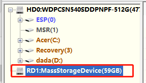

(4) Right-click and select **"Delete All Partitions.**"


(5) Create a new partition so that the computer can recognize it properly. If a prompt appears, click **"OK"** to proceed, as shown in the image below:


(6) Then click **"Save"** to save the modification.


(7) Once successful, you will see the information displayed as shown below. This indicates that the SD card/solid-state drive has been successfully formatted.


### 1.15.3 Flash Image

(1) Open the image flashing tool (**Win32DiskImager**), click to select the image file (the file must be downloaded and extracted by the user; the image shown is for reference only, and the actual image should be used). Set the **"Device"** field to the drive letter of the SD card or solid-state drive, then click the **"Write"** button to begin flashing the image.


:::{Note}
The storage path of the image file must not contain any Chinese characters.
:::

(2) If the prompt appears, simply click the **"Yes"** button to proceed.


(3) If the prompt **"Write Successful"** appears, the flashing process has been completed successfully. If an error occurs, please disable any firewall or similar software, reinsert the solid-state drive, and repeat the steps in this section.


:::{Note}
After successful flashing, if a prompt asking whether to format the partition appears, you can ignore it.
:::

(4) Wait for the image flashing to complete. Insert the SD card or solid-state drive back into the control board. Once powered on for a short period, the system should boot successfully.