# 14. ROS+OpenCV Course

## 14.1 Color Threshold Adjustment

The color of an object can change with the light sources, which can affect the functionality involved color recognition. To tackle this issue, this lesson will introduce you how to use LAB Tool to adjust the color threshold.

### 14.1.1 Open/Close LAB TOOL

> [!NOTE]
>
> * **The entered command should be case sensitive, and the “Tab” key can be used to complement key words.**
>
> * **Please strictly follow the operation steps; otherwise, you will fail to open LAB tool.**

During the color adjustment process, all steps are executed within the ROS1 environment.

1. Start the robot and connect it to Nomachine remote connection software.

2. Click on  to open the ROS1 command line terminal.

3. Input the command and press Enter to disable app auto-start service.

   ```py
   sudo systemctl stop start_app_node.service
   ```

4. Input the command and press Enter to enable the camera service.

   ```py
   roslaunch hiwonder_peripherals depth_cam.launch
   ```

5. Open a new ROS1 command-line terminal and input the command to open LAB tool.

   ```py
   python3 /home/hiwonder/software/lab_tool/main.py
   ```

   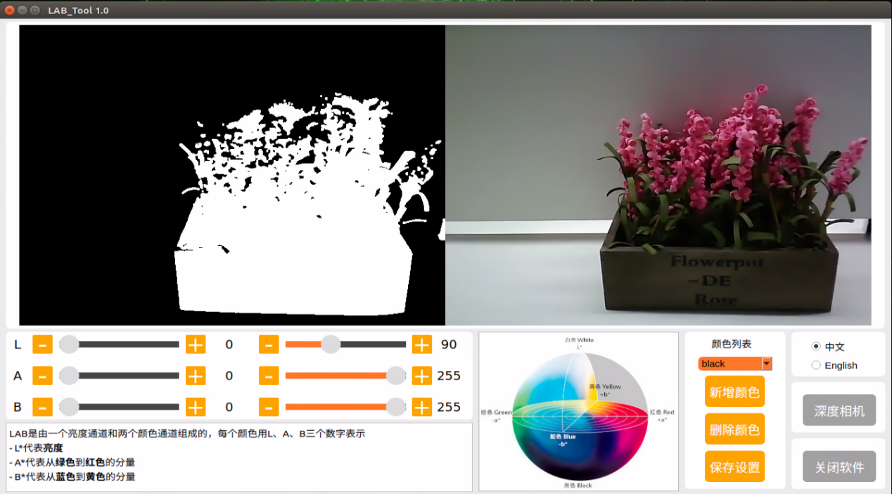

6. Regarding the interface button instructions and usage, you can refer to the following content. If you want to close it, please click on and select “**Yes**” in the popup window.

   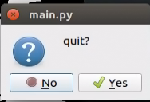

7. After closing LAB tool, press “Ctrl+C” to close the terminal, and input the command to restart app auto-start service. After the service is enable, robot arm will restore the initial position.

   ```py
   sudo systemctl restart start_app_node.service
   ```

   > [!NOTE]
   >
   > **If you do not enable app auto-start service for the robot, it will affect the corresponding app functions. Restarting robot can also automatically enable the app auto-start service.**

### 14.1.2 LAB TOOL Interface Layout Instruction

The interface of LAB tool software is divided into two parts: image display area and recognition adjustment area.

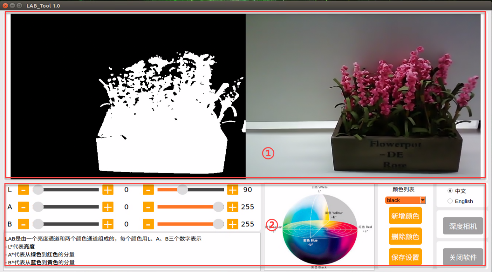

1)  Image display area: the left displays the processed image and the right is the raw image.

> [!NOTE]
>
> **If the transmitted image does not display normally, it’s the issue of camera connection. In this case, you need to examine if the wiring is connected properly or reconnect it.**

2)  Recognition adjustment area: adjust the color threshold. The function of each button refer to the following table:

<table>
<colgroup>
<col style="width: 35%" />
<col style="width: 64%" />
</colgroup>
<tbody>
<tr>
<td style="text-align: center;"><strong>Icon</strong></td>
<td style="text-align: center;"><strong>Function instruction</strong></td>
</tr>
<tr>
<td style="text-align: center;"></td>
<td style="text-align:center;"><p>The sliders L, A and B are used respectively to adjust the values of the corresponding L, A and B components of the image.</p>
<p>The sliders on the left are the “min” value for each component while the slider on the right are the “max” value for each component.</p></td>
</tr>
<tr>
<td style="text-align: center;"></td>
<td style="text-align:center;">Choose color to adjust the threshold.</td>
</tr>
<tr>
<td style="text-align: center;"></td>
<td style="text-align:center;">Delete the currently selected color.</td>
</tr>
<tr>
<td style="text-align: center;"></td>
<td style="text-align:center;">Add recognizable color.</td>
</tr>
<tr>
<td style="text-align: center;"></td>
<td style="text-align:center;">Save the adjustment result of the color threshold.</td>
</tr>
<tr>
<td style="text-align: center;"></td>
<td style="text-align:center;">Click on this button to swap Depth camera/monocular camera.</td>
</tr>
<tr>
<td style="text-align: center;"></td>
<td style="text-align:center;">Close LAB TOOL.</td>
</tr>
</tbody>
</table>


### 14.1.3 Adjust Color Threshold

1)  Open LAN tool. Choose the color in the color drop-down list of color recognition area. Take a color “**red**” as example.

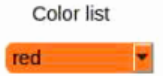

2)  Adjust the “**min**” values of L, A and B components to “**0**”, the “**max**” values to “**225**”.


3)  Place the target within the camera’s field of view. Adjust the values of L, A and B component towards the interval representing the target recognition color according to the LAB color space distribution chart.

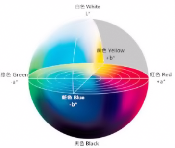

Red color is close to “+a”, which indicates that A component needs to be increased. Therefore, keep the “max” value of the A component unchanged and increase its “min” value until the object on the left turns white while other areas turn black.


4)  Adjust the L and B components according to your surroundings. If the red color is light, increase the “min” value of the L component; if it is dark, decrease the “max” value of the component. If the red color tends to be warm, increase the "min" value of the B component; if it tends to be cool, decrease the "max" value of the B component.

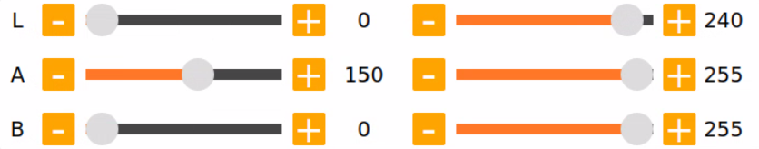

The following table shows the parameter information of LAB threshold adjustment:

| **Color component** | **Value Range** | **Corresponding Color Intervals** |
| :-----------------: | :-------------: | :-------------------------------: |
|          L          |      0~255      |        Black-white (-L~+L)        |
|          A          |      0~255      |       green-red（-a ~ +a）        |
|          B          |      0~255      |      Blue-yellow（-b ~ +b）       |

5)  Click “**Save settings**” button in adjustment area to save the adjustment parameters.

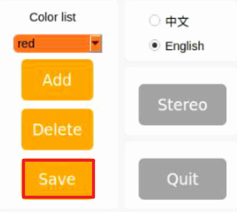

### 14.1.4 Add New Color 

In addition to the built-in colors, users can add other recognition colors. Take an example of adding “**yellow**”.

1)  Open LAB tool and click on “**add color**” button.

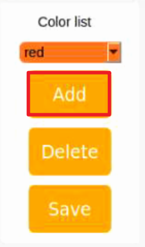

2)  Fill in the "**name**" column with the color name, and click the "**OK**" button.


3)  Choose the added color in the color drop-down menu.

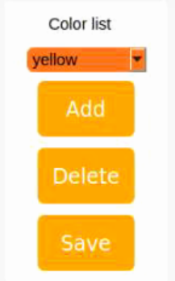

4)  Place the target within the camera's field of view, and adjust the threshold by dragging the L, A, and B component sliders until the area of the colored object within the left screen turns white, while the other areas turn black.


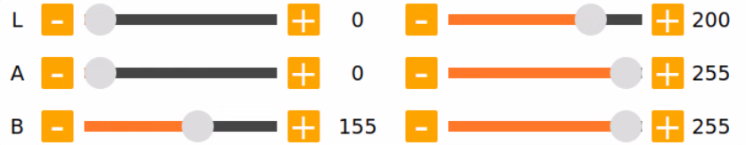

> [!NOTE]
>
> The adjustment method of color threshold refers to “**[14.1.3 Adjust Color Adjustment]()**”.

5)  Click “**Save settings**” button in recognition adjustment area to save the adjustment parameters of color threshold.


## 14.2 Color Recognition

This session will use OpenCV to perform red, green, blue recognition and display the recognition result through transmitted image. Before operations, please prepare one object of red, green and blue.

### 14.2.1 Recognition Process

Firstly, obtain the RGB image from the camera. Scale and apply Gaussian blur to the image. Convert the image from RGB to Lab. (For detailed explanations regarding the Lab color space, you can refer to "**[7. ROS+OpenCV Lesson]()**".)

Next, identify the object color in the circle by using color thresholds, followed by masking of the image portion. (masking is used to hide certain part of the processed image).

After performing opening and closing operations on the object image, the object with the largest contour is circled.

Open operations: erosion followed by dilation. Remove small objects, smooth the contours of object and keep its area unchanged. It can eliminate small noise and break thin connection between objects.

Erosion: it can be used to remove small objects or features from an image, break thin connections between objects, and generally reduce the size of objects.

Dilation: it is useful for filling in gaps between objects, joining nearby objects, and generally increasing the size of objects.

Finally, the recognition results are displayed on the screen.

### 14.2.2 Operation Steps 

> [!NOTE]
>
> **The entered command should be case sensitive and “Tab” key can be used to complement the key words.**

1. Start JetRover and connect it to Nomachine.

2. Click on  to open the ROS1 command line terminal.

3. Input the command and press Enter to disable the app auto-start service.

   ```py
   sudo systemctl stop start_app_node.service
   ```

4. Click-on  to open the ROS2 command-line terminal.

5. Run the following command to enable the camera node:

   ```py
   ros2 launch peripherals depth_camera.launch.py
   ```

6. Open a new command line terminal, enter the following command to navigate to the program directory and start the color detection game:

   ```py
   cd ~/ros2_ws/src/example/example/color_detect && python3 color_detect_demo.py
   ```

7. The program will launch the camera's image interface. For detailed recognition steps, please refer to section 14.2.3 Program Outcome.

8. Next, press "**Ctrl+C**" in the command line terminal interface. If closing fails, please try again repeatedly.

### 14.2.3 Program Outcome

> [!NOTE]
>
> **After the game starts, please ensure that there are no other objects containing recognized colors within the field of view of the camera to avoid affecting the implementation effect.**

After the game starts, place the target object within the field of view of the camera. When recognizing the target object, it will be circled up in the same color and the color name will be printed in the lower-left corner of the screen. The program supports red, blue and green object recognition.

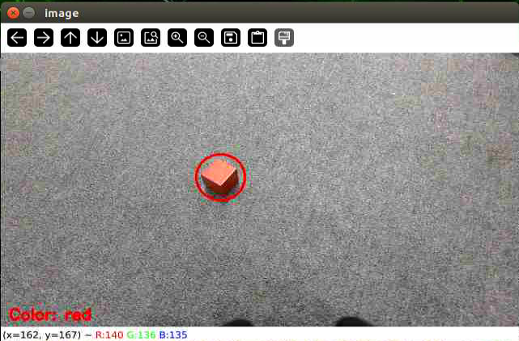

### 14.2.4 Program Analysis

The source code of the program is located in

**/home/ubuntu/ros2_ws/src/example/example/color_detect/color_detect_demo.py**

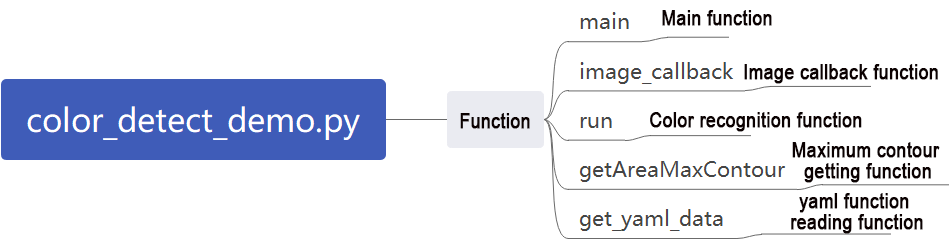

```py
range_rgb = {
    'red': (0, 0, 255),
    'blue': (255, 0, 0),
    'green': (0, 255, 0),
    'black': (0, 0, 0),
    'white': (255, 255, 255),
}

def get_yaml_data(yaml_file):
    yaml_file = open(yaml_file, 'r', encoding='utf-8')
    file_data = yaml_file.read()
    yaml_file.close()
    
    data = yaml.load(file_data, Loader=yaml.FullLoader)
    
    return data

lab_data = get_yaml_data("/home/ubuntu/share/lab_tool/lab_config.yaml")
```

* **Main Function**

Initialize the ROS node, create a color recognition node named "**color_detect_node**", subscribe to the image topic "**/depth_cam/rgb/image_raw**", and set its callback function to "**image_callback**". Start the main function for color recognition using multiple threads. Wait for the node to shut down.

```py
if __name__ == '__main__':
    rclpy.init()
    node = rclpy.create_node('color_detect_node')
    node.create_subscription(Image, '/depth_cam/rgb/image_raw', image_callback, 1)
    threading.Thread(target=main, daemon=True).start()
    rclpy.spin(node)
```

* **Image Processing**

**1. Camera Callback Function**

Primarily used to read the video stream from the topic and enqueue it to ensure real-time display.

```py
def image_callback(ros_image):
    rgb_image = np.ndarray(shape=(ros_image.height, ros_image.width, 3), dtype=np.uint8,
                           buffer=ros_image.data)  # Original RGB image
    bgr_image = cv2.cvtColor(rgb_image, cv2.COLOR_RGB2BGR)
    if image_queue.full():
        # If the queue is full, discard the oldest image
        image_queue.get()
        # Put the image into the queue
    image_queue.put(bgr_image)
```

**2. Color Recognition Main Function**

Read the image information from the queue and pass it into the function run to obtain the image after color recognition. Finally, use cv2 to display the image.

```py
def main():
    running = True
    while running:
        try:
            image = image_queue.get(block=True, timeout=1)
        except queue.Empty:
            if not running:
                break
            else:
                continue
        image = run(image)
        cv2.imshow('image', image)
        key = cv2.waitKey(1)
        if key == ord('q') or key == 27:  # Press q or esc to exit
            break
```

**3. Read yanl File Function**

```py
def get_yaml_data(yaml_file):
    yaml_file = open(yaml_file, 'r', encoding='utf-8')
    file_data = yaml_file.read()
    yaml_file.close()
    
    data = yaml.load(file_data, Loader=yaml.FullLoader)
    
    return data
```

**4. Largest Contour Function**

Input the contours detected by OpenCV, find the largest contour based on its size, and finally return the largest contour and its area.

```py
# Find the contour with the largest area
# The parameter is a list of contours to be compared
def getAreaMaxContour(contours):
    contour_area_temp = 0
    contour_area_max = 0
    area_max_contour = None

    for c in contours:  # Iterate through all contours
        contour_area_temp = math.fabs(cv2.contourArea(c))  # Calculate the contour area
        if contour_area_temp > contour_area_max:
            contour_area_max = contour_area_temp
            if contour_area_temp > 50:  # Only when the area is greater than 50, the contour with the maximum area is valid to filter out interference
                area_max_contour = c

    return area_max_contour, contour_area_max  # Return the largest contour
```

**5. Color Recognition Function**

Input the image, resize it to the size specified by the parameter (320, 240) for easier detection, then apply Gaussian processing to the image, and finally convert the image to the LAB color space.

```py
def run(img):
    global draw_color
    global color_list
    global detect_color
    
    img_copy = img.copy()
    img_h, img_w = img.shape[:2]

    frame_resize = cv2.resize(img_copy, size, interpolation=cv2.INTER_NEAREST)
    frame_gb = cv2.GaussianBlur(frame_resize, (3, 3), 3)      
    frame_lab = cv2.cvtColor(frame_gb, cv2.COLOR_BGR2LAB)  # Convert the image to the LAB color space
    max_area = 0
    color_area_max = None    
    areaMaxContour_max = 0
```

Loop through the color list for color recognition, and output the color of the largest detected contour.

```py
    for i in ['red', 'green', 'blue']:
        frame_mask = cv2.inRange(frame_lab, tuple(lab_data['lab']['Stereo'][i]['min']), tuple(lab_data['lab']['Stereo'][i]['max']))  # Perform bitwise operation on the original image and the mask
        eroded = cv2.erode(frame_mask, cv2.getStructuringElement(cv2.MORPH_RECT, (3, 3)))  # Erosion
        dilated = cv2.dilate(eroded, cv2.getStructuringElement(cv2.MORPH_RECT, (3, 3)))  # Dilation
        contours = cv2.findContours(dilated, cv2.RETR_EXTERNAL, cv2.CHAIN_APPROX_NONE)[-2]  # Find contours
        areaMaxContour, area_max = getAreaMaxContour(contours)  # Find the largest contour
        if areaMaxContour is not None:
            if area_max > max_area:  # Find the maximum area
                max_area = area_max
                color_area_max = i
                areaMaxContour_max = areaMaxContour
```

The detected contour area must be greater than 200; otherwise, it will be filtered out. If it is greater than 200, calculate the contour coordinates and, based on the largest contour's color, draw the target color's position on the image.

```py
if max_area > 200:  # Maximum area found
        ((centerX, centerY), radius) = cv2.minEnclosingCircle(areaMaxContour_max)  # Get the minimum enclosing circle
        centerX = int(common.val_map(centerX, 0, size[0], 0, img_w))
        centerY = int(common.val_map(centerY, 0, size[1], 0, img_h))
        radius = int(common.val_map(radius, 0, size[0], 0, img_w))            
        cv2.circle(img, (centerX, centerY), radius, range_rgb[color_area_max], 2)# Draw a circle

        if color_area_max == 'red':  # Red has the maximum area
            color = 1
        elif color_area_max == 'green':  # Green has the maximum area
            color = 2
        elif color_area_max == 'blue':  # Blue has the maximum area
            color = 3
        else:
            color = 0
        color_list.append(color)

        if len(color_list) == 3:  # Multiple judgments
            # Take the average value
            color = int(round(np.mean(np.array(color_list))))
            color_list = []
            if color == 1:
                detect_color = 'red'
                draw_color = range_rgb["red"]
            elif color == 2:
                detect_color = 'green'
                draw_color = range_rgb["green"]
            elif color == 3:
                detect_color = 'blue'
                draw_color = range_rgb["blue"]
            else:
                detect_color = 'None'
                draw_color = range_rgb["black"]               
    else:
        detect_color = 'None'
        draw_color = range_rgb["black"]
            
    cv2.putText(img, "Color: " + detect_color, (10, img.shape[0] - 10), cv2.FONT_HERSHEY_SIMPLEX, 0.65, draw_color, 2)
    
    return img
```

## 14.3 Generate & Recognize QR Code

This lesson is divided into two parts. The first part will introduce you how to learn to create a QR code, while the second part focuses on recognizing the created QR code and then decoding the QR code information through the terminal.

### 14.3.1 Generate QR Code

* **Process** 

First, create an instance object of the QR code tool and set its detailed parameters.

Next, obtain the user’s data and fill it into the QR code.

Finally, generate a QR CODE image based on the data and display it in a window, and save it in the corresponding path.

* **Operation Steps**

> [!NOTE]
>
> **The entered command should be case sensitive and the “Tab” key can be used to fill in key words.**

1. Start JetRover and connect it to Nomachine.

2. Click on  to open the ROS1 command line terminal.

3. Input the command and press Enter to disable the app auto-start service.

   ```py
   sudo systemctl stop start_app_node.service
   ```

4. Click-on  to open the ROS2 command-line terminal.

5. Input the command to access the program directory and start the QR code creation program.

   ```py
   cd ~/ros2_ws/src/example/example/qrcode && python3 qrcode_creater.py
   ```

   After start the program, it’s necessary to enter characters in the terminal to generate the QR code. Take the input of “**ubuntu**” as example.

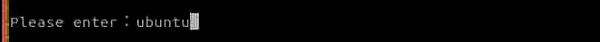

Press “**Enter**” to display a QR code image containing the input data.

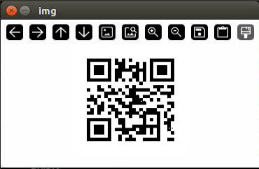

6)  If need to close the program, press “**Ctrl+C**” in the terminal. If this fails, please try multiple times.

7)  After closing the window, the saved content and its path are printed.

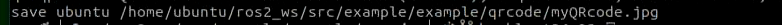

8. Proceed to enter the command to copy the QR code to the corresponding folder, for exporting to our PC desktop.

   ```py
   cp myQRcode.jpg ~/share/tmp
   ```

9. Next, we click on  on the left side of the system interface, then click to open the file manager, and navigate to the directory highlighted in the red box in the screenshot below. Here, you can see that the generated QR code has been exported to the host system.

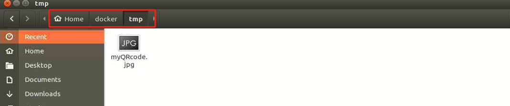

10) Drag the image to your PC desktop using the NoMachine tool's drag-and-drop feature. Then, you can print it out or transfer it to your mobile phone's photo album.

    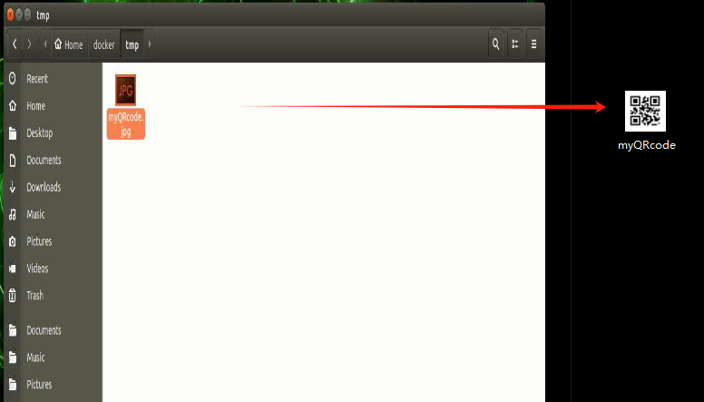

* **Program Analysis**

The source code of this program is located at:

**/home/ubuntu/ros2_ws/src/example/example/qrcode/qrcode_creater.py**

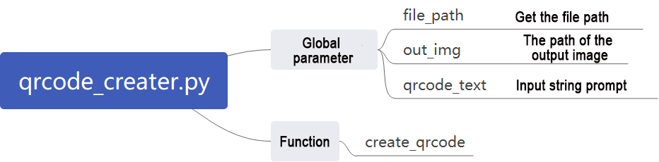

```py
#!/usr/bin/env python3
# encoding: utf-8
import os
import cv2
import qrcode
import numpy as np

def create_qrcode(data, file_name):
    '''
    version: An integer ranging from 1 to 40, which controls the size of the QR code (the minimum value is 1, corresponding to a 12×12 matrix).
             If you want the program to determine it automatically, set the value to None and use the fit parameter.
    error_correction: Controls the error correction function of the QR code. It can take the following 4 constants:
    　　ERROR_CORRECT_L: Approximately 7% or fewer errors can be corrected.
    　　ERROR_CORRECT_M (default): Approximately 15% or fewer errors can be corrected.
    　　ROR_CORRECT_H: Approximately 30% or fewer errors can be corrected.
    box_size: Controls the number of pixels contained in each small grid of the QR code.
    border: Controls the number of grids contained in the border (the distance between the QR code and the image boundary) (default is 4, which is the minimum value specified by relevant standards).
    '''
    qr = qrcode.QRCode(
        version=1,
        error_correction=qrcode.constants.ERROR_CORRECT_H,
        box_size=5,
        border=4)
    # Add data
    qr.add_data(data)
    # Fill data
    qr.make(fit=True)
    # Generate image
    img = qr.make_image(fill_color=(0, 0, 0), back_color=(255, 255, 255))
    opencv_img = cv2.cvtColor(np.asarray(img), cv2.COLOR_RGB2BGR)
    while True:
        cv2.imshow('img', opencv_img)
        k = cv2.waitKey(1)
        if k != -1:
            break
    cv2.imwrite(file_name, opencv_img)
    print('save', data, file_name)

if __name__ == '__main__':
    file_path = os.getcwd()
    out_img = file_path + '/myQRcode.jpg'
    qrcode_text = input("Please enter：")
    create_qrcode(qrcode_text, out_img)
```

**1. Creating QR Code Utility Object**

Using the qrcode module to create the necessary object and setting various parameters for the QR code.

```py
    qr = qrcode.QRCode(
        version=1,
        error_correction=qrcode.constants.ERROR_CORRECT_H,
        box_size=5,
        border=4)
    qr.add_data(data)
```

The parameters of the above function are as follows:

The first parameter "**version**" is an integer ranging from 1 to 40, used to control the size of the QR code. If you want the program to automatically determine the size, set this value to None and use the "**fit**" parameter.

The second parameter "**error_correction**" controls the error correction capability of the QR code, with the following options:

1)  ERROR_CORRECT_L: can correct approximately 7% or fewer errors.

2)  ERROR_CORRECT_M: default value, can correct approximately 15% or fewer errors.

3)  ERROR_CORRECT_H: can correct approximately 30% or fewer errors.

    The third parameter "box_size" controls the number of pixels contained in each small box of the QR code.

    The fourth parameter "border" controls the number of boxes included in the border (distance between the QR code and the image boundary), with a default value of 4, which is the minimum value specified by relevant standards.

**2. Generating QR Code**

Using the `add_data` and `make` functions to retrieve and fill data, and then using the "make_image" function to generate the image.

```py
    # Add data
    qr.add_data(data)
    # Fill data
    qr.make(fit=True)
    # Generate image
    img = qr.make_image(fill_color=(0, 0, 0), back_color=(255, 255, 255))
    opencv_img = cv2.cvtColor(np.asarray(img), cv2.COLOR_RGB2BGR)
```

The parameters of the `make_image` function are as follows:

The first parameter `fill_color=(0, 0, 0)` is the fill color of the image, which is black in this case.

The second parameter `back_color=(255, 255, 255)` is the background color of the image, which is white in this case.

**3. Displaying Image**

Converting the color space of the image using the `cvtColor` function, and then displaying it on the window using the `imshow` function.

```py
    opencv_img = cv2.cvtColor(np.asarray(img), cv2.COLOR_RGB2BGR)
    while True:
        cv2.imshow('img', opencv_img)
        k = cv2.waitKey(1)
        if k != -1:
            break
```

**4. Saving Image**

Using the `imwrite` function to store the generated QR code image and printing relevant information.

```py
    cv2.imwrite(file_name, opencv_img)
    print('save', data, file_name)
```

The parameters of the `imwrite` function are as follows:

The first parameter `file_name` is the storage path of the image.

The second parameter `opencv_img` is the image to be stored.

### 14.3.2 QR Code Recognition

In the previous section, we created a QR code. In this section, we'll perform content recognition on the QR code.

* **Recognition Process**

Firstly, create an instance object for QR code detection, and pass in the required network structure and model weight files for detection.

Then, obtain the camera's feedback image and perform detection.

Finally, once the QR code is recognized, it will be framed, and the content of the QR code will be printed.

The source code for this program is located at: **/home/ubuntu/ros2_ws/src/example/example/qrcode/qrcode_detecter.py**

* **QR Code Recognition Steps**

> [!NOTE]
>
> **When entering commands, it is necessary to strictly distinguish between uppercase and lowercase letters, and you can use the "Tab" key to complete keywords.**

1. Start the robot and connect it to the remote control software NoMachine.

2. Click on 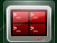 on the system desktop to open the ROS1 command line terminal.

3. Enter the command to stop the automatic startup service of the app:

   ```py
   sudo systemctl stop start_app_node.service
   ```

4. Click on  on the system desktop to open the ROS2 command line terminal.

5. Enter the command to start the camera node:

   ```py
   ros2 launch peripherals depth_camera.launch.py
   ```

6. Open a new ROS2 command line terminal, enter the command to switch to the program directory, and start the QR code recognition program:

   ```py
   cd ~/ros2_ws/src/example/example/qrcode && python3 qrcode_detecter.py
   ```

   To close this game, press "**Ctrl+C**" in the terminal interface. If closing fails, please try again repeatedly.

* **Program Outcome**

After starting the gameplay, it will recognize the QR code images appearing in the feedback screen, mark them with a red box, and print out the content of the QR code.

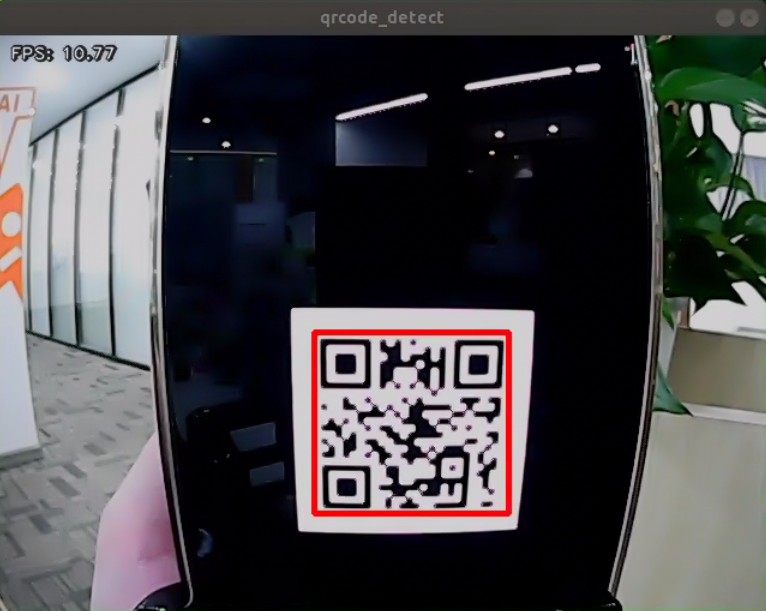

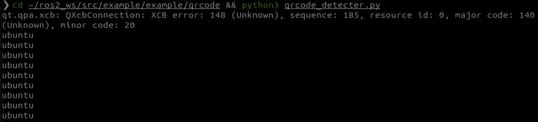

* **Program Analysis**

The source code of this program is saved in **/home/ubuntu/ros2_ws/src/example/example/qrcode/qrcode_detecter.py**

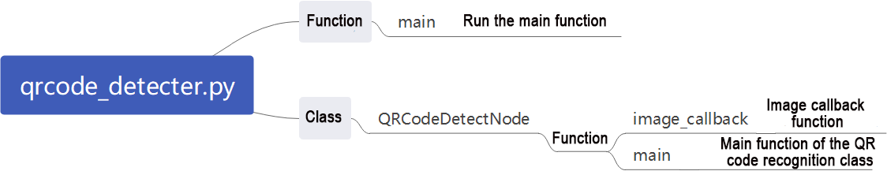

```py
#!/usr/bin/env python3
# encoding: utf-8
import os
import cv2  
import queue
import rclpy
import threading
import numpy as np
from rclpy.node import Node
from sensor_msgs.msg import Image

class QRCodeDetectNode(Node):
    def __init__(self, name):
        rclpy.init()
        super().__init__(name)
        self.running = True
        self.model_path = os.path.join(os.path.abspath(os.path.split(os.path.realpath(__file__))[0]), 'model/detector.tflite')
        self.image_queue = queue.Queue(maxsize=2)
        self.image_sub = self.create_subscription(Image, '/depth_cam/rgb/image_raw', self.image_callback, 1)
        self.qcd = cv2.QRCodeDetector()
        threading.Thread(target=self.main, daemon=True).start()  

    def image_callback(self, ros_image):
        rgb_image = np.ndarray(shape=(ros_image.height, ros_image.width, 3), dtype=np.uint8,
                               buffer=ros_image.data)  
        bgr_image = cv2.cvtColor(rgb_image, cv2.COLOR_RGB2BGR)
```

**1. Main Function**

Initialize the QRCodeDetectNode and set the node name as "qrcode_detect". Wait for the ROS node to close, and if it closes, unregister the current node.

```py
def main():
    node = QRCodeDetectNode('qrcode_detect')
    try:
        rclpy.spin(node)
    except KeyboardInterrupt:
        node.destroy_node()
        rclpy.shutdown()
        print('shutdown')
    finally:
        print('shutdown finish')

if __name__ == "__main__":
    main()
```

**2. QRCodeDetectNode Class**

Initialize the node and define parameters, then start the self.main function.

**Parameters:**

self.running: Whether the detection is enabled

self.model_path: Model path

self.image_queue: Image queue

self.image_sub: Subscription to read camera feedback images

self.qcd: Initialization of the QR code detection

```py
class QRCodeDetectNode(Node):
    def __init__(self, name):
        rclpy.init()
        super().__init__(name)
        self.running = True
        self.model_path = os.path.join(os.path.abspath(os.path.split(os.path.realpath(__file__))[0]), 'model/detector.tflite')
        self.image_queue = queue.Queue(maxsize=2)
        self.image_sub = self.create_subscription(Image, '/depth_cam/rgb/image_raw', self.image_callback, 1)
        self.qcd = cv2.QRCodeDetector()
        threading.Thread(target=self.main, daemon=True).start()  

    def image_callback(self, ros_image):
        rgb_image = np.ndarray(shape=(ros_image.height, ros_image.width, 3), dtype=np.uint8,
                               buffer=ros_image.data)  # 原始 RGB 画面(Original RGB image)
        bgr_image = cv2.cvtColor(rgb_image, cv2.COLOR_RGB2BGR)
        if self.image_queue.full():
            # 如果队列已满，丢弃最旧的图像(If the queue is full, discard the oldest image)
            self.image_queue.get()
            # 将图像放入队列(Put the image into the queue)
        self.image_queue.put(bgr_image)

    def main(self):
        while self.running:
            try:
                image = self.image_queue.get(block=True, timeout=1)
            except queue.Empty:
                if not self.running:
                    break
                else:
                    continue
            ret_qr, decoded_info, points, _ = self.qcd.detectAndDecodeMulti(image)
            if ret_qr:
                for s, p in zip(decoded_info, points):
                    if s:
                        print(s)
                        color = (0, 255, 0)
                    else:
                        color = (0, 0, 255)
                    image = cv2.polylines(image, [p.astype(int)], True, color, 8)
            cv2.imshow('image', image)
            key = cv2.waitKey(1)
            if key == ord('q') or key == 27:  # 按q或者esc退出(Press q or esc to exit)
              break
```

**Functions:**

The camera callback function reads the camera feedback image and places it in the queue self.image_queue for automatic update and discarding of expired images.

```py
    def image_callback(self, ros_image):
        rgb_image = np.ndarray(shape=(ros_image.height, ros_image.width, 3), dtype=np.uint8,
                               buffer=ros_image.data)  # 原始 RGB 画面(Original RGB image)
        bgr_image = cv2.cvtColor(rgb_image, cv2.COLOR_RGB2BGR)
        if self.image_queue.full():
            # 如果队列已满，丢弃最旧的图像(If the queue is full, discard the oldest image)
            self.image_queue.get()
            # 将图像放入队列(Put the image into the queue)
        self.image_queue.put(bgr_image)
```

The main function mainly starts QR code detection. It checks whether detection is enabled based on the parameter self.running. If it is True, it reads the image data from the self.image_queue queue, inputs it into the initialized recognition model self.qcd, and finally prints the recognition content and draws the recognition box based on the output data.

```py
    def main(self):
        while self.running:
            try:
                image = self.image_queue.get(block=True, timeout=1)
            except queue.Empty:
                if not self.running:
                    break
                else:
                    continue
            ret_qr, decoded_info, points, _ = self.qcd.detectAndDecodeMulti(image)
            if ret_qr:
                for s, p in zip(decoded_info, points):
                    if s:
                        print(s)
                        color = (0, 255, 0)
                    else:
                        color = (0, 0, 255)
                    image = cv2.polylines(image, [p.astype(int)], True, color, 8)
            cv2.imshow('image', image)
            key = cv2.waitKey(1)
            if key == ord('q') or key == 27:  # 按q或者esc退出(Press q or esc to exit)
              break
```

## 14.4 Autonomous Line Following

### 14.4.1 Recognition Procedure

First, obtain the RGB image from the camera and resize it. Apply Gaussian blur to the image and convert the color space from RGB to Lab. (For detailed explanation on Lab color space, please refer to "1 Tutorial\\ 2 Development Basics Course\3 OpenCV Basics Course").

Then, perform color recognition on the objects in the circle using color thresholding. Apply masking to parts of the image. (Masking is used to globally or locally mask the processed image using selected images, graphics, or objects).

Afterward, perform opening and closing operations on the object images. Finally, outline the largest object with a circle.

Opening operation: First, erode the image and then dilate it. Purpose: Used to eliminate small objects, smooth the shape boundary, and not change its area. It can remove small grain noise and break the adhesion between objects.

Erosion: Eliminate the boundary points of the object, causing the boundary to shrink inward, and can remove objects smaller than the structural element.

Dilation: Expand the boundary points of the object, merge all background points in contact with the object into the object, and expand the boundary outward.

Finally, feedback the recognition results on the feedback screen.

### 14.4.2 Autonomous Line Following Operation

> [!NOTE]
>
> **The input command should be case sensitive, and keywords can be complemented using Tab key.**

1. Start the robot and connect it to the remote control software NoMachine.

2. Click on  on the system desktop to open the ROS1 command line terminal.

3. Enter the command to stop the automatic startup service of the app:

   ```py
   sudo systemctl stop start_app_node.service
   ```

4. Click on  on the system desktop to open the ROS2 command line terminal.

5. Enter the command to start the camera node:

   ```py
   ros2 launch peripherals depth_camera.launch.py
   ```

6. Open a new ROS2 command line terminal, enter the command to navigate to the program directory, and start the line-following game:

   ```py
   ros2 service call /line_following/enter std_srvs/srv/Trigger {}
   ```

7. Then, in the current command line terminal, enter the command to navigate to the program directory and start the line-following game:

   ```py
   ros2 service call /line_following/set_running std_srvs/srv/SetBool "{data: True}"
   ```

8)  Click on the position of the line in the image to select the corresponding color of the track line, and you can start line following by color picking.

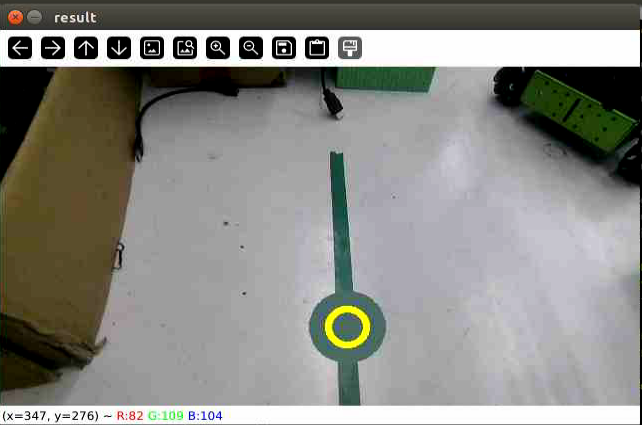

9. If you need to close this function, you need to return to the command line terminal and enter the command to stop it.

   ```py
   ros2 service call /line_following/enter std_srvs/srv/Trigger {}
   ```

### 14.4.3 Program Analysis

**Launch Analysis:**

The program file corresponding to this section of the course document is located at:

**/home/ubuntu/ros2_ws/src/app/launch/scripts/line_following_node.launch.py**

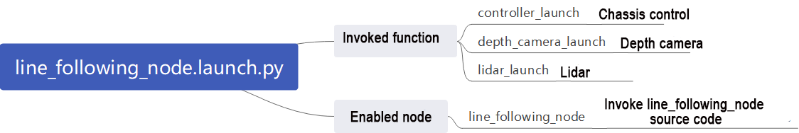

**1. Read the Storage Path**

```py
    if compiled == 'True':
        peripherals_package_path = get_package_share_directory('peripherals')
        controller_package_path = get_package_share_directory('controller')
    else:
        peripherals_package_path = '/home/ubuntu/ros2_ws/src/peripherals'
        controller_package_path = '/home/ubuntu/ros2_ws/src/driver/controller'
```

Use \`get_package_share_directory\` to obtain the package path.

**2. Launch**

```py
    controller_launch = IncludeLaunchDescription(
        PythonLaunchDescriptionSource(
            os.path.join(controller_package_path, 'launch/controller.launch.py')),
    )

    lidar_launch = IncludeLaunchDescription(
        PythonLaunchDescriptionSource(
            os.path.join(peripherals_package_path, 'launch/lidar.launch.py')),
    )

    lidar_controller_node = Node(
        package='app',
        executable='lidar_controller',
        output='screen',
    )
```

`controller_launch`: Start motion control launch.

`depth_camera_launch`: Start depth camera launch.

`lidar_launch`: Start lidar launch.

**3. None**

`line_following_node`: Start line following node.

```
    line_following_node = Node(
        package='app',
        executable='line_following',
        output='screen',
    )
```

Source Code Analysis:

The program file corresponding to this section of the course document is located at:

**/home/ubuntu/ros2_ws/src/app/app/scripts/line_following.py**

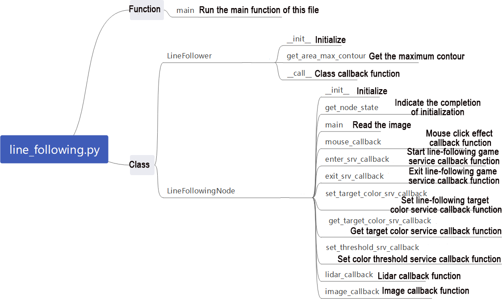

> [!NOTE]
>
> **It’s necessary to back up the original program file before making any modification to the program. You’re forbidden to modify the original source code file to avoid causing robot malfunctions that may be irreparable due to incorrect parameter modifications!**

According to the game’s effect, the process logic of this game is summarized as shown in the following diagram:

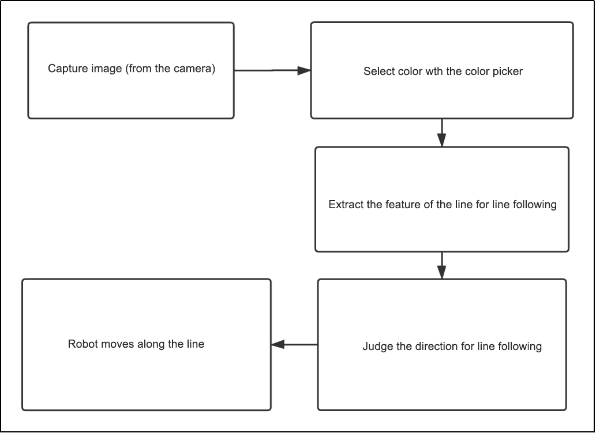

Subscribe to the topic messages published by the camera node to obtain RGB images. From the image, identify and select the target line. Determine the color threshold by picking the color of the line. Based on the line's color information, extract the features of the line for line following. Calculate the robot's offset relative to the line's position in the field of view. Control the robot to move along the line segment, continuously correcting its position to keep the line at the center of the field of view and use lidar to detect obstacles and avoid them.

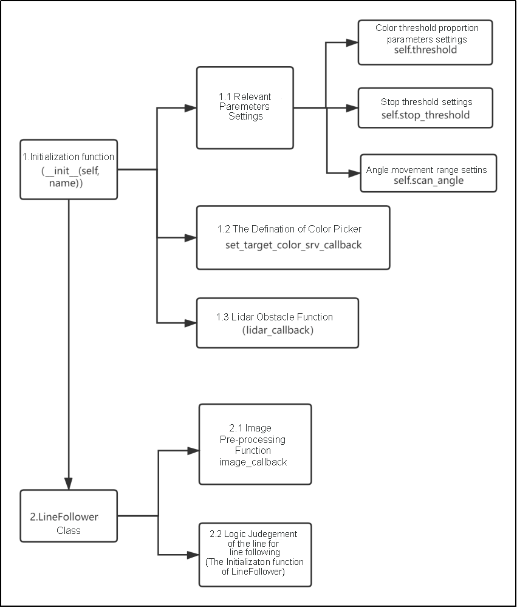

Then, the color picker object is defined (used in the gameplay to pick colors), along with the setting of additional Lidar obstacle avoidance functionality. Next is the implementation of the LineFollower class, which mainly includes functions for image preprocessing and logic for line following.

**Function:**

Main:

```py
def main():
    node = LineFollowingNode('line_following')
    rclpy.spin(node)
    node.destroy_node()
    rclpy.shutdown()
```

Initiate line following node:

Class:

LineFollower:

```py
class LineFollower:
    def __init__(self, color, node):
        self.node = node
```

Init:

```py
    def __init__(self, color, node):
        self.node = node
        self.target_lab, self.target_rgb = color
        self.rois = ((0.9, 0.95, 0, 1, 0.7), (0.8, 0.85, 0, 1, 0.2), (0.7, 0.75, 0, 1, 0.1))
        self.weight_sum = 1.0
```

Set the line-following color and ROI list.

get_area_max_contour:

```py
    def get_area_max_contour(contours, threshold=100):
        '''
        获取最大面积对应的轮廓(get the contour of the largest area)
        :param contours:
        :param threshold:
        :return:
        '''
        contour_area = zip(contours, tuple(map(lambda c: math.fabs(cv2.contourArea(c)), contours)))
        contour_area = tuple(filter(lambda c_a: c_a[1] > threshold, contour_area))
        if len(contour_area) > 0:
            max_c_a = max(contour_area, key=lambda c_a: c_a[1])
            return max_c_a
        return None
```

Get the contour with the maximum area.

Call:

```py
    def __call__(self, image, result_image, threshold):
        centroid_sum = 0
        h, w = image.shape[:2]
        min_color = [int(self.target_lab[0] - 50 * threshold * 2),
                     int(self.target_lab[1] - 50 * threshold),
                     int(self.target_lab[2] - 50 * threshold)]
        max_color = [int(self.target_lab[0] + 50 * threshold * 2),
                     int(self.target_lab[1] + 50 * threshold),
                     int(self.target_lab[2] + 50 * threshold)]
        target_color = self.target_lab, min_color, max_color
        for roi in self.rois:
            blob = image[int(roi[0]*h):int(roi[1]*h), int(roi[2]*w):int(roi[3]*w)]  # 截取roi(intercept roi)
            img_lab = cv2.cvtColor(blob, cv2.COLOR_RGB2LAB)  # rgb转lab(convert rgb into lab)
            img_blur = cv2.GaussianBlur(img_lab, (3, 3), 3)  # 高斯模糊去噪(perform Gaussian filtering to reduce noise)
            mask = cv2.inRange(img_blur, tuple(target_color[1]), tuple(target_color[2]))  # 二值化(image binarization)
            eroded = cv2.erode(mask, cv2.getStructuringElement(cv2.MORPH_RECT, (3, 3)))  # 腐蚀(corrode)
            dilated = cv2.dilate(eroded, cv2.getStructuringElement(cv2.MORPH_RECT, (3, 3)))  # 膨胀(dilate)
            # cv2.imshow('section:{}:{}'.format(roi[0], roi[1]), cv2.cvtColor(dilated, cv2.COLOR_GRAY2BGR))
            contours = cv2.findContours(dilated, cv2.RETR_EXTERNAL, cv2.CHAIN_APPROX_TC89_L1)[-2]  # 找轮廓(find the contour)
            max_contour_area = self.get_area_max_contour(contours, 30)  # 获取最大面积对应轮廓(get the contour corresponding to the largest contour)
            if max_contour_area is not None:
                rect = cv2.minAreaRect(max_contour_area[0])  # 最小外接矩形(minimum circumscribed rectangle)
                box = np.intp(cv2.boxPoints(rect))  # 四个角(four corners)
                for j in range(4):
                    box[j, 1] = box[j, 1] + int(roi[0]*h)
                cv2.drawContours(result_image, [box], -1, (0, 255, 255), 2)  # 画出四个点组成的矩形(draw the rectangle composed of four points)
```

Perform color recognition, identify based on the set color, and provide feedback on the recognized image and angle.

LineFollowingNode:

```py
class LineFollowingNode(Node):
    def __init__(self, name):
        rclpy.init()
        super().__init__(name)
        self.name = name
        self.set_callback = False
        self.is_running = False
        self.color_picker = None
```

Init：

```py
def __init__(self, name):
        rclpy.init()
        super().__init__(name)
        
        self.name = name
        self.set_callback = False
        self.is_running = False
        self.color_picker = None
        self.follower = None
        self.scan_angle = math.radians(45)
        self.pid = pid.PID(0.01, 0.0, 0.0)
        self.empty = 0
        self.count = 0
        self.stop = False
```

Initialize the required parameters for the program, call the base node, camera node, and start services such as enter, exit, start, set color, get color, set threshold, etc.

get_node_state:

```py
    def get_node_state(self, request, response):
        response.success = True
        return response
```

Set the status of the current node.

Main:

```py
    def main(self):
        while True:
            try:
                image = self.image_queue.get(block=True, timeout=1)
            except queue.Empty:
                continue

            result = cv2.cvtColor(image, cv2.COLOR_RGB2BGR)
            cv2.imshow("result", result)
            if self.debug and not self.set_callback:
                self.set_callback = True
                # 设置鼠标点击事件的回调函数(Set the callback function for mouse click events)
                cv2.setMouseCallback("result", self.mouse_callback)
            k = cv2.waitKey(1)
            if k != -1:
                break
```

Read the image and use the mouse to pick colors.

mouse_callback:

```py
    def mouse_callback(self, event, x, y, flags, param):
        if event == cv2.EVENT_LBUTTONDOWN:
            self.get_logger().info("x:{} y{}".format(x, y))
            msg = SetPoint.Request()
            if self.image_height is not None and self.image_width is not None:
                msg.data.x = x / self.image_width
                msg.data.y = y / self.image_height
                self.set_target_color_srv_callback(msg, SetPoint.Response())
```

Mouse color picking callback function, obtains the pixel coordinates of the current mouse position.

enter_srv_callback:

```py
    def enter_srv_callback(self, request, response):
        self.get_logger().info('\033[1;32m%s\033[0m' % "line following enter")
        try:
            if self.image_sub is not None:
                self.destroy_subscription(self.image_sub)
                # self.image_sub.unregister()
            if self.lidar_sub is not None:
                self.destroy_subscription(self.lidar_sub)
                # self.lidar_sub.unregister()
        except Exception as e:
            self.get_logger().error(str(e))
        with self.lock:
            self.stop = False
            self.is_running = False
            self.color_picker = None
            self.pid = pid.PID(1.1, 0.0, 0.0)
            self.follower = None
            self.threshold = 0.5
            self.empty = 0
            self.image_sub = self.create_subscription(Image, '/depth_cam/rgb/image_raw', self.image_callback, 1)  # 摄像头订阅(subscribe to the camera)
            self.lidar_sub = self.create_subscription(LaserScan, '/scan', self.lidar_callback, 1)  # 订阅雷达(subscribe to Lidar)
            set_servo_position(self.joints_pub, 1, ((10, 300), (5, 500), (4, 210), (3, 40), (2, 665), (1, 500)))
            self.mecanum_pub.publish(Twist())
```

Enter autonomous line-following service, read data from the camera and lidar, and initialize actions.

exit_srv_callback:

```py
    def exit_srv_callback(self, request, response):
        self.get_logger().info('\033[1;32m%s\033[0m' % "line following exit")
        try:
            if self.image_sub is not None:
                self.image_sub.unregister()
            if self.lidar_sub is not None:
                self.lidar_sub.unregister()
        except Exception as e:
            self.get_logger().error(str(e))
        with self.lock:
            self.is_running = False
            self.color_picker = None
            self.pid = pid.PID(0.01, 0.0, 0.0)
            self.follower = None
            self.threshold = 0.5
            self.mecanum_pub.publish(Twist())
        response.success = True
        response.message = "exit"
        return response
```

Exit autonomous line-following service, close various reading nodes, reset PID, and stop line following.

set_target_color_srv_callback:

```py
    def set_target_color_srv_callback(self, request, response):
        self.get_logger().info('\033[1;32m%s\033[0m' % "set_target_color")
        with self.lock:
            x, y = request.data.x, request.data.y
            self.follower = None
            if x == -1 and y == -1:
                self.color_picker = None
            else:
                self.color_picker = ColorPicker(request.data, 20)
                self.mecanum_pub.publish(Twist())
        response.success = True
        response.message = "set_target_color"
        return response
```

Set line-following color service.

get_target_color_srv_callback:

```py
    def get_target_color_srv_callback(self, request, response):
        self.get_logger().info('\033[1;32m%s\033[0m' % "get_target_color")
        response.success = False
        response.message = "get_target_color"
        with self.lock:
            if self.follower is not None:
                response.success = True
                rgb = self.follower.target_rgb
                response.message = "{},{},{}".format(int(rgb[0]), int(rgb[1]), int(rgb[2]))
        return response
```

Set up autonomous line-following gameplay.

set_threshold_srv_callback:

```py
    def set_running_srv_callback(self, request, response):
        self.get_logger().info('\033[1;32m%s\033[0m' % "set_running")
        with self.lock:
            self.is_running = request.data
            self.empty = 0
            if not self.is_running:
                self.mecanum_pub.publish(Twist())
        response.success = True
        response.message = "set_running"
        return response
```

Set color threshold service.

lidar_callback:

```py
    def lidar_callback(self, lidar_data):
        # 数据大小 = 扫描角度/每扫描一次增加的角度(data size= scanning angle/ the increased angle per scan)
        if self.lidar_type != 'G4':
            min_index = int(math.radians(MAX_SCAN_ANGLE / 2.0) / lidar_data.angle_increment)
            max_index = int(math.radians(MAX_SCAN_ANGLE / 2.0) / lidar_data.angle_increment)
            left_ranges = lidar_data.ranges[:max_index]  # 左半边数据(left data)
            right_ranges = lidar_data.ranges[::-1][:max_index]  # 右半边数据(right data)
        elif self.lidar_type == 'G4':
            min_index = int(math.radians((360 - MAX_SCAN_ANGLE) / 2.0) / lidar_data.angle_increment)
            max_index = int(math.radians(180) / lidar_data.angle_increment)
            left_ranges = lidar_data.ranges[::-1][min_index:max_index][::-1]  # 左半边数据(left data)
            right_ranges = lidar_data.ranges[min_index:max_index][::-1]  # 右半边数据(right data)

        # 根据设定取数据(Get data according to settings)
        angle = self.scan_angle / 2
        angle_index = int(angle / lidar_data.angle_increment + 0.50)
        left_range, right_range = np.array(left_ranges[:angle_index]), np.array(right_ranges[:angle_index])

        left_nonzero = left_range.nonzero()
        right_nonzero = right_range.nonzero()
        left_nonan = ~np.isnan(left_range[left_nonzero])
        right_nonan = ~np.isnan(right_range[right_nonzero])
        # 取左右最近的距离(Take the nearest distance left and right)
        min_dist_left_ = left_range[left_nonzero][left_nonan]
        min_dist_right_ = right_range[right_nonzero][right_nonan]
        if len(min_dist_left_) > 1 and len(min_dist_right_) > 1:
            min_dist_left = min_dist_left_.min()
            min_dist_right = min_dist_right_.min()
            if min_dist_left < self.stop_threshold or min_dist_right < self.stop_threshold:
                self.stop = True
            else:
                self.count += 1
                if self.count > 5:
                    self.count = 0
                    self.stop = False
```

Lidar callback function, reorganizes and collates the data read, and determines whether to stop moving forward.

image_callback:

```py
    def image_callback(self, ros_image):
        rgb_image = np.ndarray(shape=(ros_image.height, ros_image.width, 3), dtype=np.uint8, buffer=ros_image.data)  # 原始 RGB 画面(original RGB image)
        self.image_height = ros_image.height
        self.image_width = ros_image.width
        result_image = np.copy(rgb_image)  # 显示结果用的画面 (the image used to display the result)
        with self.lock:
            # 颜色拾取器和识别巡线互斥, 如果拾取器存在就开始拾取(color picker and line recognition are exclusive. If there is color picker, start picking)
            if self.color_picker is not None:  # 拾取器存在(color picker exists)
                try:
                    target_color, result_image = self.color_picker(rgb_image, result_image)
                    if target_color is not None:
                        self.color_picker = None
                        self.get_logger().info("target color: {}".format(target_color))
                        self.follower = LineFollower(target_color, self) 
                except Exception as e:
                    self.get_logger().error(str(e))
            else:
                twist = Twist()
                twist.linear.x = 0.15
                if self.follower is not None:
                    try:
                        result_image, deflection_angle = self.follower(rgb_image, result_image, self.threshold)
                        if deflection_angle is not None and self.is_running and not self.stop:
                            self.pid.update(deflection_angle)
                            twist.angular.z = common.set_range(-self.pid.output, -1.0, 1.0)
                            self.mecanum_pub.publish(twist)
                        elif self.stop:
                            self.mecanum_pub.publish(Twist())
                        else:
                            self.pid.clear()
                    except Exception as e:
                        self.get_logger().error(str(e))
        if self.debug:
            if self.image_queue.full():
                # 如果队列已满，丢弃最旧的图像(If the queue is full, discard the oldest image)
                self.image_queue.get()
                # 将图像放入队列(Put the image into the queue)
            self.image_queue.put(result_image)
        else:
            ros_image.data = result_image.tobytes()
            self.result_publisher.publish(ros_image)
```

Camera callback function, invokes the color picker based on the read data, and moves the robot according to the recognized line using PID control.
