# 15. ROS+Machine Learning Course

## 15.1 MediaPipe Man-Robot Interaction

<p id="anchor_15_1_1"></p>

### 15.1.1 MediaPipe Introduction

* **MediaPipe Description**

MediaPipe is an open-source framework of multi-media machine learning models. Cross-platform MediaPipe can run on mobile devices, workspace and servers, as well as support mobile GPU acceleration. It is also compatible with TensorFlow and TF Lite Inference Engine, and all kinds of TensorFlow and TF Lite models can be applied on it. Besides, MediaPipe supports GPU acceleration of mobile and embedded platform.


* **MediaPipe Pros and Cons**

**1. MediaPipe Pros**

1)  MediaPipe supports various platforms and languages, including iOS, Android, C++, Python, JAVAScript, Coral, etc.

2)  Swift running. Models can run in real-time.

3)  Models and codes are with high reuse rate.

**2. MediaPipe Cons**

1)  For mobile devices, MediaPipe will occupy 10M or above.

2)  As it greatly depends on Tensorflow, you need to alter large amount of codes if you want to change it to other machine learning frameworks, which is not friendly to machine learning developer.

3)  It adopts static image which can improve efficiency, but make it difficult to find out the errors.

* **How to use MediaPipe**

The figure below shows how to use MediaPipe. The solid line represents the part to coded, and the dotted line indicates the part not to coded. MediaPipe can offer the result and the function realization framework quickly.

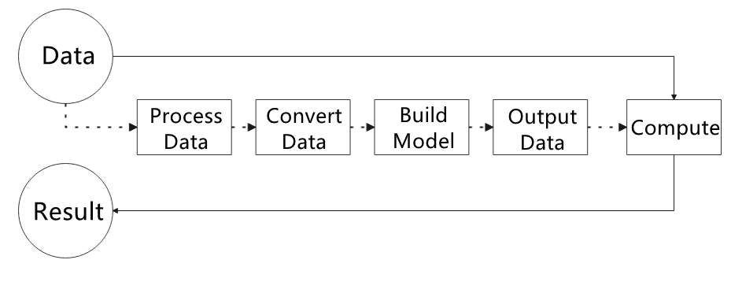

**1. Dependency**

MediaPipe utilizes OpenCV to process video, and uses [FFMPEG](https://www.ffmpeg.org/) to process audio data. Furthermore, it incorporates other essential dependencies, including OpenGL/Metal, Tensorflow, and Eigen.

For seamless usage of MediaPipe, we suggest gaining a basic understanding of OpenCV. To delve into OpenCV, you can find detailed information in "**[14. ROS+OpenCV Lesson](https://wiki.hiwonder.com/projects/JetAcker/en/jetacker-jetson-nano/docs/14.ROS%2BOpenCVCourse.html)**".

**2. MediaPipe Solutions**

Solutions is based on the open-source pre-constructed sample of TensorFlow or TFLite. MediaPipe Solutions is built upon a framework, which provides 16 Solutions, including face detection, Face Mesh, iris, hand, posture, human body and so on.

The Solutions are developed using open-source pre-constructed samples from TensorFlow or TFLite. MediaPipe Solutions are built upon a versatile framework that offers 16 different components, like face detection, Face Mesh, iris tracking, hand tracking, posture estimation, human body tracking, and more.

* **MediaPipe Learning Resources**

MediaPipe website：https://developers.google.com/mediapipe

MediaPipe Wiki：http://i.bnu.edu.cn/wiki/index.php?title=Mediapipe

MediaPipe github：<https://github.com/google/mediapipe>

Dlib website: http://dlib.net/

dlib github: https://github.com/davisking/dlib

### 15.1.2 Image Background Segmentation

This lesson provides instructions on utilizing MediaPipe's selfie segmentation model to accurately segment trained models, such as human faces and hands, from their backgrounds. Once separated, you can easily add virtual backgrounds to these models.

* **Program Logic**

To begin, import the selfie segmentation model from MediaPipe and subscribe to the corresponding topic to access the live camera feed.

Next, flip the image and apply the segmentation to the background image. For improved boundary segmentation, implement dual-border segmentation.

Finally, complete the process by replacing the background with a virtual background.

* **Operation Steps**

> [!NOTE]
>
> **The input command should be case sensitive, and keywords can be complemented using Tab key.**

1. Start the robot, and enter the robot system desktop using NoMachine.

2. Click-on  to open the ROS1 command-line terminal.

3. Run the command to disable app auto-start app service.

```py
sudo systemctl stop start_app_node.service
```

4. Click-on  to open the ROS2 command-line terminal.

5. Execute the command to enable the camera node.

```py
ros2 launch peripherals depth_camera.launch.py
```

6. Enter the command and hit Enter key to run the game program.

```py
cd ~/ros2_ws/src/example/example/mediapipe_example && python3 self_segmentation.py
```

7)  If you want to exit this game, please use shortcut key "Ctrl+C". If the game cannot be closed, please retry.

8)  Next, press "Ctrl+C" in the terminal. If it fails to close, please try again.

* **Program Outcome**

Once the game starts, the screen will transition to a gray virtual background. As soon as a human figure appears, the program will automatically execute background removal, effectively separating the human from the virtual background.

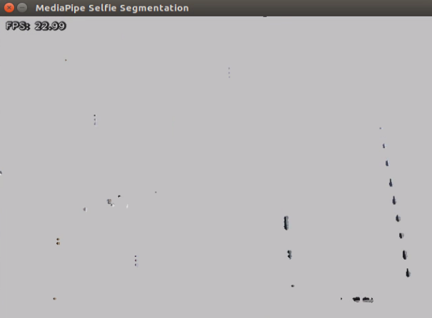

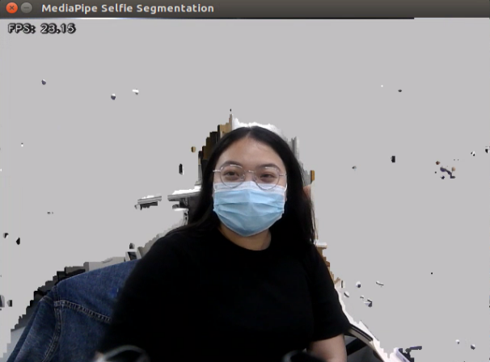

* **Program Analysis**

The source code of this program locates in:

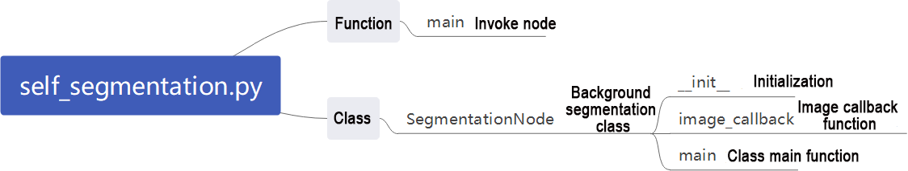

**/ros2_ws/src/example/example/mediapipe_example/self_segmentation.py**

* **1. Function**

Main:

```py
def main():
    node = SegmentationNode('self_segmentation')
    try:
        rclpy.spin(node)
    except KeyboardInterrupt:
        node.destroy_node()
        rclpy.shutdown()
        print('shutdown')
    finally:
        print('shutdown finish')
```

Used to start the background control node.

* **2. Class**

SegmentationNode：

```py
class SegmentationNode(Node):
    def __init__(self, name):
        rclpy.init()
        super().__init__(name)
        self.running = True
        self.mp_selfie_segmentation = mp.solutions.selfie_segmentation
        self.mp_drawing = mp.solutions.drawing_utils
        self.fps = fps.FPS()
        self.image_queue = queue.Queue(maxsize=2)
        self.BG_COLOR = (192, 192, 192)  # gray
        self.image_sub = self.create_subscription(Image, '/depth_cam/rgb/image_raw', self.image_callback, 1)
        self.get_logger().info('\033[1;32m%s\033[0m' % 'start')
        threading.Thread(target=self.main, daemon=True).start()
```

Init：

```py
    def __init__(self, name):
        rclpy.init()
        super().__init__(name)
        self.running = True
        self.mp_selfie_segmentation = mp.solutions.selfie_segmentation
        self.mp_drawing = mp.solutions.drawing_utils
        self.fps = fps.FPS()
        self.image_queue = queue.Queue(maxsize=2)
        self.BG_COLOR = (192, 192, 192)  # gray
        self.image_sub = self.create_subscription(Image, '/depth_cam/rgb/image_raw', self.image_callback, 1)
        self.get_logger().info('\033[1;32m%s\033[0m' % 'start')
        threading.Thread(target=self.main, daemon=True).start()
```

Initialize the parameters required for background segmentation, call the image callback function, and start the model recognition function.

image_callback：

```py
    def image_callback(self, ros_image):
        rgb_image = np.ndarray(shape=(ros_image.height, ros_image.width, 3), dtype=np.uint8,
                               buffer=ros_image.data)  # 原始 RGB 画面(Original RGB image)
        if self.image_queue.full():
            # 如果队列已满，丢弃最旧的图像(If the queue is full, discard the oldest image)
            self.image_queue.get()
            # 将图像放入队列(Put the image into the queue)
        self.image_queue.put(rgb_image)
```

Image callback function, used to read data from the camera node and enqueue it.

Main:

```py
    def main(self):
        with self.mp_selfie_segmentation.SelfieSegmentation(
            model_selection=1) as selfie_segmentation:
            bg_image = None
            while self.running:
                try:
                    image = self.image_queue.get(block=True, timeout=1)
                except queue.Empty:
                    if not self.running:
                        break
                    else:
                        continue
                # To improve performance, optionally mark the image as not writeable to
                # pass by reference.
                image.flags.writeable = False
                results = selfie_segmentation.process(image)
                image.flags.writeable = True
                image = cv2.cvtColor(image, cv2.COLOR_RGB2BGR)
                # Draw selfie segmentation on the background image.
                # To improve segmentation around boundaries, consider applying a joint
                # bilateral filter to "results.segmentation_mask" with "image".
                condition = np.stack(
                        (results.segmentation_mask,) * 3, axis=-1) > 0.1
                # The background can be customized.
                #   a) Load an image (with the same width and height of the input image) to
                #      be the background, e.g., bg_image = cv2.imread('/path/to/image/file')
                #   b) Blur the input image by applying image filtering, e.g.,
                #      bg_image = cv2.GaussianBlur(image,(55,55),0)
                if bg_image is None:
                  bg_image = np.zeros(image.shape, dtype=np.uint8)
                  bg_image[:] = self.BG_COLOR
                output_image = np.where(condition, image, bg_image)
                self.fps.update()
                result_image = self.fps.show_fps(output_image)
                cv2.imshow('MediaPipe Selfie Segmentation', result_image)
                key = cv2.waitKey(1)
                if key == ord('q') or key == 27:  # 按q或者esc退出(Press q or esc to exit)
                    break
        cv2.destroyAllWindows()
        rclpy.shutdown()
```

Load the model from MediaPipe, input the image, and display the output image using OpenCV.

### 15.1.3 3D Object Detection

* **Program Logic**

To get started, import the 3D Objectron module from MediaPipe, and subscribe to the topic message to receive the real-time camera image.

Next, flip the image to ensure proper alignment for 3D object detection.

Finally, draw the 3D boundary frame on the image.

* **Operation Steps**

1. Start the robot, and enter the robot system desktop using NoMachine.

2. Click-on  to open the ROS1 command-line terminal.

3. Run the command to disable app auto-start app service.

   ```py
   sudo systemctl stop start_app_node.service
   ```

4. Click-on  to open the ROS2 command-line terminal.

5. Execute the following command to enable the camera node:

   ```py
   ros2 launch peripherals depth_camera.launch.py
   ```

6. In a new ROS2 command line terminal, enter the command and press Enter to run the gameplay program:

   ```py
   cd ~/ros2_ws/src/example/example/mediapipe_example && python3 objectron.py
   ```

7)  To close this game, press the "Esc" key in the image interface to exit the camera image interface.

8)  Press "Ctrl+C" in the command line terminal interface. If the closure fails, please try again repeatedly.

* **Program Outcome**

Once the game starts, the 3D frame will be drawn around the boundary of the recognized object. The system can identify several objects, including a cup (with handle), shoe, chair, and camera.

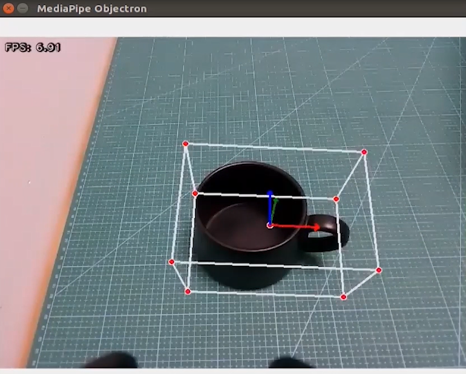

* **Program Analysis**

The program file corresponding to this section of the course documentation is located at: **/ros2_ws/src/example/example/mediapipe_example/objectron.py**

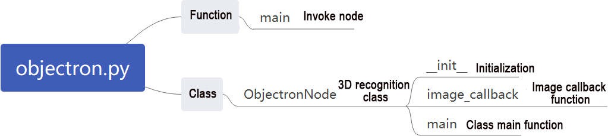

**1. Function**

Main：

```py
def main():
    node = ObjectronNode('objectron')
    try:
        rclpy.spin(node)
    except KeyboardInterrupt:
        node.destroy_node()
        rclpy.shutdown()
        print('shutdown')
    finally:
        print('shutdown finish')
```

Used to initiate 3D detection node.

**2. Class**

ObjectronNode：

```py
class ObjectronNode(Node):
    def __init__(self, name):
        rclpy.init()
        super().__init__(name)
        self.running = True
        self.mp_objectron = mp.solutions.objectron
        self.mp_drawing = mp.solutions.drawing_utils
        self.fps = fps.FPS()
        self.image_queue = queue.Queue(maxsize=2)
        self.image_sub = self.create_subscription(Image, '/depth_cam/rgb/image_raw', self.image_callback, 1)
        self.get_logger().info('\033[1;32m%s\033[0m' % 'start')
```

Init：

```py
    def __init__(self, name):
        rclpy.init()
        super().__init__(name)
        self.running = True
        self.mp_objectron = mp.solutions.objectron
        self.mp_drawing = mp.solutions.drawing_utils
        self.fps = fps.FPS()
        self.image_queue = queue.Queue(maxsize=2)
        self.image_sub = self.create_subscription(Image, '/depth_cam/rgb/image_raw', self.image_callback, 1)
        self.get_logger().info('\033[1;32m%s\033[0m' % 'start')
        threading.Thread(target=self.main, daemon=True).start()
```

Initialize the parameters required for 3D recognition, call the image callback function, and start the model recognition function.

image_callback：

```py
    def image_callback(self, ros_image):
        rgb_image = np.ndarray(shape=(ros_image.height, ros_image.width, 3), dtype=np.uint8,
                               buffer=ros_image.data)  # 原始 RGB 画面(Original RGB image)
        if self.image_queue.full():
            # 如果队列已满，丢弃最旧的图像(If the queue is full, discard the oldest image)
            self.image_queue.get()
            # 将图像放入队列(Put the image into the queue)
        self.image_queue.put(rgb_image)
```

Image callback function, used to read data from the camera node and enqueue it.

Main ：

```py
    def main(self):
        with self.mp_objectron.Objectron(static_image_mode=False,
                                max_num_objects=1,
                                min_detection_confidence=0.4,
                                min_tracking_confidence=0.5,
                                model_name='Cup') as objectron:
            while self.running:
                try:
                    image = self.image_queue.get(block=True, timeout=1)
                except queue.Empty:
                    if not self.running:
                        break
                    else:
                        continue
                # To improve performance, optionally mark the image as not writeable to
                # pass by reference.
                image.flags.writeable = False
                results = objectron.process(image)

                # Draw the box landmarks on the image.
                image.flags.writeable = True
                image = cv2.cvtColor(image, cv2.COLOR_RGB2BGR)
                if results.detected_objects:
                    for detected_object in results.detected_objects:
                        self.mp_drawing.draw_landmarks(
                          image, detected_object.landmarks_2d, self.mp_objectron.BOX_CONNECTIONS)
                        self.mp_drawing.draw_axis(image, detected_object.rotation,
                                             detected_object.translation)
                self.fps.update()
                result_image = self.fps.show_fps(cv2.flip(image, 1))
                # Flip the image horizontally for a selfie-view display.
                cv2.imshow('MediaPipe Objectron', result_image)
                key = cv2.waitKey(1)
                if key == ord('q') or key == 27:  # 按q或者esc退出(Press q or esc to exit)
                    break

        cv2.destroyAllWindows()
        rclpy.shutdown()
```

Read the model inside MediaPipe, input the image, draw the edges of the objects after obtaining the output image, and display using OpenCV.

### 15.1.4 Face Detection

Face detection is realized by face detection model of MediaPipe.

This model offers a swift and efficient solution for detecting faces, equipped with 6 facial landmarks to provide detailed information. It is designed to detect multiple human faces with accuracy and speed. Based on BlazeFace, it has been optimized for mobile GPU inference, ensuring a lightweight and high-performance face detection experience on mobile devices.

* **Program Logic**

To begin, import the human face detection model from MediaPipe and subscribe to the relevant topic message to obtain the live camera feed.

Next, utilize OpenCV to flip the image and convert the color space for further processing.

Then, using the face detection model's minimum confidence threshold, determine whether a human face has been successfully detected. If a human face is recognized, proceed to collect the necessary information about each detected face, including the bounding frame and the 6 key points (right eye, left eye, nose tip, right ear, and left ear).

Finally, frame the human face and mark the 6 key points on each detected face for visual clarity and further analysis.

* **Operation Steps**

> [!NOTE]
>
> **The input command should be case sensitive, and keywords can be complemented using Tab key.**

1. Start the robot, and enter the robot system desktop using NoMachine.

2. Click-on  to open ROS1 the command-line terminal.

3. Run the command to disable app auto-start app service.

   ```py
   sudo systemctl stop start_app_node.service
   ```

4. Click-on  to start the ROS2 command-line terminal.

5. Execute the command to enable the camera node:

   ```py
   ros2 launch peripherals depth_camera.launch.py
   ```

6. In a new ROS2 command line terminal, enter the command and press Enter to run the gameplay program:

   ```py
   cd ~/ros2_ws/src/example/example/mediapipe_example && python3 face_detect.py
   ```

7)  If you need to close this gameplay, you need to press the "**Esc**" key in the image interface to exit the camera image interface.

8)  Then press "**Ctrl+C**" in the command line terminal interface. If closing fails, please try again.

* **Program Outcome**

After the game starts, depth camera will start detecting human face, and human face will framed on the live camera feed.

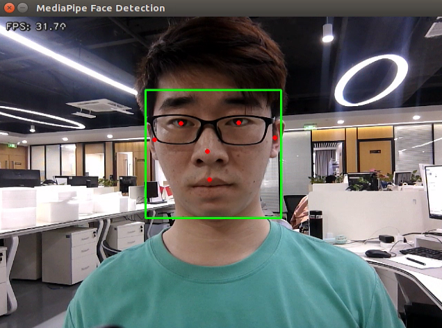

* **Program Analysis**

The source code of this program is saved in

**/ros2_ws/src/example/example/mediapipe_example/face_detect.py**

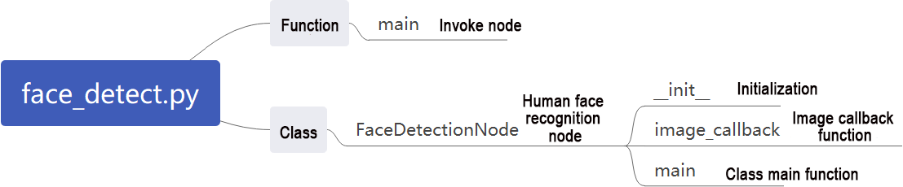

**1. Function**

Main：

```py
def main():
    node = FaceDetectionNode('face_detection')
    try:
        rclpy.spin(node)
    except KeyboardInterrupt:
        node.destroy_node()
        rclpy.shutdown()
        print('shutdown')
    finally:
        print('shutdown finish')
```

Used to initiate face detection node.

**2. Class**

FaceDetectionNode：

```py
    def __init__(self, name):
        rclpy.init()
        super().__init__(name)
        self.running = True
        model_path = os.path.join(os.path.abspath(os.path.split(os.path.realpath(__file__))[0]), 'model/detector.tflite')
        base_options = python.BaseOptions(model_asset_path=model_path)
        options = vision.FaceDetectorOptions(base_options=base_options)
        self.detector = vision.FaceDetector.create_from_options(options)
        self.fps = fps.FPS()
        self.image_queue = queue.Queue(maxsize=2)
```

Init：

```py
    def __init__(self, name):
        rclpy.init()
        super().__init__(name)
        self.running = True
        model_path = os.path.join(os.path.abspath(os.path.split(os.path.realpath(__file__))[0]), 'model/detector.tflite')
        base_options = python.BaseOptions(model_asset_path=model_path)
        options = vision.FaceDetectorOptions(base_options=base_options)
        self.detector = vision.FaceDetector.create_from_options(options)
        self.fps = fps.FPS()
        self.image_queue = queue.Queue(maxsize=2)
        self.image_sub = self.create_subscription(Image, '/depth_cam/rgb/image_raw', self.image_callback, 1)
        self.get_logger().info('\033[1;32m%s\033[0m' % 'start')
        threading.Thread(target=self.main, daemon=True).start()
```

Initialize the parameters required for face recognition, call the image callback function, and start the model recognition function.

image_callback：

```py
    def image_callback(self, ros_image):
        rgb_image = np.ndarray(shape=(ros_image.height, ros_image.width, 3), dtype=np.uint8,
                               buffer=ros_image.data)  # 原始 RGB 画面(Original RGB image)
        if self.image_queue.full():
            # 如果队列已满，丢弃最旧的图像(If the queue is full, discard the oldest image)
            self.image_queue.get()
            # 将图像放入队列(Put the image into the Press q or esc to exitqueue)
        self.image_queue.put(rgb_image)
```

Image callback function, used to read data from the camera node and enqueue it.

Main:

```py
    def main(self):
        while self.running:
            try:
                image = self.image_queue.get(block=True, timeout=1)
            except queue.Empty:
                if not self.running:
                    break
                else:
                    continue
            image = cv2.flip(image, 1)
            mp_image = mp.Image(image_format=mp.ImageFormat.SRGB, data=image)
            detection_result = self.detector.detect(mp_image)

            annotated_image = visualize(image, detection_result)
            self.fps.update()
            result_image = self.fps.show_fps(cv2.cvtColor(annotated_image, cv2.COLOR_RGB2BGR))
            cv2.imshow('face_detection', result_image)
            key = cv2.waitKey(1)
            if key == ord('q') or key == 27:  # 按q或者esc退出(Press q or esc to exit)
              break

        cv2.destroyAllWindows()
        rclpy.shutdown()
```

Read the model from MediaPipe, input the image, and after obtaining the output image, use OpenCV to draw the facial keypoints and display the feedback image.

### 15.1.5 3D Face Detection

In this program, MediaPipe Face Mesh is utilized to detect human face within the camera image.

MediaPipe Face Mesh is a powerful model capable of estimating 468 3D facial features, even when deployed on a mobile device. It employs machine learning to infer the 3D face contour accurately. Additionally, this model ensures real-time detection by utilizing a lightweight model architecture and GPU acceleration.

Furthermore, this model is integrated with a face conversion module that compensates for any differences between face landmark estimation and AR (Augmented Reality) applications. It establishes a metric 3D space and utilizes the facial landmark screen positions to estimate facial conversion within this space. The facial conversion data consists of common 3D primitives, including facial gesture conversion matrices and triangle facial mesh information.

* **Program Logic**

Firstly, you need to learn that machine learning pipeline is composed of two real-time deep neural network models. The system consists of two components: a face detector that processes the entire image and calculates the locations of faces, and a 3D face landmark model that uses these locations to predict an approximate 3D surface through regression.

To achieve 3D facial landmarks, we utilize transfer learning and train a network with multiple objectives: predicting 3D landmark coordinates on synthetic rendered data and 2D semantic contours on annotated real-world data simultaneously. This approach yields plausible 3D landmark predictions not only based on synthetic data but also on real-world data.

The 3D landmark network takes cropped video frames as input without requiring additional depth input. The model outputs the location of a 3D point and the probability that a face appears in the input and is properly aligned.

Once the face mesh model is imported, real-time images can be obtained from the camera by subscribing to topic messages.

Next, image preprocessing techniques like flipping the image and converting the color space are applied. The face detection model's minimum confidence is then used to determine whether the face has been successfully detected.

Finally, the detected face on the screen is projected into a 3D grid for visualization and display.

* **Operation Steps**

> [!NOTE]
>
> **The input command should be case sensitive, and keywords can be complemented using Tab key.**

1. Start the robot, and enter the robot system desktop using NoMachine.

2. Click-on  to open ROS1 the command-line terminal.

3. Run the command to disable app auto-start app service.

   ```py
   sudo systemctl stop start_app_node.service
   ```

4. Click-on  to start the ROS2 command-line terminal.

5. Execute the command to enable the camera node:

   ```py
   ros2 launch peripherals depth_camera.launch.py
   ```

6. Enter the command in a new ROS2 command-line terminal and press Enter to run the game program:

   ```py
   cd ~/ros2_ws/src/example/example/mediapipe_example && python3 face_mesh.py
   ```

7)  If you need to close this gameplay, you need to press the "Esc" key in the image interface to exit the camera image interface.

8)  Then press "**Ctrl+C**" in the command line terminal interface. If closing fails, please try again.

* **Program Outcome**

After starting the game, when the depth camera detects a face, it will outline the face in the feedback image.


* **Program Analysis**

The source code of this program is located in

**/ros2_ws/src/example/example/mediapipe_example/face_mesh.py**


**1. Function**

Main：

```py
def main():
    node = FaceMeshNode('face_landmarker')
    try:
        rclpy.spin(node)
    except KeyboardInterrupt:
        node.destroy_node()
        rclpy.shutdown()
        print('shutdown')
    finally:
        print('shutdown finish')
```

Used to initiate the 3D face detection node.

**2. Class**

FaceMeshNode：

```py
class FaceMeshNode(Node):
    def __init__(self, name):
        rclpy.init()
        super().__init__(name)
        self.running = True
        model_path = os.path.join(os.path.abspath(os.path.split(os.path.realpath(__file__))[0]), 'model/face_landmarker_v2_with_blendshapes.task')
        base_options = python.BaseOptions(model_asset_path=model_path)
        options = vision.FaceLandmarkerOptions(base_options=base_options,
                                       output_face_blendshapes=True,
                                       output_facial_transformation_matrixes=True,
                                       num_faces=1)
```

Init：

```py
    def __init__(self, name):
        rclpy.init()
        super().__init__(name)
        self.running = True
        model_path = os.path.join(os.path.abspath(os.path.split(os.path.realpath(__file__))[0]), 'model/face_landmarker_v2_with_blendshapes.task')
        base_options = python.BaseOptions(model_asset_path=model_path)
        options = vision.FaceLandmarkerOptions(base_options=base_options,
                                       output_face_blendshapes=True,
                                       output_facial_transformation_matrixes=True,
                                       num_faces=1)
        self.detector = vision.FaceLandmarker.create_from_options(options)

        self.fps = fps.FPS()

        self.image_queue = queue.Queue(maxsize=2)
        self.image_sub = self.create_subscription(Image, '/depth_cam/rgb/image_raw', self.image_callback, 1)
        self.get_logger().info('\033[1;32m%s\033[0m' % 'start')
        threading.Thread(target=self.main, daemon=True).start()
```

Initialize the parameters required for 3D face detection, call the image callback function, and start the model recognition function.

image_callback：

```py
    def image_callback(self, ros_image):
        rgb_image = np.ndarray(shape=(ros_image.height, ros_image.width, 3), dtype=np.uint8,
		buffer=ros_image.data)  # Original RGB frame
        if self.image_queue.full():
            # If the queue is full, discard the oldest image
            self.image_queue.get()
            # Put the image into the queue
        self.image_queue.put(rgb_image)
```

The image callback function is used to retrieve data from the camera node and encapsulate it into a queue.

Main:

```py
    def main(self):
        while self.running:
            try:
                image = self.image_queue.get(block=True, timeout=1)
            except queue.Empty:
                if not self.running:
                    break
                else:
                    continue
            image = cv2.flip(image, 1)
            mp_image = mp.Image(image_format=mp.ImageFormat.SRGB, data=image)
            detection_result = self.detector.detect(mp_image)
            annotated_image = draw_face_landmarks_on_image(image, detection_result)
            self.fps.update()
            result_image = self.fps.show_fps(cv2.cvtColor(annotated_image, cv2.COLOR_RGB2BGR))
            cv2.imshow('face_landmarker', result_image)
            key = cv2.waitKey(1)
            if key == ord('q') or key == 27:  # 按q或者esc退出(Press q or esc to exit)
                break
        cv2.destroyAllWindows()
        rclpy.shutdown()
```

Reading the model inside MediaPipe, inputting the image, and then using OpenCV to draw facial keypoints on the output image, and display the feedback image.

### 15.1.6 Hand Key Point Detection

MediaPipe's hand detection model is employed to showcase the key points of the hand and the connecting lines of these key points on the live camera feed.

MediaPipe Hands is an advanced hand and finger detection model that delivers high-fidelity results. Through the power of machine learning (ML), it accurately infers 21 3D landmarks of the hand from a single frame.

* **Program Logic**

Firstly, it's important to understand that MediaPipe's palm detection model employs a machine learning pipeline consisting of multiple models (including a linear model). This model processes the entire image and returns an oriented hand bounding box. On the other hand, the hand landmark model operates on cropped image regions defined by the palm detectors and provides high-fidelity 3D hand keypoints.

To begin, after importing the palm detection model, we subscribe to the topic message to obtain real-time camera images.

Next, various image pre-processing steps, such as flipping the image and converting the color space, are applied. These steps significantly reduce the need for data augmentation for the hand landmark model.

Furthermore, our pipeline allows for generating crops based on hand landmarks identified in the previous frame. The palm detection is invoked only when the landmark model is unable to recognize the presence of the hand accurately.

Afterward, by comparing the minimum confidence level of the hand detection model, we determine whether the palm has been successfully detected.

Lastly, the hand keypoints are detected and drawn on the camera image to visualize the detected hand in real-time.

* **Operation Steps**

1. Start the robot, and enter the robot system desktop using NoMachine.

2. Click-on  to open ROS1 the command-line terminal.

3. Run the command to disable app auto-start app service.

   ```py
   sudo systemctl stop start_app_node.service
   ```

4. Click-on  to start the ROS2 command-line terminal.

5. Execute the command to enable the camera node:

   ```py
   ros2 launch peripherals depth_camera.launch.py
   ```

6. Enter the command in a new ROS2 command-line terminal and press Enter to run the game program:

   ```py
   cd ~/ros2_ws/src/example/example/mediapipe_example && python3 face_mesh.py
   ```

7)  If you need to close this gameplay, you need to press the "**Esc**" key in the image interface to exit the camera image interface.

Then press "**Ctrl+C**" in the command line terminal interface. If closing fails, please try again.

* **Program Outcome**

Once the game starts, the depth camera will begin detecting the hand and display the hand key points on the camera image, with the key points connected.

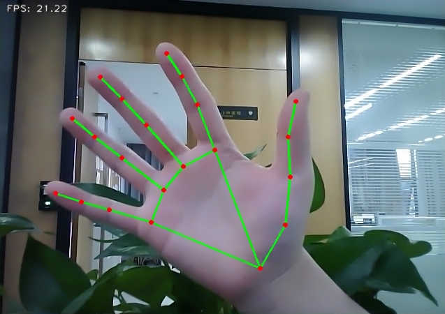

* **Program Analysis**

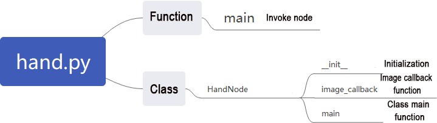

The program file corresponding to this section of the course documentation is located at:

**/ros2_ws/src/example/example/mediapipe_example/hand.py**

**1. Function**

**Main：**

```py
def main():
    node = HandNode('hand_landmarker')
    try:
        rclpy.spin(node)
    except KeyboardInterrupt:
        node.destroy_node()
        rclpy.shutdown()
        print('shutdown')
    finally:
        print('shutdown finish')
```

Used to initiate the 3D face detection node.

**2. Class**

HandNode：

```py
class HandNode(Node):
    def __init__(self, name):
        rclpy.init()
        super().__init__(name)
        self.running = True
        model_path = os.path.join(os.path.abspath(os.path.split(os.path.realpath(__file__))[0]), 'model/hand_landmarker.task')
        base_options = python.BaseOptions(model_asset_path=model_path)
        options = vision.HandLandmarkerOptions(base_options=base_options,
                                       num_hands=2)
        self.detector = vision.HandLandmarker.create_from_options(options)
        self.fps = fps.FPS()
        self.image_queue = queue.Queue(maxsize=2)
        self.image_sub = self.create_subscription(Image, '/depth_cam/rgb/image_raw', self.image_callback, 1)
        self.get_logger().info('\033[1;32m%s\033[0m' % 'start')
        threading.Thread(target=self.main, daemon=True).start()
```

Init：

```py
    def __init__(self, name):
        rclpy.init()
        super().__init__(name)
        self.running = True
        model_path = os.path.join(os.path.abspath(os.path.split(os.path.realpath(__file__))[0]), 'model/hand_landmarker.task')
        base_options = python.BaseOptions(model_asset_path=model_path)
        options = vision.HandLandmarkerOptions(base_options=base_options,
                                       num_hands=2)
        self.detector = vision.HandLandmarker.create_from_options(options)
        self.fps = fps.FPS()
        self.image_queue = queue.Queue(maxsize=2)
        self.image_sub = self.create_subscription(Image, '/depth_cam/rgb/image_raw', self.image_callback, 1)
        self.get_logger().info('\033[1;32m%s\033[0m' % 'start')
        threading.Thread(target=self.main, daemon=True).start()

    def image_callback(self, ros_image):
        rgb_image = np.ndarray(shape=(ros_image.height, ros_image.width, 3), dtype=np.uint8,
                               buffer=ros_image.data)  # 原始 RGB 画面
        if self.image_queue.full():
            # 如果队列已满，丢弃最旧的图像
            self.image_queue.get()
            # 将图像放入队列
        self.image_queue.put(rgb_image)
```

Initialize the parameters required for hand keypoint detection, call the image callback function, and start the model recognition function.

image_callback：

```py
    def image_callback(self, ros_image):
        rgb_image = np.ndarray(shape=(ros_image.height, ros_image.width, 3), dtype=np.uint8,
                               buffer=ros_image.data)  # 原始 RGB 画面
        if self.image_queue.full():
            # 如果队列已满，丢弃最旧的图像
            self.image_queue.get()
            # 将图像放入队列
        self.image_queue.put(rgb_image)
```

The image callback function is used to read data from the camera node and enqueue it.

Main:

```py
    def main(self):
        while self.running:
            try:
                image = self.image_queue.get(block=True, timeout=1)
            except queue.Empty:
                if not self.running:
                    break
                else:
                    continue
            image = cv2.flip(image, 1)
            mp_image = mp.Image(image_format=mp.ImageFormat.SRGB, data=image)
            detection_result = self.detector.detect(mp_image)
            annotated_image = draw_hand_landmarks_on_image(image, detection_result)
            self.fps.update()
            result_image = self.fps.show_fps(cv2.cvtColor(annotated_image, cv2.COLOR_RGB2BGR))
            cv2.imshow('hand_landmarker', result_image)
            key = cv2.waitKey(1)
            if key == ord('q') or key == 27:  # 按q或者esc退出(Press q or esc to exit)
                break
        cv2.destroyAllWindows()
        rclpy.shutdown()
```

Read the model from MediaPipe, input the image, and after obtaining the output image, use OpenCV to draw the key points of the hand and display the feedback image.

### 15.1.7 Body Key Points Detection

The MediaPipe body detection model is utilized to detect key points on the human body, which are then displayed on the live camera feed. This implementation incorporates MediaPipe Pose, a high-fidelity posture tracking model that leverages BlazePose to infer 33 3D key points. Additionally, this approach offers support for the ML Kit Pose Detection API.

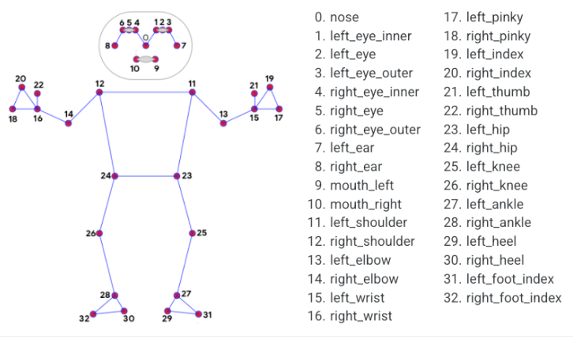

* **Program Logic**

Firstly, import body detection model.

Subsequently, flip over the image and convert the color space of the image. Check whether the human body is successfully detected based on the minimum confidence of the body detection model.

Next, define the tracked posture by comparing the minimum tracking confidence. If the confidence does not meet the minimum threshold, perform automatic human detection on the next input image.

In the pipeline, a detector is employed to initially localize the region of interest (ROI) corresponding to a person's pose within a frame. Subsequently, a tracker utilizes the cropped ROI frame as input to predict pose landmarks and segmentation masks within the ROI.

For video applications, the detector is invoked selectively, only when necessary. Specifically, it is used for the first frame or when the tracker fails to recognize the body pose in the preceding frame. In all other frames, the pipeline derives ROIs based on the pose landmarks detected in the previous frame.

After MediaPipe body detection model is imported, access the live camera feed through subscribing the related topic message.

Lastly, draw the key points representing the human body.

* **Operation Steps**

1. Start the robot, and enter the robot system desktop using NoMachine.

2. Click-on  to open ROS1 the command-line terminal.

3. Run the command to disable app auto-start app service.

   ```py
   sudo systemctl stop start_app_node.service
   ```

4. Click-on  to start the ROS2 command-line terminal.

5. Execute the command to enable the camera node:

   ```py
   ros2 launch peripherals depth_camera.launch.py
   ```

6. Enter the command in a new ROS2 command-line terminal and press Enter to run the game program:

   ```py
   cd ~/ros2_ws/src/example/example/mediapipe_example && python3 pose.py
   ```

7)  If you need to close this gameplay, you need to press the "Esc" key in the image interface to exit the camera image interface.

8)  Then press "**Ctrl+C**" in the command line terminal interface. If closing fails, please try again.

* **Program Outcome**

After the game starts, depth camera will begin detecting human pose, and body key points can be displayed and connected on the live camera feed.

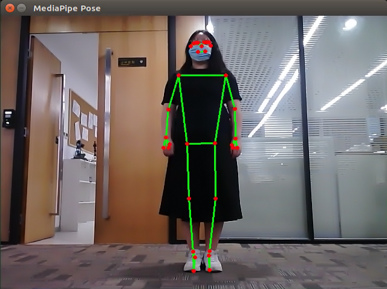

* **Program Analysis**

The program file is saved in:

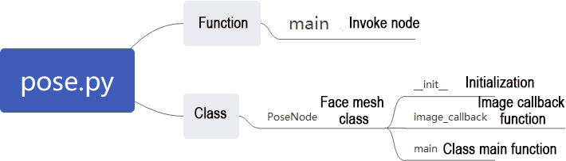

**/ros2_ws/src/example/example/mediapipe_example/pose.py**

**1.Function**

Main：

```py
def main():
    node = PoseNode('pose_landmarker')
    try:
        rclpy.spin(node)
    except KeyboardInterrupt:
        node.destroy_node()
        rclpy.shutdown()
        print('shutdown')
    finally:
        print('shutdown finish')
```

Used to initiate the 3D face detection node.

**2.Class**

PoseNode：

```py
class PoseNode(Node):
    def __init__(self, name):
        rclpy.init()
        super().__init__(name)
        self.running = True
        model_path = os.path.join(os.path.abspath(os.path.split(os.path.realpath(__file__))[0]), 'model/pose_landmarker.task')
        base_options = python.BaseOptions(model_asset_path=model_path)
        options = vision.PoseLandmarkerOptions(
            base_options=base_options,
            output_segmentation_masks=True)
        self.detector = vision.PoseLandmarker.create_from_options(options)
        self.fps = fps.FPS()
        self.image_queue = queue.Queue(maxsize=2)
        self.image_sub = self.create_subscription(Image, '/depth_cam/rgb/image_raw', self.image_callback, 1)
```

Init：

```py
    def __init__(self, name):
        rclpy.init()
        super().__init__(name)
        self.running = True
        model_path = os.path.join(os.path.abspath(os.path.split(os.path.realpath(__file__))[0]), 'model/pose_landmarker.task')
        base_options = python.BaseOptions(model_asset_path=model_path)
        options = vision.PoseLandmarkerOptions(
            base_options=base_options,
            output_segmentation_masks=True)
        self.detector = vision.PoseLandmarker.create_from_options(options)
        self.fps = fps.FPS()
        self.image_queue = queue.Queue(maxsize=2)
        self.image_sub = self.create_subscription(Image, '/depth_cam/rgb/image_raw', self.image_callback, 1)
        self.get_logger().info('\033[1;32m%s\033[0m' % 'start')
        threading.Thread(target=self.main, daemon=True).start()
```

Initialize the parameters required for limb detection, call the image callback function, and start the model recognition process.

image_callback：

```py
    def image_callback(self, ros_image):
        rgb_image = np.ndarray(shape=(ros_image.height, ros_image.width, 3), dtype=np.uint8,
                               buffer=ros_image.data)  # 原始 RGB 画面
        if self.image_queue.full():
            # 如果队列已满，丢弃最旧的图像
            self.image_queue.get()
            # 将图像放入队列
        self.image_queue.put(rgb_image)
```

Image callback function, used to read data from the camera node and enqueue it.

Main:

```py
    def main(self):
        while self.running:
            try:
                image = self.image_queue.get(block=True, timeout=1)
            except queue.Empty:
                if not self.running:
                    break
                else:
                    continue
            image = cv2.flip(image, 1)
            mp_image = mp.Image(image_format=mp.ImageFormat.SRGB, data=image)
            detection_result = self.detector.detect(mp_image)
            annotated_image = draw_pose_landmarks_on_image(image, detection_result)
            self.fps.update()
            result_image = self.fps.show_fps(cv2.cvtColor(annotated_image, cv2.COLOR_RGB2BGR))
            cv2.imshow('pose_landmarker', result_image)
            key = cv2.waitKey(1)
            if key == ord('q') or key == 27:  # 按q或者esc退出(Press q or esc to exit)
                break
        cv2.destroyAllWindows()
        rclpy.shutdown()
```

Read the model inside MediaPipe, input the image, and after obtaining the output image, use OpenCV to draw facial keypoints and display the feedback image.

### 15.1.8 Fingertip Trajectory Recognition

Identify hand joints using MediaPipe's hand detection model. Once a specific gesture is recognized, the robot will initiate fingertip locking on the screen, track the fingertips, and generate their movement trajectory.

* **Program Logic**

First, invoke the MediaPipe hand detection model to capture the camera image. Next, flip and process the image to extract hand information. Utilizing the connection lines between key points of the hand, calculate the finger angles to determine the gesture. Upon recognition of a specific gesture, the robot will proceed to identify and lock the fingertips on the screen, simultaneously tracing the movement trajectory of the fingertips on the display.

* **Operation Steps**

> [!NOTE]
>
> **The input command should be case sensitive, and the keyword can be complemented by "Tab" key.**

1. Start the robot, and enter the robot system desktop using NoMachine.

2. Click-on  to open ROS1 the command-line terminal.

3. Run the command to disable app auto-start app service.

   ```py
   sudo systemctl stop start_app_node.service
   ```

4. Click-on  to start the ROS2 command-line terminal.

5. Execute the command to enable the camera node:

   ```py
   ros2 launch peripherals depth_camera.launch.py
   ```

6. Enter the command in a new ROS2 command-line terminal and press Enter to run the game program:

   ```py
   cd ~/ros2_ws/src/example/example/mediapipe_example && python3 hand_gesture.py
   ```

7)  The program will enable the camera automatically. The detailed recognition process can be found in Program Outcome.

8)  If you need to close this gameplay, you need to press the "**Esc**" key in the image interface to exit the camera image interface.

9)  Then press "**Ctrl+C**" in the command line terminal interface. If closing fails, please try again.

* **Program Outcome**

Once the game starts, position your hand within the camera's field of view. Upon recognition, the hand keypoints will be highlighted on the camera feed.

If the robot detects the "1" gesture, the trajectory of your fingertip motion will begin to be recorded on the camera feed. If it detects the "5" gesture, the recorded fingertip trajectory will be cleared.

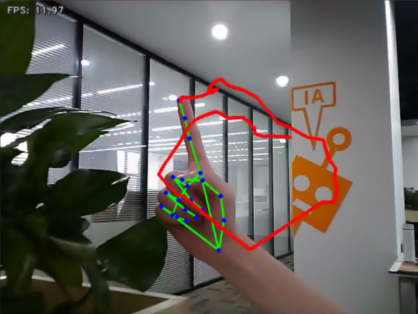

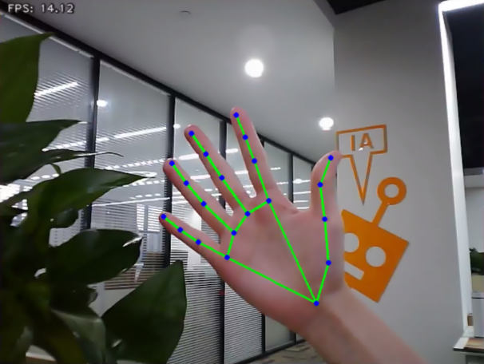

* **Program Analysis**

The program file is saved in

**/ros2_ws/src/example/example/mediapipe_example/hand_gesture.py**

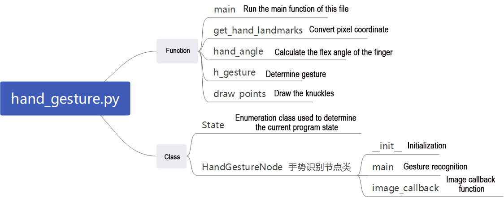

> [!NOTE]
>
> **Prior to making any alterations to the program, ensure to create a backup of the original factory program. Modify it only after creating the backup. Directly editing the source code file is prohibited to prevent inadvertent parameter modifications that could render the robot dysfunctional and irreparable!**

Based on the game's impact, the process logic of this game is organized as depicted in the figure below:

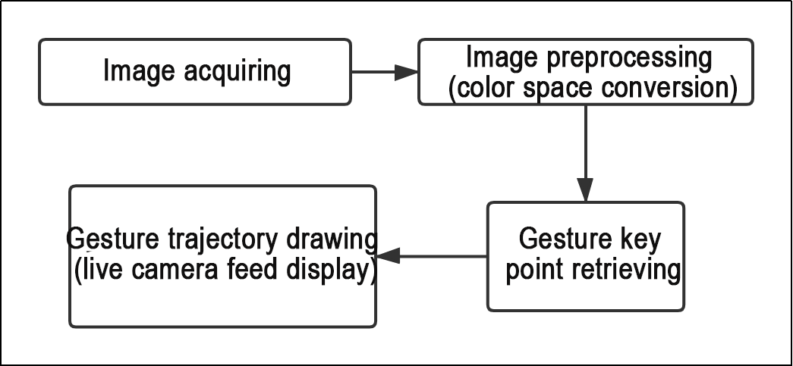

As depicted in the image above, the purpose of this game is to capture an image using the camera, preprocess it by converting its color space for easier identification, extract feature points corresponding to hand gestures from the converted image, and determine different gestures (based on angles) through logical analysis of key feature points. Finally, the trajectory of the recognized gesture is drawn on the display screen.

The program's logic flowchart extracted from the program files is illustrated in the figure below.

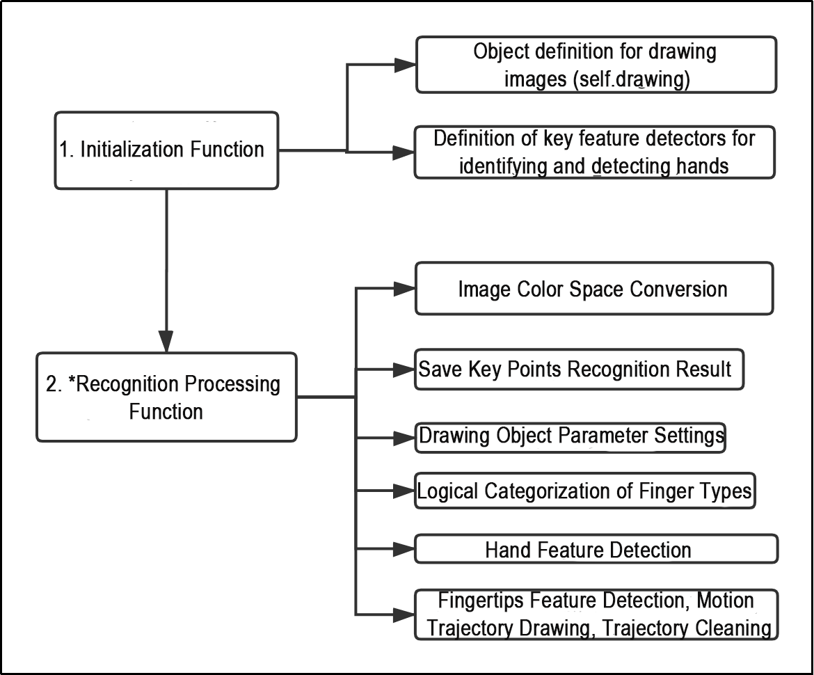

From the above diagram, it can be seen that the program's logical flow is mainly divided into initialization functions and recognition processing functions (with Xinghao being relatively important). The following document content will be written according to the program logic flow chart mentioned above.

**1. Function**

Main:

```py
def main():
    node = HandGestureNode('hand_gesture')
    try:
        rclpy.spin(node)
    except KeyboardInterrupt:
        node.destroy_node()
        rclpy.shutdown()
        print('shutdown')
    finally:
        print('shutdown finish')
```

The main function is used to start the fingertip trajectory recognition node.

get_hand_landmarks:

```py
def get_hand_landmarks(img, landmarks):
	"""
    Convert landmarks from MediaPipe's normalized output to pixel coordinates
    :param img: The image corresponding to the pixel coordinates
    :param landmarks: Normalized key points
    :return:
    """
    h, w, _ = img.shape
    landmarks = [(lm.x * w, lm.y * h) for lm in landmarks]
    return np.array(landmarks)
```

Convert the normalized data from madipipe into pixel coordinates.

hand_angle：

```py
def hand_angle(landmarks):
	"""
    Calculate the bending angles of each finger
    :param landmarks: Hand key points
    :return: The angles of each finger
    """
    angle_list = []
    # thumb 大拇指
    angle_ = vector_2d_angle(landmarks[3] - landmarks[4], landmarks[0] - landmarks[2])
    angle_list.append(angle_)
    # index 食指
    angle_ = vector_2d_angle(landmarks[0] - landmarks[6], landmarks[7] - landmarks[8])
    angle_list.append(angle_)
    # middle 中指
    angle_ = vector_2d_angle(landmarks[0] - landmarks[10], landmarks[11] - landmarks[12])
    angle_list.append(angle_)
    # ring 无名指
    angle_ = vector_2d_angle(landmarks[0] - landmarks[14], landmarks[15] - landmarks[16])
    angle_list.append(angle_)
    # pink 小拇指
    angle_ = vector_2d_angle(landmarks[0] - landmarks[18], landmarks[19] - landmarks[20])
    angle_list.append(angle_)
    angle_list = [abs(a) for a in angle_list]
    return angle_list
```

After extracting the hand feature points into the 'results' variable, it is necessary to logically process these points. By evaluating the angular relationship between the feature points, specific finger types (thumb, index finger) can be identified. The 'hand_angle' function accepts the landmark feature point set (results) as input, and subsequently employs the 'vector_2d_angle' function to compute the angles between the corresponding feature points. The feature points corresponding to the elements of the landmark set are depicted in the figure below:


Taking the thumb's angle calculation as an example: the vector_2d_angle function is used to calculate the angle between joint points. landmarks\[3\], landmarks\[4\], landmarks\[0\], and landmarks\[2\] correspond to feature points 3, 4, 0, and 2 in the hand feature extraction diagram. By calculating the angles of these joint points, the thumb's posture characteristics can be determined. Similarly, the processing logic for the other finger joints is analogous.

To ensure the accuracy of recognition, the parameters and basic logic (addition and subtraction of angle calculations) in the hand_angle function should remain at their default settings.

h_gesture：

```py
def h_gesture(angle_list):
	"""
    Determine the gesture made by the fingers through 2D features
    :param angle_list: The bending angles of each finger
    :return: The gesture name string
    """
    thr_angle = 65.
    thr_angle_thumb = 53.
    thr_angle_s = 49.
    gesture_str = "none"
    if (angle_list[0] > thr_angle_thumb) and (angle_list[1] > thr_angle) and (angle_list[2] > thr_angle) and (
            angle_list[3] > thr_angle) and (angle_list[4] > thr_angle):
        gesture_str = "fist"
    elif (angle_list[0] < thr_angle_s) and (angle_list[1] < thr_angle_s) and (angle_list[2] > thr_angle) and (
            angle_list[3] > thr_angle) and (angle_list[4] > thr_angle):
        gesture_str = "hand_heart"
    elif (angle_list[0] < thr_angle_s) and (angle_list[1] < thr_angle_s) and (angle_list[2] > thr_angle) and (
            angle_list[3] > thr_angle) and (angle_list[4] < thr_angle_s):
        gesture_str = "nico-nico-ni"
    elif (angle_list[0] < thr_angle_s) and (angle_list[1] > thr_angle) and (angle_list[2] > thr_angle) and (
            angle_list[3] > thr_angle) and (angle_list[4] > thr_angle):
        gesture_str = "hand_heart"
    elif (angle_list[0] > 5) and (angle_list[1] < thr_angle_s) and (angle_list[2] > thr_angle) and (
            angle_list[3] > thr_angle) and (angle_list[4] > thr_angle):
        gesture_str = "one"
    elif (angle_list[0] > thr_angle_thumb) and (angle_list[1] < thr_angle_s) and (angle_list[2] < thr_angle_s) and (
            angle_list[3] > thr_angle) and (angle_list[4] > thr_angle):
        gesture_str = "two"
    elif (angle_list[0] > thr_angle_thumb) and (angle_list[1] < thr_angle_s) and (angle_list[2] < thr_angle_s) and (
            angle_list[3] < thr_angle_s) and (angle_list[4] > thr_angle):
        gesture_str = "three"
    elif (angle_list[0] > thr_angle_thumb) and (angle_list[1] > thr_angle) and (angle_list[2] < thr_angle_s) and (
            angle_list[3] < thr_angle_s) and (angle_list[4] < thr_angle_s):
        gesture_str = "OK"
    elif (angle_list[0] > thr_angle_thumb) and (angle_list[1] < thr_angle_s) and (angle_list[2] < thr_angle_s) and (
            angle_list[3] < thr_angle_s) and (angle_list[4] < thr_angle_s):
        gesture_str = "four"
    elif (angle_list[0] < thr_angle_s) and (angle_list[1] < thr_angle_s) and (angle_list[2] < thr_angle_s) and (
            angle_list[3] < thr_angle_s) and (angle_list[4] < thr_angle_s):
        gesture_str = "five"
    elif (angle_list[0] < thr_angle_s) and (angle_list[1] > thr_angle) and (angle_list[2] > thr_angle) and (
            angle_list[3] > thr_angle) and (angle_list[4] < thr_angle_s):
        gesture_str = "six"
    else:
        "none"
    return gesture_str
```

After identifying the different finger types of the hand and determining their positions on the image, logical recognition processing of various gestures can be performed by implementing the 'h_gesture' function.

In the 'h_gesture' function depicted above, the parameters 'thr_angle', 'thr_angle_thenum', and 'thr_angle_s' represent the angle threshold values for corresponding gesture logic points. These values have been empirically tested to ensure stable recognition effects. It is not recommended to alter them unless the logic processing effect is unsatisfactory, in which case adjustments within a range of ±5 values are sufficient. The 'angle_list\[0,1,2,3,4\]' corresponds to the five finger types associated with the palm.

Here's an example using the gesture "one":

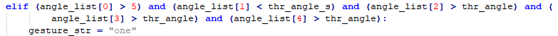

The code presented represents the logical angle evaluation of the fingers for the "one" gesture. 'angle_list\[0\]\>5' checks whether the angle value of the thumb joint feature point in the image is greater than 5. 'angle_list\[1\]\<thr_angle_s' checks if the angle feature of the index finger joint feature point is less than the predetermined value 'thr_angle_s'. Similarly, 'angle_list\[2\]\<thr_angle' verifies if the angle feature of the middle finger feature point is less than the predetermined value 'thr_angle'. The logical processing for the other two fingers, 'angle_list\[3\]' and 'angle_list\[4\]', follows a similar method. When the above conditions are met, the current gesture feature is recognized as "one", and the same principle applies to recognizing other gesture features.

Different gesture recognitions involve distinct logical processing, but the overall logical framework remains similar. For recognizing other gesture features, refer to the previous paragraph.

draw_points:

```py
def draw_points(img, points, thickness=4, color=(255, 0, 0)):
    points = np.array(points).astype(dtype=np.int64)
    if len(points) > 2:
        for i, p in enumerate(points):
            if i + 1 >= len(points):
                break
            cv2.line(img, p, points[i + 1], color, thickness)
```

Draw the currently recognized hand shape and each joint point.

**2. Class**

State:

```py
class State(enum.Enum):
    NULL = 0
    START = 1
    TRACKING = 2
    RUNNING = 3
```

An enumeration class used to set the current state of the program.

HandGestureNode：

```py
class HandGestureNode(Node):
    def __init__(self, name):
        rclpy.init()
        super().__init__(name)
        self.running = True
        self.drawing = mp.solutions.drawing_utils

        self.hand_detector = mp.solutions.hands.Hands(
            static_image_mode=False,
            max_num_hands=1,
            min_tracking_confidence=0.05,
            min_detection_confidence=0.6
        )
        
        self.fps = fps.FPS()  # fps计算器
        self.state = State.NULL
        self.points = []
        self.count = 0
        self.image_queue = queue.Queue(maxsize=2)
        self.image_sub = self.create_subscription(Image, '/depth_cam/rgb/image_raw', self.image_callback, 1)
        self.get_logger().info('\033[1;32m%s\033[0m' % 'start')
        threading.Thread(target=self.main, daemon=True).start()
```

The HandGestureNode is a fingertip trajectory recognition node that contains three functions: an initialization function, a main function, and an image callback function.

Init:

```py
    def __init__(self, name):
        rclpy.init()
        super().__init__(name)
        self.running = True
        self.drawing = mp.solutions.drawing_utils

        self.hand_detector = mp.solutions.hands.Hands(
            static_image_mode=False,
            max_num_hands=1,
            min_tracking_confidence=0.05,
            min_detection_confidence=0.6
        )
        
        self.fps = fps.FPS()  # fps计算器
        self.state = State.NULL
        self.points = []
        self.count = 0
        self.image_queue = queue.Queue(maxsize=2)
        self.image_sub = self.create_subscription(Image, '/depth_cam/rgb/image_raw', self.image_callback, 1)
        self.get_logger().info('\033[1;32m%s\033[0m' % 'start')
        threading.Thread(target=self.main, daemon=True).start()
```

Initialize each component needed and call the camera node.

<p id="anchor_15_1_9"></p>

### 15.1.9 Posture Control

The human posture estimation model, trained using the MediaPipe machine learning framework, detects the human body feature in the captured image, identifies relevant joint positions, and subsequently recognizes a variety of sequential actions. This process enables direct control of the robot through somatosensory input.

Viewed from the perspective of the robot, the following actions correspond to specific movements:

1. If the user lifts their left arm, the robot will move a certain distance to the right.

2. If the user lifts their right arm, the robot will move a certain distance to the left.

3. If the user lifts their left leg, the robot will move forward a certain distance.

4. If the user lifts their right leg, the robot will move backward a certain distance.

* **Program Logic**

First, import MediaPipe's human pose estimation model and subscribe to topic messages to obtain real-time footage from the camera.

MediaPipe is an open-source multimedia machine learning model application framework that runs cross-platform on mobile devices, workstations, and servers. It supports mobile GPU acceleration and inference engines such as TensorFlow and TF Lite.

Next, utilize the built model to detect key points of the human body in the screen. Connect these key points to display the human body and determine the human body posture.

Finally, if a specific action is detected in the human body posture, the robot will respond accordingly.

* **Operation Steps**

> [!NOTE]
>
> **The input command should be case sensitive, and keywords can be complemented using Tab key.**

1. Start the robot, and enter the robot system desktop using NoMachine.

2. Click-on  to open ROS1 the command-line terminal.

3. Run the command to disable app auto-start app service.

   ```py
   sudo systemctl stop start_app_node.service
   ```

4. Click-on  to start the ROS2 command-line terminal.

5. Execute the command to run the game program:

   ```py
   ros2 launch example body_control.launch.py
   ```

6)  The program will launch the camera's image interface. For specific recognition steps, refer to Section Program Outcome.

7)  If you need to close this gameplay, you need to press the "**Esc**" key in the image interface to exit the camera image interface.

8)  Then press "**Ctrl+C**" in the command line terminal interface. If closing fails, please try again.

* **Program Outcome**

Once the game is initiated, stand within the camera's field of view. When a person is detected, the screen will display key points of the body and lines connecting them.

From the perspective of the robot, lifting the left arm will cause the robot to turn left; lifting the right arm will make the robot turn right; lifting the left leg will make the robot move forward a certain distance; lifting the right leg will make the robot move backward a certain distance.

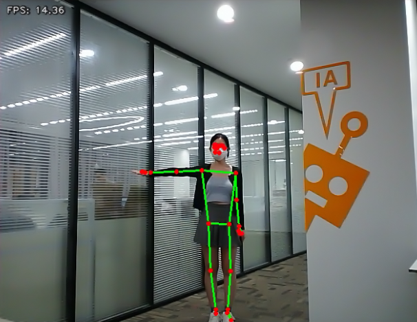

* **Program Analysis**

The program file is saved in

**ros2_ws/src/example/example/body_control/include/body_control.py**

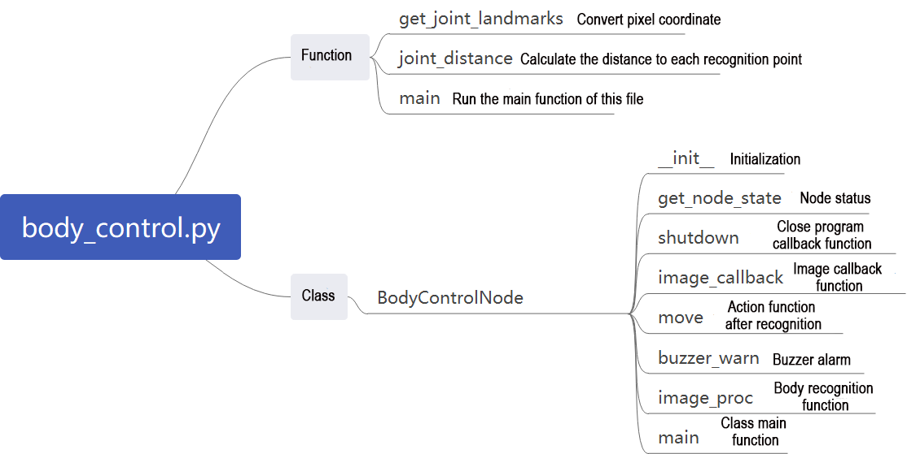

> [!NOTE]
>
> **Prior to making any alterations to the program, ensure to create a backup of the original factory program. Modify it only after creating the backup. Directly editing the source code file is prohibited to prevent inadvertent parameter modifications that could render the robot dysfunctional and irreparable!**

The game process logic is outlined below:

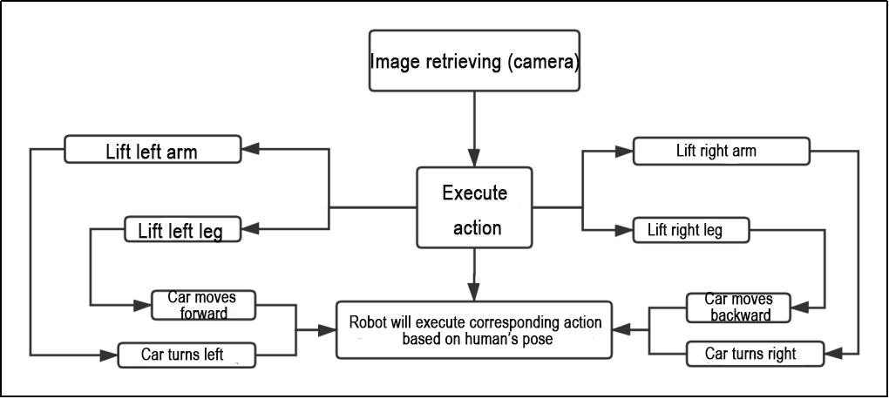

1.  Capture an image through the camera.

2.  After performing a demonstration action, the car will execute the corresponding action.

3.  From the car's perspective, lifting the left arm will cause the car to turn left; lifting the right arm will cause the car to turn right in a circle; lifting the left leg will make the car move forward a certain distance; lifting the right leg will make the car move backward a certain distance.

The program's logic flowchart, obtained from the program files, is presented below:

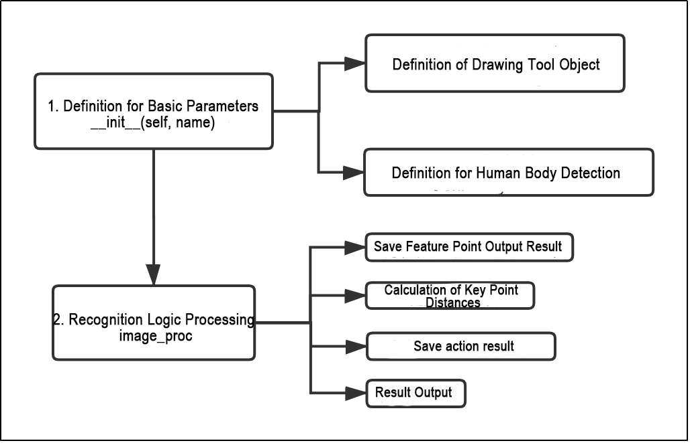

1.  Initialization function (init(self.name)) defines relevant parameters, including:

- Definition of the image tool (self.drawing) object.

- Points used to draw recognized features.

- Definition of the limb detection object (self.body_detector).

2.  Identified feature points' output results undergo logical processing for recognition.

3.  Actions are determined and stored based on key point distance conditions.

4.  Finally, the output results are generated, and the car executes corresponding actions.

**1. Function**

Main：

```py
def main():
    node = BodyControlNode('body_control')
    rclpy.spin(node)
    node.destroy_node()
```

Used to start the body sensation control node.

get_joint_landmarks：

```py
def get_joint_landmarks(img, landmarks):
    """
    将landmarks从medipipe的归一化输出转为像素坐标(Convert landmarks from medipipe's normalized output to pixel coordinates)
    :param img: 像素坐标对应的图片(picture corresponding to pixel coordinate)
    :param landmarks: 归一化的关键点(normalized keypoint)
    :return:
    """
    h, w, _ = img.shape
    landmarks = [(lm.x * w, lm.y * h) for lm in landmarks]
    return np.array(landmarks)
```

Used to convert the recognized information into pixel coordinates.

joint_distance：

```py
def joint_distance(landmarks):
    distance_list = []

    d1 = landmarks[LEFT_HIP] - landmarks[LEFT_SHOULDER]
    d2 = landmarks[LEFT_HIP] - landmarks[LEFT_WRIST]
    dis1 = d1[0]**2 + d1[1]**2
    dis2 = d2[0]**2 + d2[1]**2
    distance_list.append(round(dis1/dis2, 1))
   
    d1 = landmarks[RIGHT_HIP] - landmarks[RIGHT_SHOULDER]
    d2 = landmarks[RIGHT_HIP] - landmarks[RIGHT_WRIST]
    dis1 = d1[0]**2 + d1[1]**2
    dis2 = d2[0]**2 + d2[1]**2
    distance_list.append(round(dis1/dis2, 1))
    
    d1 = landmarks[LEFT_HIP] - landmarks[LEFT_ANKLE]
    d2 = landmarks[LEFT_ANKLE] - landmarks[LEFT_KNEE]
    dis1 = d1[0]**2 + d1[1]**2
    dis2 = d2[0]**2 + d2[1]**2
    distance_list.append(round(dis1/dis2, 1))
   
    d1 = landmarks[RIGHT_HIP] - landmarks[RIGHT_ANKLE]
    d2 = landmarks[RIGHT_ANKLE] - landmarks[RIGHT_KNEE]
    dis1 = d1[0]**2 + d1[1]**2
    dis2 = d2[0]**2 + d2[1]**2
    distance_list.append(round(dis1/dis2, 1))
    
    return distance_list
```

Used to calculate the distance between each joint point based on pixel coordinates.

**2.Class**

```py
class BodyControlNode(Node):
    def __init__(self, name):
        rclpy.init()
        super().__init__(name, allow_undeclared_parameters=True, automatically_declare_parameters_from_overrides=True)
        self.name = name
        self.drawing = mp.solutions.drawing_utils
        self.body_detector = mp_pose.Pose(
            static_image_mode=False,
            min_tracking_confidence=0.5,
            min_detection_confidence=0.5)
        self.running = True
        self.fps = fps.FPS()  # fps计算器
        signal.signal(signal.SIGINT, self.shutdown)

        self.move_finish = True
        self.stop_flag = False
        self.left_hand_count = []
        self.right_hand_count = []
        self.left_leg_count = []
        self.right_leg_count = []

        self.detect_status = [0, 0, 0, 0]
```

This class is the body control node.

Init:

```py
    def __init__(self, name):
        rclpy.init()
        super().__init__(name, allow_undeclared_parameters=True, automatically_declare_parameters_from_overrides=True)
        self.name = name
        self.drawing = mp.solutions.drawing_utils
        self.body_detector = mp_pose.Pose(
            static_image_mode=False,
            min_tracking_confidence=0.5,
            min_detection_confidence=0.5)
        self.running = True
        self.fps = fps.FPS()  # fps计算器
```

Initialize the parameters required for body control, read the image callback node from the camera, initialize nodes such as servos, chassis, buzzers, motors, etc., and finally start the main function within the class.4

get_node_state：

```py
    def get_node_state(self, request, response):
        response.success = True
        return response
```

Set the initialization state of the current node.

shutdown：

```py
    def shutdown(self, signum, frame):
        self.running = False
```

Program exit callback function used to terminate recognition.

image_callback：

```py
    def image_callback(self, ros_image):
        rgb_image = np.ndarray(shape=(ros_image.height, ros_image.width, 3), dtype=np.uint8, buffer=ros_image.data)  # 将自定义图像消息转化为图像
        if self.image_queue.full():
            # 如果队列已满，丢弃最旧的图像
            self.image_queue.get()
        # 将图像放入队列
        self.image_queue.put(rgb_image)
```

Image node callback function used to process images and enqueue them.

Move:

```py
    def move(self, *args):
        if args[0].angular.z == 1:
            set_servo_position(self.joints_pub, 0.1, ((9, 650), ))
            time.sleep(0.2)
            motor1 = MotorState()
            motor1.id = 2
            motor1.rps = 0.1
            motor2 = MotorState()
            motor2.id = 4
            motor2.rps = -1.0
            msg = MotorsState()
            msg.data = [motor1, motor2]
            self.motor_pub.publish(msg)
            time.sleep(11)
            set_servo_position(self.joints_pub, 0.1, ((9, 500), ))
            motor1 = MotorState()
            motor1.id = 2
            motor1.rps = 0.0
            motor2 = MotorState()
            motor2.id = 4
            motor2.rps = 0.0
            msg = MotorsState()
            msg.data = [motor1, motor2]
            self.motor_pub.publish(msg)
        elif args[0].angular.z == -1:
            set_servo_position(self.joints_pub, 0.1, ((9, 350), ))
            time.sleep(0.2)
            motor1 = MotorState()
            motor1.id = 2
            motor1.rps = 1.0
            motor2 = MotorState()
            motor2.id = 4
            motor2.rps = -0.1
            msg = MotorsState()
            msg.data = [motor1, motor2]
            self.motor_pub.publish(msg)
            time.sleep(12)
            set_servo_position(self.joints_pub, 0.1, ((9, 500), ))
            motor1 = MotorState()
            motor1.id = 2
            motor1.rps = 0.0
            motor2 = MotorState()
            motor2.id = 4
            motor2.rps = 0.0
            msg = MotorsState()
            msg.data = [motor1, motor2]
            self.motor_pub.publish(msg)
        else:
            self.mecanum_pub.publish(args[0])
            time.sleep(args[1])
            self.mecanum_pub.publish(Twist())
            time.sleep(0.1)
        self.stop_flag =True
        self.move_finish = True
```

Movement strategy function that moves the vehicle according to the recognized limb actions.

buzzer_warn:

```py
    def buzzer_warn(self):
        msg = BuzzerState()
        msg.freq = 1900
        msg.on_time = 0.2
        msg.off_time = 0.01
        msg.repeat = 1
        self.buzzer_pub.publish(msg)
```

Buzzer control function used for buzzer alarms.

image_proc:

```py
    def image_proc(self, image):
        image_flip = cv2.flip(cv2.cvtColor(image, cv2.COLOR_RGB2BGR), 1)
        results = self.body_detector.process(image)
        if results is not None and results.pose_landmarks is not None:
            if self.move_finish:
                twist = Twist()
                landmarks = get_joint_landmarks(image, results.pose_landmarks.landmark)
                distance_list = (joint_distance(landmarks))
```

Function for recognizing limbs, which invokes the model to draw key points of the human body based on the recognized information, and then performs movements according to the recognized posture.

Main:

```py
    def main(self):
        while self.running:
            try:
                image = self.image_queue.get(block=True, timeout=1)
            except queue.Empty:
                if not self.running:
                    break
                else:
                    continue
            try:
                result_image = self.image_proc(np.copy(image))
            except BaseException as e:
                self.get_logger().info('\033[1;32m%s\033[0m' % e)
                result_image = cv2.flip(cv2.cvtColor(image, cv2.COLOR_RGB2BGR), 1)
            self.fps.update()
            result_image = self.fps.show_fps(result_image)
            cv2.imshow(self.name, result_image)
            key = cv2.waitKey(1)
            if key == ord('q') or key == 27:  # 按q或者esc退出
                self.mecanum_pub.publish(Twist())
                self.running = False
```

The main function within the BodyControlNode class, used to input image information into the recognition function and display the returned image.

### 15.1.10 Human Body Tracking

> [!NOTE]
>
> **This game is best suited for indoor environments. Outdoor settings may significantly interfere with its effectiveness!**

Utilize the yolov5 framework to import a pre-trained human pose model for detecting human bodies. The center point of the detected human body will be indicated in the returned image. When a human body approaches, the robot will retreat; conversely, if the human body is distant, the robot will move forward. This ensures that the distance between the human body and the robot remains approximately 3 meters at all times.

* **Program Logic**

First, import the human pose estimation model from yolov5, and subscribe to topic messages to obtain real-time camera images. Next, utilize the trained model to detect key points of the human body in the images, and calculate the coordinates of the human body's center point based on all detected key points. Finally, update the PID controller based on the coordinates of the human body's center point and the screen's center point to control the robot's movement in sync with the human body's movement.

* **Operation Steps**

> [!NOTE]
>
> **When entering commands, strict case sensitivity is required, and you can use the "Tab" key to complete keywords.**

As ROS2 is placed within a container and cannot directly access the GPU of the mainboard, it needs to utilize ROS1 to start the mainboard's GPU, and then transfer the recognition information to ROS2 for use.

1. Start the robot, and enter the robot system desktop using NoMachine.

2. Click-on  to open ROS1 the command-line terminal.

3. Run the command to disable app auto-start app service.

   ```py
   sudo systemctl stop start_app_node.service
   ```

4. Enter the command and press Enter to start the human tracking game:

   ```py
   roslaunch hiwonder_example body_track_base.launch
   ```

5. Click-on  to start the ROS2 command-line terminal.

6. Enter the command to update the environment for bridging information between ROS1 and ROS2.

   ```py
   source ~/third_party_ros2/ros1_bridge_ws/install/setup.sh
   ```

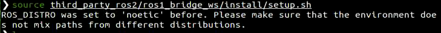

If the above prompt appears, you can ignore it without affecting the normal functionality.

7. Run the following command and hit Enter key:

   ```py
   ros2 run ros1_bridge parameter_bridge
   ```

8. Open a new ROS2 command line terminal, enter the command, and press Enter:

   ```py
   ros2 launch example body_track.launch.py
   ```

9. Finally, open a new command line terminal and launch the rqt tool to view the recognition screen.

   ```py
   rqt
   ```

10) The program will launch the camera's image interface. For specific recognition steps, refer to Section 10.3 Program Outcome.

11) If you need to close this gameplay, you need to press the "**Esc**" key in the image interface to exit the camera image interface.

12) Then press "**Ctrl+C**" in the command line terminal interface. If closing fails, please try again.

* **Program Outcome**

Upon initiating the game, the camera captures the human body within its field of view. Once detected, the center point of the human body is highlighted in the displayed image.

From the robot's perspective, if the human body is in close proximity, the robot will retreat. Conversely, if the human body is distant, the robot will move forward, ensuring that the distance between the human body and the robot remains approximately 3 meters at all times.

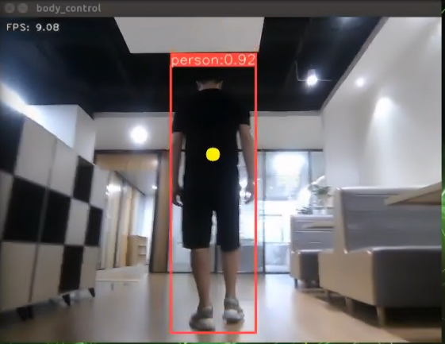

* **Program Analysis**

The program file is saved in

**ros2_ws/src/example/example/body_control/include/body_track.py**

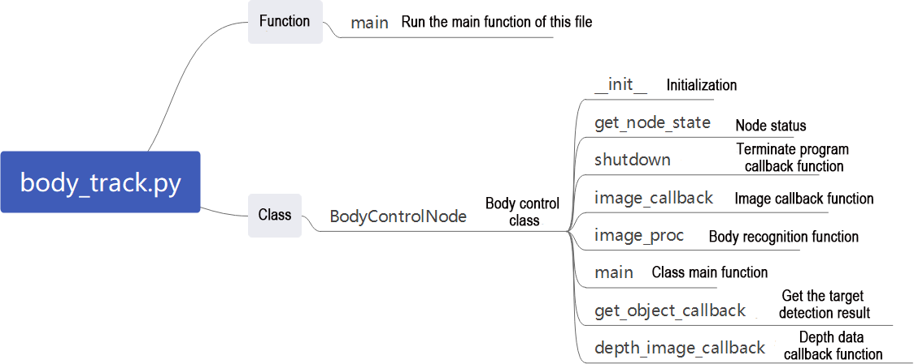


> [!NOTE]
>
> **Prior to making any alterations to the program, ensure to create a backup of the original factory program. Modify it only after creating the backup. Directly editing the source code file is prohibited to prevent inadvertent parameter modifications that could render the robot dysfunctional and irreparable!**

Based on the game's effectiveness, the procedural logic is delineated as follows:

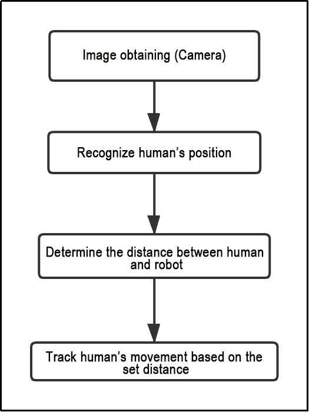

1.  The car captures images through the camera.

2.  It identifies the human body's position in the image and calculates the distance between the human body and the car.

3.  Finally, the car adjusts its movement to follow within the preset distance limit.

The program's logic flowchart, derived from the program files, is illustrated below:

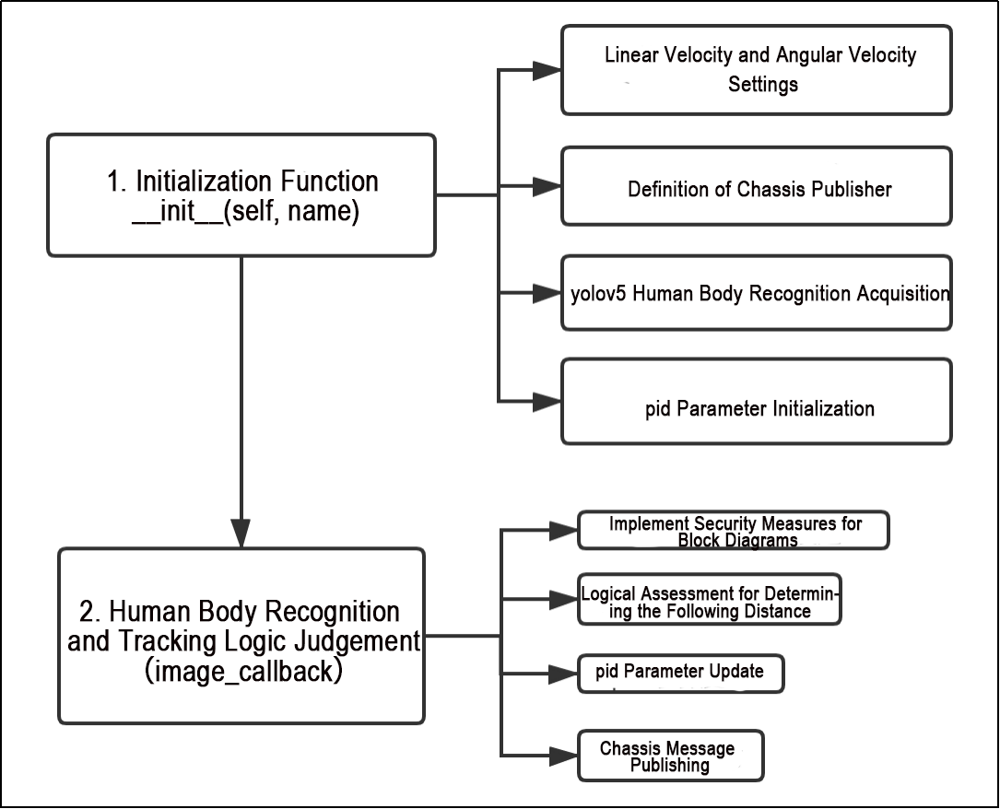

Initialization Function of the BodyControlNode Class:

**Configuration of Linear and Angular Speed**: Adjusts the car's speed based on the detected distance from the human body.

**Definition of Chassis Publisher**: Publishes the chassis's position and orientation to control the car's forward and backward movement.

**Yolov5 Human Body Detection**: Utilizes the yolov5 single-target detection algorithm to detect human bodies and obtain their positions.

**PID Parameter Initialization**: Initializes parameters related to the PID controller, governing sensitivity to the distance between the car and the human body.

**1. Function**

Main：

```py
def main():
    node = BodyControlNode('body_control')
    rclpy.spin(node)
    node.destroy_node()
```

Used to start the human tracking node.

**2. Class**

```py
class BodyControlNode(Node):
    def __init__(self, name):
        rclpy.init()
        super().__init__(name, allow_undeclared_parameters=True, automatically_declare_parameters_from_overrides=True)
        self.name = name
       
        self.pid_d = pid.PID(0.1, 0, 0)
        #self.pid_d = pid.PID(0, 0, 0)
        
        self.pid_angular = pid.PID(0.002, 0, 0)
        #self.pid_angular = pid.PID(0, 0, 0)
```

This class is the human tracking node.

Init:

```py
        rclpy.init()
        super().__init__(name, allow_undeclared_parameters=True, automatically_declare_parameters_from_overrides=True)
        self.name = name
       
        self.pid_d = pid.PID(0.1, 0, 0)
        #self.pid_d = pid.PID(0, 0, 0)
        
        self.pid_angular = pid.PID(0.002, 0, 0)
        #self.pid_angular = pid.PID(0, 0, 0)
        self.go_speed, self.turn_speed = 0.007, 0.04
```

Initialize the parameters required for human tracking, read nodes such as the camera's image callback, depth information, chassis, YOLOv5 recognition, etc., and then synchronize the time to align depth information and image information, finally start the main function within the class.

get_node_state：

```py
    def get_node_state(self, request, response):
        response.success = True
        return response
```

Set the initialization state of the current node.

shutdown：

```py
    def shutdown(self, signum, frame):
        self.running = False
```

Program exit callback function used to terminate recognition.

get_object_callback：

```py
    def get_object_callback(self, msg):
        for i in msg.objects:
            class_name = i.class_name
            if class_name == 'person':
                if i.box[1] < 10:
                    self.center = [int((i.box[0] + i.box[2])/2), int(i.box[1]) + abs(int((i.box[1] - i.box[3])/4))]
                else:
                    self.center = [int((i.box[0] + i.box[2])/2), int(i.box[1]) + abs(int((i.box[1] - i.box[3])/3))]
```

Callback function for YOLOv5 recognition node, which converts recognition information into pixel coordinates.

multi_callback：

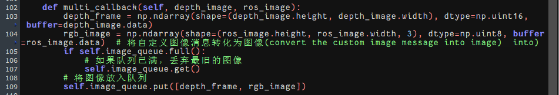

Time synchronization callback function that requires input of depth information and RGB image, synchronizes both pieces of information, and then enqueues them.

image_proc:

```py
    def image_proc(self, bgr_image):
        twist = Twist()
        if self.center is not None:
            h, w = bgr_image.shape[:-1]
            cv2.circle(bgr_image, tuple(self.center), 10, (0, 255, 255), -1) 
            #################
            roi_h, roi_w = 5, 5
            w_1 = self.center[0] - roi_w
            w_2 = self.center[0] + roi_w
            if w_1 < 0:
                w_1 = 0
            if w_2 > w:
                w_2 = w
            h_1 = self.center[1] - roi_h
            h_2 = self.center[1] + roi_h
```

Function for tracking humans, which invokes the model to draw the position of the person based on the recognized information, and uses PID to control the movement according to the recognized person.

Main：

```py
    def main(self):
        while self.running:
            try:
                image = self.image_queue.get(block=True, timeout=1)
            except queue.Empty:
                if not self.running:
                    break
                else:
                    continue
            try:
                result_image = self.image_proc(np.copy(image))
            except BaseException as e:
                self.get_logger().info('\033[1;32m%s\033[0m' % e)
                result_image = cv2.flip(cv2.cvtColor(image, cv2.COLOR_RGB2BGR), 1)
            self.fps.update()
            result_image = self.fps.show_fps(result_image)
            cv2.imshow(self.name, result_image)
            key = cv2.waitKey(1)
            if key == ord('q') or key == 27:  # 按q或者esc退出
                self.mecanum_pub.publish(Twist())
                self.running = False
```

The main function within the BodyControlNode class, used to input image information into the recognition function and display the returned image.

* **Function Expansion**

**The default tracking speed in the program is set to a fixed value. If you wish to alter the tracking speed of the robot, you can do so by adjusting the PID parameters within the program.**

1. Open the ROS1 terminal, enter the command to navigate to the directory where the program is stored:

   ```py
   cd /home/ubuntu/ros2_ws/src/example/example/body_control/include/
   ```

2. Run the following command to open the program file:

   ```py
   sudo vim body_control.py
   ```

3. Locate the "**self.pid_d**" and "**self.pid_angular**" functions, where the values inside the parentheses are the PID-related parameters. One is for the tracking linear velocity PID, and the other is for the tracking angular velocity PID.

   ```py
   #!/usr/bin/env python3
   # encoding: utf-8
   # @data:2022/11/07
   # @author:aiden
   # 人体跟踪
   import os
   import cv2
   import time
   import math
   import queue
   import rclpy
   import signal
   import threading
   import numpy as np
   import faulthandler
   import sdk.pid as pid
   import sdk.fps as fps
   from sdk import common
   from rclpy.node import Node
   from std_srvs.srv import Trigger
   from sensor_msgs.msg import Image
   from geometry_msgs.msg import Twist
   from interfaces.msg import ObjectsInfo
   from servo_controller_msgs.msg import ServosPosition
   from servo_controller.action_group_controller import ActionGroupController
   
   faulthandler.enable()
   
   class BodyControlNode(Node):
       def __init__(self, name):
           rclpy.init()
           super().__init__(name, allow_undeclared_parameters=True, automatically_declare_parameters_from_overrides=True)
           self.name = name
          
           self.pid_d = pid.PID(0.1, 0, 0)
           #self.pid_d = pid.PID(0, 0, 0)
   ```

   The three PID parameters are proportional, integral, and derivative. The proportional parameter adjusts the response level, the integral parameter adjusts the smoothness, and the derivative parameter adjusts whether there is overshoot.

4. Press "**i**" to enter edit mode. If you want to increase the robot's tracking speed, you can correspondingly increase the value. For example, here we set the tracking linear velocity PID to 0.05.

   > [!NOTE]
   >
   > **It is recommended not to adjust the parameters too high. Excessive parameters will cause the robot to track too quickly, affecting the experience.**

   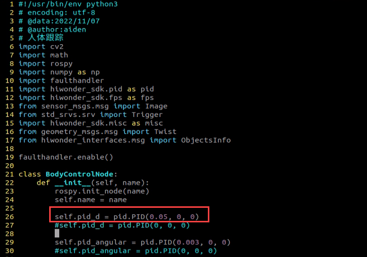

5. After completing the modifications, press "**Esc**" to exit edit mode, then press "**:wq**" to save and exit.

   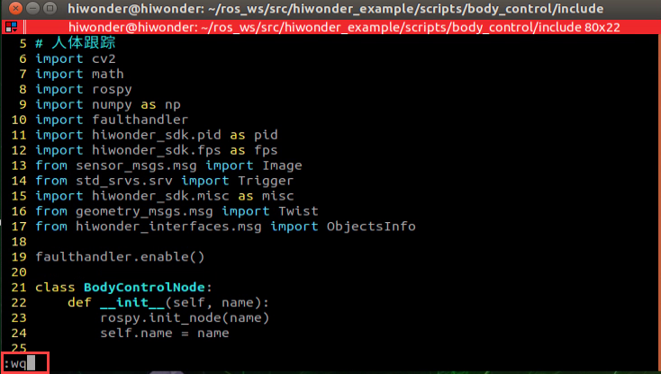

6. Start the game according to the instructions provided in section 10.2.

### 15.1.11 Integration of Body Posture and RGB Control

The depth camera combines RGB capabilities, enabling both color recognition and somatosensory control. This lesson will leverage color recognition, as discussed in "**[15.1.9 Posture Control](#anchor_15_1_9)**", to identify individuals wearing clothing of a predefined color (which can be calibrated through operations). The robot's movements are then controlled based on different body gestures.

If an individual wearing the specified color is not recognized, the robot remains unresponsive, ensuring accurate identification and control over the individual operating the robot.

* **Program Logic**

First, import MediaPipe's human pose estimation model and subscribe to topic messages to obtain real-time camera footage.

Next, utilize the built model to detect key points of the human torso on the screen. Connect these key points to display the human torso and determine the human posture. Calibrate the center point of the human body based on all key points.

Finally, if it is detected that the human body is standing with hands on hips, calibrate the color of the clothes to identify the control object. The robot enters control mode, and when the human body performs specific actions, the robot responds with corresponding actions.

* **Operation Steps**

> [!NOTE]
>
> **The input command should be case sensitive, and keywords can be complemented using Tab key.**

1. Start the robot, and enter the robot system desktop using NoMachine.

2. Click-on  to open ROS1 the command-line terminal.

3. Run the command to disable app auto-start app service.

   ```py
   sudo systemctl stop start_app_node.service
   ```

4. Click-on  to start the ROS2 command-line terminal.

5. Run the following command and hit Enter key to initiate the game:

   ```py
   ros2 launch example body_and_rgb_control.launch.py
   ```

6)  The program will launch the camera's image interface. For specific recognition steps, refer to Section Program Outcome.

7)  If you need to close this gameplay, you need to press the "**Esc**" key in the image interface to exit the camera image interface.

8)  Then press "**Ctrl+C**" in the command line terminal interface. If closing fails, please try again.

* **Program Outcome**

After starting the gameplay, stand within the camera's field of view. When a person is detected, the screen will display key points of the human torso, lines connecting these points, and the center point of the human body.

**First Step:** Slightly adjust the camera to maintain a certain distance, ensuring it can detect the entire human body.

**Second Step:** When the person to be controlled appears on the camera screen, they can assume the posture of hands on hips. If the buzzer emits a short beep, the robot completes calibration of the human body's center point and clothing color, entering control mode.

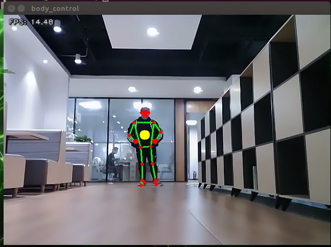

**Third Step:** At this point, with the robot as the primary viewpoint, raising the left arm causes the robot to move to the right; raising the right arm causes the robot to move to the left; raising the left leg causes the robot to move forward; raising the right leg causes the robot to move backward.

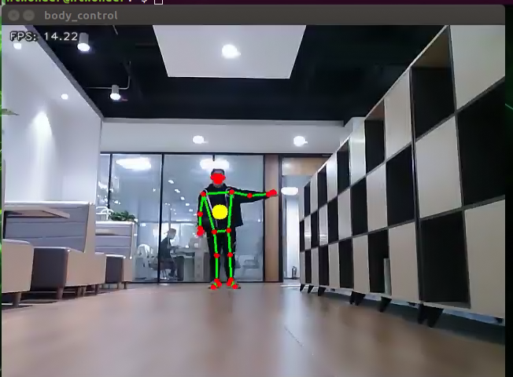

**Fourth Step:** If a person wearing a different clothing color enters the camera's field of view, they will not control the robot.

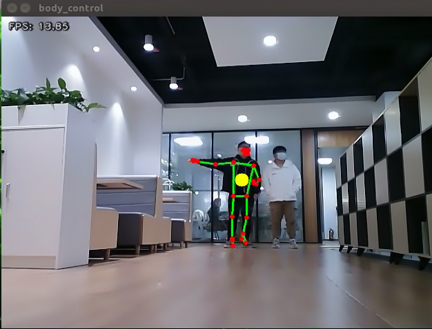

* **Program Analysis**

The program file is saved in:

**ros2_ws/src/example/example/body_control/include/body_and_rgb_control.py**

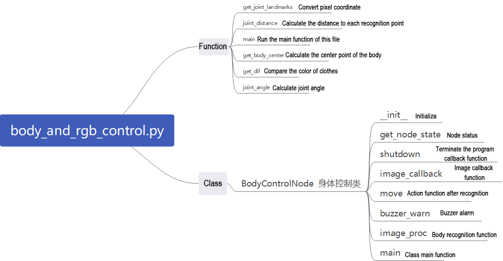

> [!NOTE]
>
> **Prior to making any alterations to the program, ensure to create a backup of the original factory program. Modify it only after creating the backup. Directly editing the source code file is prohibited to prevent inadvertent parameter modifications that could render the robot dysfunctional and irreparable!**

Based on the game's effectiveness, the procedural logic is delineated as follows:

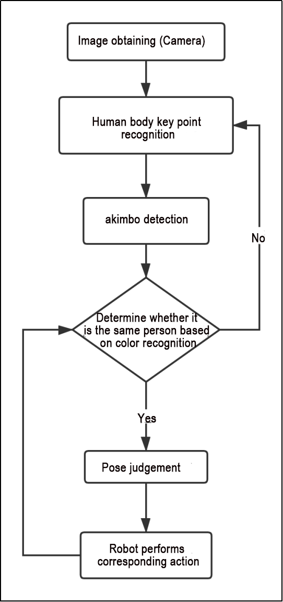

Retrieve the captured image from the camera, analyze the key characteristics of the human body, initially detect and assess the "akimbo" posture using the designated function. Subsequently, determine if it's the same individual in the picture based on clothing color. If confirmed, identify specific body movements (raising the left arm, right arm, left leg, and right leg) and instruct the car to execute corresponding actions. Otherwise, reanalyze the key feature points.

The program's logic flowchart, derived from the program files, is illustrated below:

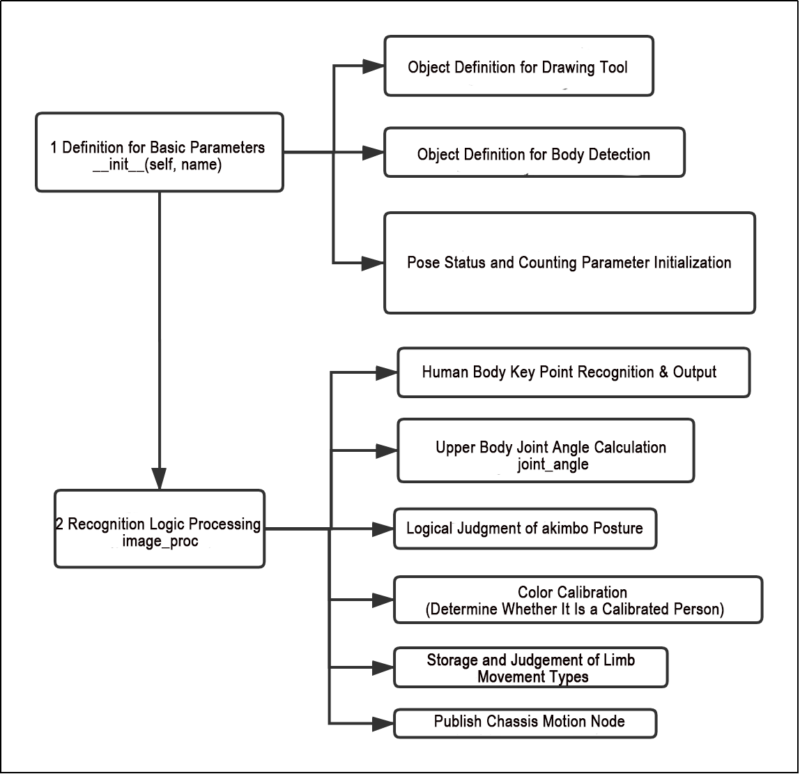

As shown in the above diagram, the program first uses the initialization function of the BodyControlNode class to set the default values for the relevant parameters. This primarily includes defining the drawing tool object, the limb detection object, and initializing the posture state and count parameters. After this setup, the program can logically process the incoming images. It begins by identifying and outputting key body feature points, calculating joint angles from the obtained (arm) parameters to mark the hands-on-hips posture. Then, it matches colors based on the recognized key feature points to determine if the person has been previously marked. Finally, the program controls the movement of the vehicle by recognizing demonstration actions (raising an arm, lifting a leg).

**1. Function**

Main：

```py
def main():
    node = BodyControlNode('body_control')
    rclpy.spin(node)
    node.destroy_node()
```

Used to start the RGB body sensation control node.

get_body_center：

```py
def get_body_center(h, w, landmarks):
    landmarks = np.array([(lm.x * w, lm.y * h) for lm in landmarks])
    center = ((landmarks[LEFT_HIP] + landmarks[LEFT_SHOULDER] + landmarks[RIGHT_HIP] + landmarks[RIGHT_SHOULDER])/4).astype(int)
    return center.tolist()
```

Used to obtain the currently recognized body contours.

get_joint_landmarks：

```py
def get_joint_landmarks(img, landmarks):
    """
    将landmarks从medipipe的归一化输出转为像素坐标(Convert landmarks from medipipe's normalized output to pixel coordinates)
    :param img: 像素坐标对应的图片(picture corresponding to pixel coordinate)
    :param landmarks: 归一化的关键点(normalized keypoint)
    """
    h, w, _ = img.shape
    landmarks = [(lm.x * w, lm.y * h) for lm in landmarks]
    return np.array(landmarks)
```

Used to convert the recognized information into pixel coordinates.

get_dif：

```py
def get_dif(list1, list2):
    if len(list1) != len(list2):
        return 255*3
    else:
        d = np.absolute(np.array(list1) - np.array(list2))
        return sum(d)
```

Used to compare the color of clothes on the body contours.

joint_angle:

```py
def joint_angle(landmarks):
    """
    计算各个关节弯曲角度(calculate flex angle of each joint)
    :param landmarks: 手部关键点(hand keypoints)
    :return: 关节角度(joint angle)
    """
    angle_list = []
    left_hand_angle1 = vector_2d_angle(landmarks[LEFT_SHOULDER] - landmarks[LEFT_ELBOW], landmarks[LEFT_WRIST] - landmarks[LEFT_ELBOW])
    angle_list.append(int(left_hand_angle1))
   
    left_hand_angle2 = vector_2d_angle(landmarks[LEFT_HIP] - landmarks[LEFT_SHOULDER], landmarks[LEFT_WRIST] - landmarks[LEFT_SHOULDER])
    angle_list.append(int(left_hand_angle2))

    right_hand_angle1 = vector_2d_angle(landmarks[RIGHT_SHOULDER] - landmarks[RIGHT_ELBOW], landmarks[RIGHT_WRIST] - landmarks[RIGHT_ELBOW])
    angle_list.append(int(right_hand_angle1))

    right_hand_angle2 = vector_2d_angle(landmarks[RIGHT_HIP] - landmarks[RIGHT_SHOULDER], landmarks[RIGHT_WRIST] - landmarks[RIGHT_SHOULDER])
    angle_list.append(int(right_hand_angle2))
    
    return angle_list
```

This function is used to calculate the recognition angles of various joints between the body parts.

joint_distance:

```py
def joint_distance(landmarks):
    distance_list = []

    d1 = landmarks[LEFT_HIP] - landmarks[LEFT_SHOULDER]
    d2 = landmarks[LEFT_HIP] - landmarks[LEFT_WRIST]
    dis1 = d1[0]**2 + d1[1]**2
    dis2 = d2[0]**2 + d2[1]**2
    distance_list.append(round(dis1/dis2, 1))
   
    d1 = landmarks[RIGHT_HIP] - landmarks[RIGHT_SHOULDER]
    d2 = landmarks[RIGHT_HIP] - landmarks[RIGHT_WRIST]
    dis1 = d1[0]**2 + d1[1]**2
    dis2 = d2[0]**2 + d2[1]**2
    distance_list.append(round(dis1/dis2, 1))
    
    d1 = landmarks[LEFT_HIP] - landmarks[LEFT_ANKLE]
    d2 = landmarks[LEFT_ANKLE] - landmarks[LEFT_KNEE]
    dis1 = d1[0]**2 + d1[1]**2
    dis2 = d2[0]**2 + d2[1]**2
    distance_list.append(round(dis1/dis2, 1))
   
    d1 = landmarks[RIGHT_HIP] - landmarks[RIGHT_ANKLE]
    d2 = landmarks[RIGHT_ANKLE] - landmarks[RIGHT_KNEE]
    dis1 = d1[0]**2 + d1[1]**2
    dis2 = d2[0]**2 + d2[1]**2
    distance_list.append(round(dis1/dis2, 1))
    
    return distance_list
```

This function is used to calculate the distance between each joint point based on pixel coordinates.

**2. Class**

```py
class BodyControlNode(Node):
    def __init__(self, name):
        rclpy.init()
        super().__init__(name)
        self.name = name
        self.drawing = mp.solutions.drawing_utils
        self.body_detector = mp_pose.Pose(
            static_image_mode=False,
            min_tracking_confidence=0.5,
            min_detection_confidence=0.5)
        
        self.color_picker = ColorPicker(Point(), 2)
        signal.signal(signal.SIGINT, self.shutdown)
        self.fps = fps.FPS()  # fps计算器

        self.running = True
        self.current_color = None
        self.lock_color = None
        self.calibrating = False
        self.move_finish = True
        self.stop_flag = False
```

This class is the body control node.

Init:

```py
class BodyControlNode(Node):
    def __init__(self, name):
        rclpy.init()
        super().__init__(name)
        self.name = name
        self.drawing = mp.solutions.drawing_utils
        self.body_detector = mp_pose.Pose(
            static_image_mode=False,
            min_tracking_confidence=0.5,
            min_detection_confidence=0.5)
        
        self.color_picker = ColorPicker(Point(), 2)
        signal.signal(signal.SIGINT, self.shutdown)
        self.fps = fps.FPS()  # fps计算器
```

Initialize the parameters required for body control, read the camera's image callback node, initialize nodes such as servos, chassis, buzzers, motors, etc., and finally start the main function within the class.

get_node_state:

```py
    def get_node_state(self, request, response):
        response.success = True
        return response
```

Set the initialization state of the current node.

shutdown:

```py
    def shutdown(self, signum, frame):
        self.running = False
```

Program exit callback function used to terminate recognition.

image_callback:

```py
    def image_callback(self, ros_image):
        rgb_image = np.ndarray(shape=(ros_image.height, ros_image.width, 3), dtype=np.uint8, buffer=ros_image.data)  # 将自定义图像消息转化为图像
        if self.image_queue.full():
            # 如果队列已满，丢弃最旧的图像
            self.image_queue.get()
        # 将图像放入队列
        self.image_queue.put(rgb_image)
```

Image node callback function used to process images and enqueue them.

Move:

```py
    def move(self, *args):
        if args[0].angular.z == 1:
            set_servo_position(self.joints_pub, 0.1, ((9, 650), ))
            time.sleep(0.2)
            motor1 = MotorState()
            motor1.id = 2
            motor1.rps = 0.1
            motor2 = MotorState()
            motor2.id = 4
            motor2.rps = -1.0
            msg = MotorsState()
            msg.data = [motor1, motor2]
            self.motor_pub.publish(msg)
            time.sleep(11)
            set_servo_position(self.joints_pub, 0.1, ((9, 500), ))
            motor1 = MotorState()
            motor1.id = 2
            motor1.rps = 0.0
            motor2 = MotorState()
            motor2.id = 4
            motor2.rps = 0.0
            msg = MotorsState()
            msg.data = [motor1, motor2]
            self.motor_pub.publish(msg)
        elif args[0].angular.z == -1:
            set_servo_position(self.joints_pub, 0.1, ((9, 350), ))
            time.sleep(0.2)
            motor1 = MotorState()
            motor1.id = 2
            motor1.rps = 1.0
            motor2 = MotorState()
            motor2.id = 4
            motor2.rps = -0.1
            msg = MotorsState()
            msg.data = [motor1, motor2]
            self.motor_pub.publish(msg)
            time.sleep(12)
            set_servo_position(self.joints_pub, 0.1, ((9, 500), ))
            motor1 = MotorState()
            motor1.id = 2
            motor1.rps = 0.0
            motor2 = MotorState()
            motor2.id = 4
            motor2.rps = 0.0
            msg = MotorsState()
            msg.data = [motor1, motor2]
            self.motor_pub.publish(msg)
        else:
            self.mecanum_pub.publish(args[0])
            time.sleep(args[1])
            self.mecanum_pub.publish(Twist())
            time.sleep(0.1)
        self.stop_flag =True
        self.move_finish = True
```

Movement strategy function that moves the vehicle according to the recognized limb actions.

buzzer_warn:

```py
    def buzzer_warn(self):
        msg = BuzzerState()
        msg.freq = 1900
        msg.on_time = 0.2
        msg.off_time = 0.01
        msg.repeat = 1
        self.buzzer_pub.publish(msg)
```

Buzzer control function used for buzzer alarms.

image_proc:

```py
    def image_proc(self, image):
        image_flip = cv2.flip(cv2.cvtColor(image, cv2.COLOR_RGB2BGR), 1)
        results = self.body_detector.process(image)
        if results is not None and results.pose_landmarks is not None:
            twist = Twist()
            
            landmarks = get_joint_landmarks(image, results.pose_landmarks.landmark)
            
            # 叉腰标定
            angle_list = joint_angle(landmarks)
            #print(angle_list)
            if -150 < angle_list[0] < -90 and -30 < angle_list[1] < -10 and 90 < angle_list[2] < 150 and 10 < angle_list[3] < 30:
                self.count_akimbo += 1  # 叉腰检测+1(hands-on-hips detection+1)
                self.count_no_akimbo = 0  # 没有叉腰检测归零(clear no hands-on-hips detection)
```

Function for recognizing limbs, which invokes the model to draw key points of the human body based on the recognized information. Then, it performs color recognition based on the position of each limb's different contours, finally determining and moving according to the recognized posture.

Main:

```py
    def main(self):
        while self.running:
            try:
                image = self.image_queue.get(block=True, timeout=1)
            except queue.Empty:
                if not self.running:
                    break
                else:
                    continue
            try:
                result_image = self.image_proc(np.copy(image))
            except BaseException as e:
                self.get_logger().info('\033[1;32m%s\033[0m' % e)
                result_image = cv2.flip(cv2.cvtColor(image, cv2.COLOR_RGB2BGR), 1)
            self.fps.update()
            result_image = self.fps.show_fps(result_image)
            cv2.imshow(self.name, result_image)
            key = cv2.waitKey(1)
            if key == ord('q') or key == 27:  # 按q或者esc退出
                self.mecanum_pub.publish(Twist())
                self.running = False
        rclpy.shutdown()
```

The main function within the BodyControlNode class, used to input image information into the recognition function and display the returned image.

### 15.1.12 Pose Detection

Through the human pose estimation model in the MediaPipe machine learning framework, the human body posture is detected. When the robot detects a person falling, it will sound an alarm and sway from side to side.

* **Program Logic**

First, import the human pose estimation model from MediaPipe and subscribe to topic messages to obtain real-time footage from the camera.

Then, process the image, such as flipping, to detect human body information in the image. Based on the lines connecting the key points of the human body, calculate the limb height to determine the body movement.

Finally, if "**falling**" is detected, the robot will sound an alarm and move forwards and backwards.

* **Operation Steps**

> [!NOTE]
>
> **The input command should be case sensitive, and keywords can be complemented using Tab key.**

1. Start the robot, and enter the robot system desktop using NoMachine.

2. Click-on  to open ROS1 the command-line terminal.

3. Run the command to disable app auto-start app service.

   ```py
   sudo systemctl stop start_app_node.service
   ```

4. Click-on  to start the ROS2 command-line terminal.

5. Run the following command and hit Enter key to initiate the game:

   ```py
   ros2 launch example body_and_rgb_control.launch.py
   ```

6)  The program will launch the camera's image interface. For specific recognition steps, refer to Section Program Outcome.

7)  If you need to close this gameplay, you need to press the "**Esc**" key in the image interface to exit the camera image interface.

8)  Then press "**Ctrl+C**" in the command line terminal interface. If closing fails, please try again.

* **Program Outcome**

Once the game starts, ensure the human body remains as fully within the camera's field of view as possible. Upon recognizing the human body, the key points will be highlighted in the returned image.

At this point, the individual can sit down briefly. Upon detecting the "**falling**" posture, the robot will continuously sound an alarm and make repeated forward and backward movements as a reminder.

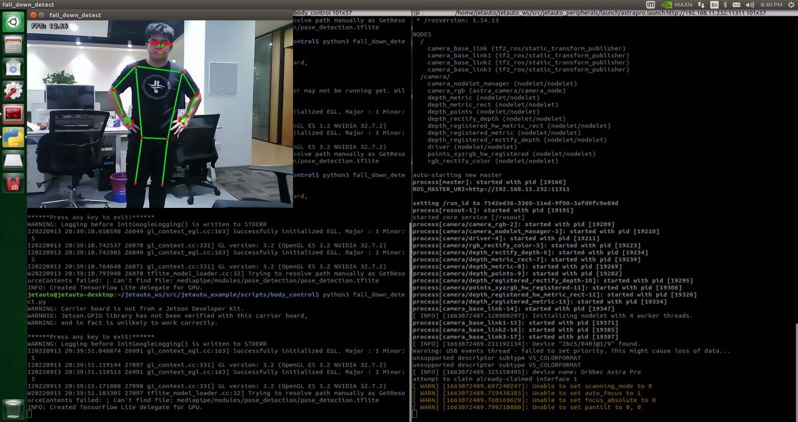

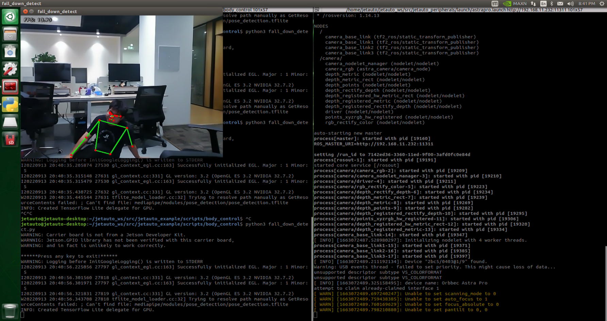

* **Program Analysis**

The program file is saved in

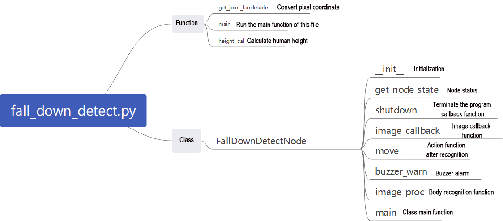

**ros2_ws/src/example/example/body_control/include/fall_down_detect.py**

> [!NOTE]
>
> **Prior to making any alterations to the program, ensure to create a backup of the original factory program. Modify it only after creating the backup. Directly editing the source code file is prohibited to prevent inadvertent parameter modifications that could render the robot dysfunctional and irreparable!**

Based on the game's effectiveness, the procedural logic is delineated as follows:

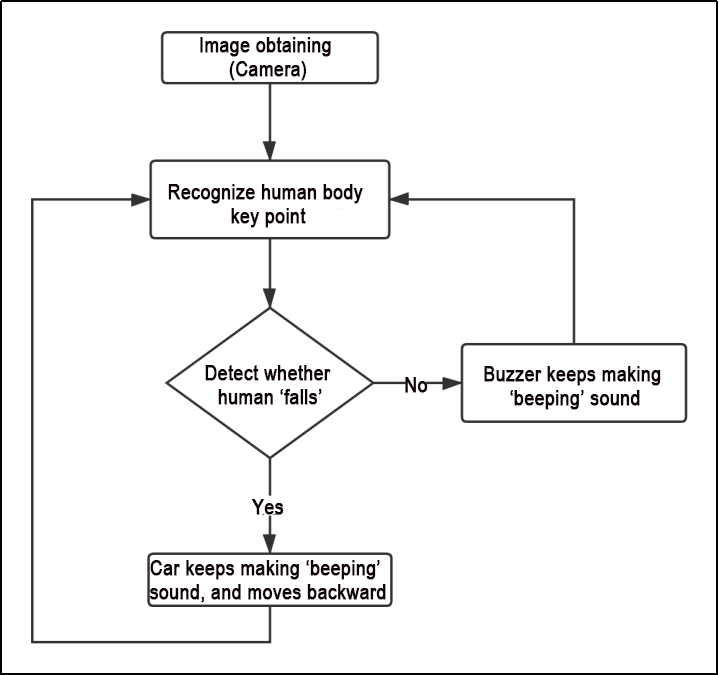

The car captures images via the camera, identifies the key feature points of the human body, and assesses whether the current posture indicates a "**fall**". If a fall is detected, the car's buzzer will emit a continuous "**beep**" sound while the car moves backward. Otherwise, the buzzer will only emit a single "**beep**" sound.

The program logic flow chart obtained from the program files is depicted in the figure below.

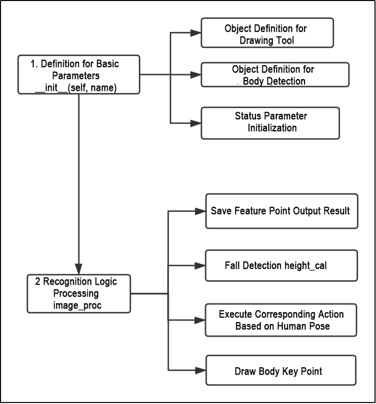

**1. Function**

Main：

```py
def main():
    node = FallDownDetectNode('fall_down_detect')
    rclpy.spin(node)
    node.destroy_node()
```

Used to start the body sensation control node.

get_joint_landmarks:

```py
def get_joint_landmarks(img, landmarks):
    """
    将landmarks从medipipe的归一化输出转为像素坐标(Convert landmarks from medipipe's normalized output to pixel coordinates)
    :param img: 像素坐标对应的图片(picture corresponding to pixel coordinate)
    :param landmarks: 归一化的关键点(normalized keypoint)
    :return:
    """
    h, w, _ = img.shape
    landmarks = [(lm.x * w, lm.y * h) for lm in landmarks]
    return np.array(landmarks)
```

Used to convert the recognized information into pixel coordinates.

height_cal:

```py
def height_cal(landmarks):
    y = []
    for i in landmarks:
        y.append(i[1])
    height = sum(y)/len(y)

    return height
```

Calculates the height of the limbs based on the recognized information.

**2. Class**

```py
class FallDownDetectNode(Node):
    def __init__(self, name):
        rclpy.init()
        super().__init__(name, allow_undeclared_parameters=True, automatically_declare_parameters_from_overrides=True)
        self.name = name
        self.drawing = mp.solutions.drawing_utils
        self.body_detector = mp_pose.Pose(
            static_image_mode=False,
            min_tracking_confidence=0.5,
            min_detection_confidence=0.5)
        self.running = True
        self.fps = fps.FPS()  # fps计算器
        
        self.fall_down_count = []
        self.move_finish = True
        self.stop_flag = False
        signal.signal(signal.SIGINT, self.shutdown)
        self.image_queue = queue.Queue(maxsize=2)
```

This class is the fall detection node.

Init:

```py
class FallDownDetectNode(Node):
    def __init__(self, name):
        rclpy.init()
        super().__init__(name, allow_undeclared_parameters=True, automatically_declare_parameters_from_overrides=True)
        self.name = name
        self.drawing = mp.solutions.drawing_utils
        self.body_detector = mp_pose.Pose(
            static_image_mode=False,
            min_tracking_confidence=0.5,
            min_detection_confidence=0.5)
        self.running = True
        self.fps = fps.FPS()  # fps计算器
        
        self.fall_down_count = []
```

Initialize the parameters required for body control, read the camera's image callback node, initialize nodes such as chassis, buzzers, and others, and finally start the main function within the class.

get_node_state:

```py
    def get_node_state(self, request, response):
        response.success = True
        return response
```

Set the initialization state of the current node.

shutdown:

```py
    def shutdown(self, signum, frame):
        self.running = False
```

Program exit callback function used to terminate recognition.

image_callback:

```py
    def image_callback(self, ros_image):
        rgb_image = np.ndarray(shape=(ros_image.height, ros_image.width, 3), dtype=np.uint8, buffer=ros_image.data)  # 将自定义图像消息转化为图像(convert the custom image message into image)age))
        if self.image_queue.full():
            # 如果队列已满，丢弃最旧的图像
            self.image_queue.get()
        # 将图像放入队列
        self.image_queue.put(rgb_image)
```

Image node callback function used to process images and enqueue them.

Move:

```py
    def move(self):
        for i in range(5):
            twist = Twist()
            twist.linear.x = 0.2
            self.mecanum_pub.publish(twist)
            time.sleep(0.2)
            twist = Twist()
            twist.linear.x = -0.2
            self.mecanum_pub.publish(twist)
            time.sleep(0.2)
        self.mecanum_pub.publish(Twist())
        self.stop_flag =True
        self.move_finish = True
```

Movement strategy function that moves the vehicle according to the recognized limb height.

buzzer_warn:

```py
    def buzzer_warn(self):
        if not self.stop_flag:
            while not self.stop_flag:
                msg = BuzzerState()
                msg.freq = 1000
                msg.on_time = 0.1
                msg.off_time = 0.1
                msg.repeat = 1
                self.buzzer_pub.publish(msg)
                time.sleep(0.2)
        else:
            msg = BuzzerState()
            msg.freq = 1900
            msg.on_time = 0.2
            msg.off_time = 0.01
            msg.repeat = 1
            self.buzzer_pub.publish(msg)
```

Buzzer control function used for buzzer alarms.

image_proc:

```py
    def image_proc(self, image):
        image_flip = cv2.flip(cv2.cvtColor(image, cv2.COLOR_RGB2BGR), 1)
        results = self.body_detector.process(image)
        if results is not None and results.pose_landmarks:
            if self.move_finish:
                landmarks = get_joint_landmarks(image, results.pose_landmarks.landmark)
                h = height_cal(landmarks)
                if h > 240:
                    self.fall_down_count.append(1)
                else:
                    self.fall_down_count.append(0)
                if len(self.fall_down_count) == 3:
                    count = sum(self.fall_down_count)
```

Function for recognizing limbs, which invokes the model to draw key points of the human body based on the recognized information, and moves according to the recognized height.

Main:

```py
    def main(self):
        while self.running:
            try:
                image = self.image_queue.get(block=True, timeout=1)
            except queue.Empty:
                if not self.running:
                    break
                else:
                    continue
            try:
                result_image = self.image_proc(np.copy(image))
            except BaseException as e:
                self.get_logger().info('\033[1;32m%s\033[0m' % e)
                result_image = cv2.flip(cv2.cvtColor(image, cv2.COLOR_RGB2BGR), 1)
            self.fps.update()
            result_image = self.fps.show_fps(result_image)
            cv2.imshow(self.name, result_image)
            key = cv2.waitKey(1)
            if key == ord('q') or key == 27:  
                self.mecanum_pub.publish(Twist())
                self.running = False
```

The main function within the FallDownDetectNode class, used to input image information into the recognition function and display the returned image.

## 15.2 Autonomous Driving

###  15.2.1 Lane Keeping

This lesson focuses on controlling the car to move forward and maintain lane alignment through instructions.

* **Preparation**

Before starting, ensure the map is laid out flat and free of wrinkles, with smooth roads and no obstacles. For specific map laying instructions, please refer to "**[15.3 Autonomous Driving Debugging](#anchor_15_3)**" in the same directory as this section for guidance. (In this lesson, we are only experiencing the road driving-line patrol function, so there is no need to place props such as traffic lights and signboards.)

When experiencing this game, ensure it is conducted in a well-lit environment, but avoid direct light shining on the camera to prevent misrecognition.

It is essential to adjust the color threshold beforehand and set the color threshold of the yellow line to avoid misidentification during subsequent recognition. For specific color threshold adjustment, please refer to the "**[7. ROS+OpenCV Courses](https://wiki.hiwonder.com/projects/JetAcker/en/jetacker-jetson-nano/docs/7.ROS%2BOpenCV_Lesson.html)**" for reference.

It is recommended to position the car in the middle of the road for easy identification!

* **Program Logic**

Lane keeping can be divided into three parts: obtaining real-time images, image processing, and result comparison.

Firstly, real-time images are obtained by capturing images using the camera.

Next, image processing includes color recognition, converting recognized images into different color spaces, erosion and dilation processing, and binarization processing.

The result comparison part involves processing the images to select the region of interest (ROI), outlining the processed images, and further comparing and calculating.

Finally, based on the comparison results, the direction of advancement is adjusted to keep the robot in the middle of the lane.

The source code for this program can be found at:

**/home/ubuntu/ros2_ws/src/example/example/self_driving/lane_detect.py**

* **Operation Steps**

> [!NOTE]
>
> **The input command should be case sensitive, and keywords can be complemented using Tab key.**
>
> **As ROS2 is placed within a container and cannot directly access the GPU of the mainboard, it needs to utilize ROS1 to start the mainboard's GPU, and then transfer the recognition information to ROS2 for use.**

Start the robot, and access the robot system desktop using NoMachine.

**Enable the model:**

1. Click-on  to open the ROS1 command-line terminal.

2. Execute the command and hit Enter to disable the app service.

   ```py
   sudo systemctl stop start_app_node.service
   ```

3. Run the command to enable the autonomous driving service.

   ```py
   roslaunch hiwonder_example self_driving_base.launch
   ```

4. If you need to terminate the game, press 'Ctrl+C'. If the game cannot be terminated, please retry.

   **Bridge:**

1. Click-on  to open the ROS2 command-line terminal.

2. Execute the following command in the 1<sup>st</sup> command-line terminal, and hit Enter key:

   ```py
   source ~/noetic_ws/install_isolated/setup.zsh
   ```

3. In the first command line, enter the command and press Enter:

   ```py
   source ~/third_party_ros2/ros1_bridge_ws/install/setup.zsh
   ```

4. In the first command line, enter the command and press Enter:

   ```py
   ros2 run ros1_bridge parameter_bridge
   ```

5. In the second command line, enter the command and press Enter:

   ```py
   ros2 launch example self_driving.launch.py only_line_follow:=true
   ```

6)  To close the program, click on the corresponding terminal window, and use the shortcut "**Ctrl+C**" to close the program.

* **Program Outcome**

After starting the game, place the robot on the road, and it will automatically detect the yellow line at the edge of the road. The robot will then adjust its position based on the detection results.

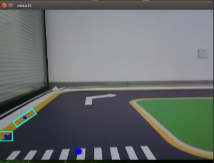

* **Program Analysis**

The source code of this program is saved in

**ros2_ws/src/example/example/self_driving/lane_detect.py**

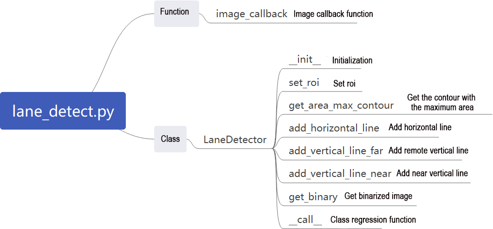

**Function:**

image_callback：

```py
def image_callback(ros_image):
    global image
    rgb_image = np.ndarray(shape=(ros_image.height, ros_image.width, 3), dtype=np.uint8, buffer=ros_image.data)
    image = rgb_image
```

Image callback function is used to read the camera node.

**Class:**

**LaneDetector:**

```py
class LaneDetector(object):
    def __init__(self, color):
        self.target_color = color
        self.rois = ((450, 480, 0, 320, 0.7), (390, 420, 0, 320, 0.2), (330, 360, 0, 320, 0.1))
        self.weight_sum = 1.0

    def set_roi(self, roi):
        self.rois = roi
```

**Init:**

```py
    def __init__(self, color):
        # 车道线颜色
        self.target_color = color
        # 车道线识别的区域
        self.rois = ((450, 480, 0, 320, 0.7), (390, 420, 0, 320, 0.2), (330, 360, 0, 320, 0.1))
        self.weight_sum = 1.0
```

Initialize the required parameters and set the ROI to lock the recognition range.

**set_roi:**

```py
    def set_roi(self, roi):
        self.rois = roi
```

Used to set the Region of Interest (ROI) for recognition.

**get_area_max_contour:**

```py
    def get_area_max_contour(contours, threshold=100):
        '''
        Get the contour corresponding to the maximum area
        :param contours:
        :param threshold:
        :return:
        '''
        contour_area = zip(contours, tuple(map(lambda c: math.fabs(cv2.contourArea(c)), contours)))
        contour_area = tuple(filter(lambda c_a: c_a[1] > threshold, contour_area))
        if len(contour_area) > 0:
            max_c_a = max(contour_area, key=lambda c_a: c_a[1])
            return max_c_a
        return None
```

Obtains the contour with the maximum area from the list of contours obtained through OpenCV.

**add_horizontal_line:**

```py
    def add_horizontal_line(self, image):
        #   |____  --->   |————   ---> ——
        h, w = image.shape[:2]
        roi_w_min = int(w/2)
        roi_w_max = w
        roi_h_min = 0
        roi_h_max = h
        roi = image[roi_h_min:roi_h_max, roi_w_min:roi_w_max]  # Crop the right half
        flip_binary = cv2.flip(roi, 0)  # Flip vertically (upside down)
        max_y = cv2.minMaxLoc(flip_binary)[-1][1]  # Extract coordinates of the topmost and leftmost point with value 255

        return h - max_y
```

Adds a horizontal recognition line based on the width and height of the frame and the ROI settings.

**add_vertical_line_far:**

```py
    def add_vertical_line_far(self, image):
        h, w = image.shape[:2]
        roi_w_min = int(w/8)
        roi_w_max = int(w/2)
        roi_h_min = 0
        roi_h_max = h
        roi = image[roi_h_min:roi_h_max, roi_w_min:roi_w_max]
        flip_binary = cv2.flip(roi, -1)  # Flip the image both horizontally and vertically
        #cv2.imshow('1', flip_binary)
        # min_val, max_val, min_loc, max_loc = cv2.minMaxLoc(ret)
        # minVal: Minimum value
        # maxVal: Maximum value
        # minLoc: Position of the minimum value
        # maxLoc: Position of the maximum value
        # The traversal order is: first rows then columns, with rows from left to right and columns from top to bottom
        (x_0, y_0) = cv2.minMaxLoc(flip_binary)[-1]  # Extract coordinates of the topmost and leftmost point with value 255
        y_center = y_0 + 55
        roi = flip_binary[y_center:, :]
        (x_1, y_1) = cv2.minMaxLoc(roi)[-1]
        down_p = (roi_w_max - x_1, roi_h_max - (y_1 + y_center))
        
        y_center = y_0 + 65
        roi = flip_binary[y_center:, :]
        (x_2, y_2) = cv2.minMaxLoc(roi)[-1]
        up_p = (roi_w_max - x_2, roi_h_max - (y_2 + y_center))

        up_point = (0, 0)
        down_point = (0, 0)
        if up_p[1] - down_p[1] != 0 and up_p[0] - down_p[0] != 0:
            up_point = (int(-down_p[1]/((up_p[1] - down_p[1])/(up_p[0] - down_p[0])) + down_p[0]), 0)
            down_point = (int((h - down_p[1])/((up_p[1] - down_p[1])/(up_p[0] - down_p[0])) + down_p[0]), h)

        return up_point, down_point
```

Adds a recognition vertical line for the part of the frame farther from the robot based on the ROI settings.

**get_binary**

```py
    def get_binary(self, image):
        img_lab = cv2.cvtColor(image, cv2.COLOR_RGB2LAB)  
        img_blur = cv2.GaussianBlur(img_lab, (3, 3), 3)  
        mask = cv2.inRange(img_blur, tuple(lab_data['lab']['Stereo'][self.target_color]['min']), tuple(lab_data['lab']['Stereo'][self.target_color]['max']))  # 二值化
        eroded = cv2.erode(mask, cv2.getStructuringElement(cv2.MORPH_RECT, (3, 3))) 
        dilated = cv2.dilate(eroded, cv2.getStructuringElement(cv2.MORPH_RECT, (3, 3))) 

        return dilated
```

Performs color recognition based on the color space and processes the binarized image.

**add_vertical_line_near:**

```py
    def add_vertical_line_near(self, image):
        # ——|         |——        |
        #   |   --->  |     --->
        h, w = image.shape[:2]
        roi_w_min = 0
        roi_w_max = int(w/2)
        roi_h_min = int(h/2)
        roi_h_max = h
        roi = image[roi_h_min:roi_h_max, roi_w_min:roi_w_max]
        flip_binary = cv2.flip(roi, -1) 
        #cv2.imshow('1', flip_binary)
        (x_0, y_0) = cv2.minMaxLoc(flip_binary)[-1]  
        down_p = (roi_w_max - x_0, roi_h_max - y_0)

        (x_1, y_1) = cv2.minMaxLoc(roi)[-1]
        y_center = int((roi_h_max - roi_h_min - y_1 + y_0)/2)
        roi = flip_binary[y_center:, :] 
        (x, y) = cv2.minMaxLoc(roi)[-1]
        up_p = (roi_w_max - x, roi_h_max - (y + y_center))

        up_point = (0, 0)
        down_point = (0, 0)
        if up_p[1] - down_p[1] != 0 and up_p[0] - down_p[0] != 0:
            up_point = (int(-down_p[1]/((up_p[1] - down_p[1])/(up_p[0] - down_p[0])) + down_p[0]), 0)
            down_point = down_p

        return up_point, down_point, y_center

    def get_binary(self, image):
        img_lab = cv2.cvtColor(image, cv2.COLOR_RGB2LAB)  
        img_blur = cv2.GaussianBlur(img_lab, (3, 3), 3) 
        mask = cv2.inRange(img_blur, tuple(lab_data['lab']['Stereo'][self.target_color]['min']), tuple(lab_data['lab']['Stereo'][self.target_color]['max'])) 
        eroded = cv2.erode(mask, cv2.getStructuringElement(cv2.MORPH_RECT, (3, 3)))  
        dilated = cv2.dilate(eroded, cv2.getStructuringElement(cv2.MORPH_RECT, (3, 3))) 

        return dilated
```

Adds a recognition vertical line for the part of the frame closer to the robot based on the ROI and frame width and height settings.

**\_\_call\_\_:**

```py
def __call__(self, image, result_image):
        # Extract line centers by weight proportion
        centroid_sum = 0
        h, w = image.shape[:2]
        max_center_x = -1
        center_x = []
        for roi in self.rois:
            blob = image[roi[0]:roi[1], roi[2]:roi[3]]  # Crop ROI
            contours = cv2.findContours(blob, cv2.RETR_EXTERNAL, cv2.CHAIN_APPROX_TC89_L1)[-2]  # Find contours
            max_contour_area = self.get_area_max_contour(contours, 30)  # Get contour with maximum area
            if max_contour_area is not None:
                rect = cv2.minAreaRect(max_contour_area[0])  # Minimum enclosing rectangle
                box = np.intp(cv2.boxPoints(rect))  # Four corner points
                for j in range(4):
                    box[j, 1] = box[j, 1] + roi[0]
                cv2.drawContours(result_image, [box], -1, (255, 255, 0), 2)  # Draw rectangle formed by four points

                # Get diagonal points of the rectangle
                pt1_x, pt1_y = box[0, 0], box[0, 1]
                pt3_x, pt3_y = box[2, 0], box[2, 1]
                # Center point of the line
                line_center_x, line_center_y = (pt1_x + pt3_x) / 2, (pt1_y + pt3_y) / 2

                cv2.circle(result_image, (int(line_center_x), int(line_center_y)), 5, (0, 0, 255), -1)  # Draw center point
                center_x.append(line_center_x)
            else:
                center_x.append(-1)
        for i in range(len(center_x)):
            if center_x[i] != -1:
                if center_x[i] > max_center_x:
                    max_center_x = center_x[i]
                centroid_sum += center_x[i] * self.rois[i][-1]
        if centroid_sum == 0:
            return result_image, None, max_center_x
        center_pos = centroid_sum / self.weight_sum  # Calculate center point by weight proportion
        angle = math.degrees(-math.atan((center_pos - (w / 2.0)) / (h / 2.0)))
        
        return result_image, angle, max_center_x
```

Callback function for the entire class. Performs color recognition here, draws the recognized yellow lines using OpenCV, and then outputs the image, angle, and pixel coordinates X of each ROI recognition contour.

### 15.2.2 Road Sign Detection

* **Preparation**

Before starting, ensure the map is laid out flat and free of wrinkles, with smooth roads and no obstacles. For specific map laying instructions, please refer to "**[15.3 Autonomous Driving Debugging](#anchor_15_3)**" in the same directory as this section for guidance.

When experiencing this game, ensure it is conducted in a well-lit environment, but avoid direct light shining on the camera to prevent misrecognition.

* **Program Logic**

Firstly, acquire the real-time image from the camera and apply operations such as erosion and dilation.

Next, invoke the YOLOv5 model and compare it with the target screen image.

Finally, execute the appropriate landmark action based on the comparison results.

You can find the source code for this program at:

**/home/ros_ws/src/hiwonder_example/scripts/yolov5_detect/yolov5_trt_7_0.py**

* **Operation Steps**

> [!NOTE]
>
> **The following steps exclusively activate road sign detection in the return screen, without executing associated actions. Users seeking direct experience with autonomous driving may bypass this lesson and proceed to "Integrated Application" within the same file.**
>
> **Since ROS2 is located inside a container, it cannot directly access the GPU of the mainboard. Therefore, we need to use ROS1 to start the GPU of the mainboard. Here, starting the YOLO model requires the use of GPU, so it's better to check the results through ROS1.**
>
> **Please make sure to enter commands with strict attention to capitalization, spacing, and you can use the "Tab" key to autocomplete keywords.**

1. Start the robot, and access the robot system desktop using NoMachine.

2. Click-on  to open the command-line terminal.

3. Execute the command, and hit Enter to disable the app service.

   ```py
   sudo systemctl stop start_app_node.service
   ```

4. Run the command to navigate to the directory containing programs.

   ```py
   roscd hiwonder_example/scripts/yolov5_detect/
   ```

5. Type the command to open the program source code.

   ```py
   vim yolov5_trt_7_0.py
   ```

6. Press the "i" key to enter insertion mode. Find the code enclosed in the red box and toggle commenting by adding or removing comments as needed. Once done, press the "ESC" key, then type "**:wq**" and press Enter to save and exit.

   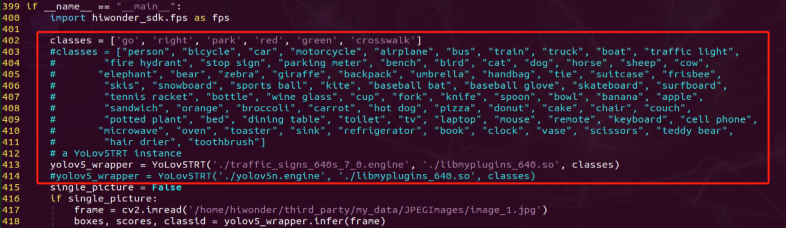

7. Run the command to initiate game program.

   ```py
   python3 yolov5_trt_7_0.py
   ```

8. Position the road sign in front of the camera, and the robot will recognize the road sign automatically.

9. If you need to terminate this game, press '**Ctrl+C**'.

10. Once you've completed the game experience, you can initiate the mobile app service by following the instructions or restarting the robot.

    If the mobile app service is not activated, the associated app functions will be disabled. (The mobile app service will automatically start when the robot restarts).

To restart the mobile app service, enter the command "**sudo systemctl start start_app_node.service**" and wait for the buzzer to emit a single beep, indicating that the service startup is complete.

> [!NOTE]
>
> **In the event that the model struggles to recognize traffic-related signs, it may be necessary to lower the confidence level. Conversely, if the model consistently misidentifies traffic-related signs, raising the confidence level might be advisable.**

1. Run the command to navigate to the directory containing programs.

   ```py
   cd ros_ws/src/hiwonder_example/scripts/self_driving
   ```

2. Enter the command to access the game program.

   ```py
   vim self_driving.launch
   ```

   The red box represents the confidence value, which can be adjusted to modify the effectiveness of target detection.

   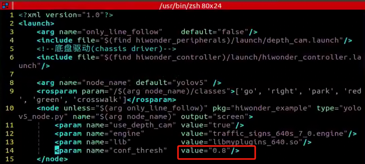

* **Program Outcome**

After initiating the game, place the robot on the road within the map. Once the robot identifies landmarks, it will highlight the detected landmarks and annotate them based on the highest confidence level learned from the model.

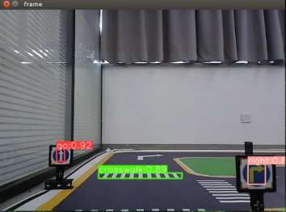

### 15.2.3 Traffic Light Recognition

* **Preparation**

1)  Before starting, ensure the map is laid out flat and free of wrinkles, with smooth roads and no obstacles. For specific map laying instructions, please refer to "**[15.3 Autonomous Driving Debugging](#anchor_15_3)**" in the same directory as this section for guidance.

2)  When experiencing this game, ensure it is conducted in a well-lit environment, but avoid direct light shining on the camera to prevent misrecognition.

* **Program Logic**

Firstly, capture a real-time image from the camera and apply operations such as erosion and dilation.

Next, invoke the YOLOv5 model to compare it with the target screen image.

Finally, execute corresponding landmark actions based on the comparison results.

The source code for this program can be found at:

**/home/ros_ws/src/hiwonder_example/scripts/yolov5_detect/yolov5_trt_7_0.py**

* **Operation Steps**

> [!NOTE]
>
>* **The following steps exclusively activate road sign detection in the return screen, without executing associated actions. Users seeking direct experience with autonomous driving may bypass this lesson and proceed to "Integrated Application" within the same file.**
>
>* **Since ROS2 is located inside a container, it cannot directly access the GPU of the mainboard. Therefore, we need to use ROS1 to start the GPU of the mainboard. Here, starting the YOLO model requires the use of GPU, so it's better to check the results through ROS1.**
>
>* **Please make sure to enter commands with strict attention to capitalization, spacing, and you can use the "Tab" key to autocomplete keywords.**

1. Start the robot, and access the robot system desktop using NoMachine.

2. Click-on  to open the command-line terminal.

3. Execute the command, and hit Enter to disable the app service.

   ```py
   sudo systemctl stop start_app_node.service
   ```

4. Run the command to navigate to the directory containing programs.

   ```py
   roscd hiwonder_example/scripts/yolov5_detect/
   ```

5. Type the command to open the program source code.

   ```py
   vim yolov5_trt_7_0.py
   ```

6. Press the "i" key to enter insertion mode. Find the code enclosed in the red box and toggle commenting by adding or removing comments as needed. Once done, press the "**ESC**" key, then type "**:wq**" and press Enter to save and exit.

   

7. Run the command to initiate game program.

   ```py
   python3 yolov5_trt_7_0.py
   ```

8. Position the road sign in front of the camera, and the robot will recognize the road sign automatically.

9. If you need to terminate this game, press '**Ctrl+C**'.

10. Once you've completed the game experience, you can initiate the mobile app service by following the instructions or restarting the robot.

    If the mobile app service is not activated, the associated app functions will be disabled. (The mobile app service will automatically start when the robot restarts).

To restart the mobile app service, enter the command "**sudo systemctl start start_app_node.service**" and wait for the buzzer to emit a single beep, indicating that the service startup is complete.

> [!NOTE]
>
> **In the event that the model struggles to recognize traffic-related signs, it may be necessary to lower the confidence level. Conversely, if the model consistently misidentifies traffic-related signs, raising the confidence level might be advisable.**

1. Run the command to navigate to the directory containing programs.

   ```py
   cd ros_ws/src/hiwonder_example/scripts/self_driving
   ```

2. Enter the command to access the game program.

   ```py
   vim self_driving.launch
   ```

   The red box represents the confidence value, which can be adjusted to modify the effectiveness of target detection.

   

* **Program Outcome**

After initiating the game, position the robot on the road depicted on the map. Upon recognizing the traffic signal, the robot will assess the color of the signal light and identify frames corresponding to red and green signal lights accordingly.

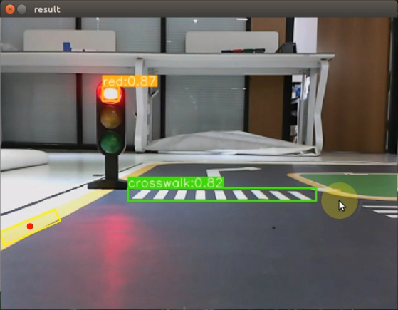

###  15.2.4 Turning Decision Making

* **Preparation**

1)  Before starting, ensure the map is laid out flat and free of wrinkles, with smooth roads and no obstacles. For specific map laying instructions, please refer to "**[15.3 Autonomous Driving Debugging](#anchor_15_3)**" in the same directory as this section for guidance.

2)  The roadmap model discussed in this section is trained using YOLOv5. For further information on YOLOv5 and related content, please refer to "**[15.1.1 MediaPipe Introduction](#anchor_15_1_1)**".

3)  When experiencing this game, ensure it is conducted in a well-lit environment, but avoid direct light shining on the camera to prevent misrecognition.

* **Program Logic**

Firstly, capture the real-time image from the camera and apply operations such as erosion and dilation.

Next, invoke the YOLOv5 model to compare the obtained image with the target screen image.

Finally, based on the comparison outcomes, recognize the steering sign and direct the car accordingly.

The source code of this program is saved in

**/home/ros_ws/src/hiwodner_example/scripts/yolov5_detect/yolov5_trt_7_0.py**

* **Operation Steps**

> [!NOTE]
>
>* **The following steps exclusively activate road sign detection in the return screen, without executing associated actions. Users seeking direct experience with autonomous driving may bypass this lesson and proceed to "Integrated Application" within the same file.**
>
>* **Since ROS2 is located inside a container, it cannot directly access the GPU of the mainboard. Therefore, we need to use ROS1 to start the GPU of the mainboard. Here, starting the YOLO model requires the use of GPU, so it's better to check the results through ROS1.**
>
>* **Please make sure to enter commands with strict attention to capitalization, spacing, and you can use the "Tab" key to autocomplete keywords.**

1. Start the robot, and access the robot system desktop using NoMachine.

2. Click-on  to open the command-line terminal.

3. Execute the command, and hit Enter to disable the app service.

   ```py
   sudo systemctl stop start_app_node.service
   ```

4. Run the command to navigate to the directory containing programs.

   ```py
   roscd hiwonder_example/scripts/yolov5_detect/
   ```

5. Type the command to open the program source code.

   ```py
   vim yolov5_trt_7_0.py
   ```

6. Press the "i" key to enter insertion mode. Find the code enclosed in the red box and toggle commenting by adding or removing comments as needed. Once done, press the "ESC" key, then type "**:wq**" and press Enter to save and exit.

   

7. Run the command to initiate game program.

   ```py
   python3 yolov5_trt_7_0.py
   ```

8. Position the road sign in front of the camera, and the robot will recognize the road sign automatically.

9. If you need to terminate this game, press '**Ctrl+C**'.

10. Once you've completed the game experience, you can initiate the mobile app service by following the instructions or restarting the robot.

    If the mobile app service is not activated, the associated app functions will be disabled. (The mobile app service will automatically start when the robot restarts).

To restart the mobile app service, enter the command "**sudo systemctl start start_app_node.service**" and wait for the buzzer to emit a single beep, indicating that the service startup is complete.

> [!NOTE]
>
> **In the event that the model struggles to recognize traffic-related signs, it may be necessary to lower the confidence level. Conversely, if the model consistently misidentifies traffic-related signs, raising the confidence level might be advisable.**

1. Run the command to navigate to the directory containing programs.

   ```py
   cd ros_ws/src/hiwonder_example/scripts/self_driving
   ```

2. Enter the command to access the game program.

   ```py
   vim self_driving.launch
   ```

   The red box represents the confidence value, which can be adjusted to modify the effectiveness of target detection.

   

* **Program Outcome**

Once the game begins, position the robot onto the road within the map. As the robot approaches a turning road sign, it will adjust its direction in accordance with the instructions provided by the sign.

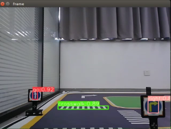

###  15.2.5 Autonomous Parking

* **Preparation**

1)  Before starting, ensure the map is laid out flat and free of wrinkles, with smooth roads and no obstacles. For specific map laying instructions, please refer to "**[15.3 Autonomous Driving Debugging](#anchor_15_3)**" in the same directory as this section for guidance.

2)  The roadmap model discussed in this section is trained using YOLOv5. For further information on YOLOv5 and related content, please refer to "**[15.1.1 MediaPipe Introduction](#anchor_15_1_1)**".

3)  When experiencing this game, ensure it is conducted in a well-lit environment, but avoid direct light shining on the camera to prevent misrecognition.

* **Program Logic**

Begin by capturing the real-time image from the camera and applying operations such as erosion and dilation.

Next, invoke the YOLOv5 model to compare the obtained image with the target screen image.

Finally, based on the comparison results, identify the parking road sign and autonomously guide the car to park in the designated parking space.

The source code of this program is saved in

**/home/ros_ws/src/hiwonder_example/scripts/Yolov5_detect/yolov5_trt_7_0.py**

* **Operation Steps**

> [!NOTE]
>
>* **The following steps exclusively activate road sign detection in the return screen, without executing associated actions. Users seeking direct experience with autonomous driving may bypass this lesson and proceed to "Integrated Application" within the same file.**
>
>* **Since ROS2 is located inside a container, it cannot directly access the GPU of the mainboard. Therefore, we need to use ROS1 to start the GPU of the mainboard. Here, starting the YOLO model requires the use of GPU, so it's better to check the results through ROS1.**
>
>* **Please make sure to enter commands with strict attention to capitalization, spacing, and you can use the "Tab" key to autocomplete keywords.**

1. Start the robot, and access the robot system desktop using NoMachine.

2. Click-on  to open the command-line terminal.

3. Execute the command, and hit Enter to disable the app service.

   ```py
   sudo systemctl stop start_app_node.service
   ```

4. Run the command to navigate to the directory containing programs.

   ```py
   roscd hiwonder_example/scripts/yolov5_detect/
   ```

5. Type the command to open the program source code.

   ```py
   vim yolov5_trt_7_0.py
   ```

6. Press the "i" key to enter insertion mode. Find the code enclosed in the red box and toggle commenting by adding or removing comments as needed. Once done, press the "ESC" key, then type "**:wq**" and press Enter to save and exit.

   

7. Run the command to initiate game program.

   ```py
   python3 yolov5_trt_7_0.py
   ```

8. Position the road sign in front of the camera, and the robot will recognize the road sign automatically.

9. If you need to terminate this game, press '**Ctrl+C**'.

10. Once you've completed the game experience, you can initiate the mobile app service by following the instructions or restarting the robot.

    If the mobile app service is not activated, the associated app functions will be disabled. (The mobile app service will automatically start when the robot restarts).

To restart the mobile app service, enter the command "**sudo systemctl start start_app_node.service**" and wait for the buzzer to emit a single beep, indicating that the service startup is complete.

> [!NOTE]
>
> **In the event that the model struggles to recognize traffic-related signs, it may be necessary to lower the confidence level. Conversely, if the model consistently misidentifies traffic-related signs, raising the confidence level might be advisable.**

1. Run the command to navigate to the directory containing programs.

   ```py
   cd ros_ws/src/hiwonder_example/scripts/self_driving
   ```

2. Enter the command to access the game program.

   ```py
   vim self_driving.launch
   ```

   The red box represents the confidence value, which can be adjusted to modify the effectiveness of target detection.

   

* **Program Outcome**

After initiating the game, position the robot on the road within the map. As the robot progresses towards the parking sign, it will automatically park in the designated parking space based on the instructions provided by the road sign.

* **Parameter Adjustment**

If the robot stops upon recognizing the parking sign and the parking position is not optimal, adjustments to the parameters in the program source code can be made.

1. Click-on  to open the ROS1 command-line terminal.

2. Execute the command to navigate to the directory containing game programs.

   ```py
   cd ros2_ws/src/example/example/self_driving/self_driving.py
   ```

3. Run the command to access the source code.

   ```py
   vim self_driving.py
   ```

4. Press the "i" key to enter insert mode and locate the code within the red box. Adjusting the parameters within the red box allows you to control the starting position for the robot to initiate the parking operation. Decreasing the parameters will result in the robot stopping closer to the zebra crossing, while increasing them will cause the robot to stop further away. Once adjustments are made, press the "**ESC**" key, type "**:wq**", and press Enter to save and exit.

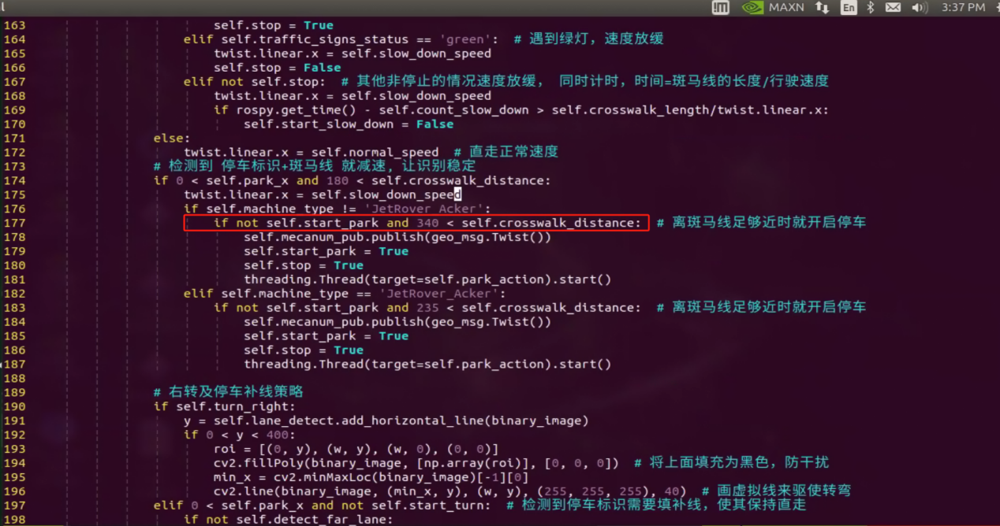

You can adjust the parking processing function to alter the parking position of the robot. Initially, the parking action sets the linear speed in the negative direction of the Y-axis (right of the robot) to 0.2 meters per second, with a forward movement time of (0.38/2) seconds. To position the robot in the ideal location on the left side of the parking space, modify the speed and time accordingly.

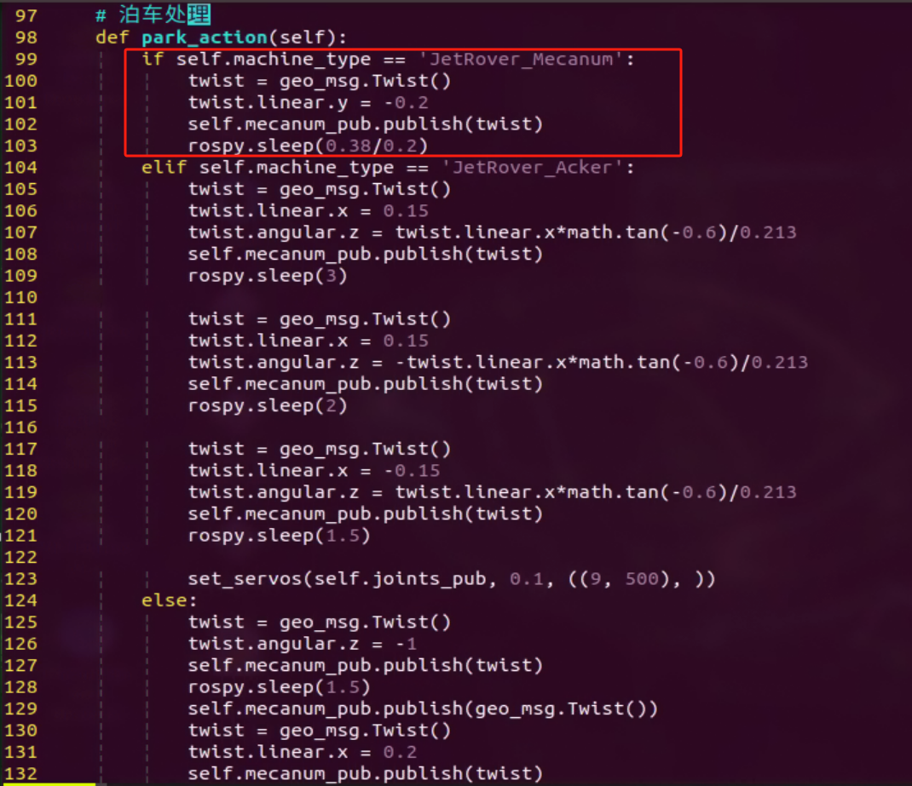

<p id="anchor_15_2_6"></p>

###  15.2.6 Integrated Application

This lesson provides instructions for implementing comprehensive driverless game on the robot, covering lane keeping, road sign detection, traffic light recognition, steering decision-making, and self-parking.

* **Preparation**

**1. Map Setup**

To ensure accurate navigation, place the map on a flat, smooth surface, free of wrinkles and obstacles. Position all road signs and traffic lights at designated locations on the map, facing clockwise. The starting point and locations of road signs are indicated below:

Note: Tools required for autonomous driving are available for separate purchase. If you are interested, kindly reach out to us at support@hiwonder.com.

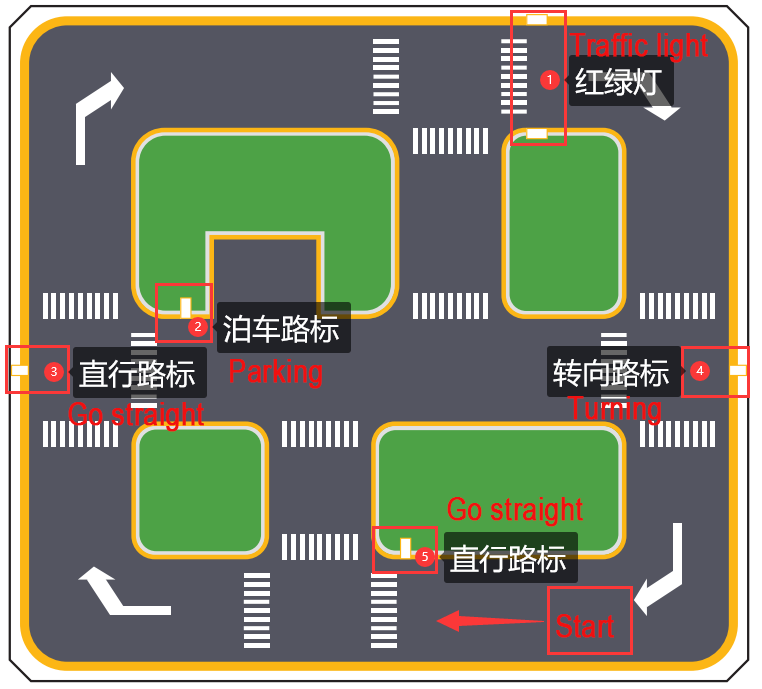

**2. Color Threshold Adjustment**

Due to variations in light sources, it's essential to adjust the color thresholds for 'black, white, red, green, blue, and yellow' based on the guidelines provided in the '**[7 ROS+OpenCV Course](https://wiki.hiwonder.com/projects/JetAcker/en/jetacker-jetson-nano/docs/7.ROS%2BOpenCV_Lesson.html)**' prior to starting. If the robot encounter inaccurate recognition while moving forward, readjust the color threshold specifically in the map area where recognition fails.

* **Program Logic**

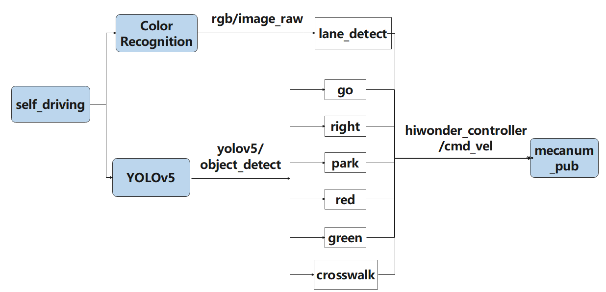

Actions implemented so far include:

1.  Following the yellow line in the outermost circle of the patrol map.

2.  Slowing down and passing if a zebra crossing is detected.

3.  Making a turn upon detection of a turn sign.

4.  Parking the vehicle and entering the parking lot upon detection of a stop sign.

5.  Halting when a red light is detected.

6.  Slowing down when passing a detected street light.

First, load the model file trained by YOLOv5 and the required library files, obtain real-time camera images, and perform operations such as erosion and dilation on the images. Next, identify the target color line segment in the image and gather information such as size and center point of the target image. Then, invoke the model through YOLOv5 and compare it with the target screen image. Finally, adjust the forward direction based on the offset comparison of the target image's center point to keep the robot in the middle of the road. Additionally, perform corresponding actions based on different recognized landmark information during map traversal.

The source code for this program can be found at:

**/home/ubuntu/ros2_ws/src/example/example/self_driving/self_driving.py**

* **Operation Steps**

> [!NOTE]
>
> **The input command should be case sensitive, and keywords can be implemented using Tab key.**
>
> **As ROS2 is located within a container, it cannot directly access the GPU of the mainboard. Thus, it's necessary to initiate the GPU of the mainboard through ROS1 and then transfer the recognition information for use within ROS2.**

Start the robot, and access the robot system desktop using NoMachine.

**Enable the model:**

1. Click-on  to open the ROS1 command-line terminal.

2. Execute the command, and hit Enter to disable the app service.

   ```py
   sudo systemctl stop start_app_node.service
   ```

3. Run the command to enable the autonomous driving service.

   ```py
   roslaunch hiwonder_example self_driving_base.launch
   ```

4. If you need to close the program, simply click on the corresponding terminal window of the program and use the shortcut "**Ctrl+C**" to exit the program.

**Bridge:**

1. Click-on  to start the ROS2 command-line terminal.

2. Execute the command, and hit Enter key.

   ```py
   source ~/noetic_ws/install_isolated/setup.zsh
   ```

3. Execute the command, and hit Enter key.

   ```py
   source ~/third_party_ros2/ros1_bridge_ws/install/setup.zsh
   ```

4. Execute the command, and hit Enter key.

   ```py
   ros2 run ros1_bridge parameter_bridge
   ```

5. Open a new terminal. Run the following command, and hit Enter key.

   ```py
   ros2 launch example self_driving.launch.py
   ```

6. If you need to close the program, simply click on the corresponding terminal window of the program and use the shortcut "**Ctrl+C**" to exit the program.

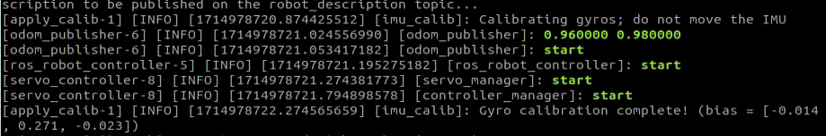

* **Program Outcome**

**1. Lane Keeping**

Upon initiating the game, the car will track the line and identify the yellow line at the road's edge. It will execute forward and turning actions based on the straightness or curvature of the yellow line to maintain lane position.

**2. Traffic Light Recognition**

When the car encounters a traffic light, it will halt if the light is red and proceed if it's green. Upon approaching a zebra crossing, the car will automatically decelerate and proceed cautiously.

**3. Turn and Parking Signs**

Upon detecting traffic signs while moving forward, the car will respond accordingly. If it encounters a right turn sign, it will execute a right turn and continue forward. In the case of a parking sign, it will execute a parking maneuver.

Following these rules, the robot will continuously progress forward within the map.

* **Program Analysis**

The source code of this program is saved in:

**ros2_ws/src/example/example/self_driving/self_driving.py**

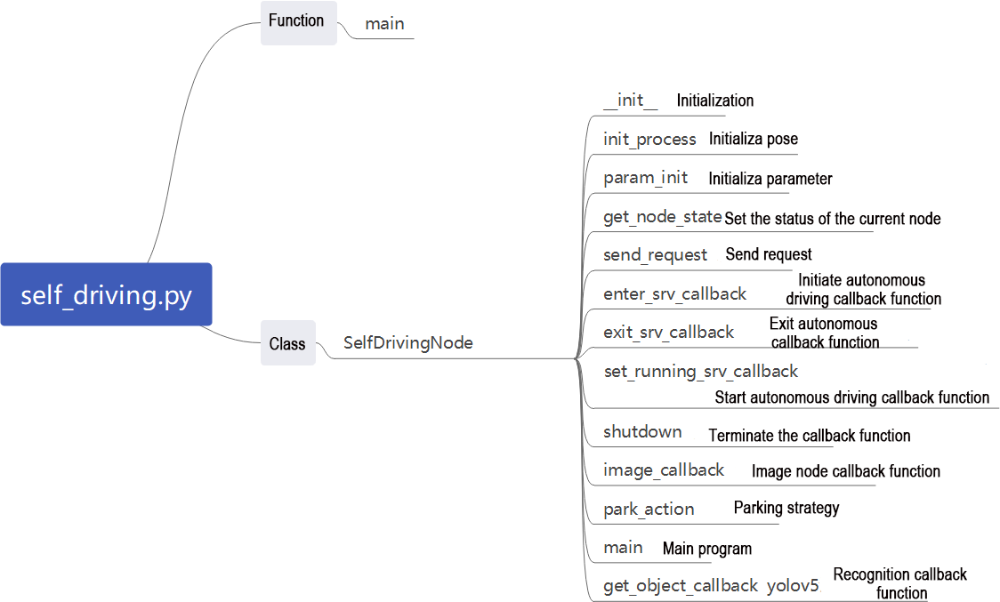

**Function:**

```py
def main():
    node = SelfDrivingNode('self_driving')
    executor = MultiThreadedExecutor()
    executor.add_node(node)
    executor.spin()
    node.destroy_node()
```

Initiate autonomous driving class.

**Class:**

```py
class SelfDrivingNode(Node):
    def __init__(self, name):
        rclpy.init()
        super().__init__(name, allow_undeclared_parameters=True, automatically_declare_parameters_from_overrides=True)
        self.name = name
        self.is_running = True
        self.pid = pid.PID(0.01, 0.0, 0.0)
        self.param_init()
```

init：

```py
        super().__init__(name, allow_undeclared_parameters=True, automatically_declare_parameters_from_overrides=True)
        self.name = name
        self.is_running = True
        self.pid = pid.PID(0.01, 0.0, 0.0)
        self.param_init()

        self.image_queue = queue.Queue(maxsize=2)
        self.classes = ['go', 'right', 'park', 'red', 'green', 'crosswalk']
        self.dispaly =False
        self.bridge = CvBridge()
        self.lock = threading.RLock()
        self.colors = common.Colors()
        signal.signal(signal.SIGINT, self.shutdown)
        self.lane_detect = lane_detect.LaneDetector("yellow")

        self.mecanum_pub = self.create_publisher(Twist, '/controller/cmd_vel', 1)
        self.joints_pub = self.create_publisher(ServosPosition, '/servo_controller', 1) 
        self.result_publisher = self.create_publisher(Image, '~/image_result', 1)

        self.create_service(Trigger, '~/enter', self.enter_srv_callback) 
        self.create_service(Trigger, '~/exit', self.exit_srv_callback) 
        self.create_service(SetBool, '~/set_running', self.set_running_srv_callback)
        # self.heart = Heart(self.name + '/heartbeat', 5, lambda _: self.exit_srv_callback(None))
        timer_cb_group = ReentrantCallbackGroup()
        self.client = self.create_client(Trigger, '/controller_manager/init_finish')
        self.client.wait_for_service()
        self.client = self.create_client(Trigger, '/yolov5/init_finish')
        self.client.wait_for_service()
        self.start_yolov5_client = self.create_client(Trigger, '/yolov5/start', callback_group=timer_cb_group)
        self.start_yolov5_client.wait_for_service()
        self.stop_yolov5_client = self.create_client(Trigger, '/yolov5/stop', callback_group=timer_cb_group)
        self.stop_yolov5_client.wait_for_service()

        self.timer = self.create_timer(0.0, self.init_process, callback_group=timer_cb_group)
```

Initialize the required parameters, obtain the current robot category, set the line-following color to yellow, start the chassis control, servo control, and image reading. Set up three types of services: enter, exit, and start, and read the YOLOv5 node.

init_process：

```py
    def init_process(self):
        self.timer.cancel()

        self.mecanum_pub.publish(Twist())
        if not self.get_parameter('only_line_follow').value:
            self.send_request(self.start_yolov5_client, Trigger.Request())
        set_servo_position(self.joints_pub, 1, ((10, 500), (5, 500), (4, 230), (3, 0), (2, 750), (1, 500)))  # 初始姿态
        time.sleep(1)
        
        if self.get_parameter('start').value:
            self.dispaly = True
            self.enter_srv_callback(Trigger.Request(), Trigger.Response())
            request = SetBool.Request()
            request.data = True
            self.set_running_srv_callback(request, SetBool.Response())

        #self.park_action() 
        threading.Thread(target=self.main, daemon=True).start()
        self.create_service(Trigger, '~/init_finish', self.get_node_state)
        self.get_logger().info('\033[1;32m%s\033[0m' % 'start')
```

Initialize the current robotic arm and start the main function.

param_init:

```py
    def param_init(self):
        self.start = False
        self.enter = False

        self.have_turn_right = False
        self.detect_turn_right = False
        self.detect_far_lane = False
        self.park_x = -1 # X-axis pixel coordinate of the parking sign
		self.start_turn_time_stamp = 0
		self.count_turn = 0self.start_turn = False # Flag to start turning
```

Initialize parameters required for position recognition or usage.

get_node_state:

```py
    def get_node_state(self, request, response):
        response.success = True
        return response
```

Obtain the current state of the node.

send_request:

```py
    def send_request(self, client, msg):
        future = client.call_async(msg)
        while rclpy.ok():
            if future.done() and future.result():
                return future.result()
```

Used to publish service requests.

enter_srv_callback:

```py
    def enter_srv_callback(self, request, response):
        self.get_logger().info('\033[1;32m%s\033[0m' % "self driving enter")
        with self.lock:
            self.start = False
            camera = 'depth_cam'#self.get_parameter('depth_camera_name').value
            self.create_subscription(Image, '/%s/rgb/image_raw' % camera, self.image_callback, 1)
            self.create_subscription(ObjectsInfo, '/yolov5/object_detect', self.get_object_callback, 1)
            self.mecanum_pub.publish(Twist())
            self.enter = True
        response.success = True
        response.message = "enter"
        return response
```

Service for entering autonomous driving gameplay, start reading images and YOLOv5 recognition content, initialize speed.

exit_srv_callback:

```py
    def exit_srv_callback(self, request, response):
        self.get_logger().info('\033[1;32m%s\033[0m' % "self driving exit")
        with self.lock:
            try:
                if self.image_sub is not None:
                    self.image_sub.unregister()
                if self.object_sub is not None:
                    self.object_sub.unregister()
            except Exception as e:
                self.get_logger().info('\033[1;32m%s\033[0m' % str(e))
            self.mecanum_pub.publish(Twist())
        self.param_init()
        response.success = True
        response.message = "exit"
        return response
```

Service for exiting autonomous driving gameplay, stop reading images and YOLOv5 recognition content, initialize speed, reset parameters.

set_running_srv_callback:

```py
    def set_running_srv_callback(self, request, response):
        self.get_logger().info('\033[1;32m%s\033[0m' % "set_running")
        with self.lock:
            self.start = request.data
            if not self.start:
                self.mecanum_pub.publish(Twist())
        response.success = True
        response.message = "set_running"
        return response
```

Start autonomous driving game, set the start parameter to True.

Shutdown:

```py
	def shutdown(self, signum, frame):  # Handle shutdown with Ctrl+C
        self.is_running = False
```

Callback function after closing the program, used to stop the currently running program.

image_callback:

```py
def image_callback(self, ros_image):  # Object detection callback
        rgb_image = np.ndarray(shape=(ros_image.height, ros_image.width, 3), dtype=np.uint8, buffer=ros_image.data)  # Original RGB frame
        if self.image_queue.full():
            # If the queue is full, discard the oldest image
            self.image_queue.get()
        # Put the image into the queue
        self.image_queue.put(rgb_image)
```

Image callback function, enqueues images and discards expired ones.

park_action:

```py
    def park_action(self):
        twist = Twist()
        twist.linear.x = 0.15
        twist.angular.z = twist.linear.x*math.tan(-0.6)/0.213
        self.mecanum_pub.publish(twist)
        time.sleep(3)

        twist = Twist()
        twist.linear.x = 0.15
        twist.angular.z = -twist.linear.x*math.tan(-0.6)/0.213
        self.mecanum_pub.publish(twist)
        time.sleep(2)

        twist = Twist()
        twist.linear.x = -0.15
        twist.angular.z = twist.linear.x*math.tan(-0.6)/0.213
        self.mecanum_pub.publish(twist)
        time.sleep(1.5)

        set_servo_position(self.joints_pub, 0.1, ((9, 500), ))
        self.mecanum_pub.publish(Twist())
```

Parking logic, runs three different parking strategies according to three different chassis types.

get_object_callback:

```py
    # Get object detection results
    def get_object_callback(self, msg):
        self.objects_info = msg.objects
        if self.objects_info == []:  # Reset variables when no objects are recognized
            self.traffic_signs_status = None
            self.crosswalk_distance = 0
        else:
            min_distance = 0
            for i in self.objects_info:
                class_name = i.class_name
                center = (int((i.box[0] + i.box[2])/2), int((i.box[1] + i.box[3])/2))
                
                if class_name == 'crosswalk':  
                    if center[1] > min_distance:  # Get the y-axis pixel coordinate of the nearest crosswalk
                        min_distance = center[1]
                elif class_name == 'right':  # Get right turn sign
                    self.count_right += 1
                    self.count_right_miss = 0
                    if self.count_right >= 10:  # Set the right turn flag to True after multiple detections
                        self.turn_right = True
                        self.count_right = 0
                elif class_name == 'park':  # Get the center coordinate of the parking sign
                    self.park_x = center[0]
                elif class_name == 'red' or class_name == 'green':  # Get traffic light status
                    self.traffic_signs_status = i
        
            self.crosswalk_distance = min_distance
```

Callback function for reading YOLOv5, obtains the categories currently recognized by YOLOv5.

Main:

```py
    def main(self):
        while self.is_running:
            time_start = time.time()
            try:
                image = self.image_queue.get(block=True, timeout=1)
            except queue.Empty:
                if not self.running:
                    break
                else:
                    continue
            result_image = image.copy()
            if self.start:
                h, w = image.shape[:2]

                # Get the binary image of the lane lines
                binary_image = self.lane_detect.get_binary(image)
                # Crosswalk detected, turn on the deceleration flag
                if 450 < self.crosswalk_distance and not self.start_slow_down:  # Start decelerating only when close enough
                    self.count_crosswalk += 1
```

The main function within the class, runs different line-following strategies according to different chassis types.

### 15.2.7 FAQ

1. The robot exhibits inconsistent performance during line patrolling, often veering off course.

   Adjust the color threshold to better suit the lighting conditions of the actual scene. For precise instructions on color threshold adjustment, please consult "**[7 ROS+OpenCV Lesson](https://wiki.hiwonder.com/projects/JetAcker/en/jetacker-jetson-nano/docs/7.ROS%2BOpenCV_Lesson.html)**" for detailed guidance.

2. The robot's turning radius appears to be either too large or too small.

3. Modify the line patrol processing code

   Navigate to the game program path by entering the command:

   ```py
   cd ros2_ws\src\example\example\self_driving
   ```

   Open the game program by entering the command:

   ```py
   vim self_driving.py
   ```

   The red box denotes the lane's center point, which can be adjusted to fine-tune the turning effect. Decreasing the value will result in earlier turns, while increasing it will cause later turns.

   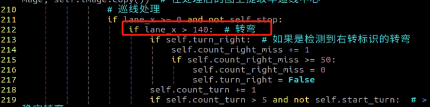

4. The parking location is suboptimal.

   You can adjust the parking processing function or modify the starting position of the parking operation. For detailed instructions, please consult "5.5 Parameter Adjustment" for reference and learning.

5. Inaccurate traffic sign recognition.

   Adjust the target detection confidence. For detailed instructions, please refer to "**[15.3.2 Operation Steps](#anchor_15_3_2)**" for comprehensive learning.

<p id="anchor_15_3"></p>

## 15.3 Autonomous Driving Debugging

**Preface**

This document pertains to the autonomous driving capabilities of our company's vehicle. Before engaging the autonomous driving feature, please verify that the hardware components (such as the depth camera and car chassis motors) installed in the vehicle meet the specified requirements and are operating correctly. Additionally, ensure that the battery is adequately charged.

### 15.3.1 Props Setup & Notices

Prior to commencing autonomous driving, please follow the steps below to set up the map. Note: Tools required for autonomous driving are available for separate purchase. If you are interested, kindly reach out to us at support@hiwonder.com.

* **Setup Instructions**

1. **Map Setup**

2. **Map Setup**

   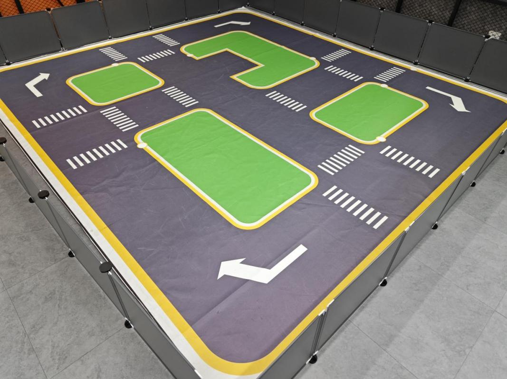

   Place the robot at the start point as pictured.

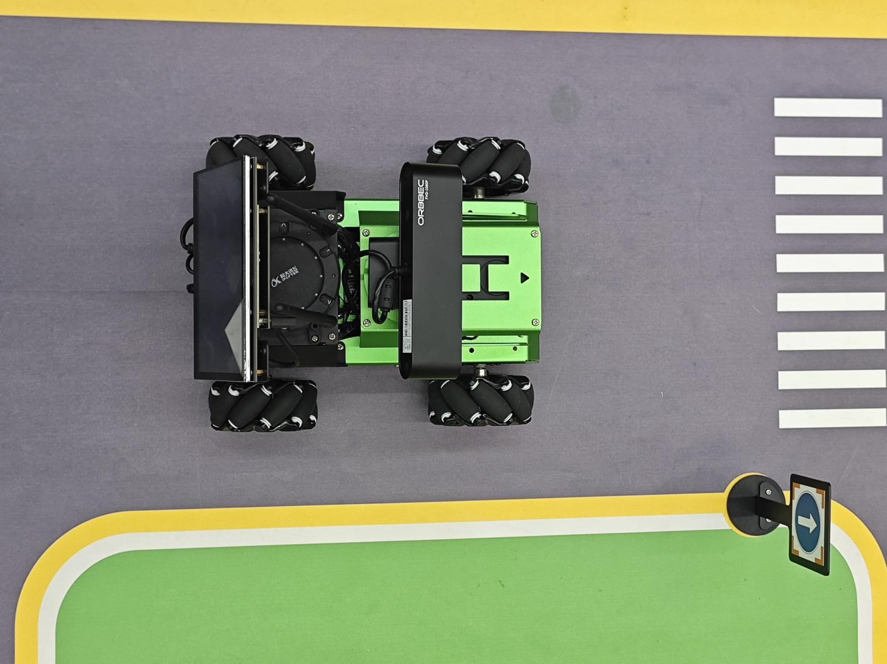

As the robot advances, it will navigate along the yellow line bordering the map, and it can dynamically adjust its posture based on the lane lines in real-time.

3. **Road Signs Setup**

   In the game of autonomous driving, a total of 4 waypoints need to be placed: 2 for straight driving, 1 for right turn, and 1 for parking. Please refer to the following image for the specific placement positions: (Note: Ensure accurate placement!!)

   

   Go straight: instruct the robot car to go forward.

   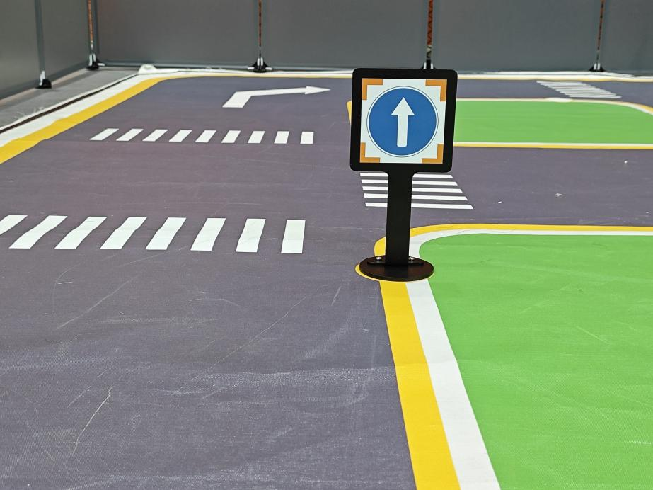

   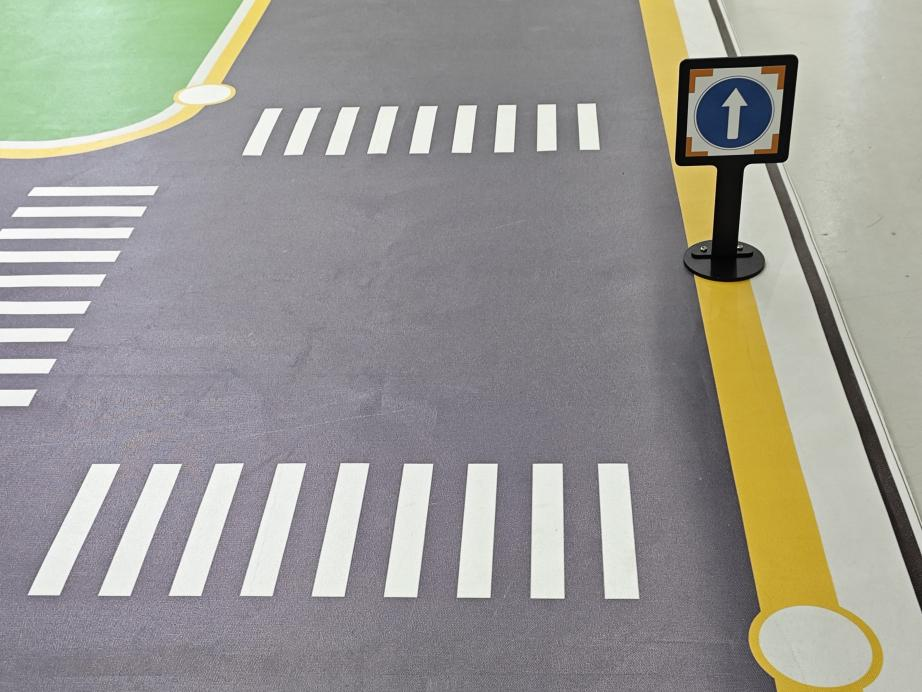

   Turn right: Instruct the robot car to turn right.

   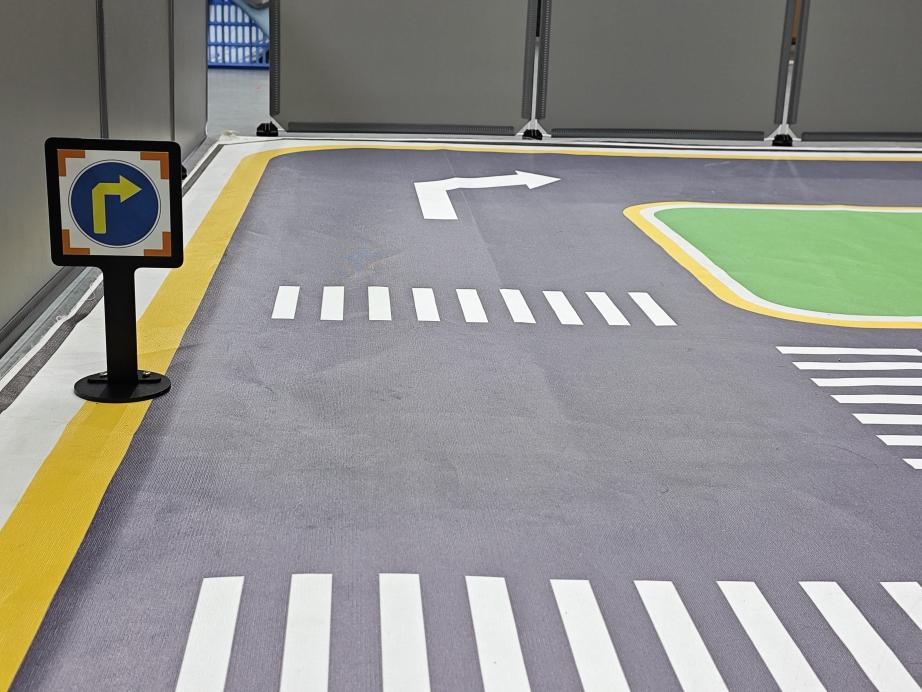

   Park: Command the robot car to park.

   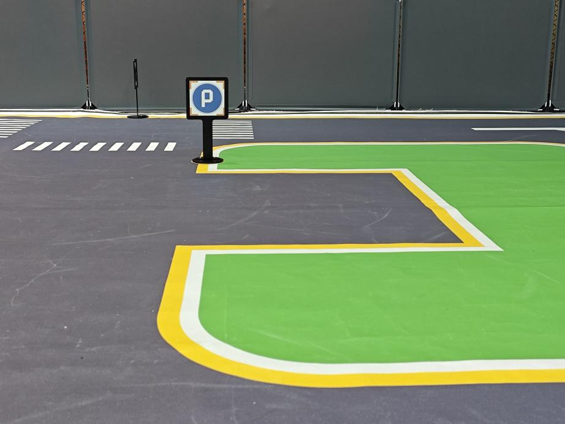

   The purpose of the road signs is to guide the car during its journey. Once the car recognizes a road sign, it will perform the appropriate actions. Additionally, the car will slow down as it approaches a pedestrian crosswalk.

4. **Traffic Light Setup**

   In the game of the autonomous driving function, only one traffic light needs to be placed. The exact placement location is illustrated in the figure below:

   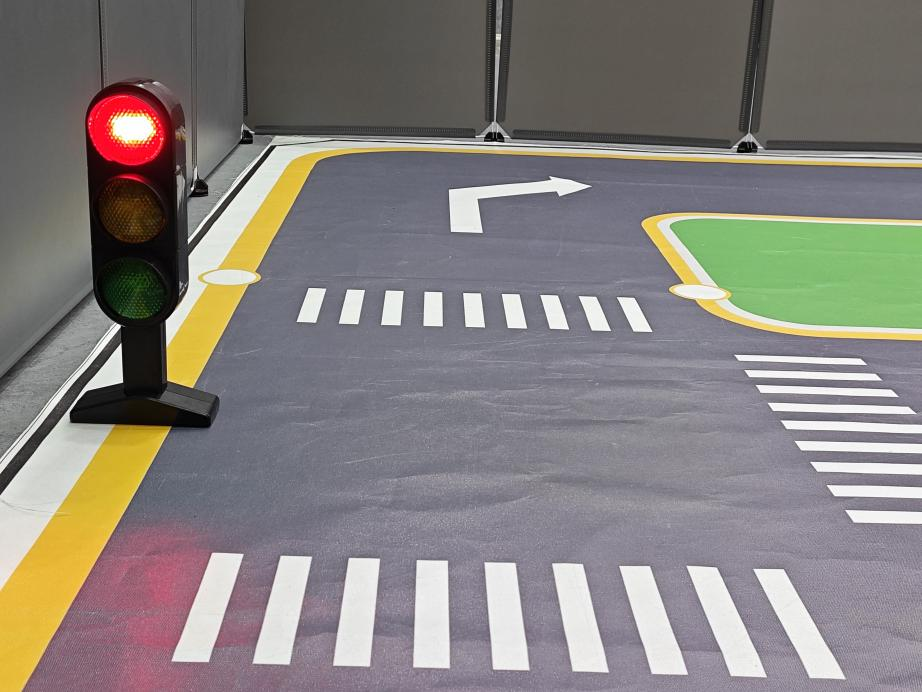

   Traffic light props are utilized to replicate real-world traffic lights on roads. When the car detects the traffic light, it will adhere to the "**stop on red light, go on green light**" rule.

   Once all venue props are arranged, refer to the following picture for setting up the venue environment:

   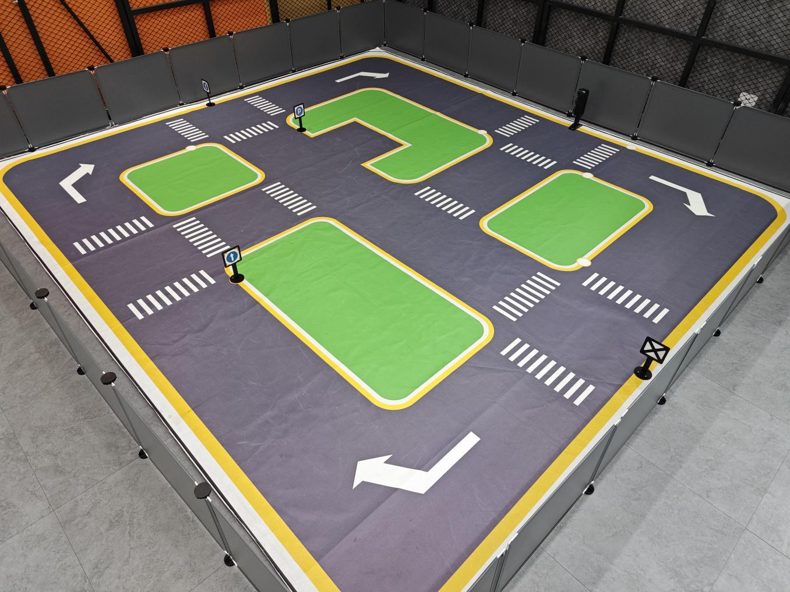

> [!NOTE]
>
>* **Ensure that the site has adequate lighting, preferably natural ambient light. Avoid strong direct light sources and colored lights, as they may hinder overall recognition. Pay attention to this aspect when setting up the site.**
>
>* **While laying out and using the equipment, ensure proper care and protection of the props on the site. In case of incomplete maps or signs, or if the traffic light is damaged and cannot function properly, promptly contact our after-sales personnel to purchase replacements to prevent any disruptions to the recognition process.**

<p id="anchor_15_3_2"></p>

### 15.3.2 Operation Steps

> [!NOTE]
>
> **The input command should be case sensitive, and keywords can be complemented using Tab key.**

1. Place the robot at the starting point of the map, and proceed clockwise while recognizing the road signs.

2. Start the robot, and access the robot system desktop using NoMachine.

3. Click-on  to open the command-line terminal.

4. Execute the command '**sudo systemctl stop start_app_node.service**', and hit Enter to disable the app service.

   ```py
   sudo systemctl stop start_app_node.service
   ```

5. Run the command '**roslaunch hiwonder_example self_driving.launch**' to initiate autonomous driving service.

   ```py
   roslaunch hiwonder_example self_driving.launch
   ```

   The printed message below indicates a successful startup.

   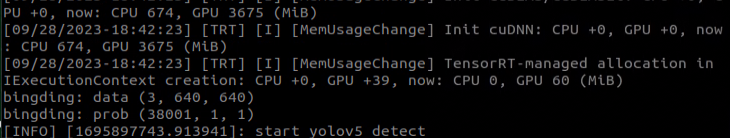

   **Program Outcome**

**1. Lane Keeping**

After initiating the game, the car will follow the line patrol and detect the yellow line along the roadside. Depending on whether the yellow line is straight or curved, the car will execute forward movement and turning actions to maintain its position within the lane.

**2. Traffic Light Recognition**

When the car encounters a traffic light, it will halt if the light is red and proceed if the light is green. While crossing a pedestrian zebra crossing, the car will automatically decelerate upon detection and move forward cautiously.

**3. Turning and Parking**

When the car detects a traffic sign ahead while moving forward, it will respond accordingly to the sign. If it indicates a right turn, the car will turn right and continue forward. If it indicates parking, the car will park sideways.

6)  Once you have experienced this functionality, execute the command or restart the robot to activate the app service.

Run the command "**sudo systemctl start start_app_node.service**" to restart the app service. When the buzzer emits a beeping sound, it indicates that the service has been successfully enabled.

```py
sudo systemctl start start_app_node.service
```

### 15.3.3 Recognition & Debugging

When the car is driving on the road, it might encounter instances of poor recognition, leading to incorrect actions. In such cases, it's essential to adjust the car's parameters. For specific debugging methods, please consult the following content.

* **Adjust Camera Angle**

When using the autonomous driving function, ensure to check the camera angle on the vehicle and confirm its correctness.

1. Attach the depth camera to the camera bracket.

   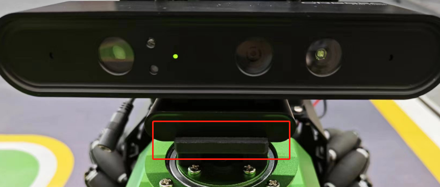

2. Twist the joint of the depth camera to adjust it the lowest angle, enabling the robot to capture the robot's body.

   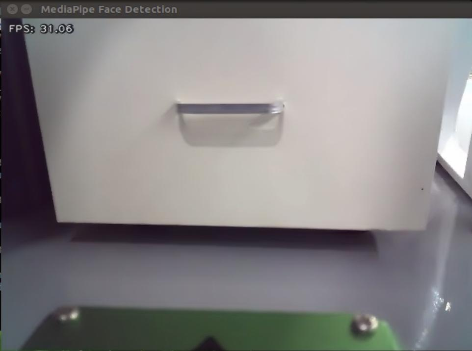

3. Then adjust the depth camera back a bit, so that it just doesn't capture the robot's body

   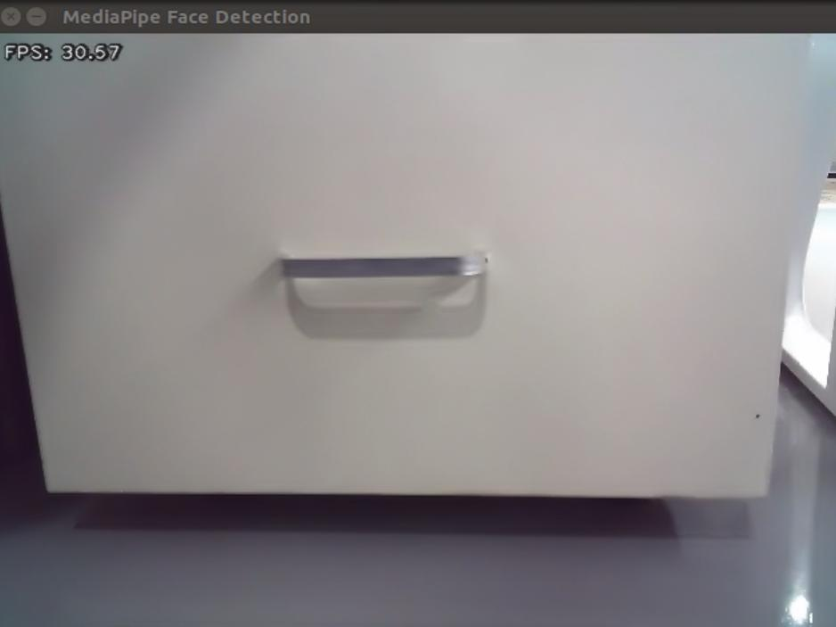

* **Color Threshold Adjustment**

If there is an offset during the movement of the robot car, for instance, JetAcker can't move forward in a straight line, you can adjust the color threshold to correct it. The specific adjustment method are as follow:

1. Place the robot on the map, centering it on the road in the map.

   

2. Input the command "**sudo systemctl stop start_app_node.service**" in the terminal, and press "Enter".

   ```py
   sudo systemctl stop start_app_node.service
   ```

3. Then run the command "**roslaunch hiwonder_peripherals depth_cam.launch**" and press Enter to enable the depth camera service.

   ```py
   roslaunch hiwonder_peripherals depth_cam.launch
   ```

4. Open a new terminal and execute the command "**python3 software/lab_tool/main.py"** to open the color adjustment tool.

   ```py
   python3 software/lab_tool/main.py
   ```

5. Select the color to adjust to yellow, as shown in the figure below

   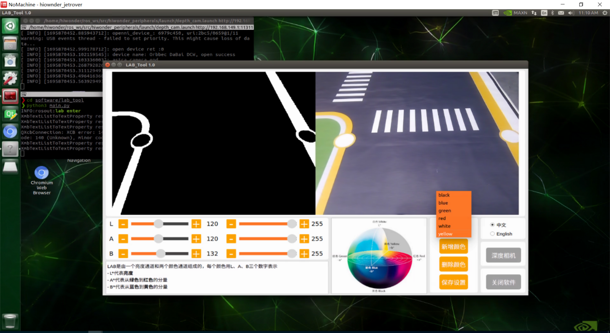

6. Adjust the three LAB colors on the left to effectively identify yellow, as shown in the figure below:

   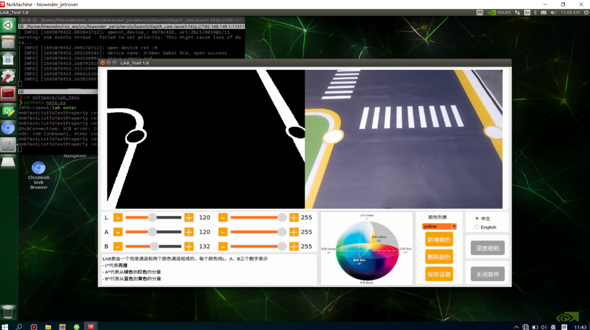

7. Click "Save" and then exit.

   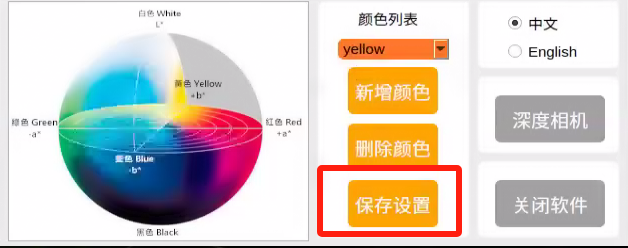

   > [!NOTE]
   >
   > **During the adjustment process, it is recommended not to adjust the color threshold for just one segment of the road. Place the car on sections of the road that it will pass through during operation for adjustment. Adjusting the color threshold in multiple places will achieve better results.** 

* **Road Sign and Traffic light Recognition Debugging**

If the robot fails to respond appropriately after recognizing signs or traffic lights, you can adjust the confidence level in the launch file accordingly. The specific instructions are as follow:

1. Create a new terminal. Input the command "**roscd hiwonder_example/scripts/self_driving/**" to navigate to the "self_driving" folder.

   ```py
   roscd hiwonder_example/scripts/self_driving/
   ```

2. Execute the command "**vim self_driving.launch**".

   ```py
   vim self_driving.launch
   ```

3. In the editor, locate the 'conf_thresh' parameter and modify the confidence value following it as pictured. At this point, 'conf_thresh' is set to 0.82.

   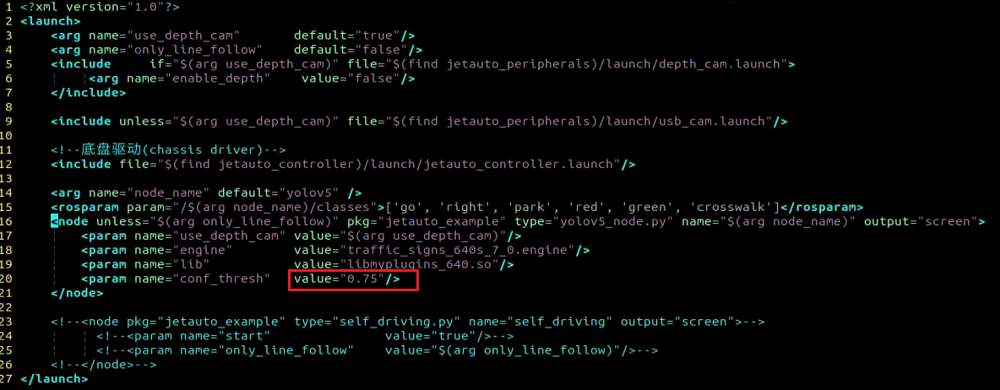

4. Adjust the '**conf_thresh**' value by slightly lowering it within the range of 0.1 to 0.2, as shown in the figure below. Set '**conf_thresh**' to 0.65 (Modification method: Left-click to select the number, press ESC, then press 'i' to enter text mode for editing, and change it to your desired value. For more detailed editing methods, you can search online for keywords like modifying text in the Vim editor).

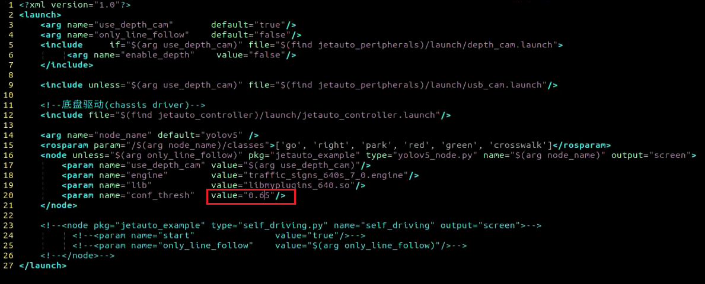

5. After making the modifications, press ESC in the interface, then use the shortcut key of "**Shift+**". After that, type '**wq**' and press Enter to exit the interface. You can then restart the program according to the game instructions to see the effects. If the results are not satisfactory, you can adjust the values appropriately. If the results are still not ideal, you can refer to point 6) for further adjustments.

6. When adjusting the '**conf_thresh**' value does not yield satisfactory results, it may be necessary to retrain the YOLOv5 model. For specific training methods, you can refer to "**[15.2.6 Machine Learning Applications](#anchor_15_2_6)"** for training the model. Once trained, load the model path into the launch file and restart the game.

* **Program Ajustment**

During the operation of the car, besides adjusting the color threshold to control the car's trajectory, there are also parameters in the program that constrain the car's movement. If the car still experiences deviation and jitter after adjusting the color threshold, you can refer to the following instruction:

Locate the self_driving.py file at **hiwonder_example\scripts\self_driving\self_driving.py**

Straight-line parameter adjustment:

In the document, find the '**lane_x**' parameter. You can use your software to search for it, as shown in the red box in the figure below:

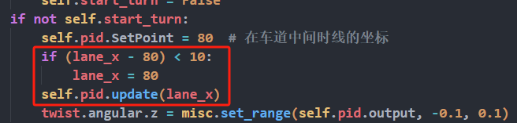

lane_x is the center point of the recognized lane line, used as a characteristic value to keep the car driving straight in the lane. This parameter is set by default, and you don't need to change it. For the effect adjustment, keep the adjustment range within ±3 values.

Right turn parameter adjustment:

In the file, locate the following section of code:

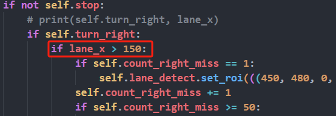

lane_x is the center point of the recognized lane line. If the recognized position exceeds 150, the car will turn right. Users can control the car's turning position by appropriately adjusting this value, keeping the adjustment range within ±20 values, depending on the angle of the camera they have set. Similarly, this parameter is set by default, and you don't need to change it.

> [!NOTE]
>
> **Please refer to the more depth-in content in the following document.**