# 2. Chassis Motion Control Lesson

## 2.1 JetAcker Robotics Kinematics Analysis

### 2.1.1 Overview

The Ackermann chassis utilizes wheels, typically with front-wheel drive and rear wheels for suporting the vehicle's weight. The front wheels are designed to steer, enabling vehicle maneuvering. This design helps reduce friction during turns, improving steering stability and handling.

It is suitable for various types of motor vehicles, including passenger cars, trucks, and agricultural and engineering machinery vehicles. Its design allows the vehicle to more flexibly respond to different road conditions and operational requirements.

### 2.1.2 Ackermann Chassis

* **Hardware Structure**

The driving mechanism consists of servos, links, and wheels. The servos are connected to the links, and these links, in turn, are connected to the wheels. By rotating the servos, the movement of the links is controlled, thereby determining the turning direction of the front wheels.

During turning, if the two wheels are in a parallel state, meaning they rotate at the same angle. The control system for the rear wheels consists of a motor and the wheels. The robot's forward, backward, and speed movements are regulated by the motor's rotation.

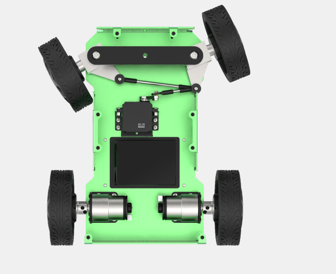

* **Physical Characteristic**

The design of Ackermann chassis aims at providing excellent steering performance and stability. To achieve this, it uses a principle known as "Ackerman geometry" to achieve this. Ackerman geometry refers to the difference in steering angle of the front and rear wheels. By offering the inner front wheel a larger

Secondly, Ackermann chassis also features an well-designed suspension system design. The suspension system is a crucial part connecting the wheels and the vehicle body, significantly impacting the physical characteristics of the chassis. Ackerman chassis typically uses an independent suspension system, allowing each wheel to be controlled independently. This design provides better suspension performance, enhancing vehicle stability and driving comfort.

Additionally, the Ackerman chassis needs to consider the vehicle's center of gravity. The center of gravity has a crucial impact on the vehicle's stability and handling performance. Typically, the Ackerman chassis will have a lower center of gravity to reduce the risk of tilting and skidding.

Lastly, the physical characteristics of the Ackerman chassis also include the braking system and the power transmission system. The braking system controls the braking force applied to the wheels, affecting the vehicle's braking performance and stability. The power transmission system is responsible for transmitting the engine's power to the wheels, influencing the vehicle's acceleration and driving performance.

* **Kinematics Principles & Formulas**

When performing kinematics analysis on the Ackermann chhassis, we can use the following mathematical formulas and parameters to describe its motion characteristics:

To ensure that the Ackerman vehicle achieves pure rolling motion (i.e., no lateral slipping when the vehicle is turning), it is necessary to ensure that the normal lines of the four wheels' motion directions (perpendicular to the tire rolling direction) intersect at one point, which is the steering center.

To simplify the model, assume there is only one front wheel (the theoretical implementation remains consistent), located in the middle of the front axle as shown by the dashed part of the front wheel in the diagram:


1.  **Front Wheel Steering Angle (θ)**: The steering angle of the front wheel, representing the deflection angle of the front wheel relative to the vehicle's forward direction, usually represented by the unit of rad.

2.  **Vehicle Linear Velocity (V):** The linear velocity of the vehicle, representing the translational speed of the vehicle as a whole, usually measured in meters per second (m/s). The left rear wheel velocity is denoted as (V<sub>L</sub>), and the right rear wheel velocity as (V<sub>R</sub>).

3.  **Vehicle Track Width (D)**: The distance between the wheels on the left and right sides of the vehicle, usually measured in meters (m).

4.  **Vehicle Wheelbase (H)**: The distance between the front and rear wheels of the vehicle, usually measured in meters (m).

5.  **Vehicle Turning Radius (R):** The radius of the circle described by the vehicle when turning, usually measured in meters (m). The turning radius of the left wheel is denoted as (R<sub>L</sub>), and the turning radius of the right wheel as (R<sub>R</sub>).

**Calculation process for robot speed and angle:**

1.  Consistency of Angular Velocity:

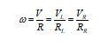

Where:

- ω is the angular velocity of the vehicle,

- R represents the turning radius of the vehicle,

- V is the linear velocity of the vehicle,

- V<sub>L</sub> is the linear velocity of the left rear wheel,

- V<sub>R</sub> is the linear velocity of the right rear wheel,

- R<sub>L</sub> is the turning radius of the left wheel,

- RR is the turning radius of the right wheel.

2.  Relation between front wheel steering angle and vehicle turning radius：

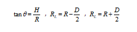

Where:

- H is the distance between the front and rear wheels of the vehicle,

- R is the turning radius of the vehicle,

- D is the distance between the wheels on the left and right sides of the vehicle,

- Θ is the steering angle of the front wheel.

3.  Velocity of the Left Rear Wheel:

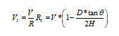

4.  Velocity of the Right Rear Wheel:

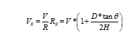

Knowing the track width and wheelbase of the robot, as well as the robot's speed and servo angle, the speeds of the two rear wheels can be determined.

* **Program Performance**

The robot's kinematics can be found at the path:

/home/hiwonder/ros_ws/src/hiwonder_driver/hiwonder_sdk/src/hiwonder_sdk/ackermann.py

**1. Import Relevant Header Files:**

```py
import math
from ros_robot_controller.msg import MotorState
```

Start MotorState for motor control message information

**2. Define the Type of Robot Motion Type:**

```py
class AckermannChassis:
    # wheelbase = 0.213  # Distance between front and rear axles(前后轴距)
    # track_width = 0.222  # Distance between left and right axles(左右轴距)
    # wheel_diameter = 0.101  # Wheel diameter(轮子直径)

    def __init__(self, wheelbase=0.213, track_width=0.222, wheel_diameter=0.101):
        self.wheelbase = wheelbase
        self.track_width = track_width
        self.wheel_diameter = wheel_diameter
```

The AckermanChassis defined above is used to initialize parameters relevant to implementing the Ackermann chassis relevant , for example, front and rear, right and left axle distances, and wheel diameter size, which are essential for subsequent kinematic calculations.

**3. Motion Speed Conversion:**

```py
def speed_covert(self, speed):
        """
        covert speed m/s to rps/s
        :param speed:
        :return:
        """
        return speed / (math.pi * self.wheel_diameter)
```

Output the actual required speeds of the wheels.

**4. Kinematics Inverse Calculation**

```py
def set_velocity(self,linear_speed,angular_speed,reset_servo=True):
```

The function takes parameters linear_speed (linear velocity of the robot) and angular_speed (angular velocity of the robot). With these inputs, it can control the robot's motion using kinematic inverse calculation.

**5. Kinematics Inverse Calculation**

```py
def set_velocity(self, linear_speed, angular_speed, reset_servo=True):
        servo_angle = 500
        data = []
        if abs(linear_speed) >= 1e-8:
            if abs(angular_speed) >= 1e-8:
                theta = math.atan(self.wheelbase*angular_speed/linear_speed)
                steering_angle = theta
                # print(math.degrees(steering_angle))
                if abs(steering_angle) > math.radians(37):
                    for i in range(4):
                        msg = MotorState()
                        msg.id = i + 1
                        msg.rps = 0.0
                        data.append(msg)
                    msg = MotorsState()
                    msg.data = data
                    return None, msg
                servo_angle = 500 + 1000*math.degrees(steering_angle)/240

            vr = linear_speed + angular_speed*self.track_width/2
            vl = linear_speed - angular_speed*self.track_width/2
            v_s = [self.speed_covert(v) for v in [0, vl, 0, -vr]]
            for i in range(len(v_s)):
                msg = MotorState()
                msg.id = i + 1
                msg.rps = float(v_s[i])
                data.append(msg)
            msg = MotorsState()
            msg.data = data
            return servo_angle, msg
        else:
            for i in range(4):
                msg = MotorState()
                msg.id = i + 1
                msg.rps = 0
                data.append(msg)
            return None, data
```

The picture above is the find value of the kinematics inverse calculation:

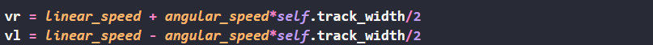

VR and VL represent the computed angular velocities for the right and left wheels respectively, derived from the kinematic inverse calculation.


1.  vs represents the value after converting speed and wheel diameter.

2.  servo_angle is the steering servo position for the front steering wheel.

3.  This completes the velocity output and directional control of the kinematic inverse calculation.

## 2.2 JetAcket Motion Control

### 2.2.1 IMU & Linear Velocity Calibration

> [!NOTE]
>
> * Before the robot leaves the factory, relevant parameters are already set, so under normal circumstances, there is no need to perform calibration. Therefore, this section is only for understanding purposes. If you notice a significant deviation during movement, such as veering to one side noticeably during forward motion, preventing it from travelling straight, you can refer to the following tutorial for calibration.
>
> * Calibration is only meant to reduce the deviation between the actual parameters of the hardware device and the ideal state parameters. There will always be some deviation in the actual hardware, so during calibration, you only need to adjust it to be relatively accurate according to your own requirements.
>
> * The calibration method is applicable to different versions of JetAcker.

If the robot exhibits deviations during operation, it may require calibration for IMU and linear velocity. Once the calibration process is completed, the robot can resume normal

* **IMU Calibration**

The IMU (Inertial Measurement Unit) is a device used to measure the three-axis attitude angle (angular rate) and acceleration of an object. It consists of the gyroscope and accelerometer as its main components, offering a total of 6 degrees of freedom to measure the angular velocity and acceleration of an object in three-dimensional space.

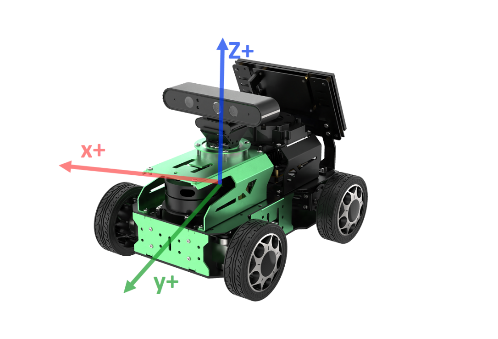

The diagram above shows the positive directions of XYZ three axes of IMU module. In the subsequent calibration process, you can refer to the above coordinate relationships for calibration.

**Upon receiving the first IMU message, the node will prompt you to keep the IMU in a specific direction.** Then, press Enter to record the measurement value. Once you have completed the adjustment of parameters in all six directions, the node will save the calibration computation parameters into the designated YAML file. Please follow the detailed instructions provided below for further guidance.

> [!NOTE]
>
> **The input command should be case sensitive, and keywords can be complemented using Tab key.**

1. Start the robot, and access the robot system via NoMachine. Reference to "**[1. Getting Ready->1.6 Development Environment Setup and Configuration]( https://wiki.hiwonder.com/projects/JetAcker/en/jetacker-jetson-nano/docs/1.Getting_Ready.html#development-environment-setup-and-configuration)**".

2. Click-on 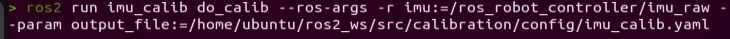 to open the command-line terminal.

3. Run the following command to disable the app auto-start service.

```bash
sudo systemctl stop start_app_node.service
```

4. Execute the following command to start IMU calibration.

```bash
roslaunch hiwonder_calibration calibrate_imu.launch
```

5. When you receive the following prompt, indicating that you can start calibrating the angular velocity offset of the IMU's positive x-axis. Put the robot as the below picture shown, then press Enter key.


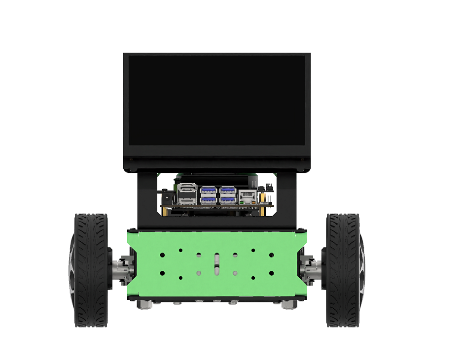

Upon successful calibration in each direction, you will receive the following prompt.


6. When you receive the following prompt, indicating that you can start calibrating the angular velocity offset of the IMU's negative x-axis. Position the robot as pictured, then press Enter key.

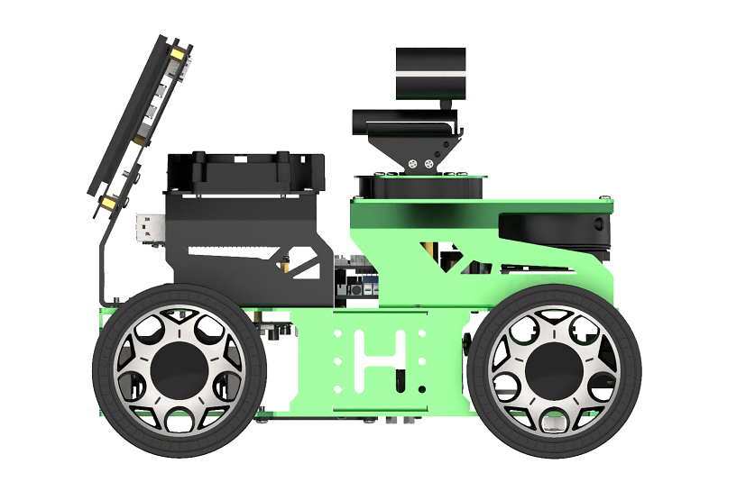


7. When you receive the following prompt, indicating that you can start calibrating the angular velocity offset of the IMU's positive y-axis. Position the robot as pictured, then press Enter key.

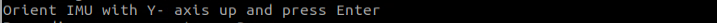


8. When you receive the following prompt, indicating that you can start calibrating the angular velocity offset of the IMU's negative y-axis. Position the robot as pictured, then press Enter key.


9. When you receive the following prompt, indicating that you can start calibrating the angular velocity offset of the IMU's positive z-axis. Position the robot as pictured, then press Enter key.


10. When you receive the following prompt, indicating that you can start calibrating the angular velocity offset of the IMU's negative z-axis. Position the robot as pictured, then press Enter key.

 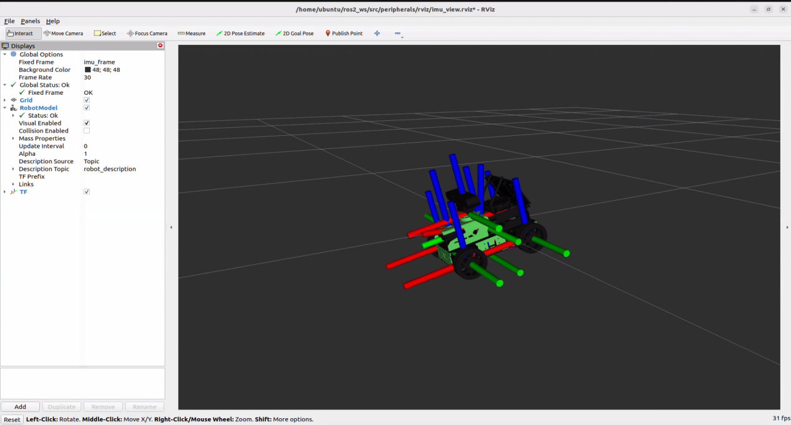

 

11. If the terminal prints the following message, it means the IMU calibration is competed. Press "**Ctrl+C**" to exit the calibration.

 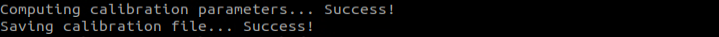

12. Once the calibration is done, enter the following command to check the model calibrated.

 **roslaunch hiwonder_peripherals imu.launch debug:=true**

 

 

 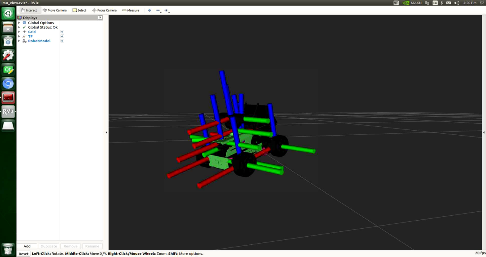

 You can try to rotate the robot. The hardware structure and joints on the robot will rotate relative to the actual IMU coordinates.

* **linear Velocity Calibration**

> [!NOTE]
>
> **The input command is case-sensitive, and keywords can be completed using the Tab key.**

Place the robot onto a flat and open surface. Glue a tape point or other markers in front the robot as the starting point. Position another tape or marker 1 meter in front of the robot as the endpoint for calibrating the linear velocity.

1. Start the robot, and access the robot system via NoMachine. Reference to "**[1. Getting Ready->1.6 Development Environment Setup and Configuration]( https://wiki.hiwonder.com/projects/JetAcker/en/jetacker-jetson-nano/docs/1.Getting_Ready.html#development-environment-setup-and-configuration)**".

2. Click-on  to open the command-line terminal.

3. Run the following command to disable the app auto-start service.

```bash
sudo systemctl stop start_app_node.service
```

4. Execute the following command and press Enter to activate the "go" parameters for adjusting linear velocity.

```bash
roslaunch hiwonder_calibration calibrate_linear.launch go:=true
```

Click calibrate_linear at the left, and the calibration interface as follow:

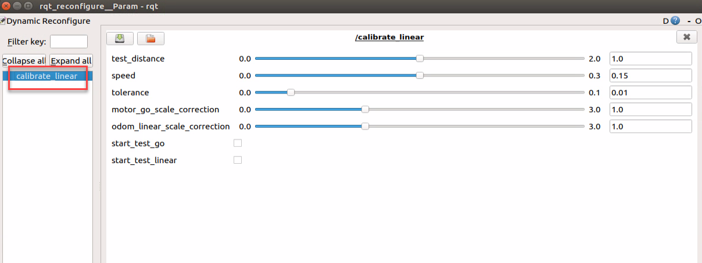

The meanings of the parameters on the left side of the interface are as follow:

1. **test_distance**: Test distance, default is 1 meter.

2. **speed**: Linear speed, default is 0.15 meters per second.

3. **tolerance**: Error tolerance; a smaller tolerance leads to greater robot jitter after reaching the target position.

4. **odom_linear_scale_correction**: Odometry linear scale correction ratio.

5. **motor_go_scale_correction**: Motor forward scaling ratio.

6. **start_test_go**: Button to start testing motor forward scaling.

7. **start_test_linear**: Button to start testing odometry linear scale.

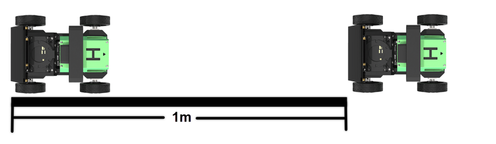

Ensure the robot is properly aligned and positioned at the starting marker. Check the "**start_test_go**" box to begin testing. The robot will move forward; observe if it travels straight. If there is deviation, adjust the "**motor_go_scale_correction**" value. This value scales the motor's forward movement. It's recommended to adjust in increments of 0.01 for each tuning step.

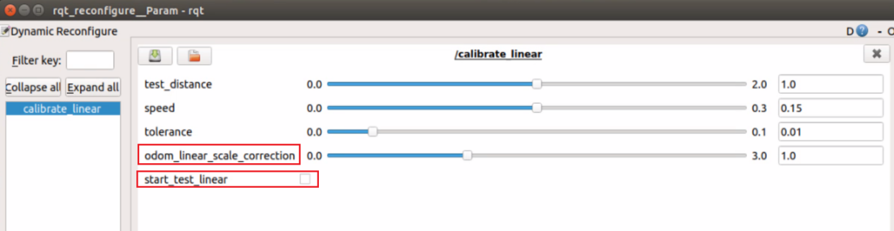

5. Open a new command-line terminal. Run the following command to ebter the calibration configuration file directory.

```bash
roscd hiwonder_controller/config/
```

6. Enter the following command to open the configuration file.

```bash
vim calibrate_params.yaml
```

7. Press '**I**' key to navigate to the editing mode, and modify the value of "**linear_correction_factor**" to the adjusted value of "**motor_go_scale_correction**".

   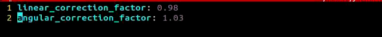

8. After making the modifications, press the "**ESC**" key, enter "**:wq**" to exit and save the changes.

9. If you need to terminate this program, use short-cut '**Ctrl+C**'.

10. After calibration, you can activate the mobile app service either by using a command or restarting the robot. If the mobile app service is not activated, related app functions will be disabled. In the case of a robot restart, the mobile app service will start automatically. Use the command '**sudo systemctl restart start_app_node.service**' to restart the mobile app service, and wait for the buzzer to make sound, signaling the completion of the service startup.

```bash
 sudo systemctl restart start_app_node.service
 ```

* **FAQ**

Q: What should I do if the robot shows movement deviation even after calibration, especially when walking in a straight line?

A: For instance, when dealing with the adjustment of linear velocity and encountering deviations, we suggest performing multiple tests. Adjust the associated parameters, specifically '**motor_go_scale_correction**' and '**odom_linear_scale_correction**,' until the robot achieves stable straight-line movement. This method helps prevent incomplete calibration by modifying only one parameter.

### 2.2.2 IMU and Odometer Data Publishing

In robot navigation, accurately calculating real-time position is essential. Normally, we obtain odometer information using motor encoders and the robot's kinematic model. However, in specific situations, like when the robot's wheels rotate in place or when the robot is lifted, it may move a distance without the wheels actually turning.

To address wheel slip or accumulated errors in such cases, combining IMU and odometer data can yield more precise odometer information. This improves mapping and navigation accuracy in scenarios where wheel slip or cumulative errors may occur.

* **Introduction to IMU and Odometer**

The IMU (Inertial Measurement Unit) is a device that measures the three-axis attitude angles (angular velocity) and acceleration of an object. It consists of the gyroscope and accelerometer as its main components, providing a total of 6 degrees of freedom to measure the object's angular velocity and acceleration in three-dimensional space.

An odometer is a method used to estimate changes in an object's position over time using data obtained from motion sensors. This method is widely applied in robotic systems to estimate the distance traveled by the robot relative to its initial position.

There are common methods for odometer positioning, including the wheel odometer, visual odometer, and visual-inertial odometer. In robotics, we specifically use the wheel odometer. To illustrate the principle of the wheel odometer, consider a carriage where you want to determine the distance from point A to point B. By knowing the circumference of the carriage wheels and installing a device to count wheel revolutions, you can calculate the distance based on wheel circumference, time taken, and the number of wheel revolutions.

While the wheel odometer provides basic pose estimation for wheeled robots, it has a significant drawback: accumulated error. In addition to inherent hardware errors, environmental factors such as slippery tires due to weather conditions contribute to increasing odometer errors with the robot's movement distance.

Therefore, both IMU and odometer are essential components in a robot. These two components are utilized to measure the three-axis attitude angles (or angular velocity) and acceleration of the object, as well as to estimate the distance, pose, velocity, and direction of the robot relative to its initial position.

To address these errors, we combine IMU data with odometer data to obtain more accurate information. IMU data is published through the "**/imu**" topic, and odometer data is published through "**/odom**". After obtaining data from both sources, the data is fused using the "**ekf**" package in ROS, and the fused localization information is then republished.

*  **Publish IMU Data** 

**1. Enable Service**

> [!NOTE]
>
> **The input command should be case sensitive, and the keywords can be complemented using "Tab" key.**

1. Start the robot, and access the robot system via NoMachine. Reference to "**[1. Getting_ready-> 1.6 Development Environment Setup and Configuration]( https://wiki.hiwonder.com/projects/JetAcker/en/jetacker-jetson-nano/docs/1.Getting_Ready.html#development-environment-setup-and-configuration)**".

2. Click-on  to open the command-line terminal.

3. Run the following command to disable the app auto-start service.

```bash
sudo systemctl stop start_app_node.service
```

4. Enter the following command and press Enter to publish IMU data.

```bash
roslaunch hiwonder_peripherals imu.launch
```

* **2. View the Data**

1. Open a new command-line terminal. Run the following command to view the current topic.

```bash
rostopic list
```

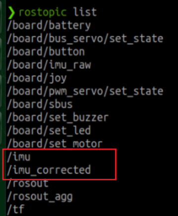

2. Run the following command to view the type, publisher and subscribers of the **/imu topic**. You can replace "**/imu**" with the topic you want to inspect

```bash
rostopic info /imu
```

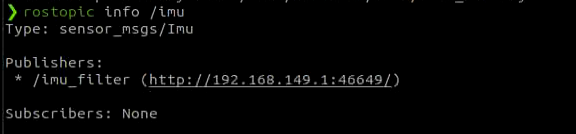

The topic is of type '**sensor_msgs/Imu**,' published under '**/imu_filter**,' and currently has no subscribers.

3. Enter the following command to display the content of the topic message. Feel free to replace '**imu**' with the name of the topic you wish to view.

```bash
rostopic echo /imu
```


The terminal will display the data from the three axes of the IMU.

After publishing data, you can activate the mobile app service either by using a command or restarting the robot. If the mobile app service is not activated, related app functions will be disabled. In the case of a robot restart, the mobile app service will start automatically. Use the command '**sudo systemctl restart start_app_node.service**' to restart the mobile app service, and wait for the buzzer to make sound, signaling the completion of the service startup.

```bash
sudo systemctl restart start_app_node.service
```

* **Publish Odometer Data** 

**1. Enable Service**

> [!NOTE]
>
> **When entering commands, it is essential to strictly distinguish between uppercase and lowercase letters, and keywords can be autocompleted using Tab key.**

1. Start the robot, and access the robot system desktop using NoMachine.

2. Double-click 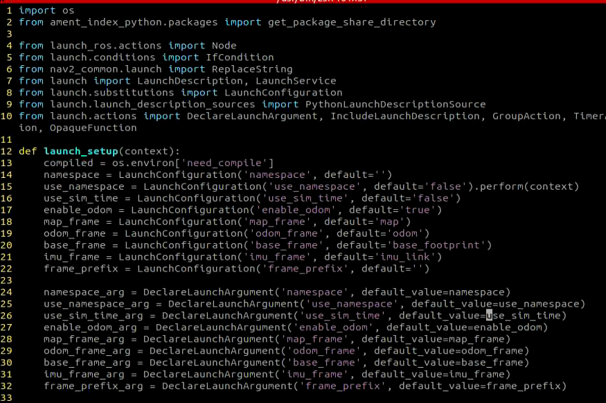 to open the command line terminal.

3. Execute the command '**sudo systemctl stop start_app_node.service**', and hit Enter to disable app auto-start service.

```bash
sudo systemctl stop start_app_node.service
```

4. Run the following command to publish the odometer data.

```bash
roslaunch hiwonder_controller hiwonder_controller.launch
```

**2. View the Data**

1)  Open a new command line terminal, and run the command '**rostopic list**' to check the current topic.

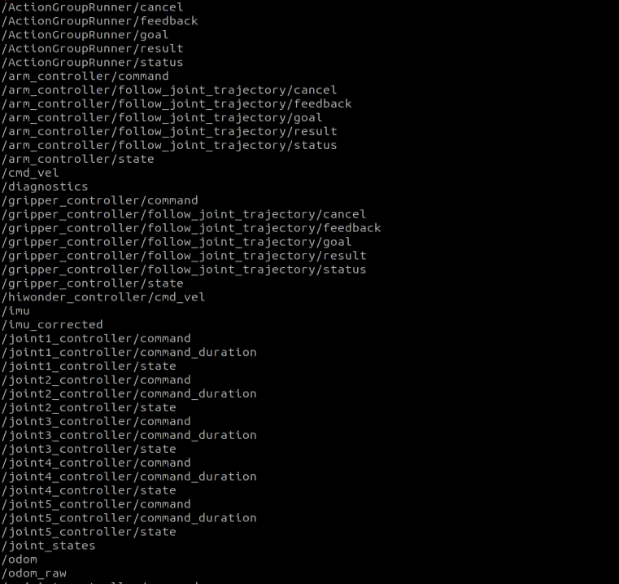

2. Enter the command '**rostopic info /odom_raw**' to check the type, publisher and subscriber of the '**/odom_raw**' topic.

```bash
rostopic info /odom_raw
```

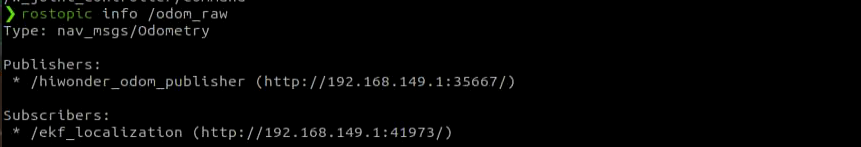

The type of this topic is '**nav_msgs/Odometry**,' published by '**/hiwonder_odom_publisher**,' and subscribed to by '**/ekf_localization**'.

3. Execute the command '**rostopic echo /odom_raw**' to display the content of the topic message. Feel free to substitute the topic name with the one you wish to observe.

```bash
rostopic echo /odom_raw
```

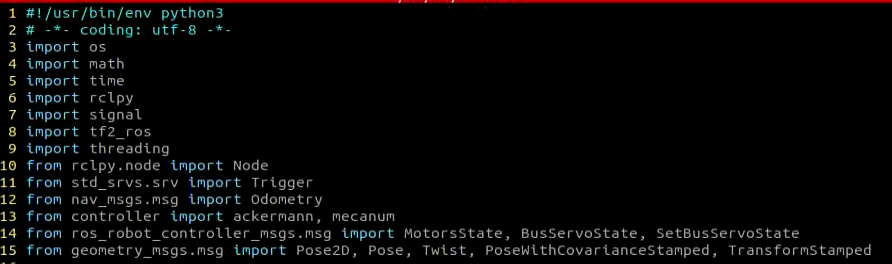

The message comprises acquired pose and velocity twist data.

After publishing data, you can activate the mobile app service either by using a command or restarting the robot. If the mobile app service is not activated, related app functions will be disabled. In the case of a robot restart, the mobile app service will start automatically. Use the command '**sudo systemctl restart start_app_node.service**' to restart the mobile app service, and wait for the buzzer to make sound, signaling the completion of the service startup.

```bash
sudo systemctl restart start_app_node.service
```

### 2.2.3 Robot Speed Control

Speed control is achieved by adjusting the linear velocity parameter.

* **Program Logic**

Utilizing the mobility features of the robot, we accomplish forward and backward motion, as well as turning, by manipulating the active wheel's forward and reverse rotation.

Within the program, the movement control node of the **hiwonder_controller** is subscribed to, allowing the retrieval of the configured linear and angular velocities. Following this, an analysis and calculation are executed based on these parameters to obtain the robot's movement speed.

The source code for this program can be found at:

**/home/hiwonder/ros_ws/src/hiwonder_driver/hiwonder_controller/scripts/odom_publisher.py**

```py
self.x = 0
        self.y = 0
        self.linear_x = 0
        self.linear_y = 0
        self.angular_z = 0
        self.pose_yaw = 0
        self.last_time = None
        self.current_time = None
        self.motor_pub = rospy.Publisher('ros_robot_controller/set_motor', MotorsState, queue_size=1)
        self.servo_state_pub = rospy.Publisher('ros_robot_controller/bus_servo/set_state', SetBusServoState, queue_size=10)
        self.ackermann = AckermannChassis(wheelbase=0.216, track_width=0.195, wheel_diameter=0.097)

        self.linear_factor = rospy.get_param('~linear_correction_factor', 1.00)
        self.angular_factor = rospy.get_param('~angular_correction_factor', 1.00)
```

<p id="anchor_2_2_3_2"></p>

* **Disable APP Service and Initiate Speed Control**

> [!NOTE]
>
> **When entering commands, it is essential to strictly distinguish between uppercase and lowercase letters, and keywords can be autocompleted using Tab key.**

1. Start the robot, and access the robot system desktop using NoMachine.

2. Double-click  to open the command line terminal.

3. Execute the command '**sudo systemctl stop start_app_node.service**', and hit Enter to disable app auto-start service.

```bash
sudo systemctl stop start_app_node.service
```

4. Run the command '**roslaunch hiwonder_controller hiwonder_controller.launch**' to launch the motion control service.

```bash
roslaunch hiwonder_controller hiwonder_controller.launch
```

5. Open a new terminal, and enter the command '**rostopic pub /hiwonder_controller/cmd_vel geometry_msgs/Twist "linear:**', then press '**TAB**' key to autocomplement the parameters.

```bash
rostopic pub /hiwonder_controller/cmd_vel geometry_msgs/Twist "linear:
```

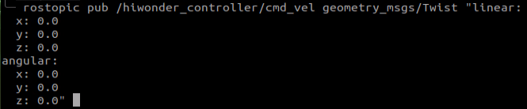

In this context, '**linear**' represents the set linear velocity, considering the robot's viewpoint where the X-axis points forward without any influence from the Y or Z directions.

On the other hand, '**angular**' pertains to the set angular velocity. A positive Z-value induces a left turn in the robot, while a negative Z-value causes the robot to turn right. This configuration has no impact on the X and Y directions.

> [!NOTE]
>
> * **In this scenario, the linear velocity (x) is measured in meters per second, and it is advisable to maintain it within the range of "-0.6 to 0.6".**
>
> * **The angular velocity (z) denotes the turning speed and is determined by the formulas V=ωR (linear velocity equals angular velocity times radius) and tanΦA=D/R (where z=ω, D=0.213, and ΦA represents the turning angle). The angle ΦA should be within the range of 0 to 36 degrees.**

6. Use the arrow keys to navigate and modify the relevant parameters. For example, to make the robot move forward, adjust the linear velocity (X) to 0.1, and then press Enter to execute the action.

   

   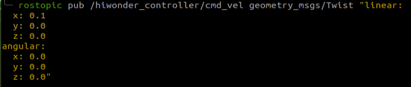

7. To bring the robot car to a stop, open a new terminal and set the linear velocity to '0.0'.

   

   

8. If you need to terminate this program, use short-cut '**Ctrl+C**'.


> [!NOTE]
>
> **To bring the robot car to a stop, please create a new terminal and adjust the linear velocity. Using the 'Ctrl+C' shortcut alone may not effectively halt the robot car.**

After calibration, you can activate the mobile app service either by using a command or restarting the robot. If the mobile app service is not activated, related app functions will be disabled. In the case of a robot restart, the mobile app service will start automatically. Use the command '**sudo systemctl restart start_app_node.service**' to restart the mobile app service, and wait for the buzzer to make sound, signaling the completion of the service startup.

```bash
sudo systemctl restart start_app_node.service
```

* **Change Forward Speed** 

By modifying the linear velocity value (X), the robot can achieve forward movement at variable speeds. For instance, to make the robot shift diagonally to the left front, during step 5 in '**[2.2.3 Robot Speed Control->Disable App Service and Initiate Speed Control](#anchor_2_2_3_2)**', set X to 'X: 0.3'.


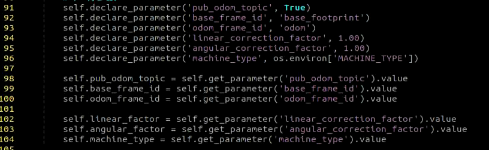

Upon pressing Enter, the robot will move forward at a speed of 0.3 meters per second in a straight direction.

* **Program Outcome**

After the game starts, the robot will go forward at the speed of 0.3m/s.

* **Program Analysis**

**1. launch File**

The launch file is saved in

**/home/hiwonder/ros_ws/src/hiwonder_driver/hiwonder_controller/launch/hiwonder_controller.launch**

**(1) Parameter Definition**

In a launch file, the **`<arg>`** tag serves as a parameter label, declaring a parameter. The subsequent **`<default>`** provides a specific definition for this parameter.

```xml
 <arg name="cmd_vel"           default="hiwonder_controller/cmd_vel"/>
```

**2. Initiate Node**

The `<node>` tag represents a node launched in the file, and the subsequent `<name>`, `<pkg>`, `<type>`,`<required>`, `<output>`, etc., are parameters within that node.

`<name>` is the name of the node.

`<pkg>` is the package in which the node is located.

`<type>` is the name of the file that the node executes; in this case, it runs the content of the '**odom_publisher.py**' file.

`<required>` determines whether the node is essential. If set to '**True**', the node will close along with other relevant nodes when deactivated.

`<output>` indicates the destination of the output; here, the output is directed to the screen.

```xml
<!--odom发布-->
    <node name="hiwonder_odom_publisher" pkg="hiwonder_controller" type="odom_publisher.py" required="true" output="screen">
        <rosparam file="$(find hiwonder_controller)/config/calibrate_params.yaml" command="load"/>
        <param name="freq"              value="$(arg freq)"/>
        <param name="odom_topic"        value="$(arg odom_raw_topic)"/>
        <param name="base_frame_id"     value="$(arg base_frame)"/>
        <param name="odom_frame_id"     value="$(arg odom_frame)"/>
        <param name="cmd_vel"           value="$(arg cmd_vel)"/>
    </node>
```

**2. Python Program**

The program is stored in:

**/home/hiwonder/ros_ws/src/hiwonder_driver/hiwonder_controller/scripts/odom_publisher.py**

- **Published Topic**

`board/set_motor`: Publishes the robot's motor status. Message type is MotorsState.

`board/bus_servo/set_state`: Publishes the state of the bus servos. Message type is SetBusServoState.

```py
 self.motor_pub = rospy.Publisher('ros_robot_controller/set_motor', MotorsState, queue_size=1)
        self.servo_state_pub = rospy.Publisher('ros_robot_controller/bus_servo/set_state', SetBusServoState, queue_size=10)
```

If `self.pub_odom_topic` is true, it will also publish:

```py
if self.pub_odom_topic:
            self.odom_broadcaster = tf2_ros.TransformBroadcaster()  # 定义TF变换广播者
            self.odom_trans = TransformStamped()
            self.odom_trans.header.frame_id = self.odom_frame_id
            self.odom_trans.child_frame_id = self.base_frame_id
```

`odom_raw` (or another name set through parameters): Publishes the robot's odometry data. Message type is Odometry.

```py
self.odom_pub = rospy.Publisher(self.odom_topic, Odometry, queue_size=10)
```

`set_pose`: Publishes pose information with covariance. Message type is PoseWithCovarianceStamped.

```py
self.pose_pub = rospy.Publisher('set_pose', PoseWithCovarianceStamped, queue_size=1)
```

- **Subscribe to Motion Control Node**

Subscribe to topic messages published by the '**hiwonder_controller**' node to retrieve pertinent movement data.

'**`set_odom`**': Listens for messages to set odometry. Message type is Pose2D. Upon receiving a message of this type, it activates the '`set_odom`' method.

'**`/hiwonder_controller/cmd_vel`**' (or an alternative name set through parameters): Listens for velocity commands. Message type is Twist. When a message of this type is received, it activates the '`cmd_vel_callback`' method.

'**`cmd_vel`**': Listens for velocity commands initiated by the application. Message type is Twist. Upon receiving a message of this type, it activates the '`app_cmd_vel_callback`' method.

```py
rospy.Subscriber('set_odom', Pose2D, self.set_odom)
rospy.Subscriber(self.cmd_vel, Twist, self.cmd_vel_callback)
rospy.Subscriber('cmd_vel', Twist, self.app_cmd_vel_callback)
```

- **Service**

This node additionally offers a ROS service:

'**`hiwonder_controller/load_calibrate_param`**': The service type is Trigger, allowing activation of the '`load_calibrate_param`' method.

```py
rospy.Service('hiwonder_controller/load_calibrate_param', Trigger, self.load_calibrate_param)
```

- **Load Parameter**

Load the speed parameter of the command.

```py
self.linear_factor = rospy.get_param('~linear_correction_factor', 1.00)
self.angular_factor = rospy.get_param('~angular_correction_factor', 1.00)
```

```py
def cmd_vel_callback(self, msg):
        self.linear_x = msg.linear.x
        self.linear_y = msg.linear.y
        if abs(msg.linear.y) > 1e-8:
            self.linear_x = 0
        else:
            self.linear_x = msg.linear.x
        self.linear_y = 0

        if msg.angular.z != 0:
            r = self.linear_x/msg.angular.z
            if r == 0:
                self.angular_z = 0
            else:
                self.angular_z = msg.angular.z
        else:
            self.angular_z = 0
        servo_state = BusServoState()
        servo_state.present_id = [1, 9]
        speeds = self.ackermann.set_velocity(self.linear_x, self.angular_z)
        self.motor_pub.publish(speeds[1])

        if speeds[0] is not None:
            servo_state.position = [1, speeds[0]]
            data = SetBusServoState()
            data.state = [servo_state]
            data.duration = 0.02
            self.servo_state_pub.publish(data)
```

To regulate forward and backward speed, only the '**X**' value is essential for the '**linear**' parameter. Considering the robot's perspective as the first-person view, the positive direction of '**X**' corresponds to forward movement. The unit is meters per second, and it is advisable to maintain the value within the range of "**-0.6 to 0.6**".

As for angular speed, solely the '**Z**' value is necessary for the '**angular**' parameter. A positive '**Z**' induces a left turn, while a negative '**Z**' prompts the robot to turn right. The unit is radians per second, and this value is calculated using the linear velocity-angular velocity formula and trigonometric functions.

- **Control Motor Rotation and Parameter Transmission**

By analyzing and calculating velocity, the necessary parameters for motor rotation are determined. The **`set_velocity`** function is then utilized to control motor rotation, enabling the robot's movement.

```py
speeds = self.ackermann.set_velocity(self.linear_x, self.angular_z)
```

The first parameter, '**linear_x**,' establishes the motor rotation speed in millimeters per second within the range of "**-0.6 to 0.6**." A negative value indicates reverse motor rotation.

The second parameter, '**angular_z**,' signifies the lateral offset rate of the robot, ranging from "**-1.0 to 1.0**." A positive value turns the robot left, while a negative value turns it right.

```py
self.motor_pub.publish(speeds[1])
```

Subsequently, the velocity values are transmitted to the ROS topic linked with '**`self.motor_pub`**.' The chassis drive control node can subscribe to this topic, utilizing the received linear and angular velocities to govern the robot's motion.

* **FAQ**

**Q:** Why pressing '**Ctrl+C**' in the terminal does not stop the robot and it continues moving forward?

**A:** In this case, please open a new terminal. Within the new terminal, input the command "**rostopic pub /hiwonder_controller/cmd_vel geometry_msgs/Twist "linear:**" and press the TAB key for autocomplete. Then, set the speed to 0 and press Enter to execute the command.