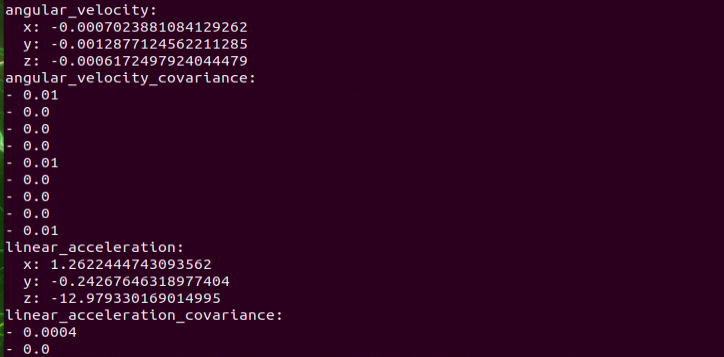
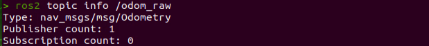
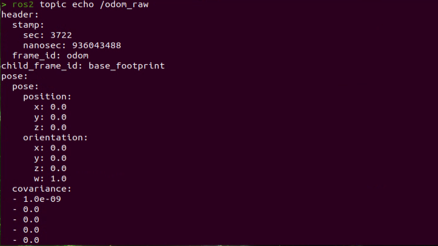
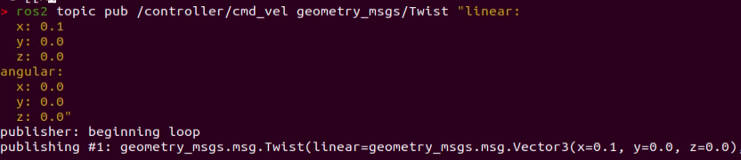
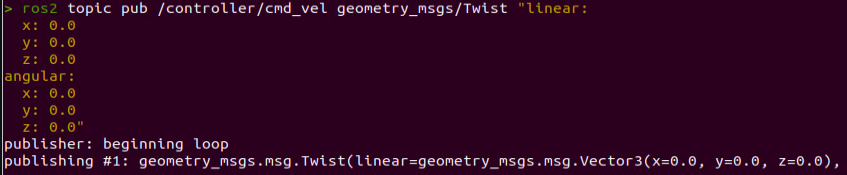

# 2. Motion Control Course

## 2.1 Kinematics Analysis

### 2.1.1 Hardware Structure

The driving mechanism consists of servos, links, and wheels. The servos are connected to the links, and these links, in turn, are connected to the wheels. By rotating the servos, the movement of the links is controlled, thereby determining the turning direction of the front wheels. 

During turning, if the two wheels are in a parallel state, meaning they rotate at the same angle. The control system for the rear wheels consists of a motor and the wheels. The robot's forward, backward, and speed movements are regulated by the motor's rotation.


### 2.1.2 Physical Characteristic

The design of Ackermann chassis aims at providing excellent steering performance and stability. To achieve this, it uses a principle known as "**Ackerman geometry**" to achieve this. Ackerman geometry refers to the difference in steering angle of the front and rear wheels. By offering the inner front wheel a larger steering angle, the Ackermann chassis makes the vehicle easier to control in corners and reduces skidding when turning.

Secondly, Ackermann chassis also features an well-designed suspension system design. The suspension system is a crucial part connecting the wheels and the vehicle body, significantly impacting the physical characteristics of the chassis. Ackerman chassis typically uses an independent suspension system, allowing each wheel to be controlled independently. This design provides better suspension performance, enhancing vehicle stability and driving comfort.

Additionally, the Ackerman chassis needs to consider the vehicle's center of gravity. The center of gravity has a crucial impact on the vehicle's stability and handling performance. Typically, the Ackerman chassis will have a lower center of gravity to reduce the risk of tilting and skidding.

Lastly, the physical characteristics of the Ackerman chassis also include the braking system and the power transmission system. The braking system controls the braking force applied to the wheels, affecting the vehicle's braking performance and stability. The power transmission system is responsible for transmitting the engine's power to the wheels, influencing the vehicle's acceleration and driving performance.

### 2.1.3 Kinematics Principles & Formulas

When performing kinematics analysis on the Ackermann chhassis, we can use the following mathematical formulas and parameters to describe its motion characteristics:

To ensure that the Ackerman vehicle achieves pure rolling motion (i.e., no lateral slipping when the vehicle is turning), it is necessary to ensure that the normal lines of the four wheels' motion directions (perpendicular to the tire rolling direction) intersect at one point, which is the steering center.

To simplify the model, assume there is only one front wheel (the theoretical implementation remains consistent), located in the middle of the front axle as shown by the dashed part of the front wheel in the diagram:


**(1) Front Wheel Steering Angle (θ)**: The steering angle of the front wheel, representing the deflection angle of the front wheel relative to the vehicle's forward direction, usually represented by the unit of rad.

**(2) Vehicle Linear Velocity (V):** The linear velocity of the vehicle, representing the translational speed of the vehicle as a whole, usually measured in meters per second (m/s). The left rear wheel velocity is denoted as (V<sub>L</sub>), and the right rear wheel velocity as (V<sub>R</sub>).

**(3) Vehicle Track Width (D)**: The distance between the wheels on the left and right sides of the vehicle, usually measured in meters (m).

**(4) Vehicle Wheelbase (H)**: The distance between the front and rear wheels of the vehicle, usually measured in meters (m).

**(5) Vehicle Turning Radius (R):** The radius of the circle described by the vehicle when turning, usually measured in meters (m). The turning radius of the left wheel is denoted as (R<sub>L</sub>), and the turning radius of the right wheel as (R<sub>R</sub>).

* **Calculation process for robot speed and angle:**

(1) Consistency of Angular Velocity:


Where:

① ω is the angular velocity of the vehicle,

② R represents the turning radius of the vehicle,

③ V is the linear velocity of the vehicle,

④ V<sub>L</sub> is the linear velocity of the left rear wheel,

⑤ V<sub>R</sub> is the linear velocity of the right rear wheel,

⑥ R<sub>L</sub> is the turning radius of the left wheel,

⑦ R<sub>r</sub> is the turning radius of the right wheel.

(2) Relation between front wheel steering angle and vehicle turning radius：


Where:

① H is the distance between the front and rear wheels of the vehicle,

② R is the turning radius of the vehicle,

③ D is the distance between the wheels on the left and right sides of the vehicle,

④ Θ is the steering angle of the front wheel.

(3) Velocity of the Left Rear Wheel:


(4) Velocity of the Right Rear Wheel:


Knowing the track width and wheelbase of the robot, as well as the robot's speed and servo angle, the speeds of the two rear wheels can be determined.

* **Program Outcome**

The program files are located in: [ros2_ws/src/driver/controller/controller/ackermann.py](../_static/source_code/driver.zip)


(1) AckermannChassis Class

{lineno-start=7}

```python
class AckermannChassis:
    # wheelbase = 0.213  # Distance between front and rear axles(前后轴距)
    # track_width = 0.222  # Distance between left and right axles(左右轴距)
    # wheel_diameter = 0.101  # Wheel diameter(轮子直径)

    def __init__(self, wheelbase=0.213, track_width=0.222, wheel_diameter=0.101):
        self.wheelbase = wheelbase
        self.track_width = track_width
        self.wheel_diameter = wheel_diameter
```

Ackermann wheel kinematics module, used to calculate wheel speeds and implement Ackermann wheel kinematics.

{lineno-start=7}

```python
    def __init__(self, wheelbase=0.213, track_width=0.222, wheel_diameter=0.101):
        self.wheelbase = wheelbase
        self.track_width = track_width
        self.wheel_diameter = wheel_diameter
```

Init：Initialize the wheel dimensions for easier subsequent calculations

{lineno-start=16}

```python
    def speed_covert(self, speed):
        """
        covert speed m/s to rps/s
        :param speed:
        :return:
        """
        return speed / (math.pi * self.wheel_diameter)
```

speed\_covert:Convert m/s to rps based on the wheel parameters.

{lineno-start=25}

```python
    def set_velocity(self, linear_speed, angular_speed, reset_servo=True):
        servo_angle = 500
        data = []
        if abs(linear_speed) >= 1e-8:
            if abs(angular_speed) >= 1e-8:
                theta = math.atan(self.wheelbase*angular_speed/linear_speed)
                steering_angle = theta
                # print(math.degrees(steering_angle))
                if abs(steering_angle) > math.radians(37):
                    steering_angle = math.radians(37)
                    # for i in range(4):
                        # msg = MotorState()
                        # msg.id = i + 1
                        # msg.rps = 0.0
                        # data.append(msg)
                    # msg = MotorsState()
                    # msg.data = data
                    # return None, msg
                servo_angle = 500 + 1000*math.degrees(steering_angle)/240

            vr = linear_speed + angular_speed*self.track_width/2
            vl = linear_speed - angular_speed*self.track_width/2
            v_s = [self.speed_covert(v) for v in [0, vl, 0, -vr]]
            for i in range(len(v_s)):
                msg = MotorState()
                msg.id = i + 1
                msg.rps = float(v_s[i])
                data.append(msg)
            msg = MotorsState()
            msg.data = data
            return servo_angle, msg
        else:
            for i in range(4):
                msg = MotorState()
                msg.id = i + 1
                msg.rps = 0.0
                data.append(msg)
            msg = MotorsState()
            msg.data = data
            return None, msg
```

set\_velocity: Based on the input speed parameters, decompose them, calculate the speeds using speed\_convert, and then publish the calculated radian speeds to the motors. Calculate the required steering angle from the linear and angular velocities, convert it, and send it to the servos.

## 2.2 Motion Control

### 2.2.1 IMU Calibration

:::{Note}

* Before the robot leaves the factory, relevant parameters are already set, so under normal circumstances, there is no need to perform calibration. Therefore, this section is only for understanding purposes. If you notice a significant deviation during movement, such as veering to one side noticeably during forward motion, preventing it from travelling straight, you can refer to the following tutorial for calibration. 

* Calibration is only meant to reduce the deviation between the actual parameters of the hardware device and the ideal state parameters. There will always be some deviation in the actual hardware, so during calibration, you only need to adjust it to be relatively accurate according to your own requirements.

:::

If the robot exhibits deviations during operation, it may require calibration for IMU and linear velocity. Once the calibration process is completed, the robot can resume normal.


The diagram above shows the positive directions of XYZ three axes of IMU module. In the subsequent calibration process, you can refer to the above coordinate relationships for calibration. 

Upon receiving the first IMU message, the node will prompt you to keep the IMU in a specific direction. Then, press Enter to record the measurement value. Once you have completed the adjustment of parameters in all six directions, the node will save the calibration computation parameters into the designated YAML file. Please follow the detailed instructions provided below for further guidance.

:::{Note}

The input command should be case sensitive, and keywords can be complemented using Tab key.

:::

(1) Start the robot, and access the robot system desktop using NoMachine.  

(2) Click-on to open the command-line terminal.

(3) Execute the command to disable the app auto-start service.

```
sudo systemctl stop start_app_node.service
```

(4) Run the command and hit Enter key to enable chassis control node.

```
ros2 launch ros_robot_controller ros_robot_controller.launch.py
```

(5) Open a new command-line terminal, then input the following command, and hit Enter key to initiate IMU calibration.

```
ros2 run imu_calib do_calib --ros-args -r imu:=/ros_robot_controller/imu_raw --param
output_file:=/home/ubuntu/ros2_ws/src/calibration/config/imu_calib.yaml
```

(6) When the command line terminal displays the following prompt, it indicates that you can begin calibrating the angular velocity bias of the IMU's x-axis. Similarly, flip the robot to the orientation shown in the diagram below (ensure the direction and angle of the flip match the diagram exactly), and press the Enter key to execute.


(7) After each direction calibration is successful, the following prompt will appear:


(8) The command line terminal will display the following prompt, indicating that you can begin calibrating the angular velocity bias of the IMU's negative x-axis direction. Similarly, flip the robot to the orientation shown in the diagram below (ensure the direction and angle of the flip match the diagram exactly), and press the Enter key to execute.


(9) When the following prompt appears, indicating that you can begin calibrating the angular velocity bias for the positive position of IMU's Y-axis. Similarly, place the robot in a side-tilt position as shown in the figure below (ensure the direction and angle of the tilt match the diagram), then press the Enter key to execute.


(10) The command line terminal will display the following prompt, indicating that you can begin calibrating the angular velocity bias of the IMU's negative y-axis direction. Similarly, position the robot in the orientation shown in the diagram below (ensure the robot's orientation and angle match the diagram exactly facing downwards), and press the Enter key to execute.


(11) The command line terminal will display the following prompt, indicating that you can begin calibrating the angular velocity bias of the IMU's positive z-axis direction. Lift the robot upwards, secure it in place, and press Enter. Similarly, position the robot in the orientation shown in the diagram below (ensure the robot's orientation and angle match the diagram exactly), and press the Enter key to execute.


(12) The command line terminal will display the following prompt, indicating that you can begin calibrating the angular velocity bias of the IMU's negative z-axis direction. Similarly, position the robot in the orientation shown in the diagram below (ensure the robot's orientation and angle match the diagram exactly), and press the Enter key to execute.


(12) If the below prompt shows up, it means the calibration is complete. To exit, use short-cut **Ctrl+C**.


(13) After calibration, execute the command to verify the calibrated model.

```
ros2 launch peripherals imu_view.launch.py
```

You can rotate the physical object to check if its angle matches the model.


### 2.2.2 Publish IMU and Odometer Data

In robot navigation, calculating real-time position is crucial.

Typically, we use encoder data from motors and apply the robot's kinematic model to compute odometry information. However, in special scenarios such as when robot wheels slip or when the robot is lifted and moved without wheel rotation, accurate odometry becomes challenging.

Therefore, by fusing IMU data with odometry, we can obtain more precise odometry information, which enhances mapping and navigation accuracy, particularly in scenarios involving wheel slippage or accumulated errors.

* **Publish IMU and Odometer Data**

The IMU (Inertial Measurement Unit) is a device that measures the three-axis attitude angles (angular velocity) and acceleration of an object. It consists of the gyroscope and accelerometer as its main components, providing a total of 6 degrees of freedom to measure the object's angular velocity and acceleration in three-dimensional space.

An odometer is a method used to estimate changes in an object's position over time using data obtained from motion sensors. This method is widely applied in robotic systems to estimate the distance traveled by the robot relative to its initial position.

There are common methods for odometer positioning, including the wheel odometer, visual odometer, and visual-inertial odometer. In robotics, we specifically use the wheel odometer. 

To illustrate the principle of the wheel odometer, consider a carriage where you want to determine the distance from point A to point B. 

By knowing the circumference of the carriage wheels and installing a device to count wheel revolutions, you can calculate the distance based on wheel circumference, time taken, and the number of wheel revolutions.

While the wheel odometer provides basic pose estimation for wheeled robots, it has a significant drawback: accumulated error. In addition to inherent hardware errors, environmental factors such as slippery tires due to weather conditions contribute to increasing odometer errors with the robot's movement distance.

Therefore, both IMU and odometer are essential components in a robot. These two components are utilized to measure the three-axis attitude angles (or angular velocity) and acceleration of the object, as well as to estimate the distance, pose, velocity, and direction of the robot relative to its initial position.

To address these errors, we combine IMU data with odometer data to obtain more accurate information. IMU data is published through the "**/imu**" topic, and odometer data is published through "**/odom**". After obtaining data from both sources, the data is fused using the "**ekf**" package in ROS, and the fused localization information is then republished.

* **IMU Data Publishing**

(1) Initiate Service

:::{Note}

When entering commands, it is essential to strictly distinguish between uppercase and lowercase letters, and keywords can be autocompleted using Tab key.

:::

① Start the robot, and access the robot system desktop using NoMachine.  

② Click-on to open the command-line terminal.

③ Execute the command, and hit Enter Key to disable the app auto-start service.

```
sudo systemctl stop start_app_node.service
```

④ Enter the command and press Enter Key to start the control node of the chassis:

```
ros2 launch ros_robot_controller ros_robot_controller.launch.py
```

⑤ Create a new command line terminal, enter the command, and press Enter key to start IMU data publishing:

```
ros2 launch peripherals imu_filter.launch.py
```

(2) Data Viewing

① Open a command line terminal, and execute the command to check the current topic.

```
ros2 topic list
```


② Enter the command to view the type, publisher, and subscribers of the "**/imu**" topic. You can replace"**/imu**" with the topic you want to view. The type of this topic is "**sensor_msgs/msg/Imu**". 

```
ros2 topic info /imu
```


③ Enter the command to print the topic message content. You can replace it with the topic you wish to view.

```
ros2 topic echo /imu
```



The content displays the data from the three axes of the IMU.

* **Odometer Data Publishing**

(1) Initiate Service

:::{Note}

When entering commands, it is essential to strictly distinguish between uppercase and lowercase letters, and keywords can be autocompleted using Tab key.

:::

① Start the robot, and access the robot system desktop using NoMachine.  

② Click-on to open the command-line terminal.

③ Execute the command, and hit Enter to disable the app auto-start service.

```
sudo systemctl stop start_app_node.service
```

④ Run the command to publish the odometer data.

```
ros2 launch controller odom_publisher.launch.py
```

* **Data Viewing**

(1) Open a new command-line terminal, and run the command below to check the current topic.

```
ros2 topic list
```


(2) Enter the command to view the type, publisher, and subscribers of the "**/odom_raw**" topic. You can replace "**/odom_raw**" with the topic you want to view. The type of this topic is "**nav_msgs/msg/Odometry**".

```
ros2 topic info /odom_raw
```



(3) Enter the command to print the topic message contents. You can replace the topic you want to view as needed.

```
ros2 topic echo /odom_raw
```



The content of this message is the acquired posture and speed twist data.

### 2.2.3 Robot Speed Control

Speed control is achieved by adjusting the linear velocity parameter.

* **Program Logic**

Based on the robot's movement characteristics, control the active wheels to achieve forward, backward, and turning movements.

In the program, subscribe to the **/controller/cmd_vel** movement control topic to obtain the set linear and angular velocities. Then, analyze and calculate based on these velocities to determine the car's movement speed.

The source code for this program can be found at:[/home/ubuntu/ros2_ws/src/driver/controller/controller/odom_publisher_node.py](../_static/source_code/driver.zip)

<p id="anchor_2_2_3_2"></p>

* **Disable APP Service and Initiate Speed Control**

:::{Note}

When entering commands, it is essential to strictly distinguish between uppercase and lowercase letters, and keywords can be autocompleted using Tab key.

:::

(1) Start the robot, and access the robot system desktop using NoMachine.  

(2) Click-on  to open the command-line terminal.

(3) Execute the command, and hit Enter to disable the app auto-start service.

```
sudo systemctl stop start_app_node.service
```

(4) Enter the command to enable motion control service.

```
ros2 launch controller controller.launch.py
```

(5) Open a new command-line terminal, then enter the following command to enable the speed control.

```bash
ros2 topic pub /controller/cmd_vel geometry_msgs/Twist "linear:
  x: 0.0
  y: 0.0
  z: 0.0
angular:
  x: 0.0
  y: 0.0
  z: 0.0"
```

In this context, **"linear"** represents the set linear velocity, considering the robot's viewpoint where the X-axis points forward without any influence from the Y or Z directions.

On the other hand, **"angular"** pertains to the set angular velocity. A positive Z-value induces a left turn in the robot, while a negative Z-value causes the robot to turn right. This configuration has no impact on the X and Y directions.

:::{Note}

* In this scenario, the linear velocity (x) is measured in meters per second, and it is advisable to maintain it within the range of "**-0.6 to 0.6**".

* The angular velocity (z) denotes the turning speed and is determined by the formulas V=ωR (linear velocity equals angular velocity times radius) and tanΦA=D/R (where z=ω, D=0.213, and ΦA represents the turning angle). The angle ΦA should be within the range of 0 to 36 degrees.

:::

Use the arrow keys to navigate and modify the relevant parameters. For example, to make the robot move forward, adjust the linear velocity (X) to 0.1, and then press Enter to execute the action.



(6) To stop the robot car, open a new terminal and set the previously modified linear velocity back to "**0.0**". Then press Enter to execute.



(7) If you need to terminate this program, use short-cut **Ctrl+C**.

:::{Note}

To bring the robot car to a stop, please create a new terminal and adjust the linear velocity. Using the **Ctrl+C** shortcut alone may not effectively halt the robot car.

:::

* **Change Forward Speed**

By modifying the linear velocity value (X), the robot can achieve forward movement at variable speeds. For instance, to make the robot shift diagonally to the left front, during step 5 in [Robot Speed Control-\> Disable App Service and Initiate Speed Control](#anchor_2_2_3_2) , set X to 'X: 0.3'.


Upon pressing Enter, the robot will move forward at a speed of 0.3 meters per second in a straight direction.

* **Program Outcome**

After the game starts, the robot will move forward at the set speed of 0.5m/s.

* **Program Analysis**


The **controller.launch** is the launch file, **calibrate\_params.yaml** is the configuration file, and **odom\_publisher.py** is the program file.  
When starting up, the launch file is executed first. The launch file will load the YAML configuration file and pass the parameters into the ROS node. The node will then read the configuration parameters from the ROS node for initialization and communicate with other nodes to collaboratively implement the functionality.

(1) Launch File


The launch file is located in: [/home/ubuntu/ros2_ws/src/driver/controller/launch/controller.launch.py](../_static/source_code/driver.zip)

{lineno-start=1} 

```
import os
from ament_index_python.packages import get_package_share_directory

from launch_ros.actions import Node
from launch.conditions import IfCondition
from nav2_common.launch import ReplaceString
from launch import LaunchDescription, LaunchService
from launch.substitutions import LaunchConfiguration
from launch.launch_description_sources import PythonLaunchDescriptionSource
from launch.actions import DeclareLaunchArgument, IncludeLaunchDescription, GroupAction, TimerAction, OpaqueFunction

def launch_setup(context):
    compiled = os.environ['need_compile']
    namespace = LaunchConfiguration('namespace', default='')
    use_namespace = LaunchConfiguration('use_namespace', default='false').perform(context)
    use_sim_time = LaunchConfiguration('use_sim_time', default='false')
    enable_odom = LaunchConfiguration('enable_odom', default='true')
    map_frame = LaunchConfiguration('map_frame', default='map')
    odom_frame = LaunchConfiguration('odom_frame', default='odom')
    base_frame = LaunchConfiguration('base_frame', default='base_footprint')
    imu_frame = LaunchConfiguration('imu_frame', default='imu_link')
    frame_prefix = LaunchConfiguration('frame_prefix', default='')

    namespace_arg = DeclareLaunchArgument('namespace', default_value=namespace)
    use_namespace_arg = DeclareLaunchArgument('use_namespace', default_value=use_namespace)
    use_sim_time_arg = DeclareLaunchArgument('use_sim_time', default_value=use_sim_time)
    enable_odom_arg = DeclareLaunchArgument('enable_odom', default_value=enable_odom)
    map_frame_arg = DeclareLaunchArgument('map_frame', default_value=map_frame)
    odom_frame_arg = DeclareLaunchArgument('odom_frame', default_value=odom_frame)
    base_frame_arg = DeclareLaunchArgument('base_frame', default_value=base_frame)
    imu_frame_arg = DeclareLaunchArgument('imu_frame', default_value=imu_frame)
    frame_prefix_arg = DeclareLaunchArgument('frame_prefix', default_value=frame_prefix)
```

① Set the storage path

Retrieve the paths for the three packages: peripherals, controller, and servo\_controller.

{lineno-start=34}

```
    if compiled == 'True':
        peripherals_package_path = get_package_share_directory('peripherals')
        controller_package_path = get_package_share_directory('controller')
        servo_controller_package_path = get_package_share_directory('servo_controller')
    else:
        peripherals_package_path = '/home/ubuntu/ros2_ws/src/peripherals'
        controller_package_path = '/home/ubuntu/ros2_ws/src/driver/controller'
        servo_controller_package_path = '/home/ubuntu/ros2_ws/src/driver/servo_controller'

```

② Initiate other Launch files

{lineno-start=43}

```
    odom_publisher_launch = IncludeLaunchDescription(
        PythonLaunchDescriptionSource([os.path.join(controller_package_path, 'launch/odom_publisher.launch.py')
        ]),
        launch_arguments={
            'namespace': namespace,
            'use_namespace': use_namespace,
            'imu_frame': imu_frame,
            'frame_prefix': frame_prefix,
            'base_frame': base_frame,
            'odom_frame': odom_frame
        }.items()
    )
```

odom\_publisher\_launch Odometer launch

imu\_filter\_launch IMU launch

③ Initiate Node

Launch the EKF fusion node.

{lineno-start=66}

```
    ekf_filter_node = Node(
        package='robot_localization',
        executable='ekf_node',
        name='ekf_filter_node',
        output='screen',
        parameters=[ekf_param, {'use_sim_time': use_sim_time}],
        remappings=[
            ('/tf', 'tf'),
            ('/tf_static', 'tf_static'),
            ('odometry/filtered', 'odom'),
            ('cmd_vel', 'controller/cmd_vel')
        ],
        condition=IfCondition(enable_odom),
    )

    servo_controller_launch = IncludeLaunchDescription(
        PythonLaunchDescriptionSource([os.path.join(servo_controller_package_path, 'launch/servo_controller.launch.py')
        ]),
        launch_arguments={
            'base_frame': base_frame,
        }.items()
    )

```


The Python program is saved in:[/home/ubuntu/ros2_ws/src/driver/controller/controller/odom_publisher_node.py](../_static/source_code/driver.zip)

④ Import Library

{lineno-start=1}

```
#!/usr/bin/env python3
# -*- coding: utf-8 -*-
import os
import math
import time
import rclpy
import signal
import threading
from rclpy.node import Node
from controller import ackermann
from std_srvs.srv import Trigger
from nav_msgs.msg import Odometry
from ros_robot_controller_msgs.msg import MotorsState, BusServoState, SetBusServoState 
from geometry_msgs.msg import Pose2D, Pose, Twist, PoseWithCovarianceStamped, TransformStamped
```

⑤ Main Function

{lineno-start=278}

```
def main():
    node = Controller('odom_publisher')
    rclpy.spin(node)  # 循环等待ROS2退出(Loop waiting for ROS2 to exit)
```

The controller class is invoked here, and wait for the node to exit.

⑥ Global Parameter

{lineno-start=16}

```
ODOM_POSE_COVARIANCE = list(map(float, 
                        [1e-3, 0, 0, 0, 0, 0, 
                        0, 1e-3, 0, 0, 0, 0,
                        0, 0, 1e6, 0, 0, 0,
                        0, 0, 0, 1e6, 0, 0,
                        0, 0, 0, 0, 1e6, 0,
                        0, 0, 0, 0, 0, 1e3]))

ODOM_POSE_COVARIANCE_STOP = list(map(float, 
                            [1e-9, 0, 0, 0, 0, 0, 
                             0, 1e-3, 1e-9, 0, 0, 0,
                             0, 0, 1e6, 0, 0, 0,
                             0, 0, 0, 1e6, 0, 0,
                             0, 0, 0, 0, 1e6, 0,
                             0, 0, 0, 0, 0, 1e-9]))

ODOM_TWIST_COVARIANCE = list(map(float, 
                        [1e-3, 0, 0, 0, 0, 0, 
                         0, 1e-3, 0, 0, 0, 0,
                         0, 0, 1e6, 0, 0, 0,
                         0, 0, 0, 1e6, 0, 0,
                         0, 0, 0, 0, 1e6, 0,
                         0, 0, 0, 0, 0, 1e3]))

ODOM_TWIST_COVARIANCE_STOP = list(map(float, 
                            [1e-9, 0, 0, 0, 0, 0, 
                              0, 1e-3, 1e-9, 0, 0, 0,
                              0, 0, 1e6, 0, 0, 0,
                              0, 0, 0, 1e6, 0, 0,
                              0, 0, 0, 0, 1e6, 0,
                              0, 0, 0, 0, 0, 1e-9]))
```


⑦ Function

{lineno-start=48}

```
def rpy2qua(roll, pitch, yaw):
    cy = math.cos(yaw*0.5)
    sy = math.sin(yaw*0.5)
    cp = math.cos(pitch*0.5)
    sp = math.sin(pitch*0.5)
    cr = math.cos(roll * 0.5)
    sr = math.sin(roll * 0.5)
    
    q = Pose()
    q.orientation.w = cy * cp * cr + sy * sp * sr
    q.orientation.x = cy * cp * sr - sy * sp * cr
    q.orientation.y = sy * cp * sr + cy * sp * cr
    q.orientation.z = sy * cp * cr - cy * sp * sr
    return q.orientation

def qua2rpy(x, y, z, w):
    roll = math.atan2(2 * (w * x + y * z), 1 - 2 * (x * x + y * y))
    pitch = math.asin(2 * (w * y - x * z))
    yaw = math.atan2(2 * (w * z + x * y), 1 - 2 * (z * z + y * y))
  
    return roll, pitch, yaw
```

The function `rpy2qua` is used to convert Euler angles to quaternions.

The function `qua2rpy` is used to convert quaternions to Euler angles.

⑧ Analysis of the Controller Class

Invoke kinematics

{lineno-start=86}

```
        self.ackermann = ackermann.AckermannChassis(wheelbase=0.216, track_width=0.195, wheel_diameter=0.097)
```

The `self.ackermann` calls the Ackermann kinematics and initializes the Ackermann kinematics object.

**Define ROS parameters:**

{lineno-start=89}

```
self.declare_parameter('pub_odom_topic', True)
        self.declare_parameter('base_frame_id', 'base_footprint')
        self.declare_parameter('odom_frame_id', 'odom')
        self.declare_parameter('linear_correction_factor', 1.00)
        self.declare_parameter('angular_correction_factor', 1.00)
        self.declare_parameter('machine_type', os.environ['MACHINE_TYPE'])
        
        self.pub_odom_topic = self.get_parameter('pub_odom_topic').value
        self.base_frame_id = self.get_parameter('base_frame_id').value
        self.odom_frame_id = self.get_parameter('odom_frame_id').value
        
        self.linear_factor = self.get_parameter('linear_correction_factor').value
        self.angular_factor = self.get_parameter('angular_correction_factor').value
```

The function `self.declare_parameter` is used to define a certain parameter.

The function `self.get_parameter` is used to obtain a certain parameter.

`pub_odom_topic`: Whether to publish the odometry node

`base_frame_id`: Robot footprint ID

`odom_frame_id`: Robot odometry ID

`linear_correction_factor`: Linear velocity correction factor

`angular_correction_factor`: Angular velocity correction factor

`machine_type`: Type of robot

**Publish odometer:**

{lineno-start=104}

```
        if self.pub_odom_topic:
            # self.odom_broadcaster = tf2_ros.TransformBroadcaster(self)  # 定义TF变换广播者
            # self.odom_trans = TransformStamped()
            # self.odom_trans.header.frame_id = self.odom_frame_id
            # self.odom_trans.child_frame_id = self.base_frame_id
            
            self.odom = Odometry()
            self.odom.header.frame_id = self.odom_frame_id
            self.odom.child_frame_id = self.base_frame_id
            
            self.odom.pose.covariance = ODOM_POSE_COVARIANCE
            self.odom.twist.covariance = ODOM_TWIST_COVARIANCE
            
            self.odom_pub = self.create_publisher(Odometry, 'odom_raw', 1)
            self.dt = 1.0/50.0

            threading.Thread(target=self.cal_odom_fun, daemon=True).start()
```

Based on the parameter **pub_odom_topic**, determine whether to publish the odometry node. If publishing is required, initialize the node, fill in the corresponding parameters, and publish the odometry using the **self.create_publisher** function. Update the odometry data using the **self.cal_odom_fun** function.

**Topic Publishing:**	

{lineno-start=104}

```
        self.motor_pub = self.create_publisher(MotorsState, 'ros_robot_controller/set_motor', 1)
        self.servo_state_pub = self.create_publisher(SetBusServoState, 'ros_robot_controller/bus_servo/set_state', 1)
        self.pose_pub = self.create_publisher(PoseWithCovarianceStamped, 'set_pose', 1)
        self.create_subscription(Pose2D, 'set_odom', self.set_odom, 1)
        self.create_subscription(Twist, '/controller/cmd_vel', self.cmd_vel_callback, 1)
        self.create_subscription(Twist, '/app/cmd_vel', self.acker_cmd_vel_callback, 1)
        self.create_subscription(Twist, '/cmd_vel', self.app_cmd_vel_callback, 1)
        self.create_service(Trigger, 'controller/load_calibrate_param', self.load_calibrate_param)

        self.create_service(Trigger, '~/init_finish', self.get_node_state)
```

The function `self.create_subscription` is used to receive topics.

The function `self.create_service` is used to create services.

self.motor\_pub publishes the motor control topic `ros_robot_controller/set_motor`, with the message type MotorsState.

self.servo\_state\_pub publishes the servo control topic `ros_robot_controller/bus_servo/set_state`, with the message type SetBusServoState.

self.pose\_pub publishes the servo control topic `set_pose`, with the message type PoseWithCovarianceStamped.

Publishes the topic `set_odom`, with the message type Pose2D, and the callback function self.set\_odom.

Publishes the topic `controller/cmd_vel`, with the message type Twist, and the callback function self.cmd\_vel\_callback.

Publishes the topic `cmd_vel`, with the message type Twist, and the callback function self.set\_app\_cmd\_vel\_callback.

Publishes the service `controller/load_calibrate_param`, with the service type Trigger, and the callback function self.load\_calibrate\_param.

Publishes the service `~/init_finish`, with the service type Trigger, and the callback function self.get\_node\_state.

**Explanation of Controller Class Functions:**

ROS Node Functions Description

<table class="docutils-nobg" border="1">
    <thead>
        <tr>
            <th>Function Name</th>
            <th>Description</th>
        </tr>
    </thead>
    <tbody>
        <tr>
            <td>get_node_state</td>
            <td>Used to get the current state of the node, serves as a callback function.</td>
        </tr>
        <tr>
            <td>shutdown</td>
            <td>Used to shutdown the ROS node, serves as a callback function.</td>
        </tr>
        <tr>
            <td>load_callbrate_param</td>
            <td>Used to read current motion parameters, serves as a callback function.</td>
        </tr>
        <tr>
            <td>set_odom</td>
            <td>Used to set up the odometry, serves as a callback function.</td>
        </tr>
        <tr>
            <td>app_cmd_vel_callback</td>
            <td>Used to set APP velocity, serves as a callback function.</td>
        </tr>
        <tr>
            <td>cmd_vel_callback</td>
            <td>Used to set velocity, serves as a callback function.</td>
        </tr>
        <tr>
            <td>cal_odom_fun</td>
            <td>Used to publish odometry data</td>
        </tr>
    </tbody>
</table>