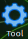
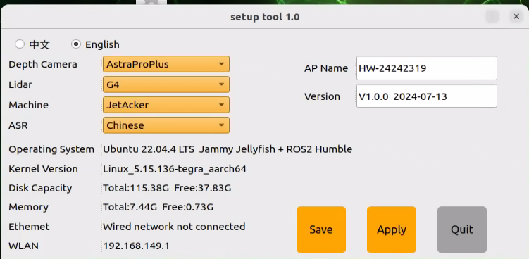
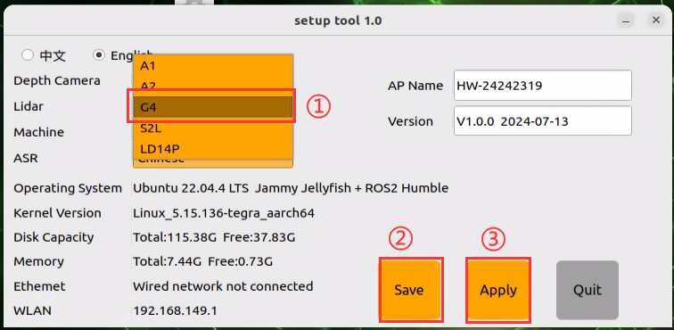
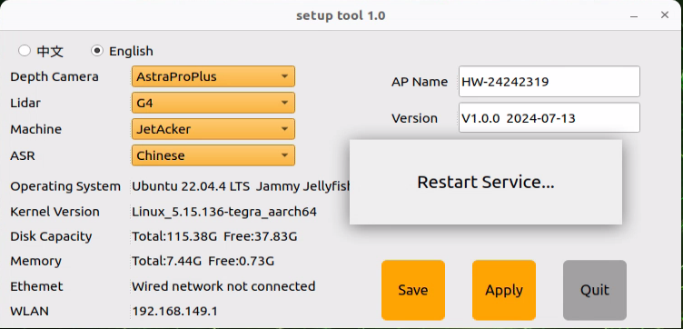
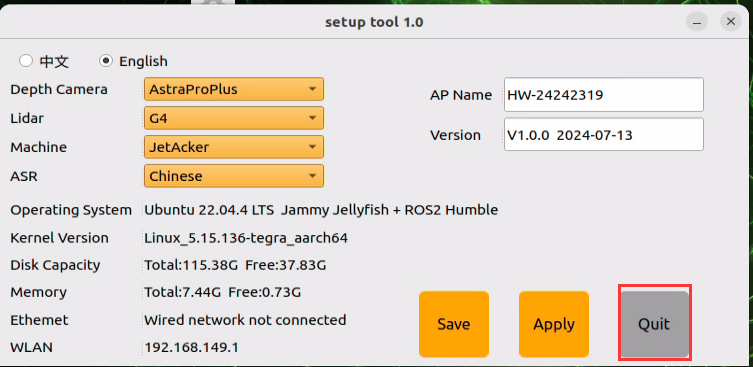
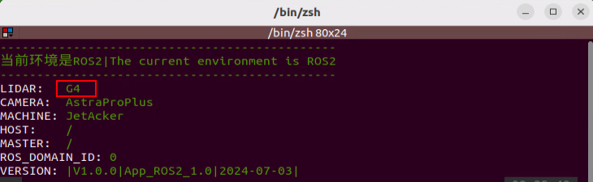

# 3. Lidar Course

## 3.1 Introduction to Lidar 

### 3.1.1 Preface

Lidar, a high-precision and high-speed remote sensing technology, is pivotal in numerous domains, including map creation, autonomous driving, environmental perception, and robot navigation. This document provides an overview of Lidar's principles, components, working mechanisms, application areas, advantages, and development trends.

In autonomous driving and intelligent transportation, Lidar assumes a critical role by offering real-time perception of obstacles, pedestrians, and vehicles on the road, providing precise distance and location information. In robot navigation and environmental perception, Lidar contributes by furnishing accurate maps and information about the surrounding environment. Furthermore, Lidar finds extensive applications in areas such as 3D modeling, map creation, safety monitoring, and remote sensing mapping.


### 3.1.2 Lidar Composition and Classification

Lidar is composed of essential components such as a laser emitter, receiver, photodetector, scanning mechanism, and angle resolver. The laser emitter produces laser beams, while the receiver and photodetector capture reflected light signals. The scanning mechanism is responsible for surveying the surrounding environment, and the angle resolver assists in determining the position of target objects.

Lidar can be categorized into various types based on the scanning method:

**Rotating Lidar**: Achieves omnidirectional scanning horizontally by rotating the emitter or scanning mechanism. Known for high scanning speed and measurement accuracy, it is widely applied in areas such as autonomous driving, 3D environmental modeling, and map creation.

**Solid-State Lidar**: Utilizes solid-state laser emitters, eliminating the need for rotating components. Compact, lightweight, and energy-efficient, solid-state lidar is suitable for applications like mobile devices, drones, and robots.

**Mechanical Lidar**: Employs mechanical components like rotating mirrors or prisms for laser beam scanning. Although offering longer measurement distances and higher accuracy, mechanical lidar tends to have slower scanning speeds. It is commonly used in terrain measurement, building scanning, and navigation.

**Phase-Modulated Lidar**: Measures the distance between target objects and the lidar by altering the phase of the laser beam. Known for high measurement accuracy and a large measurement range, phase-modulated lidar is extensively used in map creation, surveying, and industrial applications.

**Flash Lidar**: Utilizes brief, high-power laser pulses to illuminate the entire scene simultaneously. It captures reflected light signals through an array of receivers, making it suitable for high-speed and high-resolution applications, including rapid scene capture and motion tracking.

### 3.1.3 Switch Lidar Version

The robot provides two Lidar options, and the default Lidar version in the system image is G4 Lidar. Therefore, please confirm the Lidar version upon you receiving the robot kit.

Left:                                               Right: 

<div class="common_img" style="display:flex;text-align:center;">
    <div>
    
    
    </div>
    <div>
    <span>A1 Lidar </span>
    <span>G4 Lidar </span>
    </div>
</div>


(1) Start the robot, and connect it to NoMachine according to the instructions provided in [Establish Development Environment]().

(2) After successful connection, double-click .



(3) Click the drop-down menu on the Lidar tab, and select the Lidar model that matchs your robot, such as selecting "**G4**," then click "**Save**" and "**Apply**."



(5) After you reselect the Lidar version, the below prompt will appear.



(6) After the system completes a restart, click-on "**Quit**" icon.



(7) After the system completes a restart, click-on "**Quit**" icon.



## 3.2 Lidar Working and Ranging Principle

### 3.2.1 Lidar Ranging

Two common methods are employed by Lidar to determine the distance to a target: triangulation and Time of Flight (TOF).

In the case of TOF, as depicted in the diagram, the Lidar initially projects light onto the object. The object reflects the light directly back to the Lidar, which calculates the time it takes for the light to return. The distance between the object and the Lidar is then obtained by multiplying this time by the speed of light.


In triangulation, as illustrated in the diagram, the Lidar undergoes adjustments during manufacturing to ensure that the light does not directly strike the object. Instead, it is projected at a specific angle, a pre-set value that remains constant during operation. The distance from the object to the Lidar can be calculated by incorporating this angle into trigonometric functions.


### 3.2.2 Lidar Working Result

Its working result is as follows. Lidar will emit light and shine it on the object surface. When receiving the light reflected by the object, Lidar will mark the contour of the object at the position where the light is reflected.


## 3.3 Lidar Obstacle Avoidance

The robot senses the distance between itself and an object directly in front of it. Depending on the configured distance, the robot will either turn left or right to avoid obstacles. If no obstacles are detected, it will proceed to move forward.

This game can be activated in two ways: either through a mobile app or by issuing commands after establishing a remote connection to the system.

For instructions on app connection, please consult the tutorial located in ['1 Quick Start Guide/JetAcker User Manual/ 3.5 APP Control']()

(1) Start the robot, and access the robot system desktop using nomachine.

(2) Click-on to open the command-line terminal.

(3) Execute the command and press Enter to deactivate the automatic start service for the app.

```
sudo systemctl stop start_app_node.service
```

(4) Enter the command and press Enter to start the robot's auto-start program:

```
ros2 launch app lidar_node.launch.py debug:=true
```

(5) Open a new command line terminal, type the command, and press Enter to access the Lidar feature

```
ros2 service call /lidar_app/enter std_srvs/srv/Trigger {}
```

(6) Enter the command and hit Enter to launch Lidar obstacle avoidance game.

```
ros2 service call /lidar_app/set_running interfaces/srv/SetInt64 "{data: 1}"
```

(7) If you need to stop the current function, simply enter the command in the current command line terminal.

```
ros2 service call /lidar_app/set_running interfaces/srv/SetInt64 "{data: 0}"
```

(8) To exit the game mode, simply press "**Ctrl+C**" in the terminal interface at step 4) or 5).

## 3.4 Lidar Following

The robot monitors the distance between itself and an object directly in front. If the distance exceeds 35cm, it will track the object ahead. If the distance is less than 35cm, it will reverse. The robot automatically halts when the distance directly in front is detected as 35cm.

This game can be activated in two ways: either through a mobile app or by issuing commands after establishing a remote connection to the system.

For instructions on app connection, please consult the tutorial located in [1 Quick Start Guide/ JetAcker User Manual/ 3.5 App Control]().

(1) Start the robot, and access the robot system desktop using NoMachine.

(2) Click-on to start the command line terminal.

(3) Execute the command and press Enter to deactivate the automatic start service for the app.

```
sudo systemctl stop start_app_node.service
```

(3) Run the command to enable the local services for app-related game and chassis control services.

```
ros2 launch app lidar_node.launch.py debug:=true
```

(4) Open a new command-line terminal, and execute the command, then press Enter to start the Lidar game.

```
ros2 service call /lidar_app/enter std_srvs/srv/Trigger {}
```

(5) Enter the command and hit Enter to launch Lidar following game.

```
ros2 service call /lidar_app/set_running interfaces/srv/SetInt64 "{data: 2}"
```

(6) If you need to stop the current function, simply enter the command in the current command line terminal.

```
ros2 service call /lidar_app/set_running interfaces/srv/SetInt64 "{data: 0}"
```

(7) To exit the game mode, simply press "Ctrl+C" in the terminal interface at step (4) or (5).