# 5. Mapping & Navigation Course

## 5.1 Mapping

### 5.1.1 URDF Model

* **URDF Model Introduction**

The Unified Robot Description Format (URDF) is an XML file format widely used in ROS (Robot Operating System) to comprehensively describe all components of a robot.

Robots are typically composed of multiple links and joints. A link is defined as a rigid object with certain physical properties, while a joint connects two links and constrains their relative motion.

By connecting links with joints and imposing motion restrictions, a kinematic model is formed. The URDF file specifies the relationships between joints and links, their inertial properties, geometric characteristics, and collision models.

* **Comparison between Xacro and URDF Model**

The URDF model serves as a description file for simple robot models, offering a clear and easily understandable structure. However, when it comes to describing complex robot structures, using URDF alone can result in lengthy and unclear descriptions.

To address this limitation, the xacro model extends the capabilities of URDF while maintaining its core features. The xacro format provides a more advanced approach to describe robot structures. It greatly improves code reusability and helps avoid excessive description length.

For instance, when describing the two legs of a humanoid robot, the URDF model would require separate descriptions for each leg. On the other hand, the xacro model allows for describing a single leg and reusing that description for the other leg, resulting in a more concise and efficient representation.

* **Basic Syntax of URDF Model**

(1) XML Basic Syntax

The URDF model is written using XML standard.

**Elements**: An element can be defined as desired using the following formula: `<element>` and `</element>`.

**Properties**: Properties are included within elements to define characteristics and parameters. Please refer to the following formula to define an element with properties: `<element property_1="property value1" property_2="property value2">` and `</element>`.

**Comments**: Comments have no impact on the definition of other properties and elements. Please use the following formula to define a comment: `<!-- comment content -->`.

(2) Link

The Link element describes the visual and physical properties of the robot's rigid component. The following tags are commonly used to define the motion of a link:


`<visual>`: Describe the appearance of the link, such as size, color and shape.

`<inertial>`: Describe the inertia parameters of the link, which will used in dynamics calculation.

`<collision>`: Describe the collision inertia property of the link

Each tag contains the corresponding child tag. The functions of the tags are listed below.

| **Tag** | **Function** |
|:--:|:--:|
| origin | Describe the pose of the link. It contains two parameters, including `xyz` and `rpy`. `xyz` describes the pose of the link in the simulated map. `rpy` describes the pose of the link in the simulated map. |
| mess | Describe the mess of the link |
| inertia | Describe the inertia of the link. As the inertia matrix is symmetrical, these six parameters need to be input, `ixx`, `ixy`, `ixz`, `iyy`, `iyz` and `izz`, as properties. These parameters can be calculated. |
| geometry | Describe the shape of the link. It uses `mesh` parameter to load texture file, and em\[ploys `filename` parameters to load the path for texture file. It has three child tags, namely `box`, `cylinder` and `sphere`. |
| material | Describe the material of the link. The parameter name is the required filed. The tag `color` can be used to change the color and transparency of the link. |

(3) Joint

The **"Joint"** tag describes the kinematic and dynamic properties of the robot's joints, including the joint's range of motion, target positions, and speed limitations. In terms of motion style, joints can be categorized into six types.


The following tags will be used to write joint motion.


`<parent_link>`: Parent link

`<child_link>`: Child link

`<calibration>`: Calibrate the joint angle

`<dynamics>`: Describes some physical properties of motion

`<limit>`: Describes some limitations of the motion

The function of each tag is listed below. Each tag involves one or several child tags.

| **Tag** | **Function** |
|:--:|:--:|
| origin | Describe the pose of the parent link. It involves two parameters, including `xyz` and `rpy`. Both `xyz` and `rpy` describe the pose of the link in simulated map. |
| axis | Control the child link to rotate around any axis of the parent link. |
| limit | The motion of the child link is constrained using the `lower` and `upper` properties, which define the limits of rotation for the child link. The `effort` properties restrict the allowable force range applied during rotation (values: positive and negative; units: N). The `velocity` properties confine the rotational speed, measured in meters per second (m/s). |
| mimic | Describe the relationship between joints. |
| safety_controller | Describes the parameters of the safety controller used for protecting the joint motion of the robot. |

(4) Robot Tag

The complete top tags of a robot, including the `<link>` and `<joint>` tags, must be enclosed within the `<robot>` tag. The format is as follows:

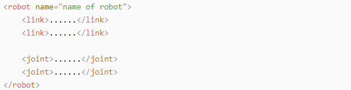

(5) gazebo Tag

This tag is used in conjunction with the Gazebo simulator. Within this tag, you can define simulation parameters and import Gazebo plugins, as well as specify Gazebo's physical properties, and more.


(6) Write Simple URDF Model

**Name the model of the robot**

To start writing the URDF model, we need to set the name of the robot following this format: **"`<robot name="robot model name">`"**. Lastly, input **"`</robot>`"** at the end to represent that the model is written successfully.


**Set links**

To write the first link and use indentation to indicate that it is part of the currently set model. Set the name of the link using the following format: **"`<link name="link name">`"**. Finally, conclude with **"`</link>`"** to indicate the successful completion of the link definition.


Write the link description and use indentation to indicate that it is part of the currently set link, and conclude with `</visual>`.


The **"`<geometry>`"** tag is employed to define the shape of a link. Once the description is complete, include **"`</geometry>`"**. Within the **"`<geometry>`"** tag, indentation is used to specify the detailed description of the link's shape. The following example demonstrates a link with a cylindrical shape: **"`<cylinder length="0.01" radius="0.2"/>`"**. In this instance, **"`length="0.01"`"** signifies a length of 0.01 meters for the link, while **"`radius="0.2"`"** denotes a radius of 0.2 meters, resulting in a cylindrical shape.


The **"`<origin>`"** tag is utilized to specify the position of a link, with indentation used to indicate the detailed description of the link's position. The following example demonstrates the position of a link: **"`<origin rpy="0 0 0" xyz="0 0 0" />`"**. In this example, **"`rpy`"** represents the roll, pitch, and yaw angles of the link, while **"`xyz`"** represents the coordinates of the link's position. This particular example indicates that the link is positioned at the origin of the coordinate system.


The **"`<material>`"** tag is used to define the visual appearance of a link, with indentation used to specify the detailed description of the link's color. To start describing the color, include **"`<material>`"**, and end with **"`</material>`"** when the description is complete. The following example demonstrates setting a link color to yellow: **"`<color rgba="1 1 0 1" />`"**. In this example, **"`rgba="1 1 0 1"`"** represents the color threshold for achieving a yellow color.


**Set joint**

To write the first joint, use indentation to indicate that the joint belongs to the current model being set. Then, specify the name and type of the joint as follows: **"`<joint name="joint name" type="joint type">`"**. Finally, include **"`</joint>`"** to indicate the completion of the joint definition.

:::{Note}
* to learn about the type of the joint, please refer to “4.2 joint”.
:::


Write the description section for the connection between the link and the joint. Use indentation to indicate that it is part of the currently defined joint. The parent parameter and child parameter should be set using the following format: **"`<parent link="parent link"/>`"**, and **"`<child link="child link" />`"**. With the parent link serving as the pivot, the joint rotates the child link.

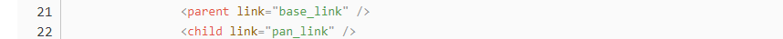

**"`<origin>`"** describes the position of the joint using indention. This example describes the position of the joint: **"`<origin xyz="0 0 0.1" />`"**. `xyz` is the coordinate of the joint.


**"`<axis>`"** describes the position of the joint adopting indention. **"`<axis xyz="0 0 1" />`"** describes one posture of a joint. `xyz` specifies the pose of the joint.


**"`<limit>`"** imposes restrictions on the joint using indention. The below picture The **"`<limit>`"** tag is used to restrict the motion of a joint, with indentation indicating the specific description of the joint angle limitations. The following example describes a joint with a maximum force limit of 300 Newtons, an upper limit of 3.14 radians, and a lower limit of -3.14 radians. The settings are defined as follows: **"`effort="joint force (N)", velocity="joint motion speed", lower="lower limit in radians", upper="upper limit in radians`"**.


**"`<dynamics>`"** describes the dynamics of the joint using indention. **"`<dynamics damping="50" friction="1" />`"** describes dynamics parameters of a joint.

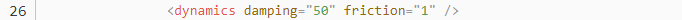

The complete codes are as below.


### 5.1.2 Explanation of ROS Robot URDF Model

* **Preparation**

To grasp the URDF model, check out [5.1.1 URDF Model -> Basic Syntax of URDF Model]() for the key syntax. This part quickly breaks down the robot model code and its components.

* **Check Code of Robot Model**

(1) Start the robot, and access the robot system desktop using NoMachine.

(2) Click-on  to open the command-line terminal.

(3) Run the command to disable app auto-start service and hit Enter
```bash
sudo systemctl stop start_app_node.service
```

(4) Enter the command to navigate to the robot simulation model folder.
```bash
vim ~/ros2_ws/src/simulations/jetacker_description/urdf/jetacker.xacro
```

(5) Locate the code below:


Several URDF models are combined to create a full robot:

| **File Name** | **Device** |
|:---:|:---:|
| materials | Color |
| inertial_matrix | Inertia matrix |
| lidar_a1 | A1 Lidar |
| lidar_g4 | G4 Lidar |
| Imu | Inertial measurement unit |
| jetacker | Robot module |

* **Brief Analysis of Robot's Main Body Model**

Open a new command terminal and run the command to access the robot model file, which contains the description of each part of the robot model.
```bash
vim ~/ros2_ws/src/simulations/jetacker_description/urdf/jetacker.urdf.xacro
```
```xml
<?xml version="1.0" encoding="utf-8"?>
<robot name="jetacker" xmlns:xacro="http://ros.org/wiki/xacro" >
```

This is the beginning of the URDF file. It specifies the XML version and encoding, and defines a robot model named "hiwonder". The `xmlns:xacro` namespace is utilized here to generate URDF using Xacro macro definitions.

The following line of code defines a Xacro property named "M_PI" and assigns the value of π to it.
```xml
<xacro:property name="M_PI" value="3.1415926535897931"/>
```

(1) Main Robot Body Model Basic Parameter

This section defines some basic parameters of the robot model:

The first parameter, `base_link_mass`, defines the weight of the robot's main body model, in kilograms.

The second parameter, `base_link_w`, defines the width of the robot's main body model, in meters.

The third parameter, `base_link_h`, defines the height of the robot's main body model, in meters.

The fourth parameter, `base_link_d`, defines the length of the robot's main body model, in meters.

The fifth parameter, `wheel_link_mass`, defines the weight of the robot's wheels, in kilograms.

The sixth parameter, `wheel_link_radius`, defines the radius of the robot's wheels, in meters.


(2) Robot Model Shadow Part（`base_footprint`）

The shadow part of the robot model (`base_footprint`) defines the link `base_footprint` and the joint `base_joint`. The joint `base_joint` is used to connect the link `base_footprint` with the link `base_link`. The position is defined at the origin to prevent the wheels from embedding into the ground.

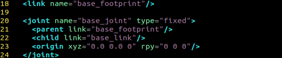

(3) Robot Main Body Model (`base_link`)

The link `base_link` is defined and then specified as a rectangle with previously defined parameters.

The description of the link `base_link` (keyword `visual`) is defined internally with the following specifications: position at the origin (keyword `origin`), inclusion of the relevant dynamics configuration file (keyword `geometry`), and the color defined as green (keyword `material`).

Collision (keyword `collision`) is defined, along with the collision position (keyword `origin`) and the collision area (keyword `geometry`).


(4) Ackermann Wheel Simulation (taking the right front wheel as an example)

Define the link `wheel_front_right_link`. This link is defined as a cylinder and populated with the parameters defined earlier.

Define the visual description of the link `wheel_front_right_link` (keyword `visual`) and within the visual description define: the position as the origin (keyword `origin`), the introduction of the relevant dynamics configuration file (keyword `geometry`), and the color as black (keyword `material`).

Define the collision (keyword `collision`), collision position (keyword `origin`), and collision area (keyword `geometry`).


(5) Robot Lidar Simulation Model

Define the link `lidar_link`. Define the inertial properties (keyword `inertial`) and within this definition, specify: the inertial origin (keyword `origin`), the mass (keyword `mass`), and the inertial properties between the links (keyword `inertia`).

Define the visual description (keyword `visual`) and within this definition specify: the position as the origin (keyword `origin`), the relevant dynamics configuration file (keyword `geometry`), and the color as black (keyword `material`).

Define the collision properties (keyword `collision`), the collision position (keyword `origin`), and the collision geometry (keyword `geometry`).

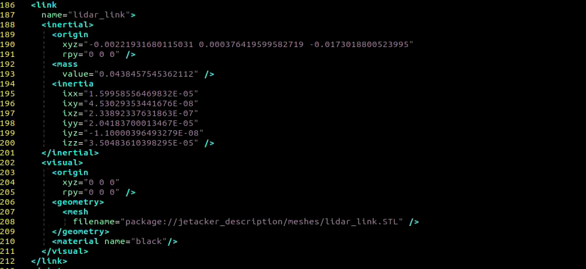

### 5.1.3 Principles of SLAM Map Building

* **Introduction to SLAM**

SLAM stands for Simultaneous Localization and Mapping.

Localization involves determining the pose of a robot in a coordinate system,, The origin of orientation of the coordinate system can be obtained from the first keyframe, existing global maps, landmarks or GPS data.

Mapping involves creating a map of the surrounding environment perceived by the robot. The basic geometric elements of the map are points. The main purpose of the map is for localization and navigation. Navigation can be divided into guidance and control. Guidance includes global planning and local planning, while control involves controlling the robot's motion after the planning is done.

* **SLAM Mapping Principle**

(1) Preprocessing: Optimizing the raw data from the radar point cloud, filtering out problematic data or performing filtering. Using laser as a signal source, pulses of laser emitted by the laser are directed at surrounding obstacles, causing scattering.


Some of the light waves will reflect back to the receiver of the lidar, and then, according to the principle of laser ranging, the distance from the lidar to the target point can be obtained.

Regarding point clouds: In simple terms, the surrounding environment information obtained by lidar is called a point cloud. It reflects a portion of what the 'eyes' of the robot can see in the environment where it is located. The object information collected presents a series of scattered, accurate angle, and distance information.

(2) Matching: Matching the point cloud data of the current local environment with the established map to find the corresponding position.

(3) Map Fusion: Integrating new round data from the lidar into the original map, ultimately completing the map update.

* **Notes**

(1) Begin the mapping process by positioning the robot in front of a straight wall or within an enclosed box. This enhances the Lidar's capacity to capture a higher density of scanning points.

(2) Initiate a 360-degree scan of the environment using the Lidar to ensure a comprehensive survey of the surroundings. This step is crucial to guarantee the accuracy and completeness of the resulting map.

(3) For larger areas, it's recommended to complete a full mapping loop before focusing on scanning smaller environmental details. This approach enhances the overall efficiency and precision of the mapping process.

* **Judge Mapping Result**

Finally, assess the robot's navigation process against the following criteria once the mapping is complete:

(1) Ensure that the edges of obstacles within the map are distinctly defined.

(2) Check for any disparities between the map and the actual environment, such as the presence of closed loops or inconsistencies.

(3) Verify the absence of gray areas within the robot's motion area, indicating areas that haven't been adequately scanned.

(4) Confirm that the map doesn't incorporate obstacles that won't exist during subsequent localization.

(5) Validate the map's coverage of the entire extent of the robot's motion area.

### 5.1.4 slam_toolbox Mapping Algorithm

* **Mapping Definition**

Slam Toolbox software package combines information from laser rangefinders in the form of `LaserScan` messages and performs TF transformation from `odom`-> `base_link` to create a two-dimensional map of space. This software package allows for fully serialized reloadable data and pose graphs of SLAM maps, used for continuous mapping, localization, merging, or other operations. It allows Slam Toolbox to operate in synchronous (i.e., processing all valid sensor measurements regardless of delay) and asynchronous (i.e., processing valid sensor measurements whenever possible) modes.

ROS replaces functionalities like gmapping, cartographer, karto, hector, providing comprehensive SLAM functionality built upon the powerful scan matcher at the core of Karto, widely used and accelerated for this package. It also introduces a new optimization plugin based on Google Ceres. Additionally, it introduces a new localization method called 'elastic pose-graph localization,' which takes measured sliding windows and adds them to the graph for optimization and refinement. This allows for tracking changes in local features of the environment instead of considering them as biases, and removes these redundant nodes when leaving an area without affecting the long-term map.

Slam Toolbox is a suite of tools for 2D Slam, including:

- Mapping, saving map pgm files
- Map refinement, remapping, or continuing mapping on saved maps
- Long-term mapping: loading saved maps to continue mapping while removing irrelevant information from new laser point clouds
- Optimizing positioning mode on existing maps. Localization mode can also be run without mapping using the 'laser odometry' mode
- Synchronous, asynchronous mapping
- Dynamic map merging
- Plugin-based optimization solver, with a new optimization plugin based on Google Ceres
- Interactive RVIZ plugin
- RVIZ graphical manipulation tools for manipulating nodes and connections during mapping
- Map serialization and lossless data storage.

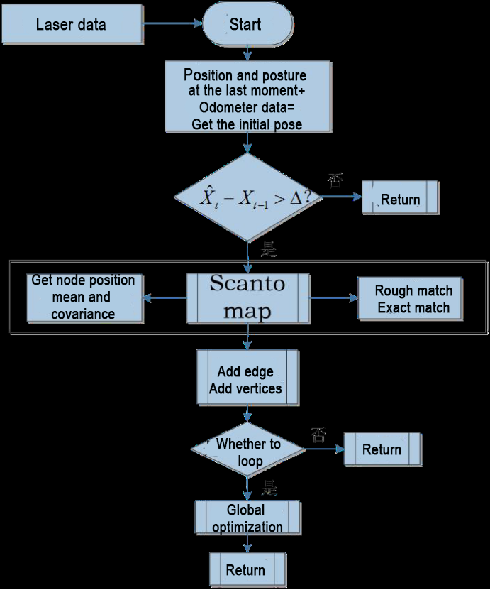

From the above diagram, it can be seen that the process is relatively straightforward. The traditional soft real-time operation mechanism of slam involves processing each frame of data upon entry and then returning.

Relevant source code and WIKI links for KartoSLAM:

- **KartoSLAM ROS Wiki:** [http://wiki.ros.org/slam_karto]()
- **slam_karto software package:** [https://github.com/ros-perception/slam_karto]()
- **open_karto open-source algorithm:** [https://github.com/ros-perception/open_karto]()

* **Mapping Operation Steps**

(1) Click-on  to open the command-line terminal.

(2) Execute the command to disable the app auto-start service.

```bash
sudo systemctl stop start_app_node.service
```

(3) Run the command to start mapping.
```bash
ros2 launch slam slam.launch.py
```

(4) Open a new command-line terminal, and run the command to display the map result through Rviz.
```bash
ros2 launch slam rviz_slam.launch.py
```

(5) Enter the command to start the keyboard control node, and press Enter key:
```bash
ros2 launch peripherals teleop_key_control.launch.py
```

If you see the prompt as shown in the following image, it means the keyboard control service has been successfully started.


(6) Control the robot to move in the current space to build a more complete map. The table below lists the keyboard keys available for controlling robot movement and their corresponding functions:

| **Key** | **Robot Action** |
|:--:|:--:|
| W | Short press to switch to forward state and continuously move forward |
| S | Short press to switch to backward state and continuously move backward |
| A | Long press to interrupt the forward or backward state and turn left |
| D | Long press to interrupt the forward or backward state and turn right |

When controlling the robot's movement with the keyboard to map, it's advisable to reduce the robot's movement speed appropriately. The slower the robot's speed, the smaller the odometry relative error, leading to better mapping results. As the robot moves, the map displayed in RVIZ will continuously expand until the entire environment scene's map construction is completed.

* **Save Map**

Run the following command and hit Enter key to save the map:
```bash
cd ~/ros2_ws/src/slam/maps && ros2 run nav2_map_server map_saver_cli -f "map_01" --ros-args -p map_subscribe_transient_local:=true
```

* **Effect Optimization**

If you desire a more precise mapping outcome, optimizing the odometry can be beneficial. Mapping with the robot requires the use of odometry, which in turn relies on the IMU.

The robot itself comes with pre-calibrated IMU data loaded, enabling it to perform mapping and navigation functions effectively. However, calibrating the IMU can still enhance accuracy further. The calibration method and steps for the IMU can be found in the [2. Motion Control Course ->  2.2 Motion Control]() section.

* **Parameter Explanation**

The parameter file can be found in the `ros2_ws\src\slam\config\slam.yaml` directory.

For more detailed information about the parameters, please refer to the official documentation: [https://wiki.ros.org/slam_toolbox]()

* **Launch File Analysis**


The launch file is located at:

[/home/ubuntu/ros2_ws/src/slam/launch/slam.launch.py]()

(1) Import Library

The launch library can be explored in detail in the official ROS documentation:

[https://docs.ros.org/en/humble/How-To-Guides/Launching-composable-nodes.html]()

{lineno-start=1}
```python
import os
from ament_index_python.packages import get_package_share_directory

from launch_ros.actions import PushRosNamespace
from launch import LaunchDescription, LaunchService
from launch.substitutions import LaunchConfiguration
from launch.launch_description_sources import PythonLaunchDescriptionSource
from launch.actions import DeclareLaunchArgument, IncludeLaunchDescription, GroupAction, OpaqueFunction, TimerAction
```
(2)  Set the Storage Path 

Use the `get_package_share_directory` function to obtain the path of the `slam` package.

{lineno-start=30}
```python
    if compiled == 'True':
        slam_package_path = get_package_share_directory('slam')
    else:
        slam_package_path = '/home/ubuntu/ros2_ws/src/slam'
```
(3) Initiate Other Launch File

{lineno-start=35}
```python
    base_launch = IncludeLaunchDescription(
        PythonLaunchDescriptionSource(
            os.path.join(slam_package_path, 'launch/include/robot.launch.py')),
        launch_arguments={
            'sim': sim,
            'master_name': master_name,
            'robot_name': robot_name
        }.items(),
    )

    slam_launch = IncludeLaunchDescription(
        PythonLaunchDescriptionSource(
            os.path.join(slam_package_path, 'launch/include/slam_base.launch.py')),
        launch_arguments={
            'use_sim_time': use_sim_time,
            'map_frame': map_frame,
            'odom_frame': odom_frame,
            'base_frame': base_frame,
            'scan_topic': '{}/scan'.format(frame_prefix),
            'enable_save': enable_save
        }.items(),
    )

    if slam_method == 'slam_toolbox':
        bringup_launch = GroupAction(
         actions=[
             PushRosNamespace(robot_name),
             base_launch,
             TimerAction(
                 period=5.0,  # 延时等待其它节点启动好(delay to wait for other nodes to start up properly)
                 actions=[slam_launch],
             ),
          ]
        )
```
`base_launch`: Launch for hardware initialization

`slam_launch`: Launch for basic mapping

`bringup_launch`: Launch for initial pose setup

### 5.1.5 RTAB-VSLAM 3D Vision Mapping & Navigation

* **RTAB-VSLAM Description**

RTAB-VSLAM is a appearance-based real-time 3D mapping system, it's an open-source library that achieves loop closure detection through memory management methods. It limits the size of the map to ensure that loop closure detection is always processed within a fixed time limit, thus meeting the requirements for long-term and large-scale environment online mapping.

* **RTAB-VSLAM Working Principle**

RTAB-VSLAM 3D mapping employs feature mapping, offering the advantage of rich feature points in general scenes, good scene adaptability, and the ability to use feature points for localization. However, it has drawbacks, such as a time-consuming feature point calculation method, limited information usage leading to loss of image details, diminished effectiveness in weak-texture areas, and susceptibility to feature point matching errors, impacting results significantly.

After extracting features from images, the algorithm proceeds to match features at different timestamps, leading to loop detection. Upon completion of matching, data is categorized into long-term memory and short-term memory. Long-term memory data is utilized for matching future data, while short-term memory data is employed for matching current time-continuous data.

During the operation of the RTAB-VSLAM algorithm, it initially uses short-term memory data to update positioning points and build maps. As data from a specific future timestamp matches long-term memory data, the corresponding long-term memory data is integrated into short-term memory data for updating positioning and map construction.


**RTAB-VSLAM software package link:** [https://github.com/introlab/rtabmap]()

* **RTAB-VSLAM 3D Mapping Instructions**

(1) Click on  on the system desktop to open the command-line terminal. Run the command to disable the app auto-start service:
```bash
sudo systemctl stop start_app_node.service
```

(2) Execute the command to start mapping:
```bash
ros2 launch slam rtabmap_slam.launch.py
```

(3) Open a new terminal window. Enter the command to open the RViz tool and display the mapping effect:
```bash
ros2 launch slam rviz_rtabmap.launch.py
```

(4) Enter the command to start the keyboard control node, and press Enter.
```bash
ros2 launch peripherals teleop_key_control.launch.py
```

If you encounter the prompt as shown in the figure below, it means that the keyboard control service has been successfully activated.


(5) Control the robot to move in the current space to build a more complete map. The table below shows the keyboard keys available for controlling robot movement and their corresponding functions:

| **Key** | **Robot Action** |
|:--:|:--:|
| W | Short press to switch to the forward state and continuously move forward |
| S | Short press to switch to the backward state and continuously move backward |
| A | Long press to interrupt the forward or backward state and turn left |
| D | Long press to interrupt the forward or backward state and turn right |

When controlling the robot's movement for mapping using the keyboard, it's advisable to appropriately reduce the robot's movement speed. The smaller the robot's running speed, the smaller the relative error of the odometry, resulting in a better mapping effect. As the robot moves, the map displayed in RVIZ will continuously expand until the entire environmental scene's map construction is completed.

* **Map Saving**

After mapping is completed, you can use the shortcut "Ctrl+C" in each command-line terminal window to close the currently running program.

:::{Note}

For 3D mapping, there's no need to manually save the map. When you use "Ctrl+C" to close the mapping command, the map will be automatically saved.
:::

* **Launch File Analysis**


The launch file is located at:

[/home/ubuntu/ros2_ws/src/slam/launch/rtabmap_slam.launch.py]()

(1) Import Library:

You can refer to the ROS official documentation for detailed analysis of the launch library:

[https://docs.ros.org/en/humble/How-To-Guides/Launching-composable-nodes.html]()

{lineno-start=1}
```python
import os
from ament_index_python.packages import get_package_share_directory

from launch_ros.actions import PushRosNamespace
from launch import LaunchDescription, LaunchService
from launch.substitutions import LaunchConfiguration
from launch.launch_description_sources import PythonLaunchDescriptionSource
from launch.actions import DeclareLaunchArgument, IncludeLaunchDescription, GroupAction, OpaqueFunction, TimerAction
```
(2) Set the Storage Path

Use `get_package_share_directory` to obtain the path of the `slam` package.

{lineno-start=32}
```python
    if compiled == 'True':
        slam_package_path = get_package_share_directory('slam')
    else:
        slam_package_path = '/home/ubuntu/ros2_ws/src/slam'
```
(3) Initiate Other Launch File

{lineno-start=37}
```python
    base_launch = IncludeLaunchDescription(
        PythonLaunchDescriptionSource(
            os.path.join(slam_package_path, 'launch/include/robot.launch.py')),
        launch_arguments={
            'sim': sim,
            'master_name': master_name,
            'robot_name': robot_name,
        }.items(),
    )

    rtabmap_launch = IncludeLaunchDescription(
        PythonLaunchDescriptionSource(
            os.path.join(slam_package_path, 'launch/include/rtabmap.launch.py')),
        launch_arguments={
            'use_sim_time': use_sim_time,
        }.items(),
    )

    bringup_launch = GroupAction(
     actions=[
         PushRosNamespace(robot_name),
         base_launch,
         TimerAction(
             period=10.0,  # 延时等待其它节点启动好(delay to wait for other nodes to start up properly)
             actions=[rtabmap_launch],
         ),
      ]
    )
```
`base_launch`: Launch for hardware initialization

`slam_launch`: Basic mapping launch

`rtabmap_launch`: RTAB mapping launch

`bringup_launch`: Initial pose launch

## 5.2 Navigation

### 5.2.1 ROS Robot Autonomous Navigation

* **Description**

Autonomous navigation involves guiding a device along a predefined route from one point to another. It finds application in various domains:

Land Applications: Including autonomous vehicle navigation, vehicle tracking and monitoring, intelligent vehicle information systems, Internet of Vehicles applications, railway operation monitoring, etc.

Navigation Applications: Encompassing ocean transportation, inland waterway shipping, ship berthing and docking, etc.

Aviation Applications: Such as route navigation, airport surface monitoring, precision approach, etc.


ROS (Robot Operating System) follows the principle of leveraging existing solutions and provides a comprehensive set of navigation-related function packages. These packages offer universal implementations for robot navigation, sparing developers from dealing with complex low-level tasks like navigation algorithms and hardware interactions. Managed and maintained by professional R&D personnel, these implementations allow developers to focus on higher-level functions. To utilize the navigation function, developers simply need to configure relevant parameters for their robots in the provided configuration files. Custom requirements can also be accommodated through secondary development of existing packages, enhancing research and development efficiency and expediting product deployment.

In summary, ROS's navigation function package set offers several advantages for developers. Developed and maintained by a professional team, these packages provide stable and comprehensive functionality, allowing developers to concentrate on upper-layer functions, thus streamlining development processes.

The ROS navigation function package, `ros-navigation`, is a crucial component within the ROS ecosystem, serving as the foundation for many autonomous mobile robot navigation functions. Subsequent sections will delve into its operation, principle analysis, installation, and usage.

* **Package Explanation**

(1) Principle Structure Framework Explanation

The Nav2 project inherits and promotes the spirit of the ROS Navigation Stack. The project strives to safely navigate mobile robots from point A to point B. Nav2 can also be applied to other applications, including robot navigation tasks such as dynamic point tracking, which involves dynamic path planning, velocity calculation, obstacle avoidance, and recovery behaviors.

Nav2 utilizes behavior trees to invoke modular servers to accomplish an action. These actions can involve path computation, control forces, recovery, or any other navigation-related operation. These are achieved through independent nodes communicating with ROS Action servers and the behavior tree (BT). You can refer to the diagram below for a preliminary understanding of Nav2's architecture:


The architecture diagram above can be further explained as one major component and three minor components, totaling four services.

**Major**: 

BT Navigator Server: This service organizes and invokes the following three minor services.

**Minor**:

① **Planner Server:** Responsible for path planning, the planner server computes paths based on selected naming conventions and algorithms. These paths are essentially routes calculated on the map.

② **Controller Server:** Also known as the local planner in ROS 1, this server provides the method for the robot to follow the globally computed path or complete local tasks. In simple terms, it controls the robot's movement based on the planned route.

③ **Recovery Server:** The backbone of the fault-tolerant system, the recovery server handles unknown or faulty conditions autonomously. Its goal is to manage unexpected situations the robot may encounter and recover autonomously. For example, if the robot falls into a hole while moving, the recovery server finds a way to get it out.

By continuously switching between planning paths, controlling the robot along the path, and autonomously recovering from issues, the robot achieves autonomous navigation.

During robot navigation, relying solely on the original map generated by SLAM is insufficient. The robot may encounter new obstacles during movement, or it may find that obstacles in certain areas of the original map have disappeared. Therefore, the maintained map during robot navigation is dynamic. Depending on the update frequency and purpose, it can be categorized into the following two types:

**Global Costmap:** 

The global costmap is mainly used for global path planners. As seen in the structure diagram above, it is located within the Planner Server. It typically includes the following layers:

* Static Map Layer: This layer consists of the static map usually created by SLAM.
* Obstacle Map Layer: This layer is used to dynamically record obstacle information perceived by sensors.
* Inflation Layer: This layer inflates (expands outward) the maps from the previous two layers to prevent the robot's shell from colliding with obstacles.

**Local Costmap:** 

The local costmap is primarily used for the local path planner, as seen in the Controller Server in the architecture diagram above. It typically consists of the following layers:

* Obstacle Map Layer: This layer records dynamically sensed obstacle information from sensors.
* Inflation Layer: This layer inflates (expands outward) on top of the obstacle map layer to prevent the robot's shell from colliding with obstacles.

### 5.2.2 AMCL Adaptive Monte Carlo Positioning

* **AMCL Positioning**

Positioning involves determining the robot's position in the global map. While SLAM also includes positioning algorithm implementation, SLAM's positioning is utilized for building the global map and occurs before navigation begins. Current positioning, on the other hand, is employed during navigation, where the robot needs to move according to the designated route. Through positioning, it can be assessed whether the robot's actual trajectory aligns with expectations.

The AMCL (Adaptive Monte Carlo Localization) system, provided in the ROS navigation function package `ros-navigation`, facilitates robot positioning during navigation. AMCL utilizes the adaptive Monte Carlo positioning method and employs particle filters to compute the robot's position based on existing maps.

Positioning addresses the association between the robot and obstacles, as path planning fundamentally involves decision-making based on surrounding obstacles. While theoretically, completing the navigation task only requires knowledge of the robot's global positioning and real-time obstacle avoidance using laser radar and other sensors, the real-time performance and accuracy of global positioning are typically limited. Local positioning from odometry, IMUs, etc., ensures the real-time performance and accuracy of the robot's motion trajectory. The `amcl` node in the navigation function package provides global positioning by publishing `map_odom`. However, users can substitute `amcl` global positioning with other methods that provide `map_odom`, such as SLAM, UWB, QR code positioning, etc.

Global positioning and local positioning establish a dynamic set of tf coordinates `map_odom` `base_footprint`, with static tf coordinates between various sensors in the robot provided through the robot URDF type. This TF relationship resolves the association problem between the robot and obstacles. For instance, if the lidar detects an obstacle 3m ahead, the tf coordinates between the lidar and the robot chassis, `base_link` to `laser_link`, are utilized. Through standard transformation, the relationship between the obstacle and the robot chassis can be determined.

* **Particle Filter**

The Monte Carlo positioning process simulates particle updates for a one-dimensional robot. Initially, a group of particles is randomly generated, with each particle representing a potential position, direction, or state variable that requires estimation. Each particle is assigned a weight indicating its similarity to the actual system state. Next, the state of each particle at the next time step is predicted, and particles are moved based on the anticipated behavior of the real system. The weights of the particles are then updated based on measurements. Particles that closely match the measured value receive higher weights and are resampled, while highly unlikely particles are discarded and replaced with more probable ones. Finally, the weighted average and covariance of the particle set are calculated to derive the state estimate.


Monte Carlo methods generally follow a specific pattern:

(1) Define possible input fields.

(2) Randomly generate inputs from a probability distribution over the domain.

(3) Perform deterministic calculations on inputs.

(4) Summarize results.

Two important considerations are:

① If the points are not uniformly distributed, the approximation effect will be poor.

② This process requires many points. The approximation is usually poor if only a few points are randomly placed throughout the square. On average, the accuracy of the approximation improves as more points are placed.

The Monte Carlo particle filter algorithm finds applications in various fields, including physical science, engineering, climatology, and computational biology.

* **Adaptive Monte Carlo Positioning**

AMCL can be viewed as an enhanced iteration of the Monte Carlo positioning algorithm, designed to boost real-time performance by employing a reduced number of samples compared to the traditional method, thereby minimizing execution time. It implements an adaptive or KLD sampling Monte Carlo localization method, utilizing particle filtering to track a robot's pose against an existing map.

The Adaptive Monte Carlo positioning nodes primarily utilize laser scanning and lidar maps to exchange messages and perform pose estimation calculations. The implementation process entails initializing the adaptive Monte Carlo positioning algorithm's particle filter for each parameter provided by the ROS system during initialization. In instances where the initial pose is not specified, the algorithm assumes that the robot commences its journey from the origin of the coordinate system, resulting in a more intricate calculation process.

Hence, it is advisable to set the initial pose using the **"2D Pose Estimate"** button in rviz. For further information on Adaptive Monte Carlo positioning, you can also refer to the wiki address link: [https://github.com/ros-planning/navigation]()

* **Cost Map**

Regardless of whether it's a 2D or 3D SLAM map generated by LiDAR or a depth camera, it cannot be directly employed for actual navigation. Instead, it needs to be converted into a costmap. In ROS, the costmap typically adopts a grid format, where each grid cell in the raster map occupies 1 byte (8 bits). This allows for data storage ranging from 0 to 255, representing different cell costs.

The costmap only requires consideration of three scenarios: occupied (barrier), free area (barrier-free), and unknown space.

Before delving into `costmap_2d`, it's important to introduce the Bresenham algorithm. This algorithm is utilized to draw a straight line between two points by calculating the closest point of a line segment on an n-dimensional raster. It relies solely on relatively fast integer operations such as addition, subtraction, and bit shifting, making it a fundamental algorithm in computer graphics.


To construct a set of virtual grid lines, we begin by passing them through the pixel centers of each row and column. The intersection points of these straight lines with each vertical grid line are calculated sequentially, starting from the line's origin and moving towards its endpoint. Subsequently, the pixel closest to each intersection point within the pixel column is determined based on the sign of the error term.

The core concept of the algorithm relies on the assumption that k=dy/dx, where k represents the slope. Since the straight line originates from the center of a pixel, the initial error term d is set to d0＝0. With each increment in the subscript X, d increases by the slope value k, i.e., d=d+k. When d≥1, 1 is subtracted from it to ensure that d remains between 0 and 1. If d≥0.5, the pixel closest to the upper-right of the current pixel is considered (i.e., (x+1,y+1)); otherwise, it's closer to the pixel on the right (i.e.,(x+1,y)). For ease of calculation, let e=d−0.5; initially, e is set to -0.5, and it increments by k. When e≥0, the upper-right pixel of the current pixel (xi, yi) is selected, and when e<0, the pixel closer to the right (x+1,y) is chosen instead. Integers are preferred to avoid division. Since the algorithm only uses the sign of the error term, it can be replaced as follows: e1 = 2*e*dx.


The `Costmap2D` class is responsible for managing the cost value of each raster. Meanwhile, the `Layer` class serves as a virtual base class, standardizing the interfaces of costmap layers for each plugin. Key interface functions include:

The `initialize` function, which invokes the `onInitialize` function to initialize each costmap layer individually.

The `matchSize` function, found in the `StaticLayer` and `ObstacleLayer` classes, ensures consistency across costmap layers by calling the `matchSize` function of the `CostmapLayer` class. This initialization process sets the size, resolution, origin, and default cost value of each layer. In the `inflationLayer` class, a cost table is computed based on the expansion radius, enabling subsequent cost value queries based on distance. Additionally, the `seen_` array is defined to mark traversed rasters. For the `VoxelLayer` class, initialization involves setting the size of the voxel grid.

The `updateBounds` function adjusts the size range of the current costmap layer requiring updates. For the `StaticLayer` class, the update range is determined by the size of the static map (typically used in global costmaps). Conversely, the `ObstacleLayer` class determines obstacle boundaries by traversing sensor data in `clearing_observations`.

The `initialize` and `matchSize` functions are executed only once each, while `updateBounds` and `updateCosts` are performed periodically, their frequency determined by `map_update_frequency`.

The `CostmapLayer` class inherits from both the `Layer` class and the `Costmap2D` class, providing various methods for updating cost values. The `StaticLayer` and `ObstacleLayer` classes, needing to retain cost values of instantiated layers, also inherit from `CostmapLayer`. The `StaticLayer` updates its costmap using static raster map data, whereas the `ObstacleLayer` employs sensor data for updates. In contrast, the `VoxelLayer` class considers z-axis data more extensively, particularly in obstacle clearance. This distinction primarily affects obstacle removal, with two-dimensional clearance in one case and three-dimensional clearance in the other.

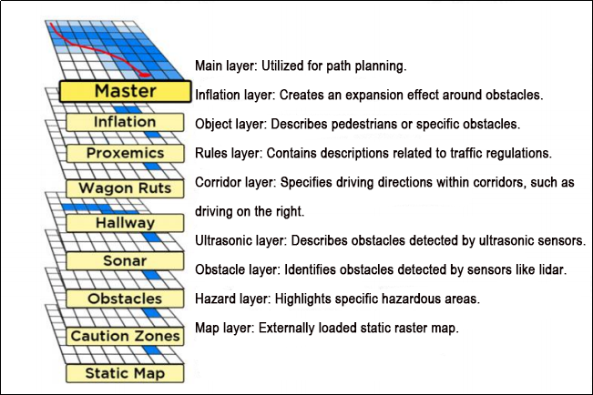

Costmap measurement barriers offer remarkable flexibility. You can tailor a specific layer to your requirements, thereby managing pertinent barrier information effectively. For instance, if your robot is equipped solely with LiDAR, you'll need to establish an `Obstacles` layer to handle obstacle data scanned by the LiDAR. In case ultrasonic sensors are integrated into the robot, creating a new `Sonar` layer becomes necessary to manage obstacle information from the sonic sensor. Each layer can define its own rules for obstacle updates, encompassing tasks such as obstacle addition, deletion, and confidence level updates. This approach significantly enhances the scalability of the navigation system.

* **Global Path Planning**

Preface: Based on the mobile robot's perception of the environment, the characteristics of the environment, and the algorithms employed, path planning can be categorized into environment-based, map knowledge-based, and completeness-based path planning algorithms.


Commonly used path planning algorithms in robot autonomous navigation encompass Diikstra, A\*, D\*, PRM, RRT, genetic algorithms, ant colony algorithms, fuzzy algorithms, and others.

Dijkstra and A\* are graph-based path search algorithms commonly utilized in robotic applications. The navigation function package integrates `navfn`, `global_planner`, and `carrot_planner` as global route planning plug-ins. Users have the option to select one of these plug-ins to load into `move_base` for utilization. Alternatively, they can opt for a third-party global path planning plug-in, such as `SBPL_Lattice_Planner` or `srl_global_planner`, or develop a custom global path planning plug-in adhering to the interface specification of `nav_core`.


Mobile robot navigation facilitates reaching a target point through path planning. The navigation planning layer comprises several components:

(1) Dijkstra Algorithm

Dijkstra's algorithm is a classic shortest path algorithm known for its efficiency in finding the shortest path from a single source to all other vertices in a graph. It operates by expanding outward in layers from the starting point, employing a breadth-first search approach while considering edge weights. This makes it one of the most widely used algorithms in global path planning.

Here is a diagram illustrating the process of Dijkstra's algorithm:

① Initially, we set the distance from the starting point (start) to itself as 0, and all other points' distances are initialized to infinity.


② During the first iteration, we identify the point (let's call it Point 1) with the smallest distance value, mark it as processed, and update the distances of all adjacent points (previously unprocessed) connected to Point 1. For instance, if Point 1 is connected to Points 2, 3, and 4, we update their distances as follows: dis\[2\]=2, dis\[3\]=4, and dis\[4\]=7.


③ In the subsequent iterations, we repeat the process: find the point with the smallest distance value (e.g., Point 2 in the second iteration), mark it as processed, and update the distances of its adjacent points (if necessary). For example, if Point 2 is connected to Points 3 and 5, we update their distances as dis\[3\]=3 and dis\[5\]=4.


④ This procedure continues until all points have been processed. At each iteration, we select the unprocessed point with the smallest distance and update distances of its adjacent points accordingly.


⑤ Once all points have been processed, the algorithm terminates, and the shortest path distances from the starting point to all other points are determined.

To access the introduction and usage details of the Dijkstra algorithm, please log in to the wiki using the following link:

[http://wiki.ros.org/navfn]()

(2) A Star Algorithm

A-star is an enhancement of Dijkstra's algorithm tailored for single destination optimization. While Dijkstra's algorithm determines paths to all locations, A-star focuses on finding the path to a specific location or the nearest location among several options. It prioritizes paths that seem to be closer to the goal.

The formula for the A-star algorithm is: *F*=*G*+*H*, where *G* represents the movement cost from the starting point to the designated square, and *H* denotes the estimated cost from the designated square to the endpoint. There are two methods for calculating the *H* value:

① Calculate the distance of horizontal and vertical movement; diagonal calculation is not applicable (Manhattan distance).


② Calculate the distance of horizontal and vertical movement; diagonal calculation is applicable (diagonal distance).


For an introduction to and usage of the A\* algorithm, please consult the video tutorial or visit the following links:

ROS Wiki: [http://wiki.ros.org/global_planner]()

Red Blob Games website: [https://www.redblobgames.com/pathfinding/a-star/introduction.html#graphs]()

### 5.2.3 Local Path Planning

Global path planning begins with inputting the starting point and the target point, utilizing obstacle information from the global map to devise a path between them. This path consists of discrete points and solely considers static obstacles. Consequently, while the global path serves as a macro reference for navigation, it cannot be directly utilized for navigation control.

* **DWA Algorithm**

(1) Description

The Dynamic Window Approach (DWA), a classic algorithm for path planning and motion control of mobile robots, ensures safe navigation on a known map. By exploring the speed and angular velocity state space, DWA identifies the optimal combination for safe navigation. Below, you'll find a basic description along with some key formulas of the DWA algorithm.


The core concept of the DWA algorithm involves the robot assessing its current state and sensor data to generate a series of potential motion trajectories (referred to as dynamic windows) in the speed and angular velocity state space. These trajectories are then evaluated based on criteria such as obstacle avoidance, maximizing forward speed, and minimizing angular velocity to select the optimal trajectory. Through iterative iterations of this process, the robot dynamically plans its trajectory in real-time to adapt to changing environments and obstacles.

* **Formula**

(1) Robot status: current position (x, y) and orientation (θ)

(2) Motion control parameters: linear velocity (V) and angular velocity (ω).

(3) Range of velocity and angular velocity sampling: minimum (Vmin, ωmin) and maximum (Vmax, ωmax).

(4) Time step: Δt

The formula is as below:

① Velocity Sampling: In the DWA algorithm, the initial step involves sampling the state space of velocity and angular velocity to create a set of potential velocity-angular velocity pairs, known as dynamic windows.

V<sub>samples</sub> = \[v<sub>min</sub>, v<sub>max</sub>\]

ω<sub>samples</sub> = \[-ω<sub>max</sub>, ω<sub>max</sub>\]

(V<sub>samples</sub>) denotes the speed sampling range, while (ω<sub>samples</sub>) indicates the angular speed sampling range.

② Motion Simulation: The DWA algorithm conducts a motion simulation for each speed-angular velocity pair, determining the trajectory of the robot based on these combinations in its current state.

x(t+1) = x(t) + v \* cos(θ(t)) \*Δt

y(t+1) = y(t) + v \* sin(θ(t)) \*Δt

θ(t+1) = θ(t) + ω \* Δt

Here, x(t) and y(t) denote the robot's position, θ(t) represents its orientation, v stands for linear velocity, ω for angular velocity, and Δt represents the time step.

③ Trajectory Evaluation: The DWA algorithm assesses each generated trajectory using evaluation functions, including obstacle avoidance, maximum speed, and minimum angular velocity.

**Obstacle Avoidance Evaluation:** Detects if the trajectory intersects with obstacles.

**Maximum Speed Evaluation:** Verifies if the maximum linear speed on the trajectory falls within the permissible range.

**Minimum Angular Velocity Evaluation:** Ensures that the minimum angular velocity on the trajectory remains within the allowed range.

These evaluation functions can be defined and adjusted as per task requirements.

④ Select optimal trajectory: The DWA algorithm chooses the trajectory with the highest evaluation score as the next move for the robot.

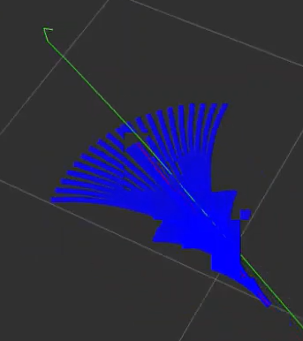

* **Expansion**

Extensions and resources for learning about the DWA algorithm:

The DWA algorithm serves as a fundamental method in mobile robotics, with numerous extended and enhanced versions designed to boost performance and efficiency in path planning. Some notable variations include:

(1) DWA Algorithm Extension: [https://arxiv.org/abs/1703.08862]()

(2) Enhanced DWA (e-DWA) Algorithm: [https://arxiv.org/abs/1612.07470]()

(3) DP-DWA Algorithm (DP-based Dynamic Window Approach): [https://arxiv.org/abs/1909.05305]()

(4) ROS Wiki: [http://wiki.ros.org/dwa_local_planner]()

These resources provide in-depth insights and further exploration into the DWA algorithm and its various extensions.

* **TEB Algorithm**

(1) Description

The TEB (Timed Elastic Band) algorithm is utilized for both path planning and motion planning, particularly in domains like robotics and autonomous vehicles. At its core, the TEB algorithm treats path planning as an optimization challenge, aiming to generate the best trajectory within a specified timeframe while accommodating dynamic constraints and obstacle avoidance needs for the robot or vehicle. Key characteristics of the TEB algorithm encompass:

**Time Layered Representation:** The TEB algorithm employs time layering, dividing the trajectory into discrete time steps, each corresponding to a position of the robot or vehicle. This aids in setting timing constraints and preventing collisions.

**Trajectory Parameterization:** TEB parameterizes the trajectory into displacements and velocities, facilitating optimization. Each time step is associated with displacement and velocity parameters.

**Constrained Optimization:** TEB considers dynamic constraints, obstacle avoidance, and trajectory smoothness, integrating them into the objective function of the optimization problem.

**Optimization Solution:** TEB utilizes techniques like linear quadratic programming (QP) or nonlinear programming (NLP) to determine optimal trajectory parameters that fulfill the constraints.


(2) Formula

The figure below illustrates the optimization objective function in the TEB algorithm:


In the following expression:

J(x) denotes the objective function, where x represents the trajectory parameter.

`wsmooth` and `wobstacle` represent weights assigned to smoothness and obstacle avoidance, respectively.

H signifies the smoothness penalty matrix.

f(xi, oj) represents the obstacle cost function between trajectory point xi and obstacle oj.

**Status Definition:** Firstly, we define the state of the robot (or vehicle) in the path planning problem as follows: Position: P = \[X, Y\], indicating the coordinates of the robot on the two-dimensional plane. Velocity: V = \[Vx, Vy\], representing the robot's velocity along the X and Y axes. Time: t, denoting the current time. Control Input: u = \[ux, uy\], representing the control input of the robot, which can be speed or acceleration. Robot Trajectory: x(t) = \[p(t), v(t)\], indicating the state of the robot at time t.

**Target Function:** The essence of the TEB algorithm lies in solving an optimization problem. The objective is to minimize a composite function comprising various components:


`Jsmooth(x)`: Smoothness objective function, ensuring trajectory smoothness.

`Jobstacle(x)`: Obstacle avoidance objective function, preventing collisions with obstacles.

`Jdynamic(x)`: Dynamic objective function, ensuring compliance with the robot's dynamic constraints.

**Smoothness objective function Jsmooth(x):** Smoothness objective functions typically involve the curvature of trajectories to ensure the generated trajectories are smooth. It can be represented as:


Where k(t) is the curvature.

**Obstacle avoidance objective function Jobstacle(x):** The obstacle avoidance objective function calculates the distance between trajectory points and obstacles. It penalizes trajectory points that are in close proximity to obstacles. The specific obstacle cost function, denoted as f(x,o), can be adjusted according to specific requirements or needs.


**Dynamic objective function Jdynamic(x):** The dynamics objective function ensures that the generated trajectory adheres to the robot's dynamic constraints, which are determined by its kinematics and dynamics model. This typically includes limitations on velocity and acceleration.

**Optimization:** In the end, the Trajectory Optimization with Ellipsoidal Bounds (TEB) algorithm addresses the stated objective function by framing it as a constrained optimization problem. This problem incorporates optimization variables for trajectory parameters, time allocation, and control inputs. Typically, this optimization problem falls under the category of nonlinear programming (NLP) problems.

(3) Expansion


Additional resources and learning materials for the TEB algorithm:

The TEB algorithm is a significant technology within the realm of path planning, boasting numerous extended and enhanced versions. Below are some learning links and extension topics aimed at facilitating a more comprehensive understanding of the TEB algorithm and its associated concepts:

**Original TEB Paper:** **"Trajectory modification considering dynamic constraints of autonomous robots"** by M. Rösmann et al.

**TEB implementation in ROS:** The TEB algorithm is commonly implemented as a ROS package (Robot Operating System Package), making it readily available for robot path planning tasks.

ROS TEB Local Planner Package:

[https://github.com/rst-tu-dortmund/teb_local_planner]()

Wiki website:

[http://wiki.ros.org/teb_local_planner]()

These links provide valuable resources for users seeking to explore the TEB algorithm and its associated topics in greater detail.

### 5.2.4 Point-to-Point and Multi-Point Navigation and Obstacle Avoidance

* **Point-to-Point and Multi-Point Navigation and Obstacle Avoidance**

(1) Click-on  to open the command line terminal, and execute the command to disable the app auto-start service:
```bash
sudo systemctl stop start_app_node.service
```

(2) Enter the following command to start the navigation service and press Enter:
```bash
ros2 launch navigation navigation.launch.py map:=`map_01`
```

The "`map_01`" at the end of the command is the map name. Users can modify this parameter according to their needs. The map is stored at "/home/ubuntu/ros2_ws/src/slam/maps".

(3) Enter the following command to start the RViz tool for navigation display:
```bash
ros2 launch navigation rviz_navigation.launch.py
```

* **Point-to-Point Navigation**

In the software menu bar, **"2D Pose Estimate"** is used to set the initial position of the JetRover robot; **"2D Nav Goal"** is used to set a single target point for the robot; **"Publish Point"** is used to set multiple target points for the robot.


(1) Click  to set the initial position of the robot. On the map interface, choose a position, click, and drag the mouse to select the robot's pose.


(2) After setting the initial position of the robot, the effect is as shown in the figure below:

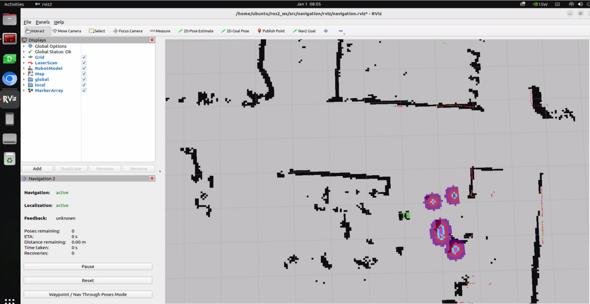

(3) Click  and select a location on the map interface as the target point. Click the mouse once at that point. After selection, the robot will automatically generate a route and move to the target point.


(4) After confirming the target point, the map will display two paths: the green line represents the direct path between the robot and the target point, and the dark blue line represents the planned path of the robot.


(5) When encountering obstacles, the robot will bypass them and continuously adjust its posture and travel route.


* **Multi-Point Navigation**

(1) Click the **"waypoint"** button to start multi-point navigation:


(2) Set each navigation point using  as shown in the figure below:


(3) Finally, click "Start Nav Through Poses" or "Start Waypoint Following" to start navigation. "Start Nav Through Poses" will control the robot's pose at each navigation point; **"Start Waypoint Following"** will not focus on the robot's pose at each navigation point.


(4) The effect during multi-point navigation is shown in the figure below, with the robot reaching the target points in sequence:

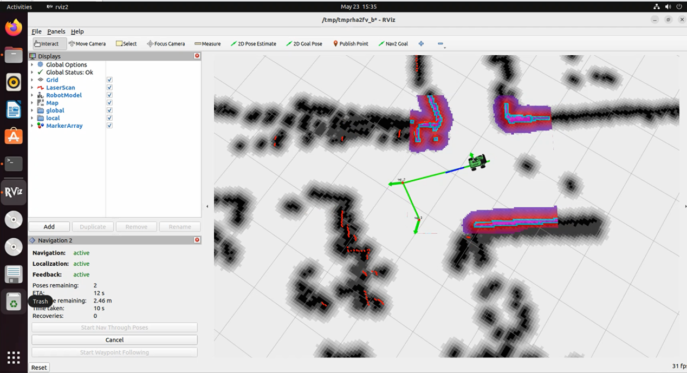

(5) The effect after completing multi-point navigation is shown in the figure below:

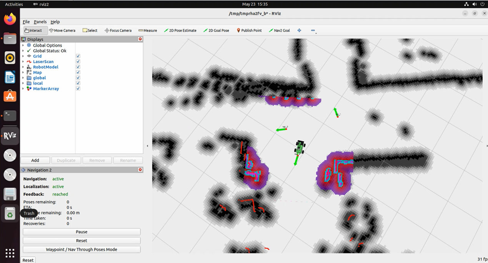

* **Launch Description**


The path to the launch file is located at:

[/home/ubuntu/ros2_ws/src/navigation/launch/navigation.launch.py]()

{lineno-start=1}
```python
import os
from ament_index_python.packages import get_package_share_directory

from launch_ros.actions import PushRosNamespace
from launch import LaunchDescription, LaunchService
from launch.substitutions import LaunchConfiguration
from launch.launch_description_sources import PythonLaunchDescriptionSource
from launch.actions import DeclareLaunchArgument, IncludeLaunchDescription, GroupAction, OpaqueFunction, TimerAction

def launch_setup(context):
    compiled = os.environ['need_compile']
    if compiled == 'True':
        slam_package_path = get_package_share_directory('slam')
        navigation_package_path = get_package_share_directory('navigation')
    else:
        slam_package_path = '/home/ubuntu/ros2_ws/src/slam'
        navigation_package_path = '/home/ubuntu/ros2_ws/src/navigation'

    sim = LaunchConfiguration('sim', default='false').perform(context)
    map_name = LaunchConfiguration('map', default='map_01').perform(context)
    robot_name = LaunchConfiguration('robot_name', default=os.environ['HOST']).perform(context)
    master_name = LaunchConfiguration('master_name', default=os.environ['MASTER']).perform(context)
    use_teb = LaunchConfiguration('use_teb', default='true').perform(context)

    sim_arg = DeclareLaunchArgument('sim', default_value=sim)
    map_name_arg = DeclareLaunchArgument('map', default_value=map_name)
    master_name_arg = DeclareLaunchArgument('master_name', default_value=master_name)
```
(1) Set Paths

Locate the paths for the `peripherals`, `controller`, and `servo_controller` packages.

{lineno-start=12}
```python
    if compiled == 'True':
        slam_package_path = get_package_share_directory('slam')
        navigation_package_path = get_package_share_directory('navigation')
    else:
        slam_package_path = '/home/ubuntu/ros2_ws/src/slam'
        navigation_package_path = '/home/ubuntu/ros2_ws/src/navigation'
```
(2) Launch Other Files

`base_launch` for various hardware

`navigation_launch` to start the navigation algorithm

`bringup_launch` to initialize actions

{lineno-start=34}
```python
    base_launch = IncludeLaunchDescription(
        PythonLaunchDescriptionSource(os.path.join(slam_package_path, 'launch/include/robot.launch.py')),
        launch_arguments={
            'sim': sim,
            'master_name': master_name,
            'robot_name': robot_name
        }.items(),
    )
    
    navigation_launch = IncludeLaunchDescription(
        PythonLaunchDescriptionSource(os.path.join(navigation_package_path, 'launch/include/bringup.launch.py')),
        launch_arguments={
            'use_sim_time': use_sim_time,
            'map': os.path.join(slam_package_path, 'maps', map_name + '.yaml'),
            'params_file': os.path.join(navigation_package_path, 'config', 'nav2_params.yaml'),
            'namespace': robot_name,
            'use_namespace': use_namespace,
            'autostart': 'true',
            'use_teb': use_teb,
        }.items(),
    )

    bringup_launch = GroupAction(
     actions=[
         PushRosNamespace(robot_name),
         base_launch,
         TimerAction(
             period=10.0,  # 延时等待其它节点启动好(delay and wait for other nodes to start up properly)
             actions=[navigation_launch],
         ),
      ]
    )
```
* **Feature Pack Description**

The path to the navigation package is: `ros2_ws/src/navigation/`


`config`: Contains configuration parameters related to navigation, as shown below:


`launch`: Contains launch files related to navigation, including localization, map loading, navigation modes, and simulation model launch files, as shown below:


`rviz`: Contains parameter loading for the RViz visualization tool, including RViz configuration files for robots using different navigation algorithms and navigation configuration files, as shown below:


`Package.xml`: Configuration information file for the current package.

### 5.2.5 RTAB-VSLAM 3D Navigation

* **Algorithm Introduction & Principle**

For an introduction to the RTAB-VSLAM algorithm and its principles, refer to [Mapping Tutorial, Section 5 RTAB-VSLAM 3D Vision Mapping & Navigation]() for study and reference.

* **Robot Operations**

(1) Start the robot, and access the robot system desktop using NoMachine.

(2) Click-on  to open the ROS1 command line terminal, and execute the command to disable the app auto-start service:

```bash
sudo systemctl stop start_app_node.service
```

(3) Enter the following command to start the navigation service and press Enter:
```bash
ros2 launch navigation rtabmap_navigation.launch.py
```

(4) Enter the following command to start the RViz tool for navigation display:
```bash
ros2 launch navigation rviz_rtabmap_navigation.launch.py
```

In the software menu bar, **"2D Nav Goal"** is used to set a single target point for the robot, and **"Publish Point"** is used to set multiple target points for the robot.

(5) Click , and on the map interface, select a location as the target point by clicking the mouse once at that point. After the selection is made, the robot will automatically generate a route and move to the target point.


(6) After confirming the target point, the map will display two paths: a line composed of blue squares representing the straight-line path between the robot and the target point, while the dark blue line represents the planned path of the robot.


(7) After encountering obstacles, the car will navigate around them and continuously adjust its posture and trajectory.

* **Launch Description**


The launch file is saved in:

[/home/ubuntu/ros2_ws/src/navigation/launch/navigation.launch.py]()

{lineno-start=1}
```python
import os
from ament_index_python.packages import get_package_share_directory

from launch_ros.actions import PushRosNamespace
from launch import LaunchDescription, LaunchService
from launch.substitutions import LaunchConfiguration
from launch.launch_description_sources import PythonLaunchDescriptionSource
from launch.actions import DeclareLaunchArgument, IncludeLaunchDescription, GroupAction, OpaqueFunction, TimerAction

def launch_setup(context):
    compiled = os.environ['need_compile']
    if compiled == 'True':
        slam_package_path = get_package_share_directory('slam')
        navigation_package_path = get_package_share_directory('navigation')
    else:
        slam_package_path = '/home/ubuntu/ros2_ws/src/slam'
        navigation_package_path = '/home/ubuntu/ros2_ws/src/navigation'

    sim = LaunchConfiguration('sim', default='false').perform(context)
    map_name = LaunchConfiguration('map', default='map_01').perform(context)
    robot_name = LaunchConfiguration('robot_name', default=os.environ['HOST']).perform(context)
    master_name = LaunchConfiguration('master_name', default=os.environ['MASTER']).perform(context)
    use_teb = LaunchConfiguration('use_teb', default='true').perform(context)

    sim_arg = DeclareLaunchArgument('sim', default_value=sim)
    map_name_arg = DeclareLaunchArgument('map', default_value=map_name)
    master_name_arg = DeclareLaunchArgument('master_name', default_value=master_name)
    robot_name_arg = DeclareLaunchArgument('robot_name', default_value=robot_name)
    use_teb_arg = DeclareLaunchArgument('use_teb', default_value=use_teb)
```
(1) Set Paths

Locate the paths for the `peripherals`, `controller`, and `servo_controller` packages.

{lineno-start=12}
```python
    if compiled == 'True':
        slam_package_path = get_package_share_directory('slam')
        navigation_package_path = get_package_share_directory('navigation')
    else:
        slam_package_path = '/home/ubuntu/ros2_ws/src/slam'
        navigation_package_path = '/home/ubuntu/ros2_ws/src/navigation'
```


(2) Launch Other Files

`base_launch` for various hardware

`navigation_launch` to start the navigation algorithm

`bringup_launch` to initialize actions

{lineno-start=43}
```python
    navigation_launch = IncludeLaunchDescription(
        PythonLaunchDescriptionSource(os.path.join(navigation_package_path, 'launch/include/bringup.launch.py')),
        launch_arguments={
            'use_sim_time': use_sim_time,
            'map': os.path.join(slam_package_path, 'maps', map_name + '.yaml'),
            'params_file': os.path.join(navigation_package_path, 'config', 'nav2_params.yaml'),
            'namespace': robot_name,
            'use_namespace': use_namespace,
            'autostart': 'true',
            'use_teb': use_teb,
        }.items(),
    )

    bringup_launch = GroupAction(
     actions=[
         PushRosNamespace(robot_name),
         base_launch,
         TimerAction(
             period=10.0,  # 延时等待其它节点启动好(delay and wait for other nodes to start up properly)
             actions=[navigation_launch],
         ),
      ]
    )

    return [sim_arg, map_name_arg, master_name_arg, robot_name_arg, use_teb_arg, bringup_launch]

```