# 6. Multi-robot Formation Manual

## 6.1 Muti-robot Communication Configuration

**If you need to control several JetAcker cars simultaneously, you need to connect the robots to the same network. The instruction of multi-robot communication configuration is given below.**

### 6.1.1 Definition of the Master and Slave

**Master**: receive the commands sent by the user and perform corresponding action. Then send the obtained command to the slave. And there is only one master device.

**Slave**: obtain commands from the master, and perform the corresponding action. And you can set one slave, or multiple slaves.

### 6.1.2 Preparations

- 2 or above JetAcker cars are required

- Prepare your own wireless router (optional). And wireless router of 5GHz is recommended. (If the router's performance is poor, group control may be choppy, actions may not be synchronized, and there may be delays.)

### 6.1.3 Network Connection Configuration

1.  Prepare a router and enable its WIFI function, and then connect all the robots to the same network.

> [!NOTE]
>
> The robot is set as AP direct connection mode by default. For more detailed information, please refer to "**[1.Getting Ready](https://wiki.hiwonder.com/projects/JetAcker/en/jetacker-jetson-nano/docs/1.Getting_Ready.html)**". If there are more than two robots, it’s not recommended to use the hotspot generated by the robot as it will result in lag and effect the experience. To control more robots, you must connect to a wireless router, preferably one with the 5GHz frequency band and high performance.

2.  Connect all the robots to the prepared WiFi.

### 6.1.4 Install & Import Virtual Machine 

After installing the virtual machine, extract the configured virtual machine image file, which is located in "**[Virtual Machine](https://drive.google.com/drive/folders/1NvHD0ISTFSCJh3WHWl2T8zTNyxY3FW07?usp=sharing)**"

1)  Please ensure your computer and the robot are connected to the same network.


2)  Open the virtual machine software "**VMware Workstation**". Click "**File**" on the menu bar to select "**Open**", or you can directly the shortcut keys "**Ctrl+O**".


3)  Access the directory where the virtual machine file is stored. Select and open the virtual machine file, and then the file is imported into the software.

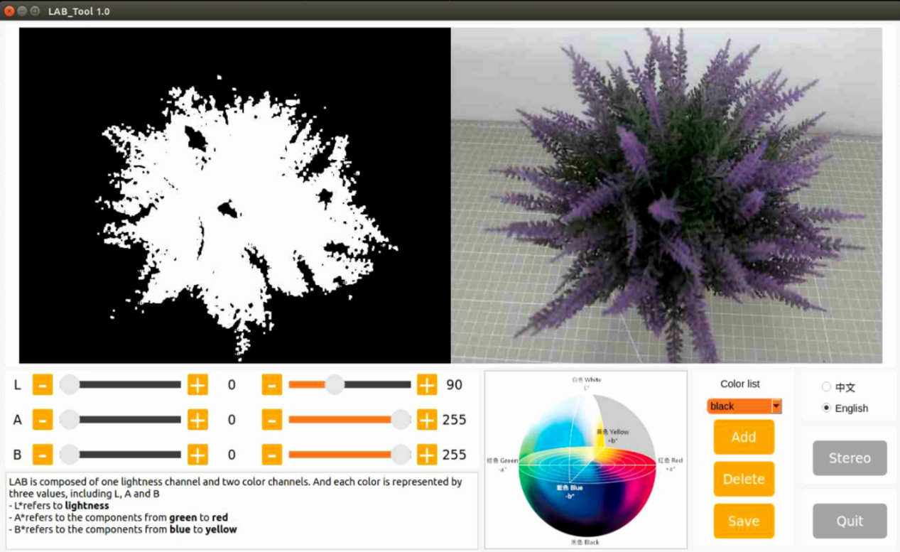

### 6.1.5 Copy Robot Files to the Virtual Machine and Compile

* **Export Files from the Robot**

1. Start the robot, and access the robot system desktop using NoMachine.

2. Double click 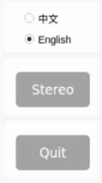 to open the command line terminal.

3. Execute the command "**sudo systemctl stop start_app_node.service**" and press Enter to disable app auto-start service.

```bah
sudo systemctl stop start_app_node.service
```

4. Open a new terminal-line window. Run the command "**cd ros_ws/src/"** to navigate to the "**ros_ws/src/**" directory.

```bah
cd ros_ws/src/
```

5. Execute the following command to package "**hiwonder_multi, hiwonder_navigation, hiwonder_peripherals, hiwonder_simulations, hiwonder_slam, and the explore, frontier_exploration, rrt_exploration, sparse_bundle_adjustment, virtual_wall files under the third_party directory**" into a compressed file.

```bah
zip -r src.zip hiwonder_multi hiwonder_navigation hiwonder_peripherals hiwonder_simulations hiwonder_slam third_party/explore third_party/frontier_exploration third_party/rrt_exploration third_party/sparse_bundle_adjustment third_party/virtual_wall
```

6. Click 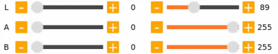on the system desktop to open the file directory, then navigate to the home/ros_ws/src directory:

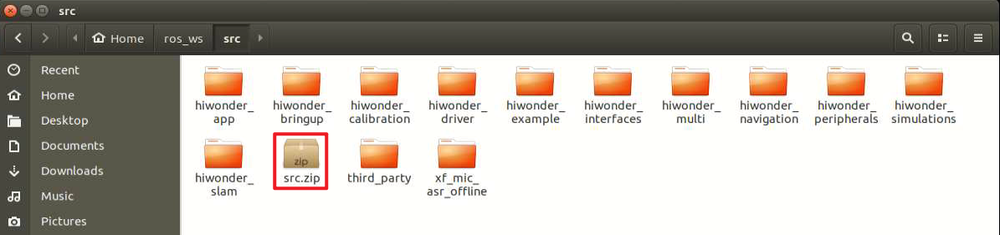

7. Drag the src.zip file to the system desktop.

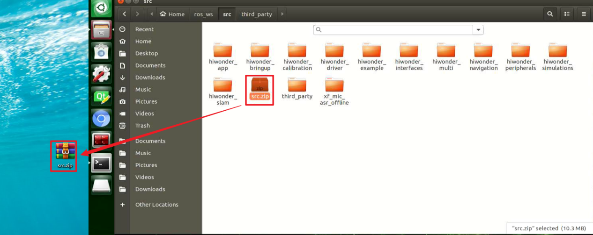

8. Click on the system desktop to open the file directory, then navigate to the home/ros_ws/ directory:

9. Use the shortcut "**ctrl+h**" to display the hidden "**.typerc**" file.

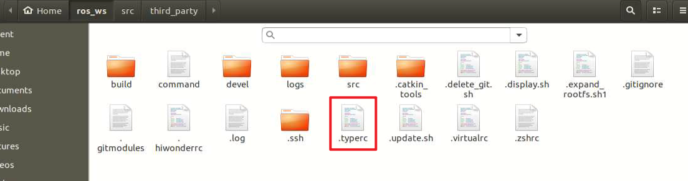

10. Drag the "**.typerc**" file to the system desktop.


* **Import Files to the Virtual Machine**

1)  Click  on system desktop to navigate to the home directory.


2)  Drag and drop the .typerc file and src.zip file from your computer desktop into the virtual machine:


* **Create and Compile Workspace**

1. Click 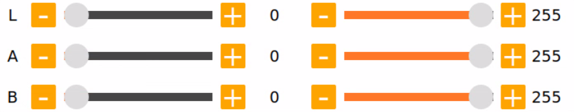on system desktop in virtual machine to open the command line terminal.

2. Input the command "**mkdir -p ros_ws/src**" to create the ros_ws/src file directory.

```bah
mkdir -p ros_ws/src
```

3. Run the command "**unzip src.zip -d /home/ubuntu/ros_ws/src/**" to unzip src.zip to the current home/ubuntu directory:

```bah
unzip src.zip -d /home/ubuntu/ros_ws/src/
```

4. Execute the command "**mv .typerc ros_ws/**" to move the .typerc file into the ros_ws directory:

```bah
mv .typerc ros_ws/
```

5. Input the command "**cd ros_ws/**" to enter the ros_ws directory.

```bah
cd ros_ws/
```

6. Input the command "**ls -a**" to check if .typerc has been moved to the ros_ws directory:

```bah
ls -a
```


7. Input the command "**catkin_make**" to compile the workspace.

```bah
catkin_make
```

8. If compilation errors occur, indicating that certain header files (such as exploration_msgs/SetPolygon.h, exploration_msgs/ExploreAction.h, and virtual_wall/Wall.h) cannot be found, please repeat the compilation process multiple times until it completes successfully.

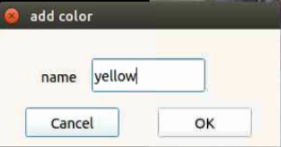


9. Input the command "**ifconfig**" to view the current IP address of the virtual machine:

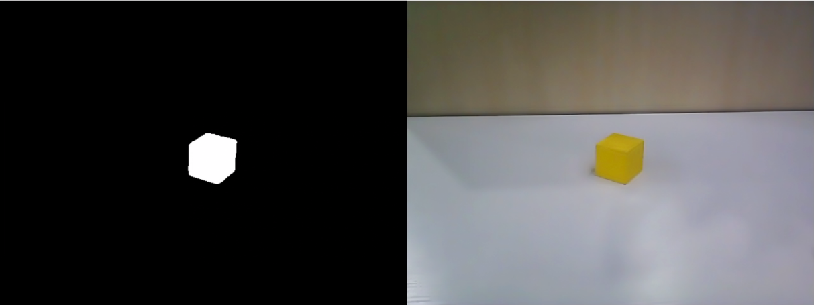

10. Input the command "**gedit ~/.bashrc**" to modify the .bashrc file.

```bah
gedit ~/.bashrc
```

11. Copy the following commands into the .bashrc file:

```bah
source /home/ubuntu/ros_ws/.typerc
source /home/ubuntu/ros_ws/devel/setup.bash
```

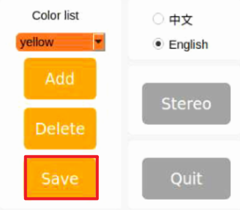

12. After writing the content, save and exit by using shortcut "Ctrl + S" or clicking the Save button located in the upper right corner.


13. Run the command "**source ~/.bashrc**" to refresh the environment configuration:

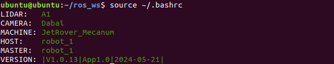

### 6.1.6 Configure Virtual Machine

**1. Configure Virtual Machine**

1) Connect the wireless network card to your computer. Click "**Edit**" on the virtual machine’s menu bar and select "**Virtual Network Editor**".

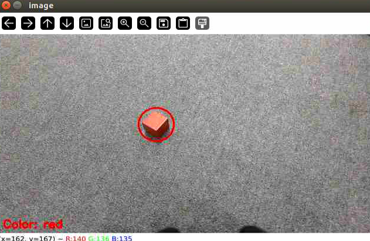

2)  Click "**Change Settings**" to obtain permission for modifications.

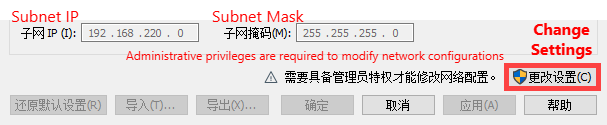

3)  Click "**Add network**".

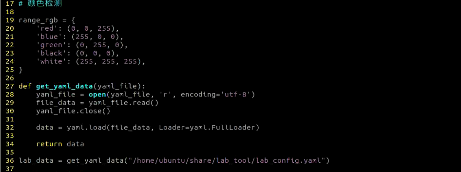

4)  Select the network. Take "**Vmnet0**" as example and click "**OK**".

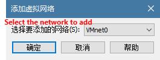

5)  Select the added network "**VMnet0**", and set it as the bridge mode. Then set the the bridge device to the network card. After making the modifications, click "**Yes**".

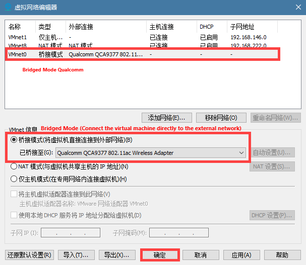

6)  Click "**Power on this virtual machine**". Wait for the system to boot up.

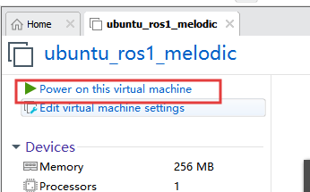

**2. Configure Virtual Machine Name**

> [!NOTE]
>
> **The entered commands should be case sensitive, and the "Tab" key can be used to complement the key words.**

1. Please first check if the virtual machine has the same name as the master name. Open the virtual machine and click 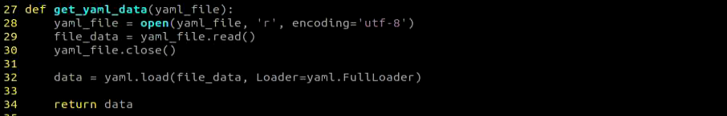to open the command line terminal.

2. Enter command "**vim ~/ros_ws/.typerc**" ot open the basic configuration file.

```bah
vim ~/ros_ws/.typerc
```

3)  "**HOST=robot_1**" and "**MASTER**" reamin unchanged, and press "**Esc**", and then enter "**:wq**" to save and exit.

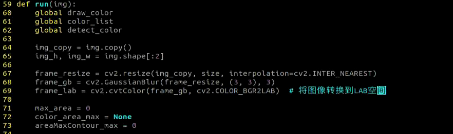

**3. Configure Virtual Machine Publishing Node Address**

1. Enter command "**ifconfig**" and press **"Enter**" to view IP address.

```bah
ifconfig
```

2. Record the IP in red box as pictured.

> [!NOTE]
>
> **If the corresponding IP does not appear, you need to enter the command "sudo dhclient ens33" to refresh the WI-Fi.**


3. Enter command "**gedit ~/.bashrc**" and press "**Enter**" to open the virtual machine configuration file.

```bah
gedit ~/.bashrc
```

4)  To add the following content to the .bashrc file and set "**MASER_IP=\$IP**" as "**MASER_IP=（virtual machine IP)**", then press "**Esc**" and enter "**:wq**" to save and exit.

```bah
export HOST_IP=192.168.1.186
export MASTER_IP=192.168.1.186
export ROS_MASTER_URI=http://$MASTER_IP:11311
export ROS_HOSTNAME=$HOST_IP
```

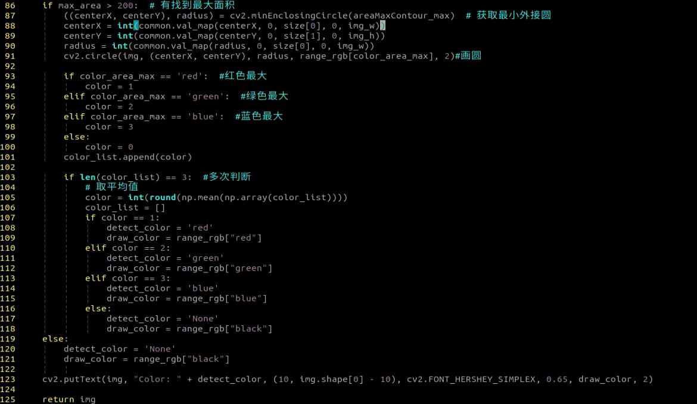

5. After editing, use the shortcut "Ctrl+S" or click"Save"button to save and exit.


6. Enter command "**source .bashrc**" to update the virtual machine configuration file to make the settings come into effective

```bah
source .bashrc
```

### 6.1.7 Configure Master

You can connect to the robot for modification using either NoMachine or an SSH tool. The connection can be established in the following two ways:

1.  Obtain the robot IP through app or router management interface.

2.  Connect the robot using USB cable and adopting the Static IP "**192.168.55.1**".

It’s recommended to use the second method for the stable connection. Even if the configuration make mistakes earlier, you can still connect and view. The operation steps are as follow:

1)  After powering on the robot, connect the robot and computer using USB cable.

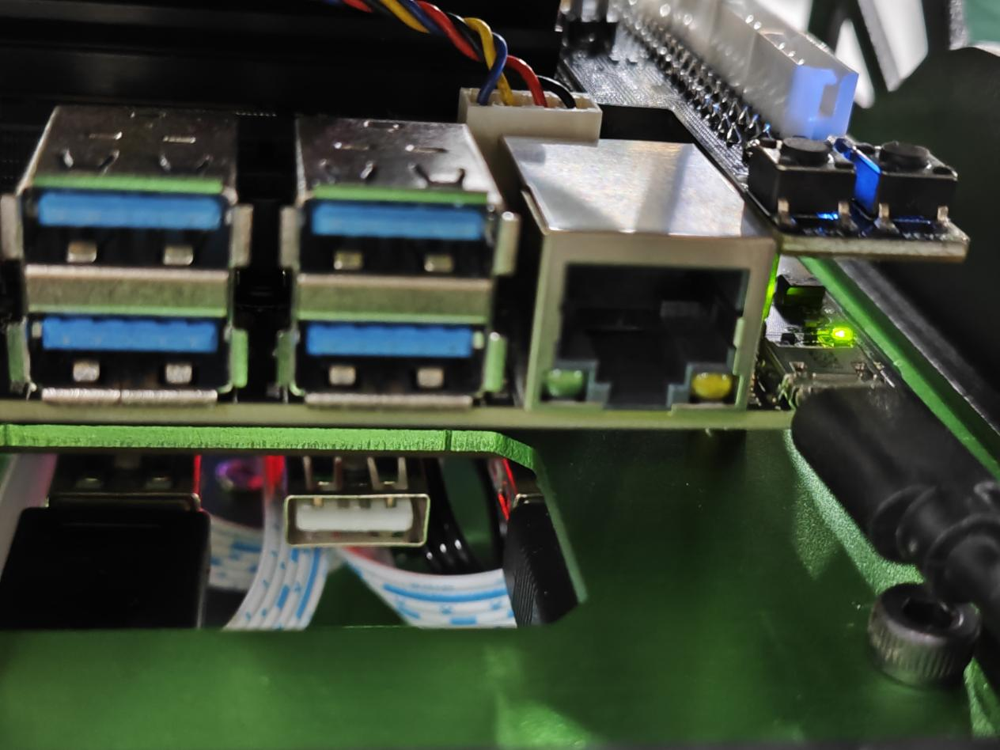

2)  Open NoMachine, and input "**192.168.55.1**" in the search bar, then press Enter


3)  Double click "Double click "**JetAcker-desktop**" device to enter the robot system.

4)  Double click to open the command line terminal.

* **Configure Master Network**

1. Enter command "**vim ./hiwonder-toolbox/hiwonder_wifi_conf.py**" and press Enter to open the network configuration file.

```bah
vim ./hiwonder-toolbox/hiwonder_wifi_conf.py
```

2)  From the top to the bottom as shown in the figure below. Change the content in the first red box to "**HW_WIFI_MODE = 2**", the second red box to "**HW_WIFI_STA_SSID = ‘(WIFI Name)**" and "**HW_WIFI_STA_PASSWORD = ‘（WiFi Password)**". Press "Esc" and enter ":wq" to save and exit.

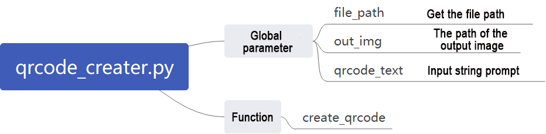

3. Enter command "**sudo systemctl restart hw_wifi.service**" to restart the robot’s WIFI service.

```bah
sudo systemctl restart hw_wifi.service
```

> [!NOTE]
>
> **It is mandatory to restart robot’s WIFI service, otherwise, the network configuration won’t take effect.**

4)  After the configuration is complete, the LED indicator on Jetson expansion board turns into solid blue, indicating that the configuration has taken effect.

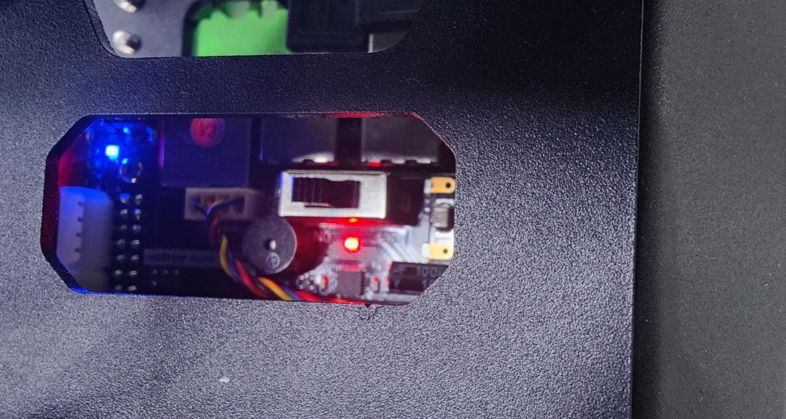

* **Configure Master Name**

> [!NOTE]
>
> The entered commands should be case sensitive, and the "**Tab**" key can be used to complement the key words.****

1. Enter command "**vim ros_ws/.typerc**" to open the basic information configuration file.

```bah
vim ros_ws/.typerc
```

2)  Check if the robot set as the master has been configured as shown in the red box. Press the "**Esc**" key, then enter "**:wq**" to save and exit.

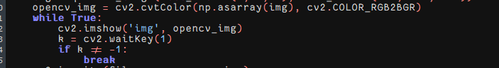

*  **Configure Master Publishing Node Address**

1. Enter command "**vim ros_ws/.hiwonderrc**" and press Enter to open the robot configuration file.

```bah
vim ros_ws/.hiwonderrc
```

2)  Set "**MASER_IP=\$IP**" to "**MASER_IP=(virtual machine IP)**", then press the "Esc" key and enter ":wq" to save and exit.


3. Enter command "**source .zshrc**" to update the robot configuration file.

```bah
source .zshrc
```

### 6.1.8 Configure Slave

*  **Configure Slave Name**

> [!NOTE]
>
> The entered commands should be case sensitive, and the "Tab" key can be used to complement the key words.

1. Enter command "**vim ros_ws/.typerc**" to open the basic information configuration file.

```bah
vim ros_ws/.typerc
```

2)  Check if the robot set as the slave has configured the content in the red box as "**HOST=(robot name, example: robot_2)**", "**MASTER=robot_1**", then press the "Esc" key, type ":wq" to save and exit.

> [!NOTE]
>
>* **The master must be robot_1.**
>
>* **The slave robot name can be set as robot_2, robot_3, and so on, but please do not set it as robot_1, as this may cause conflicts with the master and lead to errors.**

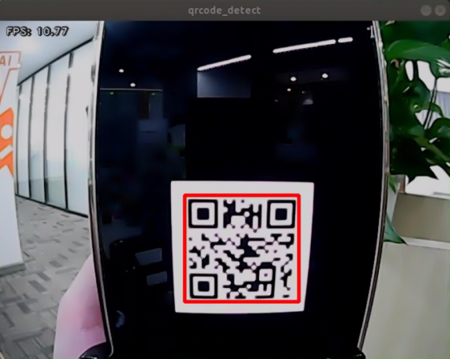

* **Configure Slave Publishing Node Address**

1. Enter command "**vim ros_ws/.hiwonderrc**" and press Enter to open the robot configuration file.

```bah
vim ros_ws/.hiwonderrc
```

2)  Set "**MASER_IP=\$IP**" to "**MASER_IP=(virtual machine IP)**", then press the "Esc" key and enter ":wq" to save and exit.


3. Enter command "**source .zshrc**" to update the robot configuration file.

```bah
source .zshrc
```

* **Configure Slave Network**

1. Enter command "**vim ./hiwonder-toolbox/hiwonder_wifi_conf.py**" and press Enter to open the network configuration file.

```bah
vim ./hiwonder-toolbox/hiwonder_wifi_conf.py
```

2)  From the top to the bottom as shown in the figure below. Change the content in the first red box to "**HW_WIFI_MODE = 2**", the second red box to "**HW_WIFI_STA_SSID = ‘(WIFI Name)**" and "**HW_WIFI_STA_PASSWORD = ‘（WiFi Password)**". Press "Esc" and enter ":wq" to save and exit.

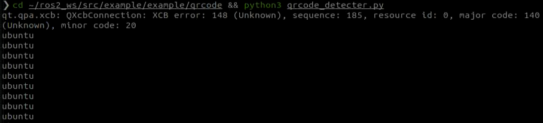

3. Enter command "**sudo systemctl restart hw_wifi.service**" to restart the robot’s WIFI service.

```bah
sudo systemctl restart hw_wifi.service
```

<p id="anchor_6_1_9"></p>

### 6.1.9 Configure Communication Between Virtual Machine and Robot

* **Connect Robot via Virtual Machine**

Using the SSH protocol, you can achieve centralized management of other nodes by the master node, such as parameter settings, testing, and debugging.

> [!NOTE]
>
> **The entered commands should be case sensitive, and the "Tab" key can be used to complement the key words.**

1)  In the virtual machine terminal interface, you can right-click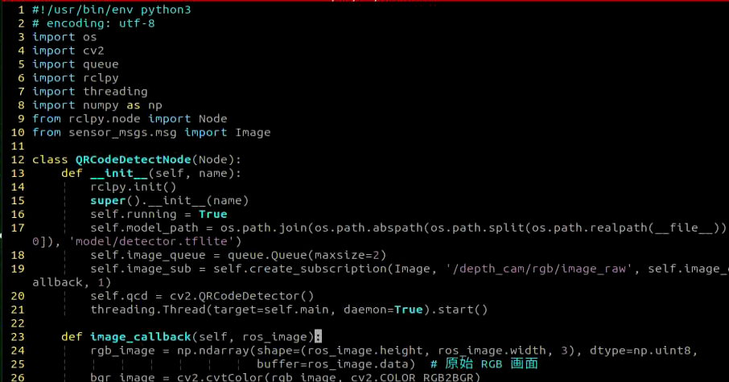 to split the terminal. "**Split Horizontally**" and "**Split Vertically**" respectively represent horizontal and vertical splits.

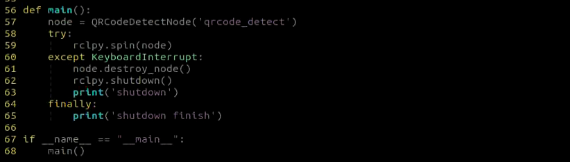

2. After splitting, enter the commands "**ssh robot_1**" and "**ssh robot_2**" respectively. Then input the remote password "**hiwonder**" to establish a remote connection.

```bah
ssh robot_1
```

```bah
ssh robot_2
```

3)  If you need to connect to other slaves, modify "**robot_X**" accordingly

* **Configure Virtual Machine SSH Communication**

1. Enter command "**ssh-keygen**" to initialize the SSH service. Follow the on-screen prompts, and press Enter or input "**y**" as instructed

```bah
ssh-keygen
```

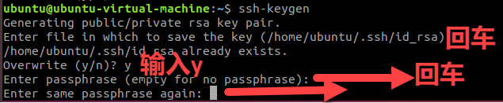

2. Enter command "**ssh-copy-id -i ubuntu@192.168.1.186"** to configure the SSH service. Here, the IP "**192.168.1.186**" is the IP of the virtual machine itself (modify the IP according to your own virtual machine environment, this is just an example). Press Enter, then enter the password when prompted. The password is "**ubuntu**"

```bah
ssh-copy-id -i ubuntu@192.168.1.186
```

* **Configure SSH Communication Between the Master and Slave**

Here, taking the master as an example, the steps and commands required for both the master and the slaves are the same. You need to configure as many as the number of slaves you have.

1)  Go back to the terminal interface of the robot, enter command "**ssh-keygen**" to initialize the SSH service. Press Enter continuously when prompted.

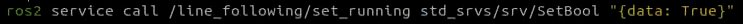

2)  Enter command "**ssh-copy-id -i ubuntu@192.168.1.186"** to configure SSH service. Replace the IP address "**192.168.1.186**" with the actual IP address of your virtual machine (the IP address depends on your own virtual machine environment, this text is just an example). After entering pressing Enter, you will be prompted to enter the password. The password is "**ubuntu"**.

```bah
ssh-copy-id -i ubuntu@192.168.1.186
```

* **Configure Virtual Machine SSH Communication Parameters**

1. Enter the command "**vim .ssh/config**" to configure the SSH parameters.

```bah
vim .ssh/config
```

2)  Fill in the config file according to the below figure, where "**robot_1**" and "**robot_2**" are the names of the robots, HostName is the IP address of the robot and User is the username of the robot. You can add more robots following the same format according the number of robots you need to control. Press "**Esc**" key, then type "**:wq**" to save and exit.

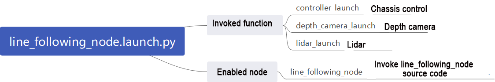

### 6.1.10 Synchronize Time (Must-read!!)

Time synchronization is particularly crucial to ROS robot group control system. If the clocks are not synchronized, it can result in incorrect message transmission or processing out of order. Robots need to confirm and perform time synchronization every time they restart or boot up.

1)  Open virtual machine and click to open the command line terminal.

2)  Right-click the terminal to select "**Split Horizontally**".

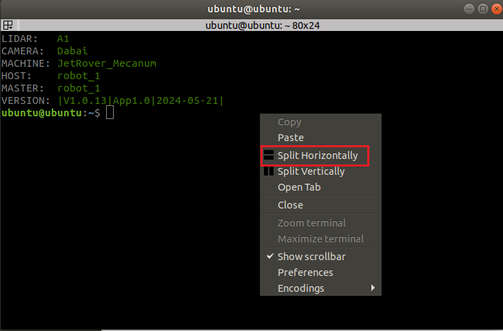

3)  In the first split column, type command "**ssh robot_1**" to connect the master and host respectively according to "**[6.1.9 Configure Communication Between Virtual Machine and Robot ->Connect Robot via Virtual Machine](#anchor_6_1_9)**".

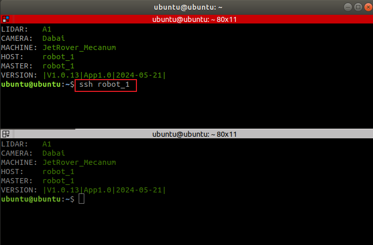

4)  Click on the position where the below arrow is pointing. Then select "**Broadcast all**" to activate the broadcast mode to both columns.

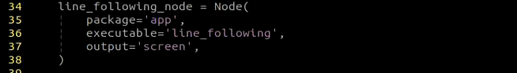

5. In the first command, type the command "**sudo date -s "2022/12/6 19:42:7"**" to synchronize time between the virtual machine and the robot connected via SSH. The time specified in the command "**"2022/12/6 19:42:7"**", can be customized by users.

```bah
sudo date -s "2022/12/6 19:42:7
```

6)  After settings, enter the command "**date**" to check if the time is synchronized successfully.

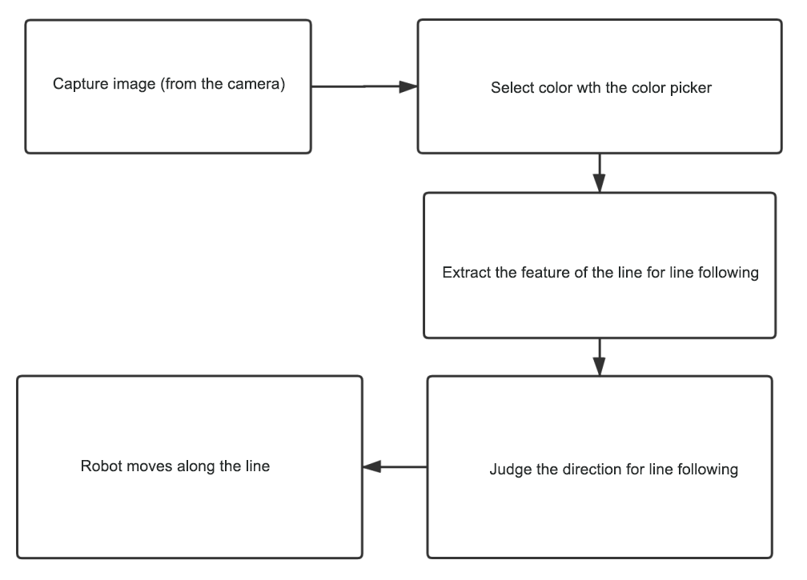

7)  After synchronization, click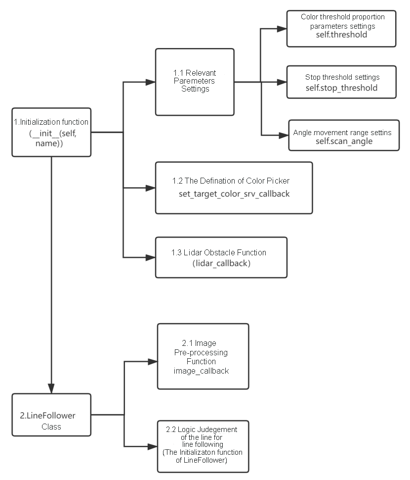 on the upper left of the terminal to select "**Broadcast off**" to cancel the command broadcast mode.

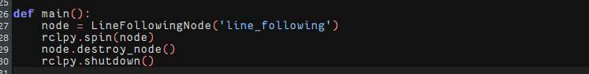

##  6.2 Group Control

In group control, you can use one wireless handle to control multiple JetRover robots to perform actions simultaneously.

### 6.2.1 Preparations

1)  Prepare two and above JetAcker robots

2)  Install the virtual machine

3)  Configure communication for the both master and slave.

4)  Plug the USB handle receiver into the master,while the slave does not require a receiver. All slaves should unplug the handle receiver.

### 6.2.2 Synchronize Time

Time synchronization is particularly crucial to ROS robot group control system. If the clocks are not synchronized, it can result in incorrect message transmission or processing out of order. Robots need to confirm and perform time synchronization every time they restart or boot up.

1)  Open virtual machine and click to open the command line terminal.

2)  Right-click the terminal to select "**Split Horizontally**".

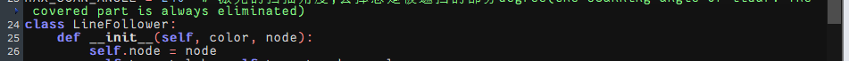

3. In the first split column, type command "**ssh robot_1**", "**ssh robot_2**" and "**ssh robot_3**" to connect the master and host respectively according to "**[6.1.9 Configure Communication Between Virtual Machine and Robot ->Connect Robot via Virtual Machine](#anchor_6_1_9)**". Then enter the password "hiwonder" to remotely connect to the robot system.

```bah
ssh robot_1
```

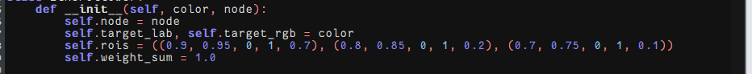

The connected three robots will display in the virtual machine as pictures.

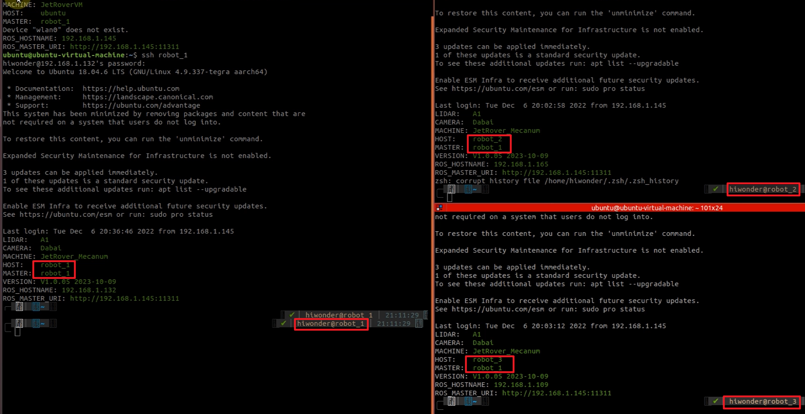

At this point, open a new terminal in virtual machine to facilitate the time synchronization between the robot and the virtual machine.

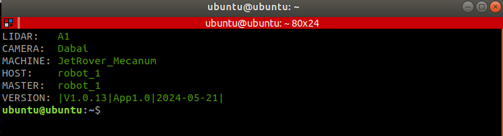

4)  Click on the position where the below arrow is pointing. Then select "**Broadcast all**" to activate the broadcast mode to both columns.


5. In the first command, type the command "**sudo date -s "2022/12/6 19:42:7"**" to synchronize time between the virtual machine and the robot connected via SSH. The time specified in the command "**"2022/12/6 19:42:7"**", can be customized by users.

```bah
sudo date -s "2022/12/6 19:42:7
```

6)  After settings, enter the command "**date**" to check if the time is synchronized successfully.


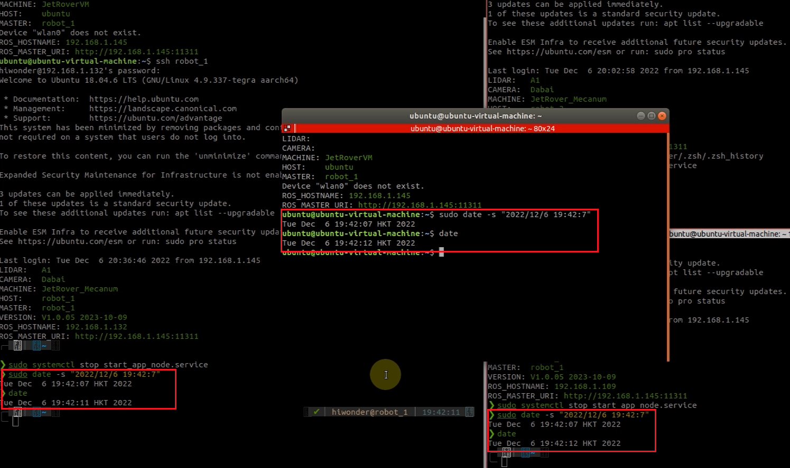

7)  After synchronization, you can run the command **"sudo systemctl stop start_app_node.service**" to simultaneously disable the app servo for three robots under broadcast mode.

```bah
sudo systemctl stop start_app_node.service
```

8)  After synchronization and disabling app service, click on the upper left of the terminal to select "**Broadcast off**" to cancel the command broadcast mode.


### 6.2.3 Enable Service

* **Enable Virtual Machine Node Controller**

Open the command line terminal, and enter the command "**roscore**" to enable the nodes communication service.

```bah
roscore
```

* **Enable Handle Control Service of the Master (robot_1)**

Input command "**roslaunch hiwonder_multi multi_control.launch**" and press Enter to enable group control service.

```bah
roslaunch hiwonder_multi multi_control.launch
```

* **Enable Handle Control Service of the Slave (robot_2)**

Waif for the master service to start completely, then enter the command "**roslaunch hiwonder_multi multi_control.launch**" in the connected terminal to activate the group control service.

```bah
roslaunch hiwonder_multi multi_control.launch
```

If there are more slave robots, please individually enable the handle control service on each slave robot.

### 6.2.4 Handle Buttons Function

Turn on the gamepad switch, and first press the "**Start**" button to confirm the connection to the robot. Once you hear a "**beep**" from the buzzer, it indicates that the connection is successful. You can then use the gamepad to control multiple robots.
The following table describes the functions of the gamepad's buttons and joysticks:

| **Button** | **Function** | Instruction |
|:--:|:--:|:--:|
| START | Stop and reset body | Short press |
| Push up the left joystick | Move forward | Long press |
| Push down the left joystick | Move backward | Long press |
| Push the left joystick to left | Move to left (mecanum wheel chassis only) | Long press |
| Push the left joystick to right | Move to right (mecanum wheel chassis only) | Long press |
| Push the right joystick to left | Turn left (only for the Ackerman steering front wheels) | Long press |
| Push the right joystick to right | Turn right (only for the Ackerman steering front wheels) | Long press |

<p id="anchor_6_3"></p>

##  6.3 Multi-robot Mapping

Multi-robot Mapping means that use one wireless handle to control multiple JetRover robots to move synchronously so as to map the surroundings together.

The working logic of multi-robot mapping is as follow.

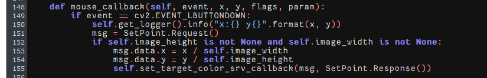

### 6.3.1 Preparation

1)  Prepare two and above JetAcker robots.

2)  Install the virtual machine.

3)  Configure communication for the both master and slave.

4)  Place the robots in the place to be mapped. It is recommended to let the robot map in the indoor, because the light and distance of the outdoor will affect the mapping effect.

5)  Place the robots side by side on a wide platform. From the perspective of the robot, position the master on the right and the slave on the left, with a distance of 1 meter between them.

### 6.3.2 Synchronize Time

Time synchronization is particularly crucial to ROS robot group control system. If the clocks are not synchronized, it can result in incorrect message transmission or processing out of order. Robots need to confirm and perform time synchronization every time they restart or boot up.

1)  Open virtual machine and click to open the command line terminal.

2)  Right-click the terminal to select "**Split Horizontally**".


3. In the first split column, type command "**ssh robot_1**", "**ssh robot_2**" and "**ssh robot_3**" to connect the master and host respectively according to "**[6.1.9 Configure Communication Between Virtual Machine and Robot ->Connect Robot via Virtual Machine](#anchor_6_1_9)**". Then enter the password "hiwonder" to remotely connect to the robot system.

```bah
ssh robot_1
```


The connected three robots will display in the virtual machine as pictures.


At this point, open a new terminal in virtual machine to facilitate the time synchronization between the robot and the virtual machine.


4)  Click on the position where the below arrow is pointing. Then select "**Broadcast all**" to activate the broadcast mode to both columns.


5. In the first command, type the command "**sudo date -s "2022/12/6 19:42:7"**" to synchronize time between the virtual machine and the robot connected via SSH. The time specified in the command "**"2022/12/6 19:42:7"**", can be customized by users.

```bah
sudo date -s "2022/12/6 19:42:7
```

6)  After settings, enter the command "**date**" to check if the time is synchronized successfully.


7)  After synchronization, you can run the command **"sudo systemctl stop start_app_node.service**" to simultaneously disable the app servo for three robots under broadcast mode.

```bah
sudo systemctl stop start_app_node.service
```

9)  After synchronization and disabling app service, click on the upper left of the terminal to select "**Broadcast off**" to cancel the command broadcast mode.


### 6.3.3 Map with Gmapping Algorithm

> [!NOTE]
>
> **The entered command should be case sensitive, and the keyword can be complemented by "Tab" key.**

1)  Start JetAcker, and connect the robot to the computer through USB cable after the LED1 on expansion board lights up.

2)  Connect the master and slave robots using SSH in the virtual machine according to "**[6.1.9 Configure Communication Between Virtual Machine and Robot ->Connect Robot via Virtual Machine](#anchor_6_1_9)**".

* **Start Virtual Machine Node Controller**

Open the command line terminal and enter the command "**roscore**" to enable the nodes communication service.

```bah
roscore
```

* **Enable Mapping Service for the Master (robot_1)**

In the connected command line terminal, enter the command "**roscd hiwonder_multi/launch/multi_slam && roslaunch master_node.launch**" to enable the mapping service on the master.

```bah
roscd hiwonder_multi/launch/multi_slam && roslaunch master_node.launch
```

* **Enable Mapping Service for the Slave (robot_2)**

Wait for the master service to enable, then enter the command "**roscd hiwonder_multi/launch/multi_slam && roslaunch slave_node.launch**" in the connected terminal to enable the mapping service on the slave

```bah
roscd hiwonder_multi/launch/multi_slam && roslaunch slave_node.launch
```

* **View Mapping Process on RIVZ**

Enter the command "**roslaunch hiwonder_multi multi_slam_rviz.launch**" and press Enter to access the specific directory. Open RVIZ to view mapping process.

```bah
roslaunch hiwonder_multi multi_slam_rviz.launch
```

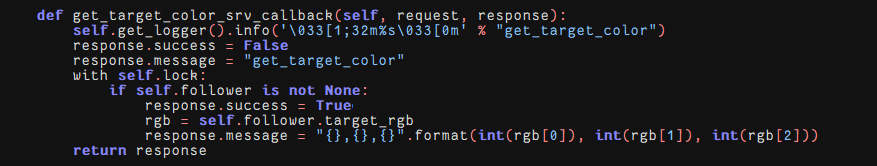

After all robots are configured, turn on the first handle switch. Wait for the handle to connect to the master, then you can use the handle to control the matter to move and construct the map of the current area. Turn on the second handle. Once the handle connects to the slave, you can use the handle to control the slave to move and construct the map of the current area.

The above example uses two robot to perform mapping process. If there are more robots, the corresponding numbers of handles are required to control the robots.

* **Save Map**

Take "**master (robot_1)**" as an example. Users can follow the same steps to save map on the slave.

1. Enter the command "**roscd hiwonder_slam/maps && rosrun map_server map_saver map:=/robot_1/map -f map_01**" and press Enter to save the map.

```bah
roscd hiwonder_slam/maps && rosrun map_server map_saver map:=/robot_1/map -f map_01
```

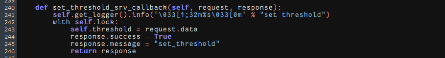

2)  The "**map_01**" in command is the map name. It can be customized. The below prompt indicates that the map is saved successfully.

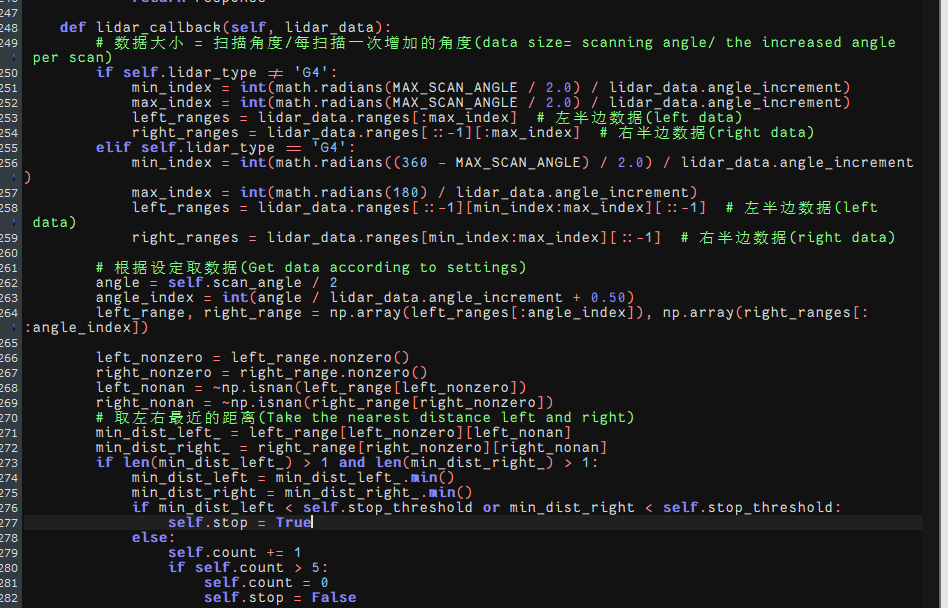

##  6.4 Multi-robot Formation

Multi-robot formation means that you can use one handle to control multiple JetRover cars to move in fixed formation as pictured, including row, column and triangle (the robot cars will adjust their position based on navigation and localization information to ensure their relative positions).

robot_1 the master robot，and robot_2 and robot_3 are slave robots.

| **Formation type** | **Picture** |
|:--:|:--:|
| row | 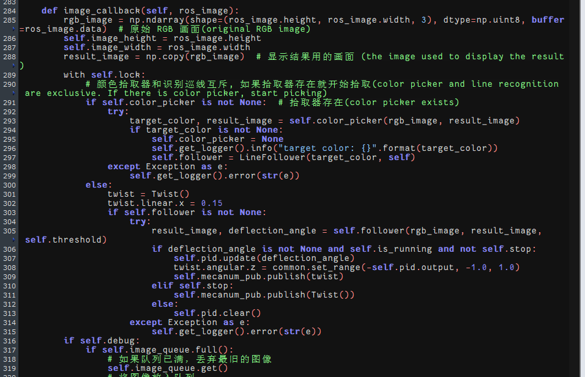 |
| column |  |
| triangle | 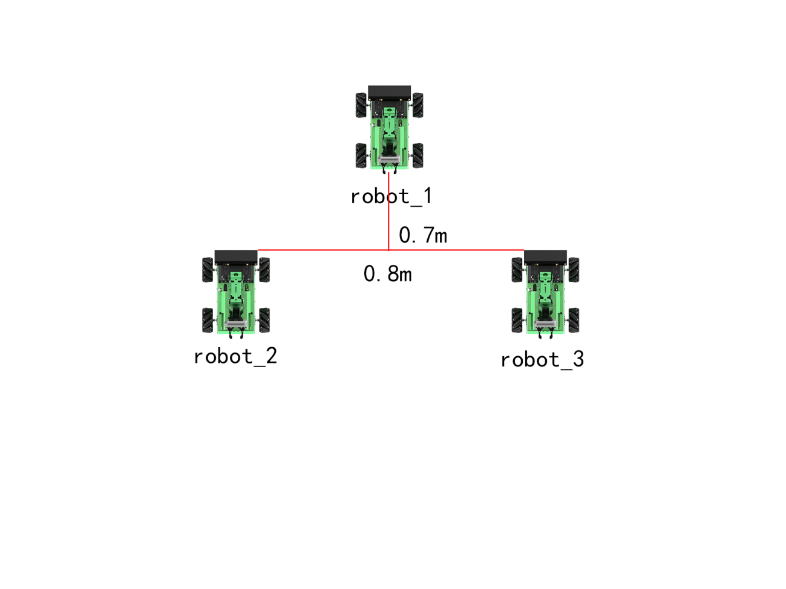 |

### 6.4.1 Preparation

1)  Prepare two and above JetAcker robots

2)  Install the virtual machine

3)  Configure communication for the both master and slave.

4)  Build a map of the current area where robot is located. If you need to understand the mapping method, please refer to the above content "**[6.3 Multi-robot Mapping](#anchor_6_3)**".

> [!NOTE]
>
> **Note: The map of each robot must be stored under the directory "ros_ws/src/hiwonder_multi/maps".**

5)  Place the robot according to the selected formation type within the map.

### 6.4.2 Synchronize Time

Time synchronization is particularly crucial to ROS robot group control system. If the clocks are not synchronized, it can result in incorrect message transmission or processing out of order. Robots need to confirm and perform time synchronization every time they restart or boot up.

1)  Open virtual machine and click to open the command line terminal.

2)  Right-click the terminal to select "**Split Horizontally**".


3. In the first split column, type command "**ssh robot_1**", "**ssh robot_2**" and "**ssh robot_3**" to connect the master and host respectively according to "**[6.1.9 Configure Communication Between Virtual Machine and Robot ->Connect Robot via Virtual Machine](#anchor_6_1_9)**". Then enter the password "hiwonder" to remotely connect to the robot system.

```bah
ssh robot_1
```


The connected three robots will display in the virtual machine as pictures.


At this point, open a new terminal in virtual machine to facilitate the time synchronization between the robot and the virtual machine.


4)  Click on the position where the below arrow is pointing. Then select "**Broadcast all**" to activate the broadcast mode to both columns.


5. In the first command, type the command "**sudo date -s "2022/12/6 19:42:7"**" to synchronize time between the virtual machine and the robot connected via SSH. The time specified in the command "**"2022/12/6 19:42:7"**", can be customized by users.

```bah
sudo date -s "2022/12/6 19:42:7
```

6)  After settings, enter the command "**date**" to check if the time is synchronized successfully.


7)  After synchronization, you can run the command **"sudo systemctl stop start_app_node.service**" to simultaneously disable the app servo for three robots under broadcast mode.

```bah
sudo systemctl stop start_app_node.service
```

10) After synchronization and disabling app service, click on the upper left of the terminal to select "**Broadcast off**" to cancel the command broadcast mode.


### 6.4.3 Enable Formation Service

> [!NOTE]
>
> **The entered command should be case sensitive, and the keyword can be complemented by "Tab" key.**

1)  Start JetAcker, and connect the robot to the computer through USB cable after the LED1 on expansion board lights up.

2)  Connect the master and slave robots using SSH in the virtual machine according to "**[6.1.9 Configure Communication Between Virtual Machine and Robot ->Connect Robot via Virtual Machine](#anchor_6_1_9)**".

* **Enable Formation Service for the Master (robot_1)**

Open the command line terminal and enter the command "**roscore**" to enable the nodes communication service.

```bah
roscore
```

* **Enable Formation Service for the Master (robot_1)**

Enter the corresponding command for the master robot formation service in the terminal according to the following formation commands.

Row:**"roscd hiwonder_multi/launch/multi_formation && roslaunch master_node.launch map:=map_01 multi_mode:=row"**

Column:**"roscd hiwonder_multi/launch/multi_formation && roslaunch master_node.launch map:=map_01 multi_mode:=column"**

Triangle:**"roscd hiwonder_multi/launch/multi_formation && roslaunch master_node.launch map:=map_01 multi_mode:=triangle"**

Enable the master formation service.

* **Enable Formation Service for the Slave (robot_2)**

Wait for the mater service to start, then enter the command "**roscd hiwonder_multi/launch/multi_formation && roslaunch slave_node.launch**" in the connected terminal to enable the formation service for the slave.

```bah
roscd hiwonder_multi/launch/multi_formation && roslaunch slave_node.launch
```

* **Check Navigation on RIVZ**

Enter the command **"roslaunch hiwonder_multi multi_formation_rviz.launch**" and press Enter to open RIVZ tool.

```bah
roslaunch hiwonder_multi multi_formation_rviz.launch
```

##  6.5 Multi-robot Navigation

**Multi-robot navigation means that after several JetRover cars collaborate with each other to construct one map, they will navigate together and can avoid hitting the front cars within 240-degree.**

### 6.5.1 Preparation

1)  Prepare two and above JetAcker robots.

2)  Install the virtual machine.

3)  Configure communication for the both master and slave.

4)  Place the robots in the place to be mapped. It is recommended to let the robot map in the indoor, because the light and distance of the outdoor will affect the mapping effect.

> [!NOTE]
>
> **Note: The map of each robot must be stored under the directory "ros_ws/src/hiwonder_multi/maps".**

### 6.5.2 Synchronize Time

Time synchronization is particularly crucial to ROS robot group control system. If the clocks are not synchronized, it can result in incorrect message transmission or processing out of order. Robots need to confirm and perform time synchronization every time they restart or boot up.

1)  Open virtual machine and click to open the command line terminal.

2)  Right-click the terminal to select "**Split Horizontally**".


3. In the first split column, type command "**ssh robot_1**", "**ssh robot_2**" and "**ssh robot_3**" to connect the master and host respectively according to "**[6.1.9 Configure Communication Between Virtual Machine and Robot ->Connect Robot via Virtual Machine](#anchor_6_1_9)**". Then enter the password "hiwonder" to remotely connect to the robot system.

```bah
ssh robot_1
```


The connected three robots will display in the virtual machine as pictures.


At this point, open a new terminal in virtual machine to facilitate the time synchronization between the robot and the virtual machine.


4)  Click on the position where the below arrow is pointing. Then select "**Broadcast all**" to activate the broadcast mode to both columns.


5. In the first command, type the command "**sudo date -s "2022/12/6 19:42:7"**" to synchronize time between the virtual machine and the robot connected via SSH. The time specified in the command "**"2022/12/6 19:42:7"**", can be customized by users.

```bah
sudo date -s "2022/12/6 19:42:7
```

6)  After settings, enter the command "**date**" to check if the time is synchronized successfully.


7. After synchronization, you can run the command **"sudo systemctl stop start_app_node.service**" to simultaneously disable the app servo for three robots under broadcast mode.

```bah
sudo systemctl stop start_app_node.service
```

8. After synchronization and disabling app service, click on the upper left of the terminal to select "**Broadcast off**" to cancel the command broadcast mode.


### 6.5.3 Enable Navigation Service 

> [!NOTE]
>
> **The entered command should be case sensitive, and the keyword can be complemented by "Tab" key.**

1)  Start JetAcker, and connect the robot to the computer through USB cable after the LED1 on expansion board lights up.

2)  Connect the master and slave robots using SSH in the virtual machine according to "**[6.1.9 Configure Communication Between Virtual Machine and Robot ->Connect Robot via Virtual Machine](#anchor_6_1_9)**".

* **Enable Virtual Machine Node Controller**

Open the command line terminal and enter the command "**roscore**" to enable the nodes communication service.

```bah
roscore
```

* **Enable Navigation Service for the Master (robot_1)**

In the connected command terminal, enter the command "**roscd hiwonder_multi/launch/multi_navigation && roslaunch master_node.launch map:=map_01**" to enable the mapping service for the master.

```bah
roscd hiwonder_multi/launch/multi_navigation && roslaunch master_node.launch map:=map_01
```

* **Enable Navigation Service for the Slave (robot_2)**

Wait for the master service to enable, then enter the command "**roscd hiwonder_multi/launch/multi_navigation && roslaunch slave_node.launch**" in the connected terminal to enable the mapping service for the slave.

```bah
roscd hiwonder_multi/launch/multi_navigation && roslaunch slave_node.launch
```

* **Check Navigation on RIVZ**

Enter the command "**roslaunch hiwonder_multi multi_navigation_rviz.launch**" and press Enter to open RIVZ tool.

```bah
roslaunch hiwonder_multi multi_navigation_rviz.launch
```

After starting the navigation, it's necessary to calibrate the robot's position on the map to correspond to its real location. You can refer to 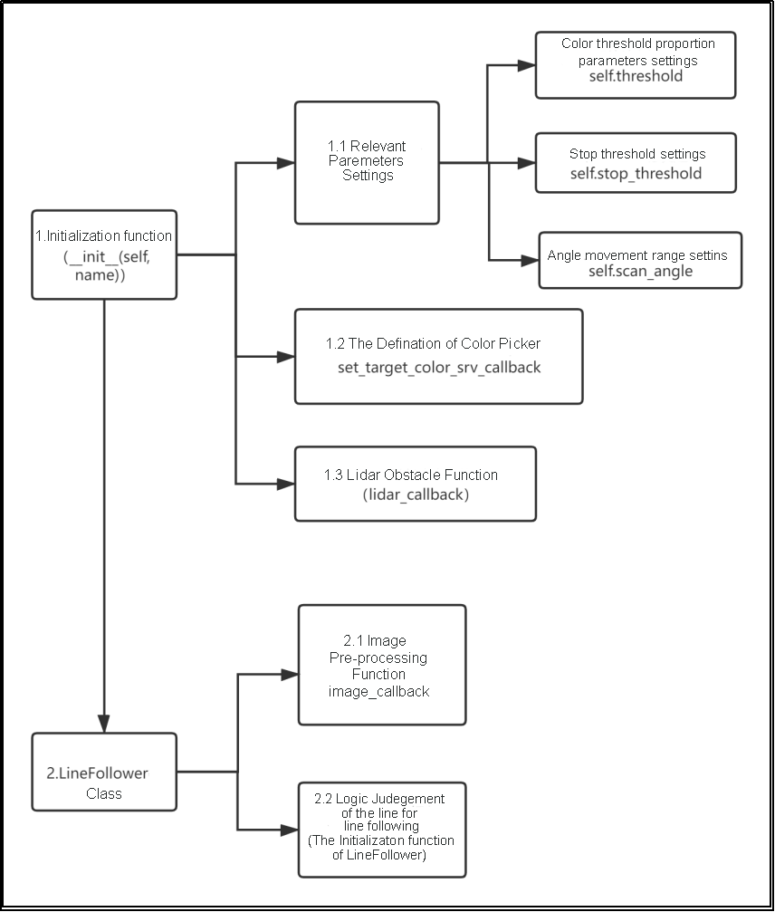 in 6.5.4 Usage Instruction of RIVZ for guidance.

### 6.5.4 Usage Instruction of RIVZ

RVIZ is a 3D visualizer for the Robot Operating System (ROS) framework. RVIZ allows you to visualize the information, and send message to the object to monitor and control it.

The functions of the keys are listed below.

<table class="docutils-nobg" border="1">
<colgroup>
<col style="width: 28%" />
<col style="width: 71%" />
</colgroup>
<tbody>
<tr>
<td style="text-align: center;"><strong>Icon</strong></td>
<td style="text-align: center;"><strong>Functions</strong></td>
</tr>
<tr>
<td style="text-align: center;"></td>
<td style="text-align: left;">Select the robot or designate the position where the angle should be adjusted</td>
</tr>
<tr>
<td style="text-align: center;"></td>
<td style="text-align: left;">Select this tool and left press your mouse without release to adjust the camera angle</td>
</tr>
<tr>
<td style="text-align: center;"></td>
<td style="text-align: left;">Select this tool and left press your mouse without release to select the model</td>
</tr>
<tr>
<td style="text-align: center;"></td>
<td style="text-align: left;">Select this tool and left click one point on the 3D model area randomly to set it as the center of the map.</td>
</tr>
<tr>
<td style="text-align: center;"></td>
<td style="text-align: left;">Select this tool, and respectively click the starting point and end point on the 3D model area to range the distance between them</td>
</tr>
<tr>
<td style="text-align: center;"></td>
<td style="text-align: left;"><p>Set the initial position of the robot on 3D model area. This tool is only applicable to navigation.</p>
<p>When the actual position of the robot is not in line with that on 3D model area, you need to reset the position of the robot on 3D model area.</p>
<p>After clicking this tool, left click any point on 3D model area to set it as the initial position of the robot.</p></td>
</tr>
<tr>
<td style="text-align: center;"></td>
<td style="text-align: left;"><p>Publish single target point.</p>
<p>After clicking this tool, left click any point on 3D model area to set it as the target destination.</p>
<p>After the point is set, robot will design a path toward the target point automatically.</p></td>
</tr>
</tbody>
</table>


##  6.6Multi-robot Surrounding

**In multi-robot surrounding game, you can use one handle to control one robot to drive around other robot.**

**robot_1 is the master robot, and robot_2 is the slave robot.**

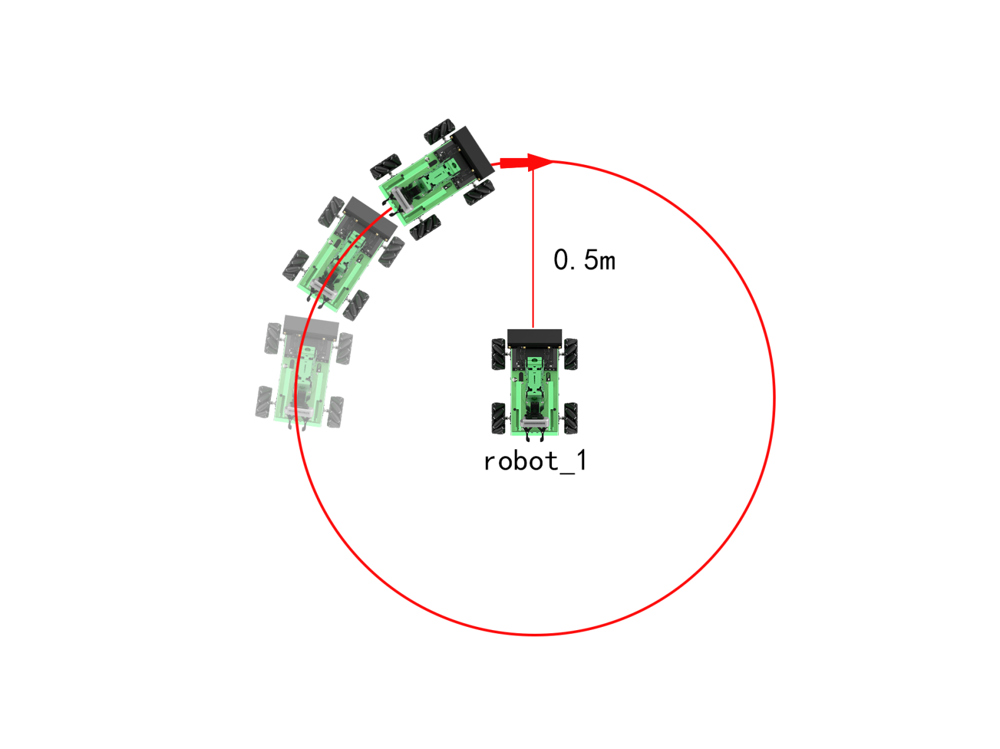

### 6.6.1 Preparation

1)  Prepare two and above JetAcker robots.

2)  Install the virtual machine.

3)  Configure communication for the both master and slave.

4)  Place the robots in the place to be mapped. It is recommended to let the robot map in the indoor, because the light and distance of the outdoor will affect the mapping effect.

> [!NOTE]
>
> **The map of each robot must be stored under the directory "ros_ws/src/hiwonder_multi/maps".**

### 6.6.2 Synchronize Time

Time synchronization is particularly crucial to ROS robot group control system. If the clocks are not synchronized, it can result in incorrect message transmission or processing out of order. Robots need to confirm and perform time synchronization every time they restart or boot up.

1)  Open virtual machine and click to open the command line terminal.

2)  Right-click the terminal to select "**Split Horizontally**".


3. In the first split column, type command "**ssh robot_1**", "**ssh robot_2**" and "**ssh robot_3**" to connect the master and host respectively according to "**[6.1.9 Configure Communication Between Virtual Machine and Robot ->Connect Robot via Virtual Machine](#anchor_6_1_9)**". Then enter the password "**hiwonder**" to remotely connect to the robot system.

```bah
ssh robot_1
```


The connected three robots will display in the virtual machine as pictures.


At this point, open a new terminal in virtual machine to facilitate the time synchronization between the robot and the virtual machine.


4)  Click on the position where the below arrow is pointing. Then select "**Broadcast all**" to activate the broadcast mode to both columns.


5. In the first command, type the command "**sudo date -s "2022/12/6 19:42:7"**" to synchronize time between the virtual machine and the robot connected via SSH. The time specified in the command "**"2022/12/6 19:42:7"**", can be customized by users.

```bah
sudo date -s "2022/12/6 19:42:7
```

6)  After settings, enter the command "**date**" to check if the time is synchronized successfully.


7)  After synchronization, you can run the command **"sudo systemctl stop start_app_node.service**" to simultaneously disable the app servo for three robots under broadcast mode.

```bah
sudo systemctl stop start_app_node.service
```

11) After synchronization and disabling app service, click on the upper left of the terminal to select "**Broadcast off**" to cancel the command broadcast mode.


### 6.6.3 Enable Surrounding Service

> [!NOTE]
>
> **The entered command should be case sensitive, and the keyword can be complemented by "Tab" key.**

1)  Start JetAcker, and connect the robot to the computer through USB cable after the LED1 on expansion board lights up.

2)  Connect the master and slave robots using SSH in the virtual machine according to "**[6.1.9 Configure Communication Between Virtual Machine and Robot ->Connect Robot via Virtual Machine](#anchor_6_1_9)**".

* **Enable Virtual Machine Node Controller**

Open the command line terminal and enter the command "**roscore**" to enable the nodes communication service.

```bah
roscore
```

* **Enable the Master Service (robot_1)**

In the connected command terminal, enter the command "**roscd hiwonder_multi/launch/multi_surround && roslaunch master_node.launch map:=map_01**" to enable the mapping service for the master.

```bah
roscd hiwonder_multi/launch/multi_surround && roslaunch master_node.launch map:=map_01
```

* **Enable the Slave Service (robot_2)**

Wait for the master service to enable, then enter the command "**roscd hiwonder_multi/launch/multi_surround && roslaunch slave_node.launch**" in the connected terminal to enable the mapping service for the slave.

```bah
roscd hiwonder_multi/launch/multi_surround && roslaunch slave_node.launch
```

* **Check Performance on RVIZ**

Enter the command "**roslaunch hiwonder_multi multi_surround_rviz.launch**" and press Enter to open RVIZ tool.

```bah
roslaunch hiwonder_multi multi_surround_rviz.launch
```
