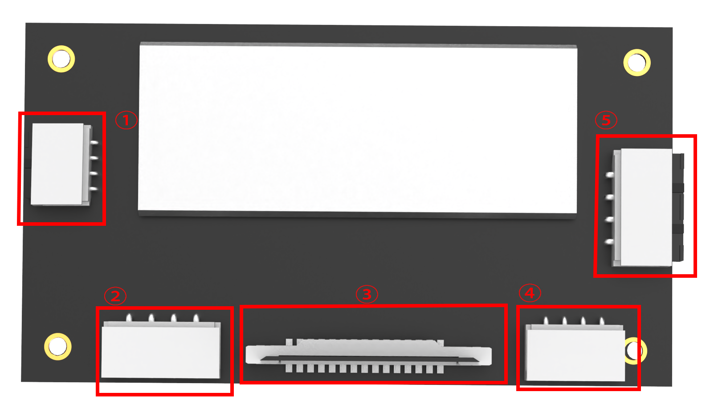
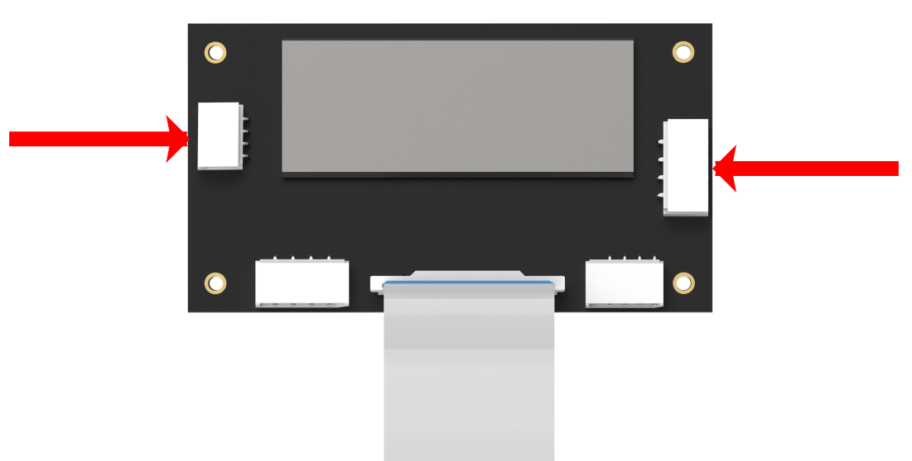
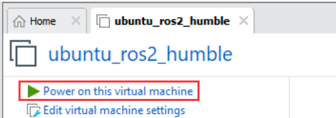
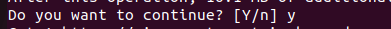
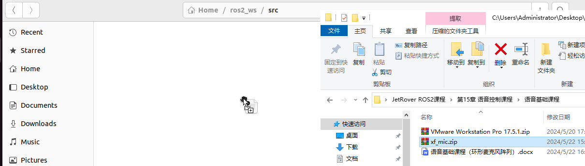
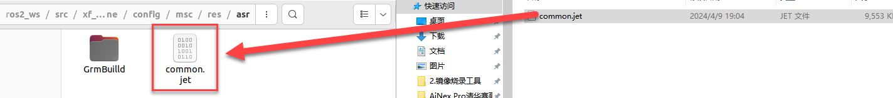
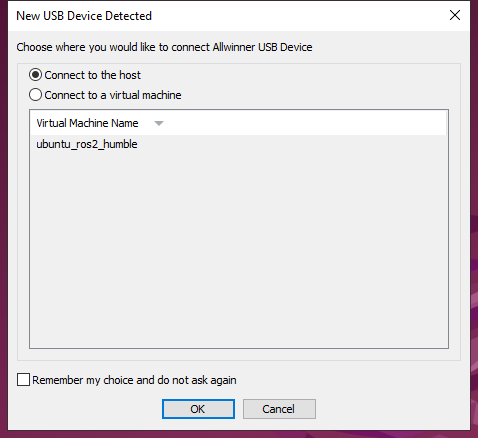
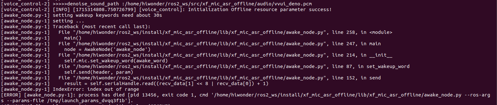
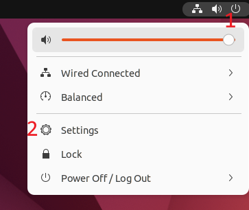
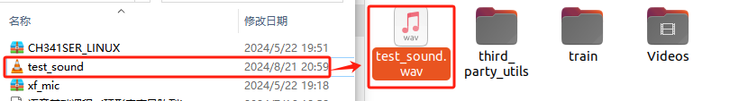

# 8. Voice Control Course

## 8.1 Voice Control Basic Lesson

This document serves as an informational guide, providing an overview of the 6-channel ring microphone array, including its introduction, assembly, and debugging processes. It is specifically designed for single-module use.

### 8.1.1 R818 Noise Reduction Board

* **R818 Noise Reduction Board Introduction**

The R818 noise reduction board serves as a voice front-end solution featuring a multi-microphone array. Powered by a high-performance quad-core edge computing processor, this module internally incorporates iFLYTEK"s voice algorithm. Leveraging the spatial filtering characteristics of the microphone array, it uses angle positioning to awaken individuals. This creates a directional pickup beamforming, suppressing noise outside the beam and enhancing far-field audio pickup quality. Specifically designed for human-machine interaction terminals, it integrates a high-performance echo cancellation algorithm to alleviate the challenges of speech and semantic recognition. Developers can seamlessly integrate this module to empower products with functionalities like multi-microphone audio capture, wake-up, noise reduction, and echo cancellation.

* **R818 Noise Reduction Board Specification**

The purpose of the interface on the R818 noise reduction board is outlined below:



| Interface NO. |          Name          |                      Function                      |
| :-----------: | :--------------------: | :------------------------------------------------: |
|       1       |      Serial port       |           For PC software communication            |
|       2       | Reference signal port  | Power amplifier/echo cancellation reference signal |
|       3       |    Microphone port     |       Connect to 6-channel microphone array        |
|       4       | Independent power port |                  Power input port                  |
|       5       |        UAC port        |                 Audio output port                  |

* **R818 Noise Reduction Board Parameter Description**

(1) Performance Parameter Indicator 

Key parameter:

|      Microphone       |                        SPA1687LR5H-1                         |
| :-------------------: | :----------------------------------------------------------: |
|      Sensitivity      |                           -3dBV/Pa                           |
| Signal-to-noise ratio |                             65dB                             |
|       PCB size        |                      90mm\*50mm\*1.2mm                       |
|     External port     | Serial port, UAC port, independent power port, reference signal port and microphone port |

Electrical parameter:

<table  class="docutils-nobg" style="text-align: center;" border="1">
  <thead>
    <tr>
      <th>Project</th>
      <th>Project</th>
      <th>Minimum value</th>
      <th>Classic value</th>
      <th>Maximum value</th>
    </tr>
  </thead>
  <tbody>
    <tr>
      <td>Working voltage</td>
      <td>DC5V</td>
      <td>4.75V</td>
      <td>5V</td>
      <td>5.25V</td>
    </tr>
    <tr>
      <td>Working current</td>
      <td>DC5V</td>
      <td>250mA</td>
      <td>300mA</td>
      <td>400mA</td>
    </tr>
    <tr>
      <td rowspan="2">Operating environment</td>
      <td>temperature</td>
      <td>-20℃</td>
      <td>25℃</td>
      <td>70℃</td>
    </tr>
    <tr>
      <td>relative humidness</td>
      <td>/</td>
      <td>/</td>
      <td>95%</td>
    </tr>
  </tbody>
</table>

(2) Structure & Size

Front view:


Back view:


* **6-Channel Ring Microphone Array Introduction**

The 6-Channel Ring Microphone Array is a board designed for microphone pickup, known for its heightened sensitivity and excellent signal-to-noise ratio. It incorporates six analog silicon microphones arranged in a circular pattern. When integrated with the mainboard, it excels in delivering advanced features such as Acoustic Echo Cancellation (AEC), reduction of environmental noise, and factory-level sound pickup capabilities extending up to 10 meters.

(1) Ring 6-Channel Microphone Array Specification

The structure of the ring 6-channel microphone array is as below:

Front： Back：

 


① Signal interface: connects to R818 noise reduction board.

② At the rear, six analog silicon microphones are strategically arranged in a circular pattern to optimize audio reception.


(2)  6-Channel Ring Microphone Array Parameter

① Performance Parameter

Key parameter:

|      Microphone       |     SPA1687LR5H-1      |
| :-------------------: | :--------------------: |
|      Sensitivity      |        -3dBV/Pa        |
| Signal-to-noise ratio |          65dB          |
|       PCB size        |   115mm\*12mm\*1.2mm   |
|     External port     | Microphone signal port |

Electrical parameter:

<table  class="docutils-nobg" style="text-align: center;" border="1">
  <thead>
    <tr>
      <th>Project</th>
      <th>Project</th>
      <th>Minimum value</th>
      <th>Classic value</th>
      <th>Maximum value</th>
    </tr>
  </thead>
  <tbody>
    <tr>
      <td>Working voltage</td>
      <td>DC5V</td>
      <td>4.75V</td>
      <td>5V</td>
      <td>5.25V</td>
    </tr>
    <tr>
      <td>Working current</td>
      <td>DC5V</td>
      <td>250mA</td>
      <td>300mA</td>
      <td>400mA</td>
    </tr>
    <tr>
      <td rowspan="2">Operating environment</td>
      <td>temperature</td>
      <td>-20℃</td>
      <td>25℃</td>
      <td>70℃</td>
    </tr>
    <tr>
      <td>relative humidness</td>
      <td>/</td>
      <td>/</td>
      <td>95%</td>
    </tr>
  </tbody>
</table>

② Product Structure & Size

Front view:


Back view:


<p id="anchor_9_1_2"></p>

### 8.1.2 Wiring

(1) Please gather the items depicted in the picture below:


(2) Connect the microphone array to the noise reduction board. Be cautious while inserting the connection cable to avoid any forceful insertion that may lead to damage to the port.


(3) Connect the two UAC-to-USB cables to the noise deduction board as below:



(4) Connect the serial port connection cable and UAC cable to the corresponding port on the noise reduction board. First, attach the ring microphone array to the casing. Use the screws to secure it in the three holes highlighted by the red boxes in the image below. Additionally, be sure to align the signal cable connector properly, as shown in the yellow box in the image below. 


(5) Next, connect the noise reduction board, which has already been wired, to the corresponding slots in the casing. Pay attention to the orientation of the noise reduction board, as shown in the image below. Use 3M adhesive to secure the signal cable in place, as indicated by the green box in the image.


Tighten the four screws:


(6) Connect the two USB cables to the laptop and run a test to check if the computer recognizes the port numbers. This completes the wiring and installation of the microphone array.


<p id="anchor_9_1_3"></p>

###  8.1.3 Virtual Machine Installation and Configuration

* **Install VMware Workstation Software**

A virtual machine is essentially a computer generated through software emulation, offering a usage experience similar to that of a physical computer. Popular virtual machine software options include VMware Workstation (often called VMware), VirtualBox, Microsoft Virtual PC, and more. In this section, we"ll use the example of installing VMware Workstation, initiating, and configuring a virtual machine for explanation.

(1) Extract the virtual machine software package saved in "**2. Software Tool/ 6. Voice Environment Setup Tool/ Virtual Machine Installation Pack**".

(2) Find the folder where the virtual machine was extracted, and double-click on the virtual machine executable file.


(3) Follow the images below to complete the virtual machine installation.


* **Import Virtual Machine**

After entering the virtual machine interface, click on **"Open Virtual Machine".**


(1) In the popup window, locate the image file under the directory "**2 Tools/6 Voice Recognition Environment Set Up Tool/6-Channel Microphone Array Image**". Open the image file (the actual name of the image may vary; this image is for reference only).


(2) After opening, you can change the virtual machine"s name and local storage path.


* **Upgrade Virtual Machine**

(1) If upgrading the virtual machine is available after selecting it, proceed with the upgrade; otherwise, skip this step.


(2) Pop-up with the following content, click **"Next"**.


(3) Pop-up with the following content, select Virtual Machine 17.5.


(4) Then click **"Next"**.


(5) Choose "**Modify this virtual machine"**, then click **"Next"**.


(6) Click **"Finish"**.


(7) Click **"Close"**.


* **Start Virtual Machine**

(1) Click-on **"Power on this virtual machine".**



(2) After start-up, you will enter the desktop of the virtual machine.


* **Install Dependency**

(1) Click-on  to start the command-line, the execute the following command to install pip:

```bash
sudo apt install pip
```

When you encounter the prompt as shown in the following image, press "y", then press Enter.



(2) Run the following command to complete the installation.

```bash
sudo apt install serial
```

### 8.1.4 6-Channel Microphone Array Configuration

* **Create Workspace**

(1) Click-on  to open the command-line terminal, and run the following command to create a folder.

```bash
sudo mkdir ros2_ws
```

When the prompt as shown in the following image appears, enter the password **"ubuntu"**.


(2) Execute the following command to create a folder.

```bash
sudo mkdir ros2_ws/src
```

(3) Enter the command to grant folder permissions:

```bash
sudo chmod a+w+x+r ros2_ws/ ros2_ws/src/
```

* **Import Feature Pack**

(1) Click on the location shown in the image below to open the folder.


(2) Drag the files from the same directory into the virtual machine folder.




(3) Extract the two files into the current directory.


(4) Enter the extracted folder and move the three folders to /ros2_ws/src.


(5) Delete unnecessary files inside /ros2_ws/src.


(6) Exit the **"src"** folder and return to the **"ros_ws"** folder, then open the command line.


(7) Enter the command to start compiling the package:

```bash
colcon build
```

Compilation completion will be as shown below:


(8) Enter the command to add environment variables:

```bash
echo "source ~/ros2_ws/install/setup.bash" >> ~/.bashrc
```

(9) Enter the command to navigate to the microphone function package:

```bash
cd /home/ubuntu/ros2_ws/src/xf_mic_asr_offline
```

(10) Enter the command to grant permissions:

```bash
sudo find . -name "*.py" -exec chmod +x+w+r {} \
```

* **6-Channel Microphone Array Configuration: Apply for offline voice resources and APPID**

As the robot utilizes offline voice recognition, you will require offline voice resources available exclusively on the iFLYTEC Chinese website. Please note that you need to switch the language to Chinese and follow the provided instructions for the process.

(1) Enter iFLYTEC website, https://www.xfyun.cn/, then click "**sign in**" to create an account.


(2) Choose **"Sign up with phone number"**, and fill in the required information. (select corresponding country code)


(3) After registration, click **"console-\>my application"** to add new application.


(4) Fill in the required information, and click "**Submit**".


(5) Open the application you just added.


(6) Click **"Voice recognition-\>Offline voice command recognition (Latest version)"**


(7) Download Linux AIKit.


:::{Note}

Each new application offers 90-day free trial, and you will be charged if you continue to use it. When free trial expires, you can add new application again, and each person can only request 5 new applications.

:::

(8) Select the username you created and the Linux platform. After making your choices, select the **"Regular Version"** below, check **"Offline Command Word Recognition"** and **"Voice Wakeup"** options, then click **"SDK Download".**


(9) Choose **"OK"** to start downloading.


* **Replace Offline Voice Resources and ID**

(1) Unzip the file below and locate the offline voice resource **"common.jet"**.


(2) Click the icon below.


(3) Drag the Common.jet file into the specified folder within the virtual machine (as illustrated in the image) to complete the replacement.



(4) Navigate to the folder **"ros_ws/src/xf_mic_asr_offline/launch"** and right click the file **"mic_init.launch"** and choose "Open With Text Editor".


(5) Replace the existing appid with the one obtained from the iFLYTEC website. Afterward, press "Ctrl+S" to save the changes. (Note: the offline voice resource should be consistent with the appid)


:::{Note}

If you are still unable to activate voice control for the car after following the steps above, please reach out to our technical support team at <support@hiwonder.com> for assistance.

:::

* **Import Dynamic Library**

Choose the corresponding directory based on your CPU architecture. Here, we take **"x64"** as an example.

:::{Note}

If you are using a Raspberry Pi, you need to choose the "arm32" folder. If you are using a Jetson Nano, choose the "arm64" folder. If you are using a PC with Linux or Windows, select the folder based on your system: choose the "x64" folder for 64-bit systems and the "x86" folder for 32-bit systems.

:::


(1) Enter the command to open the directory containing the dynamic link library (DLL) files for the x64 architecture:

```bash
cd /home/ubuntu/ros2_ws/src/xf_mic_asr_offline/lib/x64/
```

(2) Enter the command to copy the dynamic link libraries to the user directory:

```bash
sudo cp lib* /usr/lib
```

* **Change User Parameters**

After modifying the APPID, if you wish to make changes to the speech recognition threshold, recording duration, wake-up word, or wake-up speech, you can refer to the methods described below.

(1) Locate the folder **"ros_ws/src/xf_mic_asr_offline/launch"**, and right-click **"mic_init.launch"**, then select **"Open With Text Editor"**.


(2) Set confidence thresholds for speech results and the duration of each voice command entry based on the two parameters highlighted in the red box in the following diagram.


(3) Modify the parameter highlighted in the red box below to change the wake-up word.


English wakeup word format: word1 word2 word3

(1) To change the wakeup language, you can directly change the below parameter.


(2) After modification, press **"Ctrl+S"** to save the editing.

* **Configure Microphone Port**

(1) Start the virtual machine.


(2) Press the shortcut key **"Ctrl + Alt + T"** to open the command line terminal, then enter the following command to copy the microphone interface mapping rules into the system:

```bash
sudo cp /home/ubuntu/ros2_ws/src/xf_mic_asr_offline/xf_mic.rules /etc/udev/rules.d/
```

(3) Enter the following three commands one by one to update the USB mapping rules:

```bash
sudo udevadm control --reload-rules
```

```bash
sudo service udev restart
```

```bash
sudo udevadm trigger
```

### 8.1.5 Set Wake-Up Command

(1) Connect the microphone array to the computer according to section ["**9.1.2 Wiring**"](#anchor_9_1_2).


(2) Connect the device to the virtual machine.



(3) Enter the command to start the initialization node of the six-channel microphone array and burn the wake-up word.

```bash
ros2 launch xf_mic_asr_offline mic_init.launch.py enable_seting:=true
```

(4) After initialization is complete, the following content will appear. The initial startup may be slightly slow, and completion will appear as shown below:


(5) If you want to close this node, use short-cut **"Ctrl+C"**.

### 8.1.6 Sound Source Localization and Speech Recognition

* **Start Node**

Enter the command to start the initialization node of the six-channel microphone array:

```bash
ros2 launch xf_mic_asr_offline mic_init.launch.py
```


(1) Voice Wake-up

After starting the microphone node, say "Hello Hiwonder" into the microphone. The command line will provide recognition feedback:


(2) Voice Recognition

After activating the microphone, speak the specific command to be recognized.


Command location: `ros2_ws/src/xf_mic_asr_offline/config/call.bnf`


(3) Sound Source Localization

Open a new command-line terminal, and run the following command to initiate the microphone array node.

```bash
ros2 topic echo /awake_node/angle
```


After waking up the microphone, it will print the angle of the sound relative to the microphone.

* **FAQ**

(1) 10108 Error Code

Initiating the initialization service for the 6-channel microphone array multiple times may lead to the problem shown in the following image. However, this issue does not impact functionality. To restore normal operation, just repeat the wake-up words "**Hello Hiwonder**".


(2) Solution for Unable to Find the Microphone Device

If the error shown in the image below occurs, follow these steps to recover:



Enter the following command to clear the occupation:

```bash
sudo apt remove brltty -y
```

Enter the following three commands one by one to update the USB mapping rules:

```bash
sudo udevadm control --reload-rules
```

```bash
sudo service udev restart
```

```bash
sudo udevadm trigger
```

### 8.1.7 Sound Card Introduction

* **Sound Card Introduction**

As a fundamental component of multimedia systems, a sound card converts analog sound waves into digital signals and vice versa. The primary function of a sound card is to convert raw audio signals from sources such as microphones, tapes, and disks, and output them to various devices such as speakers, headphones, amplifiers, and recorders. Additionally, sound cards can support the playback of the converted audio signals through MIDI interfaces.

Below is about the introduction to USB to audio driver-free sound card.

(1) Sound Card Interface


| NO.  |            Name             |                          Function                          |
| :--: | :-------------------------: | :--------------------------------------------------------: |
|  1   |        USB interface        |             connect to PC or embedded devices              |
|  2   |       power indicator       |      remains on red when the sound card is powered on      |
|  3   |      speaker interface      |                connect to external speaker                 |
|  4   | Echo cancellation interface | An external speaker can be connected for echo cancellation |

(2) Interior Structure


(3) Parameter

|     Power supply voltage     |            5V             |
| :--------------------------: | :-----------------------: |
| Audio encoding decoding chip |         SSS1629A5         |
|      Control interface       |            USB            |
|       Audio interface        |           PH2.0           |
|        Speaker driver        | 2.6W per channel (4Ω BTL) |

* **Speaker Introduction**

A speaker is an electroacoustic device that transforms an electrical signal into mechanical vibrations and emits sound waves into the surrounding space.

Parameters of speaker are as follow.

| AC impedance |  4Ω  |
| :----------: | :--: |
|  Peak power  |  2W  |

* **Wiring**

(1) Ensure that the power is off when connecting the speaker wires to the SPK- and SPK+ ports on the right side of the sound card to enable sound playback. (The speaker connection wire has a design to prevent incorrect insertion; if it does not fit, do not force it. Instead, try inserting it in the opposite direction.) If connected to the RLN and RLP ports, the speaker will not produce sound.


(2) Then connect the USB extension cable to sound card.


(3) After completing the connections, insert the USB connectors of the sound card and microphone into the USB ports on the computer. The sound card and microphone can also be connected to a Raspberry Pi or Jetson Nano motherboard using the same method.

Follow the instruction to test sound card and speaker.

(1) Start the virtual machine. Regarding the configuration and installation method of the virtual machine, please refer to the section ["**9.1.3 Virtual Machine Installation and Configuration**"](#anchor_9_1_3)

(2) Connect sound card and speaker to any USB interface on computer according to the instruction in ["**9.1.2 Wiring**"](#anchor_9_1_2).

Warm tip: if the virtual machine is still powered on after configuration, the following prompt will pop up when you insert microphone.


(3) Open settings.



(4) Click **"Sound\>Output device\>Test"**.


(5) Once opened, users should connect the wires to the SPK- and SPK+ ports correctly. Since the speaker is mono, you can test it by selecting **"Front Right."** For detailed information on wiring connections, please refer to ["**9.1.2 Wiring**"](#anchor_9_1_2)


If the speaker plays English voice, it means that the speaker functions normally.

* **Import External Music File**

Virtual machine only supports audio file of the format of wav. Abundant materials are available on the Internet teaching you how to convert the format into wav.

(1) Copy the converted audio file (e.g., **"test_sound.wav"**) to the same directory as this document. You can also download WAV format files from the internet for import, which will be used as an example for demonstration.


(2) Next, switch back to the virtual machine and click on the file manager  located on the left side of the screen. Select the **"test_sound"** file by left-clicking on it, then drag it into the file manager. This will save it in the home directory of the user group.



(3) Double-click the test_sound.wav file to play the music.

(4) Run the following command in sequence to play music:

```bash
sudo apt-get install sox -y
```

```bash
play test_sound.wav
```

(5) If you want to pause the music, press **"Ctrl+C"**.


## 8.2 6-Channel Microphone Array Configuration (Must Read)

### 8.2.1 Apply for Offline Voice Resources and ID

As the robot utilizes offline voice recognition, you will require offline voice resources available exclusively on the iFLYTEC Chinese website. Please note that you need to switch the language to Chinese and follow the provided instructions for the process.

(1) Enter iFLYTEC website, **https://www.xfyun.cn/,** then click "**sign in**" to create an account.


(2) Choose "**Sign up with phone number**", and fill in the required information. (select corresponding country code)


(3) After registration, click "console-\>my application" to add new application.


(4) Fill in the required information, and click "Submit".


(5) Open the application you just added.


(6)Click "**offline voice command recognition**". Then find "**APPID**" in the drop-down menu as the red frame shown. Next, find "**offline voice command recognition SDK-\> Liunx MSC**", and click "Download".


:::{Note}

Each new application offers 90-day free trial, and you will be charged if you continue to use it. When free trial expires, you can add new application again, and each person can only request 5 new applications.

:::

### 8.2.2 Replace Offline Voice Resources and ID

(1) Extract the following file.


:::{Note}

The file is downloaded to the path you have set.

:::

(2) Open the extracted folder "**Linux_aitalk_exp1227_216da28f**" **(The version ID 1227_216da28f is not a fixed version and is distributed by the official source**). Click "**\bin\msc\res\asr**" to find "**common.jet**", then drag this file to the system image desktop.


(3) Click-on  to start the command-line terminal.

(4) Input the following command, and hit Enter key to replace the the file "**common.jet**".

```python
cp /home/ubuntu/Desktop/common.jet /home/ubuntu/ros2_ws/src/xf_mic_asr_offline/config/msc/res/asr/
```

(5) Run the following command, and press Enter key to change the APPID.

```python
vim ./ros2_ws/src/xf_mic_asr_offline/launch/mic_init.launch.py
```

(6) Locate the following code:


(7) Press **"i"** key to enter the editing mode, and change "**01997b6c**" with the requested APPID.

(8)After modifying the APPID and replacing the common.jet file, connect to the robot"s remote desktop and double-click  to open it. Locate the "Voice Function" option and set it to "English" to enable English language support for subsequent voice interactions.


## 8.3 Voice-Controlled Car Movement

This lesson focuses on issuing voice commands to control the robot"s movements. For example, you can use voice commands to make the robot move forward, backward, and perform other corresponding actions.

### 8.3.1 Preparation

(1) Please ensure the microphone array, sound card and speaker are connected to the corresponding port of USB hub.

(2) Confirm that the "**APPID**" in the configuration file has been modified and the "**Common.jet**" file has been replaced. You can refer to the document [8.2.1 Apply for Offline Voice Resources and ID]() for the application of APPID and file replacement process.

### 8.3.2 Program Logic

Initially, subscribe to the speech recognition service provided by the microphone array node. This involves positioning, noise reduction, recognition, and other operations on the speech data to obtain the recognized sentence and the angle of the sound source. Subsequently, open the robot"s chassis movement control service to facilitate the direct implementation of subsequent voice commands.

Next, wake up the robot using a specific wake word. Upon hearing the wake-up word, the robot will respond with corresponding voice feedback.

Finally, perform statement matching, and based on the matching results, the robot will execute the corresponding action.

### 8.3.3 Operation Steps

:::{Note}

The input command should be case sensitive, and keywords can complemented using **"Tab"** key.

:::

(1) Start the robot, and access the robot system desktop using remote control software NoMachine.

(2) Click-on  to open the command-line terminal.

(3) Run the command, and hit Enter to disable the app auto-start service.

```python
sudo systemctl stop start_app_node.service
```

(4) Execute the command, and hit Enter to enable the voice control function.

```python
ros2 launch xf_mic_asr_offline voice_control_move.launch.py
```

(5) If you need to terminate this program, you need to create a now ROS2 command-line terminal, and enter the following command:

```python
~/.stop_ros.sh
```

(6) Terminate all the opened terminals.

### 8.3.4 Program Outcome

:::{Note}

* For a better experience, please ensure you are in a relatively quiet environment.

* Before issuing each voice command, start by saying the wake-up word.

* Speak loudly and clearly when giving voice commands.

* Give voice commands one at a time and wait for the robot to complete one feedback before giving additional commands.

:::

(1) Once the game has started, wait until you hear the speaker say "**I'm ready**" before providing any voice input.

(2) To begin, say the wake-up word "Hello Hiwonder" and wait for the speaker to play **"i"**m here" before proceeding with the next voice command. For instance, say "go forward"; upon recognition of the voice command by the robot, the speaker will play "Copy that. Start moving forward", and then the robot will execute the command accordingly.

The following are voice commands and their corresponding control actions:

| **Voice Command** |                  **Control Action**                   |
|:-----------------:|:-----------------------------------------------------:|
|    Go forward     |          Control the robot car to go forward          |
|    Go backward    |         Control the robot car to go backward          |
|     Turn left     |          Control the robot car to turn left           |
|    Turn right     |          Control the robot car to turn right          |
|     Come here     | Control the car to move to the front of the commander |

### 8.3.5 Program Analysis

Voice-controlled robot movement involves establishing a connection between the voice control node and the underlying driver node of the robot. Subsequently, the car is controlled to execute corresponding actions based on the commands issued through voice input.

* **launch File**

This launch file is saved in:

[/home/ubuntu/ros2_ws/src/xf_mic_asr_offline/launch/voice_control_move.launch.py]()


(1) Launch File

{lineno-start=21}

```python
    controller_launch = IncludeLaunchDescription(
        PythonLaunchDescriptionSource(
            os.path.join(controller_package_path, 'launch/controller.launch.py')),
    )

    lidar_launch = IncludeLaunchDescription(
        PythonLaunchDescriptionSource(
            os.path.join(peripherals_package_path, 'launch/lidar.launch.py')),
    )

    mic_launch = IncludeLaunchDescription(
        PythonLaunchDescriptionSource(
            os.path.join(xf_mic_asr_offline_package_path, 'launch/mic_init.launch.py')),
    )

```

`controller_launch` is used to start the chassis control node, allowing control of the servo motor after startup.

`lidar_launch` starts the radar node, which will publish radar data.

`mic_launch` activates the microphone functionality.

(2) Initiate the Node

{lineno-start=36}

```python
    voice_control_move_node = Node(
        package='xf_mic_asr_offline',
        executable='voice_control_move.py',
        output='screen',
    )
```

voice_control_move_node is used to call the voice control movement source code and start the program.

* **Python Launch File**


The source code of the program is saved in

**/home/ubuntu/ros2_ws/src/xf_mic_asr_offline/scripts/voice_control_move.py**

(1) Function:

① Main：

{lineno-start=36}

```python
def main():
    node = VoiceControMovelNode('voice_control_move')
    rclpy.spin(node)
    node.destroy_node()
    rclpy.shutdown()
```

Enable the voice-controlled motion.

(2) **Class:**

① Init：

{lineno-start=23}

```python
    def __init__(self, name):
        rclpy.init()
        super().__init__(name)

        self.angle = None
        self.words = None
        self.running = True
        self.haved_stop = False
        self.last_status = Twist()

        self.language = os.environ['ASR_LANGUAGE']
        self.mecanum_pub = self.create_publisher(Twist, '/controller/cmd_vel', 1)
        self.buzzer_pub = self.create_publisher(BuzzerState, '/ros_robot_controller/set_buzzer', 1)
        self.create_subscription(String, '/asr_node/voice_words', self.words_callback, 1)
        self.create_subscription(Int32, '/awake_node/angle', self.angle_callback, 1)

        self.client = self.create_client(Trigger, '/asr_node/init_finish')
        self.client.wait_for_service()  # Blocking wait(阻塞等待)
        self.declare_parameter('delay', 0)
        time.sleep(self.get_parameter('delay').value)
        self.mecanum_pub.publish(Twist())
        self.play('running')

        self.get_logger().info('唤醒口令: 小幻小幻(Wake up word: hello hiwonder)')
        self.get_logger().info('唤醒后15秒内可以不用再唤醒(No need to wake up within 15 seconds after waking up)')
        self.get_logger().info('控制指令: 左转 右转 前进 后退(Voice command: turn left/turn right/go forward/go backward)')
        self.time_stamp = time.time()
        self.current_time_stamp = time.time()
        threading.Thread(target=self.main, daemon=True).start()
        self.create_service(Trigger, '~/init_finish', self.get_node_state)
        self.get_logger().info('\033[1;32m%s\033[0m' % 'start')

```

Initialize various parameters, call the chassis node, buzzer node, radar node, and voice recognition node, and finally start the main function.

② get_node_state:

{lineno-start=55}

```python
    def get_node_state(self, request, response):
        response.success = True
        return response
```

Initialize the status of the node.

③ Play：

{lineno-start=59}

```python
    def play(self, name):
        voice_play.play(name, language=self.language)
```

④ Play the audio

words_callback：

{lineno-start=62}

```python
    def words_callback(self, msg):
        self.words = json.dumps(msg.data, ensure_ascii=False)[1:-1]
        if self.language == 'Chinese':
            self.words = self.words.replace(' ', '')
        self.get_logger().info('words:%s' % self.words)
        if self.words is not None and self.words not in ['唤醒成功(wake-up-success)', '休眠(Sleep)', '失败5次(Fail-5-times)',
                                                         '失败10次(Fail-10-times']:
            pass
        elif self.words == '唤醒成功(wake-up-success)':
            self.play('awake')
        elif self.words == '休眠(Sleep)':
            msg = BuzzerState()
            msg.freq = 1000
            msg.on_time = 0.1

            msg.off_time = 0.01
            msg.repeat = 1
            self.buzzer_pub.publish(msg)
```

The voice recognition callback function reads data returned by the microphone through the node.

⑤ angle_callback：

{lineno-start=81}

```python
    def angle_callback(self, msg):
        self.angle = msg.data
        self.get_logger().info('angle:%s' % self.angle)
        self.start_follow = False
        self.mecanum_pub.publish(Twist())
```

The sound source recognition callback function will determine the angle of the sound source relative to the microphone based on the wake-up signal.

⑥ Main：

{lineno-start=87}

```py
    def main(self):
        while True:
            if self.words is not None:
                twist = Twist()
                if self.words == '前进' or self.words == 'go forward':
                    self.play('go')
                    self.time_stamp = time.time() + 2
                    twist.linear.x = 0.2
                elif self.words == '后退' or self.words == 'go backward':
                    self.play('back')
                    self.time_stamp = time.time() + 2
                    twist.linear.x = -0.2
                elif self.words == '左转' or self.words == 'turn left':
                    self.play('turn_left')
                    self.time_stamp = time.time() + 2
                    twist.linear.x = 0.2
                    twist.angular.z = twist.linear.x/0.5 
                elif self.words == '右转' or self.words == 'turn right':
                    self.play('turn_right')
                    self.time_stamp = time.time() + 2
                    twist.linear.x = 0.2
                    twist.angular.z = -twist.linear.x/0.5
                elif self.words == '休眠(Sleep)':
                    time.sleep(0.01)
                self.words = None
                self.haved_stop = False
                self.mecanum_pub.publish(twist)
            else:
                time.sleep(0.01)
            self.current_time_stamp = time.time()
            if self.time_stamp < self.current_time_stamp and not self.haved_stop:
                self.mecanum_pub.publish(Twist())
                self.haved_stop = True
```

After receiving commands, the execution strategy adjusts the linear and angular velocities differently based on each command, thereby controlling the robot for various movements.

### 8.3.6 Function Extension

* **Change Wake-Up Command**

The default wake-up command is "**Hello Hiwonder**", which can be changed by revising the configuration file. For example, change it to "**小爱小爱**".

:::{Note}

The input command should be case sensitive, and keywords can be complemented using **"Tab"** key.

:::

(1) Start the robot, and access the robot system using the remote control software NoMachine.

(2) Click-on  to open the command-line terminal.

(3) Run the command and press Enter:

```python
vim ./ros2_ws/src/xf_mic_asr_offline/launch/mic_init.launch.py
```

(4) Locate the following code.


(5) Press **"i"** key to enter the editing mode, and change the vale of "**chinese_awake_words**" to "**xiao3 ai4 xiao3 ai4**".


(6) After modification, press "**Esc**" key, and input "**:wq**", then hit Enter to save and exit the file.

(7) Run the following command to set the wake-up command:

```python
ros2 launch xf_mic_asr_offline mic_init.launch.py enable_setting:=true
```

Setting up takes approximately 30 seconds, and next time it starts, there"s no need to add the parameter "enable_setting.

(8) Restart the game according to the section [8.3.3 Operation Steps]().

##  8.4 Voice-Controlled Color Recognition

This lesson focuses on activating or deactivating the color recognition function using voice commands. When any color—red, green, or blue—is recognized, the speaker will announce the corresponding color.

### 8.4.1 Preparation


### 8.4.2 Program Logic

Firstly, subscribe to the speech recognition service provided by the microphone array node, where operations such as positioning, noise reduction, and recognition are carried out on the speech to obtain the recognized sentence and the angle of the sound source.

Next, activate the robot using a specific wake word. Upon speaking the wake-up word, the robot will respond with corresponding voice feedback.

Finally, issue the appropriate command to toggle the color recognition feature on or off. The implementation of color recognition comprises two main stages: color recognition and execution feedback post-recognition.

In the color recognition stage, Gaussian filtering is applied to reduce image noise, followed by conversion of the item"s color using the Lab color space.

### 8.4.3 Operation Steps

:::{Note}

* The input command should be case sensitive, and keywords can be complemented using Tab key.

* When identifying color blocks, ensure that objects with colors similar or identical to the color blocks in the background are avoided to prevent interference.

* If the recognition result is inaccurate, you need to adjust the color threshold according to the instructions provided in "3 ROS2 Courses/ 7 ROS+OpenCV Course".

:::

(1) Start the robot, and access the robot system desktop using remote control software NoMachine.

(2) Click-on  to open the command-line terminal.

(3) Run the command, and hit Enter to disable the app auto-start service.

```python
sudo systemctl stop start_app_node.service
```

(4) Run the command, and hit Enter to initiate the game.

```python
ros2 launch xf_mic_asr_offline voice_control_color_detect.launch.py
```

(5) If you need to terminate this program, you need to create a new command-line terminal, and enter the following command:

```python
~/.stop_ros.sh
```

(6) Terminate all the opened terminals.

### 8.4.4 Program Outcome

:::{Note}

* For optimal performance, ensure you are in a relatively quiet environment.

* Before issuing each voice command, start by saying the wake-up word.

* Speak loudly and clearly when giving voice commands.

* Give voice commands one at a time and wait for the robot to provide feedback before issuing additional commands.

:::

To initiate game, begin by stating the wake-up word "**Hello Hiwonder**," followed by the command "Start color recognition" to prompt the robot to start recognizing colors. The recognizable colors for this activity are red, green, and blue. Upon recognizing a color, such as red, position a red square within the camera"s field of view. Once the color block is identified, the robot will announce the color name, such as "red."

If you wish to cease color recognition, please state the wake-up word "Hello Hiwonder" followed by the command "Stop color recognition".

### 8.4.5 Program Analysis

<span class="mark">Voice-controlled color recognition involves establishing communication between the voice control node, the robot"s underlying drive node, and the camera node. This enables the robot to recognize color blocks based on voice commands.</span>

* **launch File**


The launch file is saved in:

**/home/ubuntu/ros2_ws/src/xf_mic_asr_offline/launch/voice_control_color_detect.py.launch**

(1) Launch File

{lineno-start=21}

```python
    controller_launch = IncludeLaunchDescription(
        PythonLaunchDescriptionSource(
            os.path.join(controller_package_path, 'launch/controller.launch.py')),
    )

    color_detect_launch = IncludeLaunchDescription(
        PythonLaunchDescriptionSource(
            os.path.join(example_package_path, 'example/color_detect/color_detect_node.launch.py')),
        launch_arguments={
            'enable_display': 'true',
        }.items(),       
    )

    mic_launch = IncludeLaunchDescription(
        PythonLaunchDescriptionSource(
            os.path.join(xf_mic_asr_offline_package_path, 'launch/mic_init.launch.py')),
    )

    voice_control_color_detect_node = Node(
        package='xf_mic_asr_offline',
        executable='voice_control_color_detect.py',
        output='screen',
    )

    init_pose_launch = IncludeLaunchDescription(
        PythonLaunchDescriptionSource(os.path.join(controller_package_path, 'launch/init_pose.launch.py')),
        launch_arguments={
            'namespace': '',  
            'use_namespace': 'false',
            'action_name': 'horizontal',
        }.items(),
    )
```

**controller_launch** is used to start the chassis control node, enabling control of the servo motor once launched.

**color_detect_launch** is used to start the color recognition node.

**mic_launch** is used to start the microphone function.

**init_pose_launch** is used to initialize the movements.

(2) Initiate Node

{lineno-start=39}

```python
    voice_control_color_detect_node = Node(
        package='xf_mic_asr_offline',
        executable='voice_control_color_detect.py',
        output='screen',
    )
```

voice_control_color_detect_node is used to call the voice-controlled color recognition source code and start the program.

* **Python Program**


The source code of this program is saved in:

**/home/ubuntu/ros2_ws/src/xf_mic_asr_offline/scripts/voice_control_color_detect.py**

(1) Function:

① Main：

{lineno-start=142}

```python
def main():
    node = VoiceControlColorDetectNode('voice_control_color_detect')
    executor = MultiThreadedExecutor()
    executor.add_node(node)
    executor.spin()
    node.destroy_node()
```

Launch Voice-Controlled Color Recognition

(2) Class:

① VoiceControlColorDetectNode：

{lineno-start=22}

```python
class VoiceControlColorDetectNode(Node):
```

② Init：

{lineno-start=23}

```python
    def __init__(self, name):
        rclpy.init()
        super().__init__(name, allow_undeclared_parameters=True, automatically_declare_parameters_from_overrides=True)
        
        self.count = 0
        self.color = None
        self.running = True
        self.last_color = None
        signal.signal(signal.SIGINT, self.shutdown)

        self.language = os.environ['ASR_LANGUAGE']
        
        self.buzzer_pub = self.create_publisher(BuzzerState, '/ros_robot_controller/set_buzzer', 1)
        timer_cb_group = ReentrantCallbackGroup()
        self.create_subscription(String, '/asr_node/voice_words', self.words_callback, 1, callback_group=timer_cb_group)
        self.create_subscription(ColorsInfo, '/color_detect/color_info', self.get_color_callback, 1)
        self.client = self.create_client(Trigger, '/asr_node/init_finish')
        self.client.wait_for_service()
        self.client = self.create_client(Trigger, '/color_detect/init_finish')
        self.client.wait_for_service() 
        self.set_color_client = self.create_client(SetColorDetectParam, '/color_detect/set_param', callback_group=timer_cb_group)
        self.set_color_client.wait_for_service()
        self.play('running')
        self.get_logger().info('唤醒口令: 小幻小幻(Wake up word: hello hiwonder)')
        self.get_logger().info('唤醒后15秒内可以不用再唤醒(No need to wake up within 15 seconds after waking up)')
        self.get_logger().info('控制指令: 开启颜色识别 关闭颜色识别(Voice command: start color recognition/stop color recognition)')

        threading.Thread(target=self.main, daemon=True).start()
        self.create_service(Trigger, '~/init_finish', self.get_node_state)
        self.get_logger().info('\033[1;32m%s\033[0m' % 'start')
```

Initialize various parameters, call the chassis node, buzzer node, radar node, speech recognition node, and color recognition node, and finally start the main function.

③ get_node_state：

{lineno-start=54}

```python
    def get_node_state(self, request, response):
        response.success = True
        return response
```

Set the current state of the node.

④ Play：

{lineno-start=59}

```python
    def play(self, name):
        voice_play.play(name, language=self.language)
```

Play audio.

⑤ Shutdown：

{lineno-start=61}

```python
    def shutdown(self, signum, frame):
        self.running = False
```

Callback function after shutting down the program. It sets the parameter running to False, stopping the program.

⑥ get_color_callback：

{lineno-start=64}

```python
    def get_color_callback(self, msg):
        data = msg.data
        if data != []:
            if data[0].radius > 30:
                self.color = data[0].color
            else:
                self.color = None
        else:
            self.color = None
```

Obtain the current color recognition result based on the information published by the color recognition node.

⑦ send_request:

{lineno-start=74}

```python
    def send_request(self, client, msg):
        future = client.call_async(msg)
        while rclpy.ok():
            if future.done() and future.result():
                return future.result()
```

Publish service requests.

⑧ words_callback：

{lineno-start=80}

```python
    def words_callback(self, msg):
        words = json.dumps(msg.data, ensure_ascii=False)[1:-1]
        if self.language == 'Chinese':
            words = words.replace(' ', '')
        self.get_logger().info('words: %s'%words)
        if words is not None and words not in ['唤醒成功(wake-up-success)', '休眠(Sleep)', '失败5次(Fail-5-times)',
                                               '失败10次(Fail-10-times']:
            if words == '开启颜色识别' or words == 'start color recognition':
                msg_red = ColorDetect()
                msg_red.color_name = 'red'
                msg_red.detect_type = 'circle'
                msg_green = ColorDetect()
                msg_green.color_name = 'green'
                msg_green.detect_type = 'circle'
                msg_blue = ColorDetect()
                msg_blue.color_name = 'blue'
                msg_blue.detect_type = 'circle'
                msg = SetColorDetectParam.Request()
                msg.data = [msg_red, msg_green, msg_blue]
                res = self.send_request(self.set_color_client, msg)
                if res.success:
                    self.play('open_success')
                else:
                    self.play('open_fail')
            elif words == '关闭颜色识别' or words == 'stop color recognition':
                msg = SetColorDetectParam.Request()
                res = self.send_request(self.set_color_client, msg)
                if res.success:
                    self.play('close_success')
                else:
                    self.play('close_fail')
        elif words == '唤醒成功(wake-up-success)':
            self.play('awake')
        elif words == '休眠(Sleep)':
            msg = BuzzerState()
            msg.freq = 1900
            msg.on_time = 0.05
            msg.off_time = 0.01
            msg.repeat = 1
            self.buzzer_pub.publish(msg)
```

Speech recognition callback function. It controls whether recognition is enabled based on the recognized speech. If enabled, it provides feedback based on the information from the color recognition node.

⑨ Main：

{lineno-start=121}

```python
    def main(self):
        while self.running:
            if self.color == 'red' and self.last_color != 'red':
                self.last_color = 'red'
                self.play('red')
                self.get_logger().info('\033[1;32m%s\033[0m' % 'red')
            elif self.color == 'green' and self.last_color != 'green':
                self.last_color = 'green'
                self.play('green')
                self.get_logger().info('\033[1;32m%s\033[0m' % 'green')
            elif self.color == 'blue' and self.last_color != 'blue':
                self.last_color = 'blue'
                self.play('blue')
                self.get_logger().info('\033[1;32m%s\033[0m' % 'blue')
            else:
                self.count += 1
                time.sleep(0.01)
                if self.count > 50:
                    self.count = 0
                    self.last_color = self.color
```

Broadcast the corresponding audio based on the recognized color.

## 8.5Voice-Controlled Color Tracking

This lesson focuses on controlling the robot to track specific colors using voice commands. It also covers the principles of voice control and color tracking.

### 8.5.1 Preparation

(1) Please ensure the microphone array, sound card and speaker are connected to the corresponding port of USB hub.

(2) Ensure that you have remotely modified the configuration file to replace the APPID and the "Common.jet" file obtained from the installation of iFlytek.

(3) If the above preparations have not been completed, please refer to the [8.2.1 Apply for Offline Voice Resources and ID]() directory for instructions on how to apply for an APPID and replace the file

### 8.5.2 Program Logic

Firstly, subscribe to the speech recognition service provided by the microphone array node. Perform operations such as positioning, noise reduction, and speech recognition to obtain the recognized sentence and the angle of the sound source.

Next, wake up the robot using a specific wake word. After uttering the wake-up word, the robot will respond with corresponding voice feedback.

Finally, issue the appropriate command, and the robot will begin tracking the specified color.

The implementation of target tracking involves two main parts: color recognition and tracking.

In the color recognition part, perform Gaussian filtering to reduce image noise, then convert the item"s color using the Lab color space. Identify the color of the object within the circle through color thresholding, and mask the image accordingly. After processing the object pictures with opening and closing operations, circle the object with the largest outline.

For the tracking part, utilize the PID algorithm to compare the target"s screen pixel coordinates with the screen center coordinates. This helps reduce the distance between the two coordinates, thereby achieving target tracking.

The PID algorithm is widely used as an automatic controller. In process control, it operates based on the proportion (P), integral (I), and differential (D) of the error. It offers advantages such as a simple principle, easy implementation, wide application, independent control parameters, and relatively simple parameter selection.

### 8.5.3 Operation Steps

:::{Note}

* The input command should be case sensitive, and keywords can be complemented using Tab key.

* When identifying color blocks, ensure that objects with colors similar or identical to the color blocks in the background are avoided to prevent interference.

:::

(1) Start the robot, and access the robot system desktop using remote control software NoMachine.

(2) Click-on  to open the command-line terminal.

(3) Run the command, and hit Enter to disable the app auto-start service.

```python
sudo systemctl stop start_app_node.service
```

(4) Execute the command, and hit Enter to start the game.

```python
ros2 launch xf_mic_asr_offline voice_control_color_track.launch.py
```

(5) If you want to terminate the program, use short-cut "**Ctrl+C**". If the program fails to stop, please retry.

```py
~/.stop_ros.sh
```

(6) Terminate all the opened terminals.

### 8.5.4 Program Outcome

:::{Note}

* For optimal performance, ensure you are in a relatively quiet environment.

* Before issuing each voice command, start by saying the wake-up word.

* Speak loudly and clearly when giving voice commands.

* Give voice commands one at a time and wait for the robot to provide feedback before issuing additional commands.

:::

To initiate game, begin by stating the wake-up word "**Hello Hiwonder**," followed by the command "**Start color tracking**" to prompt the robot to start recognizing colors. The recognizable colors for this activity are red, green, and blue. Upon recognizing a color, such as red, position a red square within the camera"s field of view. Once the color block is identified, the robot will announce the color name, such as "**red**."

If you wish to cease color recognition, please state the wake-up word "**Hello Hiwonder**" followed by the command "**Stop tracking**".

### 8.5.5 Program Analysis

<span class="mark">Voice-controlled color tracking enables the voice control node to establish communication with the camera node. Subsequently, it commands the robot to identify and track color blocks based on voice-issued commands.</span>

* **Launch File**


The launch file is located in:

[/home/ubuntu/ros2_ws/src/xf_mic_asr_offline/launch/voice_control_color_track.py.launch]()

(1) Launch Files

{lineno-start=19}

```python
    color_track_launch = IncludeLaunchDescription(
        PythonLaunchDescriptionSource(
            os.path.join(example_package_path, 'example/color_track/color_track_node.launch.py')),
        launch_arguments={'start': 'false'}.items()
    )

    mic_launch = IncludeLaunchDescription(
        PythonLaunchDescriptionSource(
            os.path.join(xf_mic_asr_offline_package_path, 'launch/mic_init.launch.py')),
    )
```

**color_track_launch**: Start the color tracking node

**mic_launch**: Start the microphone functionality

(2) Initiate Node

{lineno-start=30}

```python
    voice_control_color_track_node = Node(
        package='xf_mic_asr_offline',
        executable='voice_control_color_track.py',
        output='screen',
    )
```

**voice_control_color_track_node**: Used to invoke the voice-controlled color tracking source code and start the program.

*  **Python Program**


The source code is located at:

[/home/ubuntu/ros2_ws/src/xf_mic_asr_offline/scripts/voice_control_color_track.py]()

(1) Function:

Main:

{lineno-start=115}

```python
def main():
    node = VoiceControlColorTrackNode('voice_control_color_track')
    executor = MultiThreadedExecutor()
    executor.add_node(node)
    executor.spin()
    node.destroy_node()
```

Start voice-controlled color tracking.

(2) Classes:

① VoiceControlColorTrackNode:

{lineno-start=18}

```python
class VoiceControlColorTrackNode(Node):
```

② Init：

{lineno-start=19}

```python
    def __init__(self, name):
        rclpy.init()
        super().__init__(name, allow_undeclared_parameters=True, automatically_declare_parameters_from_overrides=True)

        self.language = os.environ['ASR_LANGUAGE']
        timer_cb_group = ReentrantCallbackGroup()
        self.buzzer_pub = self.create_publisher(BuzzerState, '/ros_robot_controller/set_buzzer', 1)
        self.create_subscription(String, '/asr_node/voice_words', self.words_callback, 1, callback_group=timer_cb_group)
        self.client = self.create_client(Trigger, '/asr_node/init_finish')
        self.client.wait_for_service()
        self.client = self.create_client(Trigger, '/color_track/init_finish')
        self.client.wait_for_service()
        self.start_client = self.create_client(Trigger, '/color_track/start')
        self.start_client.wait_for_service()
        self.set_color_client = self.create_client(SetString, '/color_track/set_color', callback_group=timer_cb_group)
        self.set_color_client.wait_for_service()

        self.timer = self.create_timer(0.0, self.init_process, callback_group=timer_cb_group)
```

Initialize various parameters, invoke the buzzer node, speech recognition node, and color tracking node, and finally initialize actions.

③ init_process:

{lineno-start=38}

```python
    def init_process(self):
        self.timer.cancel()

        res = self.send_request(self.start_client, Trigger.Request())
        if res.success:
            self.get_logger().info('open color_track')
        else:
            self.get_logger().info('open color_track fail')
        self.play('running')
        self.get_logger().info('唤醒口令: 小幻小幻(Wake up word: hello hiwonder)')
        self.get_logger().info('唤醒后15秒内可以不用再唤醒(No need to wake up within 15 seconds after waking up)')
        self.get_logger().info('控制指令: 追踪红色 追踪绿色 追踪蓝色 停止追踪(Voice command: track red/green/blue object)')

        self.create_service(Trigger, '~/init_finish', self.get_node_state)
        self.get_logger().info('\033[1;32m%s\033[0m' % 'start')
```

Start the color tracking mode, provide command prompts, and initialize marker nodes.

④ get_node_state：

{lineno-start=54}

```python
    def get_node_state(self, request, response):
        response.success = True
        return response
```

Set the current node state.

⑤ Play：

{lineno-start=61}

```python
    def play(self, name):
        voice_play.play(name, language=self.language)
```

Play audio.

⑥ send_request:

{lineno-start=61}

```python
    def send_request(self, client, msg):
        future = client.call_async(msg)
        while rclpy.ok():
            if future.done() and future.result():
                return future.result()
```

Publish service requests.

⑦ words_callback：

{lineno-start=67}

```python
    def words_callback(self, msg):
        words = json.dumps(msg.data, ensure_ascii=False)[1:-1]
        if self.language == 'Chinese':
            words = words.replace(' ', '')
        self.get_logger().info('words: %s'%words)
        if words is not None and words not in ['唤醒成功(wake-up-success)', '休眠(Sleep)', '失败5次(Fail-5-times)',
                                               '失败10次(Fail-10-times']:
            if words == '追踪红色' or words == 'track red object':
                msg = SetString.Request()
                msg.data = 'red'
                res = self.send_request(self.set_color_client, msg)
                if res.success:
                    self.play('start_track_red')
                else:
                    self.play('track_fail')
            elif words == '追踪绿色' or words == 'track green object':
                msg = SetString.Request()
                msg.data = 'green'
                res = self.send_request(self.set_color_client, msg)
                if res.success:
                    self.play('start_track_green')
                else:
                    self.play('track_fail')
            elif words == '追踪蓝色' or words == 'track blue object':
                msg = SetString.Request()
                msg.data = 'blue'
                res = self.send_request(self.set_color_client, msg)
                if res.success:
                    self.play('start_track_blue')
                else:
                    self.play('track_fail')
            elif words == '停止追踪' or words == 'stop tracking':
                msg = SetString.Request()
                res = self.send_request(self.set_color_client, msg)
                if res.success:
                    self.play('stop_track')
                else:
                    self.play('stop_fail')
        elif words == '唤醒成功(wake-up-success)':
            self.play('awake')
        elif words == '休眠(Sleep)':
            msg = BuzzerState()
            msg.freq = 1900
            msg.on_time = 0.05
            msg.off_time = 0.01
            msg.repeat = 1
            self.buzzer_pub.publish(msg)
```

Speech recognition callback function. Based on recognized speech, control whether to start color tracking. Announce the corresponding voice based on the recognized result, pass the color to be tracked to the color tracking node, and the tracking is implemented within the color tracking node.

## 8.6 Voice-Controlled Multi-Point Navigation

<span class="mark">This lesson involves utilizing voice-controlled robots to navigate on an existing map.</span>

### 8.6.1 Preparation

(1) Please ensure the microphone array, sound card and speaker are connected to the corresponding port of USB hub.

(2) Ensure that you have remotely modified the configuration file to replace the APPID and the "Common.jet" file obtained from the installation of iFlytek.

(3) If the above preparations have not been completed, please refer to the [8.2.1 Apply for Offline Voice Resources and ID]() directory for instructions on how to apply for an APPID and replace the file

(4) Construct a map of the area where the robot is currently located. If you need guidance on how to build a map, refer to the documents under the [5. Mapping & Navigation Course]() section.

(5) Place the robot on an open platform and ensure that there is sufficient movement range within 3 meters around the robot.

### 8.6.2 Program Logic

First, initiate the robot navigation service and load the map to start the multi-point navigation service.

Next, subscribe to the speech recognition service published by the microphone array node. Perform sound source localization, noise reduction, recognition, and other operations on the speech to obtain the recognized sentence and sound source angle.

Then, the microphone will recognize the language. Upon recognizing the wake-up words and control instructions and meeting the set recognition threshold, the robot will respond with corresponding voice feedback.

Finally, based on the recognition of the corresponding language, the robot will navigate to the designated location on the map. The navigation process begins with global planning, and local planning will be performed if obstacles are encountered during traversal.

### 8.6.3 Operation Steps

:::{Note}

The input command should be case sensitive, and keywords can be complemented using **"Tab"** key.

:::

(1) Start the robot, and access the robot system desktop using remote control software NoMachine.

(2) Click-on  to open the command-line terminal.

(3) Run the command, and hit Enter to disable the app auto-start service.

```python
sudo systemctl stop start_app_node.service
```

(4) Type the command to initiate the game.

```py
ros2 launch xf_mic_asr_offline voice_control_navigation.launch.py map:=map_01
```

The name of the map is "map_01", which users can modify as per their requirements. The map is stored in "**/home/ros_ws/src/hiwonder_slam/maps**".

(5) If you need to terminate this game, use short-cut "Ctrl+C". If the program fails to stop, please retry.

```python
~/.stop_ros.sh
```

### 8.6.4 Program Outcome

After initiating the game, begin by saying the wake-up word "**Hello Hiwonder**," followed by the command statement to control the robot"s movement.

For instance, start by saying "**Hello Hiwonder**" and the robot will respond with **"i"**m here." Then, proceed to announce "Go to A point," and the robot will navigate to the upper right of the starting position.

Below are the command statements and their corresponding functions (with the robot as the first perspective):

| **Voice command** | **Function** |
|:--:|:--:|
| Go to A point | Control the robot to move to point A: Upper right of the starting position |
| Go to B point | Control the robot to move to point B: Upper left of the starting position |
| Go to C point | Control the robot to move to point C: Below point A |
| Go back to the start | Control the robot to move to the origin point: Starting position |


### 8.6.5 Program Analysis

* **launch File**


The launch file is saved in:

[/home/ubuntu/ros2_ws/src/xf_mic_asr_offline/launch/voice_control_color_track.py.launch]()

(1) Launch File

{lineno-start=34}

```python
    navigation_launch = IncludeLaunchDescription(
        PythonLaunchDescriptionSource(
            os.path.join(navigation_package_path, 'launch/navigation.launch.py')),
        launch_arguments={
            'map': map_name,
            'master_name': master_name,
            'robot_name': robot_name
        }.items(),
    )

    mic_launch = IncludeLaunchDescription(
        PythonLaunchDescriptionSource(
            os.path.join(xf_mic_asr_offline_package_path, 'launch/mic_init.launch.py')),
    )

```

**navigation_launch**: Start navigation

**mic_launch**: Start microphone functionality

(2) Initiate Node

{lineno-start=49}

```python
    voice_control_navigation_node = Node(
        package='xf_mic_asr_offline',
        executable='voice_control_navigation.py',
        output='screen',
        parameters=[{
            'map_frame': map_frame,
            'costmap': cosmap,
            'cmd_vel': cmd_vel,
            'goal': goal,
        }]
    )

```

**voice_control_navigation_node**: Used to invoke the voice-controlled multi-point navigation source code and start the program.

* **Python Program**


The source code of the program is saved in:

[/home/ubuntu/ros2_ws/src/xf_mic_asr_offline/scripts/voice_control_navigation.py]()

(1) Function:

①Main：

{lineno-start=128}

```python
def main():
    node = VoiceControlNavNode('voice_control_nav')
    rclpy.spin(node)
    node.destroy_node()
    rclpy.shutdown()

```

Start voice-controlled multi-point navigation.

(2) Class:

① VoiceControlColorSortingNode:

{lineno-start=18}

```python
class VoiceControlNavNode(Node):
```

② Init:

{lineno-start=19}

```python
    def __init__(self, name):
        rclpy.init()
        super().__init__(name)

        self.angle = None
        self.words = None
        self.running = True
        self.haved_stop = False
        self.last_status = Twist()

        self.language = os.environ['ASR_LANGUAGE']
        self.declare_parameter('costmap', '/local_costmap/costmap')
        self.declare_parameter('map_frame', 'map')
        self.declare_parameter('goal_pose', '/goal_pose')
        self.declare_parameter('cmd_vel', '/controller/cmd_vel')

        self.costmap = self.get_parameter('costmap').value
        self.map_frame = self.get_parameter('map_frame').value
        self.goal_pose = self.get_parameter('goal_pose').value
        self.cmd_vel = self.get_parameter('cmd_vel').value

        self.clock = self.get_clock()
        self.mecanum_pub = self.create_publisher(Twist, self.cmd_vel, 1)
        self.goal_pub = self.create_publisher(PoseStamped, self.goal_pose, 1)
        self.create_subscription(String, '/asr_node/voice_words', self.words_callback, 1)
        self.create_subscription(Int32, '/awake_node/angle', self.angle_callback, 1)
        
        self.client = self.create_client(Trigger, '/asr_node/init_finish')
        self.client.wait_for_service()

        self.mecanum_pub.publish(Twist())
        self.buzzer_pub = self.create_publisher(BuzzerState, '/ros_robot_controller/set_buzzer', 1)
        self.play('running')

        self.get_logger().info('唤醒口令: 小幻小幻(Wake up word: hello hiwonder)')
        self.get_logger().info('唤醒后15秒内可以不用再唤醒(No need to wake up within 15 seconds after waking up)')
        self.get_logger().info('控制指令: 去A点 去B点 去C点 回原点(Voice command: go to A/B/C point go back to the start')

        threading.Thread(target=self.main, daemon=True).start()
        self.create_service(Trigger, '~/init_finish', self.get_node_state)
        self.get_logger().info('\033[1;32m%s\033[0m' % 'start')
```

Initialize various parameters, set parameters required for navigation, call speech recognition node, buzzer node, and start the main function.

③ get_node_state:

{lineno-start=61}

```python
    def get_node_state(self, request, response):
        response.success = True
        return response
```

Set the current node state.

④ Play:

{lineno-start=65}

```python
    def play(self, name):
        voice_play.play(name, language=self.language)
```

Play audio

⑤ words_callback:

{lineno-start=68}

```python
    def words_callback(self, msg):
        self.words = json.dumps(msg.data, ensure_ascii=False)[1:-1]
        if self.language == 'Chinese':
            self.words = self.words.replace(' ', '')
        self.get_logger().info('words:%s' % self.words)
        if self.words is not None and self.words not in ['唤醒成功(wake-up-success)', '休眠(Sleep)', '失败5次(Fail-5-times)',
                                                         '失败10次(Fail-10-times']:
            pass
        elif self.words == '唤醒成功(wake-up-success)':
            self.play('awake')
        elif self.words == '休眠(Sleep)':
            msg = BuzzerState()
            msg.freq = 1000
            msg.on_time = 0.1
            msg.off_time = 0.01
            msg.repeat = 1
            self.buzzer_pub.publish(msg)
```

Speech recognition callback function. Control whether garbage classification is activated based on recognized speech. Announce corresponding speech based on recognition result, with classification handled within garbage classification node.

⑥ angle_callback：

{lineno-start=86}

```python
    def angle_callback(self, msg):
        self.angle = msg.data
        self.get_logger().info('angle:%s' % self.angle)
```

Sound source recognition callback function. Handle sound sources awakened relative to microphone angle.

⑦ Main:

{lineno-start=90}

```python
    def main(self):
        while True:
            if self.words is not None:
                pose = PoseStamped()
                pose.header.frame_id = self.map_frame
                pose.header.stamp = self.clock.now().to_msg()
                if self.words == '去\'A\'点' or self.words == 'go to A point':
                    self.get_logger().info('>>>>>> go a')
                    pose.pose.position.x = 1.0
                    pose.pose.position.y = -1.0
                    pose.pose.orientation.w = 1.0
                    self.play('go_a')
                    self.goal_pub.publish(pose)
                elif self.words == '去\'B\'点' or self.words == 'go to B point':
                    self.get_logger().info('>>>>>> go b')
                    pose.pose.position.x = 2.0
                    pose.pose.position.y = 0.0
                    pose.pose.orientation.w = 1.0
                    self.play('go_b')
                    self.goal_pub.publish(pose)
                elif self.words == '去\'C\'点' or self.words == 'go to C point':
                    self.get_logger().info('>>>>>> go c')
                    pose.pose.position.x = 1.0
                    pose.pose.position.y = 1.0
                    pose.pose.orientation.w = 1.0
                    self.play('go_c')
                    self.goal_pub.publish(pose)
                elif self.words == '回原点' or self.words == 'go back to the start':
                    self.get_logger().info('>>>>>> go origin')
                    pose.pose.position.x = 0.0
                    pose.pose.position.y = 0.0
                    pose.pose.orientation.w = 1.0
                    self.play('go_origin')
                    self.goal_pub.publish(pose)
                self.words = None
            else:
                time.sleep(0.01)
```

Publish navigation points to navigation node based on voice-recognized nodes and announce through audio.

### 8.6.6 Function Expansion

The default point A in the program corresponds to the upper right corner of the robot"s starting position map, with coordinates (1, -1) in meters. To change the position of point A, follow these steps, using the example of relocating point A to the lower right of the starting position:

(1) Modify the coordinate values to reflect the new position of point A. For instance, if you want point A to be at the lower right corner, adjust the coordinates accordingly.

(2) Save the changes and ensure the modifications are correctly applied.

By following these steps, you can effectively relocate point A to the desired position.

:::{Note}

* Users can refer to this section to adjust the positions of point B and point C as needed.

* Please ensure strict case sensitivity when entering commands, and feel free to use the "Tab" key for auto-completion of keywords.

:::

(1) Start the robot, and access the robot system desktop using the remote control software NoMachine.

(2) Click-on  to open the command-line terminal.

(3) Run the command, and hit Enter to navigate to the directory containing the programs.

```python
sudo systemctl stop start_app_node.service
```

(4) Execute the following command and hit Enter key to access the program file:

```python
vim ./ros2_ws/src/xf_mic_asr_offline/scripts/voice_control_navigation.py
```

(5) Locate the following code.


(6) Press **"i"** key to enter editing mode. Change "1" to "-1".


From the robot"s perspective, the positive X-axis direction is forward, and the positive Y-axis direction is leftward. Hence, adjusting the X-axis coordinate of point A from positive to negative will relocate the point to the lower right side of the robot.

(7) After modification, press "**Esc**" key, input "**:wq**" and hit Enter key to save the change and close the file.


(8)Restart the game according to the instructions provided in "**8.6.3 Operation Steps**".
