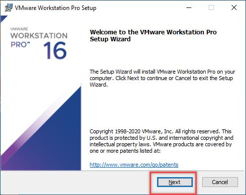
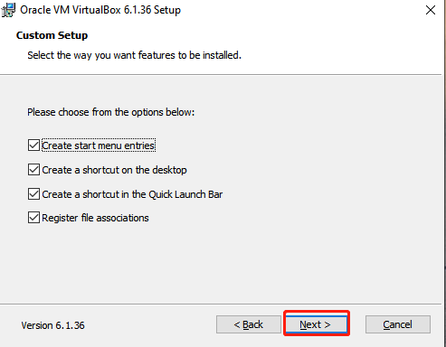
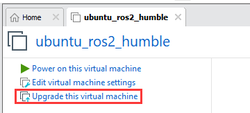
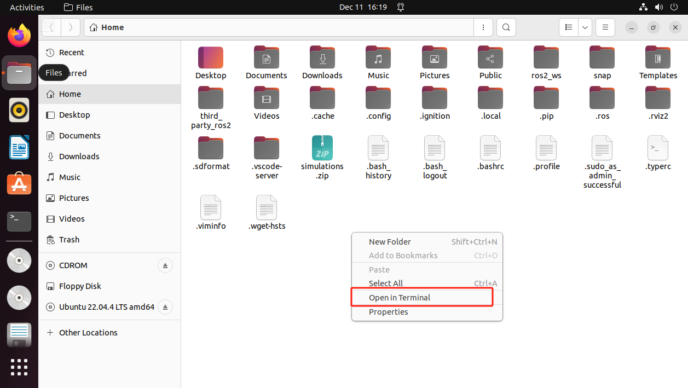
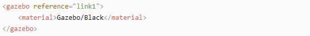
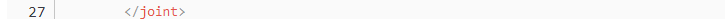

# 9. ROS2-Movelt & Gazebo Simulation

## 9.1 Virtual Machine Installation and Configuration

### 9.1.1 Virtual Machine Installation and Import

* **VMware Installation**

A virtual machine allows us to run other operating systems within our current operating system. In this section, we will demonstrate the installation process using VMware Workstation as an example:

(1) Unzip the virtual machine software package located under the "**Configuration File -\> VMware**" path.


(2) After unzipping, locate the virtual machine folder and double-click the executable file (with the "**.exe**" extension).


(3) Follow the on-screen instructions to complete the installation of the virtual machine.




(4) VMware Workstation offers 30-day free trial. After 30-day trial, you can purchase a license key to activate this software. If you need free resource, please contact us via email.


* **VirtualBox Installation**

(1) Open the software installation package in the same directory and click `Next`.


(2) Modify the installation path if needed, then click `Next`.


(3) No changes needed, just click `Next`.



(4) Confirm the installation and click `Start Installation`.


(5) Once the installation is complete, click `Finish`.


### 9.1.2 Virtual System Image Import

(1) In the software interface, click on `Open Virtual Machine`.


(2) Locate the required virtual machine file in the same directory, and open it.


(3) Select a storage path and click `Import`. Wait for the import to complete.


(4) Once the import is finished, you can start using the virtual machine.

### 9.1.3 Virtual Machine Settings

(1) Locate the virtual machine you just imported and click `Edit Virtual Machine Settings`.



(2) Click on `Network Adapter` and select `Bridged Mode`.


(3) Click on `Display` and uncheck the `Accelerate 3D Graphics` option.  

:::Note
Enabling the "Accelerate 3D Graphics" option can negatively affect virtual machine performance and may cause lag during simulation.
:::


### 9.1.4 Configuration

It is normal for the virtual machine to take a longer time to start for the first time.

The virtual machine interface is as below:


* **Package Import (Performed on Virtual Machine)**

(1) Start the virtual machine. Click the system desktop icon  to open the command-line terminal.

(2) Click the "**Home**" icon  on the desktop to enter the Home directory.

(3) Locate the [jetacker_description.zip](), [robot_gazebo.zip]() compressed file in the same directory. Drag the compressed file into the **Home** directory of the virtual machine.

:::{Note}

Only drag one file at a time.

:::

(4) Right-click in the Home directory and select **"Open in terminal"** to open the terminal.



(5) Enter the following command to create a directory:

```
mkdir -p ~/ros2_ws/src
```

(6) Execute the following commands to extract the source files and enter the source directory:

```
unzip ~/jetacker_description.zip -d ~/ros2_ws/src/ 
```

```
unzip  ~/robot_gazebo.zip -d ~/ros2_ws/src
```

If prompted to replace files, type **A** and press Enter.


(7) Run the following command to compile the packages and wait for the process to finish:

```
cd ~/ros2_ws && colcon build --symlink-install
```

(8) Run the following command to replace the `.typerc` file:

```
mv /home/ubuntu/.typerc ~/ros2_ws/.typerc
```

(9) Check if the file move was successful by running:

```
cd ~/ros2_ws/ && ls -a
```


(10) To update the settings, reload the configuration file using:

```
source ~/.bashrc
```

## 9.2 Introduction to URDF Models

### 9.2.1 URDF Model 

:::{Note}

This tutorial is based on configuration and simulation within a virtual machine. If the virtual machine is not yet installed, please first refer to [9.1 Virtual Machine Installation and Configuration to complete the installation.

:::

* **URDF Model Introduction**

The Unified Robot Description Format (URDF) is an XML file format widely used in ROS (Robot Operating System) to comprehensively describe all components of a robot.

Robots are typically composed of multiple links and joints. A link is defined as a rigid object with certain physical properties, while a joint connects two links and constrains their relative motion.

By connecting links with joints and imposing motion restrictions, a kinematic model is formed. The URDF file specifies the relationships between joints and links, their inertial properties, geometric characteristics, and collision models.

* **Comparison between Xacro and URDF Model**

The URDF model serves as a description file for simple robot models, offering a clear and easily understandable structure. However, when it comes to describing complex robot structures, using URDF alone can result in lengthy and unclear descriptions.

To address this limitation, the xacro model extends the capabilities of URDF while maintaining its core features. The xacro format provides a more advanced approach to describe robot structures. It greatly improves code reusability and helps avoid excessive description length.

For instance, when describing the two legs of a humanoid robot, the URDF model would require separate descriptions for each leg. On the other hand, the xacro model allows for describing a single leg and reusing that description for the other leg, resulting in a more concise and efficient representation.

* **Install URDF Dependency**

:::{Note}

The URDF and Xacro models are already pre-installed in the virtual machine, so there is no need for users to reinstall them. This section is for informational purposes only.

:::

(1) Run the following command and press Enter to update the package information:

```
sudo apt update
```


(2) Run the following command and press Enter to install the URDF dependencies:

```
sudo apt-get install ros-humble-urdf
```

When the output matches the image below, the installation is successful:


(3) Run the following command and press Enter to install the Xacro model extension for URDF:

```
sudo apt-get install ros-humble-xacro
```

When the output matches the image below, the installation is successful:


* **URDF Model Basic Syntax**

(1) XML Basic Syntax

The URDF model is written using XML standard.

**Elements**:

An element can be defined as desired using the following formula:

```
<element>

</element>
```

**Properties**:

Properties are included within elements to define characteristics and parameters. Please refer to the following formula to define an element with properties:

```
<element

property_1="property value1"

property_2="property value2">

</element>
```

**Comments**:

Comments have no impact on the definition of other properties and elements. Please use the following formula to define a comment:

**\<!-- comment content --\>**

(2) Link

The Link element describes the visual and physical properties of the robot's rigid component. The following tags are commonly used to define the motion of a link:


\<visual\>: Describe the appearance of the link, such as size, color and shape.

\<inertial\>: Describe the inertia parameters of the link, which will used in dynamics calculation.

\<collision\>: Describe the collision inertia property of the link

Each tag contains the corresponding child tag. The functions of the tags are listed below.

| **Tag**  |                         **Function**                         |
| :------: | :----------------------------------------------------------: |
|  origin  | Describe the pose of the link. It contains two parameters, including xyz and rpy. Xyz describes the pose of the link in the simulated map. Rpy describes the pose of the link in the simulated map. |
|   mess   |                Describe the mess of the link                 |
| inertia  | Describe the inertia of the link. As the inertia matrix is symmetrical, these six parameters need to be input, ixx, ixy, ixz, iyy, iyz and izz, as properties. These parameters can be calculated. |
| geometry | Describe the shape of the link. It uses mesh parameter to load texture file, and em\[ploys filename parameters to load the path for texture file. It has three child tags, namely box, cylinder and sphere. |
| material | Describe the material of the link. The parameter name is the required filed. The tag color can be used to change the color and transparency of the link. |

(3) Joint

The "**Joint**" tag describes the kinematic and dynamic properties of the robot's joints, including the joint's range of motion, target positions, and speed limitations. In terms of motion style, joints can be categorized into six types.

<table>   <thead>     <tr>       <th>Type and Explanation</th>       <th>Tag</th>     </tr>   </thead>   <tbody>     <tr>       <td>continuous joint: rotate around single axis continuously</td>       <td>continuous</td>     </tr>     <tr>       <td>revolute joint: similar to continuous, but its rotation angle is limited</td>       <td>revolute</td>     </tr>     <tr>       <td>prismatic joint: move along a axis within limited range</td>       <td>prismatic</td>     </tr>     <tr>       <td>Planar joints: translate or rotate in plane orthogonal directions</td>       <td>planar</td>     </tr>     <tr>       <td>floating joint: translate and rotate</td>       <td>floating</td>     </tr>     <tr>       <td>fixed joint: not allowed to do any movements</td>       <td>fixed</td>     </tr>   </tbody> </table>

The following tags will be used to write joint motion.


\<parent_link\>: Parent link

\<child_link\>: Child link

\<calibration\>: Calibrate the joint angle

\<dynamics\>: Describes some physical properties of motion

\<limit\>: Describes some limitations of the motion

The function of each tag is listed below. Each tag involves one or several child tags.

|      **Tag**      |                         **Function**                         |
| :---------------: | :----------------------------------------------------------: |
|      origin       | Describe the pose of the parent link. It involves two parameters, including xyz and rpy. Both xyz and rpy describe the pose of the link in simulated map. |
|       axis        | Control the child link to rotate around any axis of the parent link. |
|       limit       | The motion of the child link is constrained using the lower and upper properties, which define the limits of rotation for the child link. The effort properties restrict the allowable force range applied during rotation (values: positive and negative; units: N). The velocity properties confine the rotational speed, measured in meters per second (m/s). |
|       mimic       |          Describe the relationship between joints.           |
| safety_controller | Describes the parameters of the safety controller used for protecting the joint motion of the robot. |

(4) Robot Tag

The complete top tags of a robot, including the \<link\> and \<joint\> tags, must be enclosed within the \<robot\> tag. The format is as follows:


(5) gazebo Tag

This tag is used in conjunction with the Gazebo simulator. Within this tag, you can define simulation parameters and import Gazebo plugins, as well as specify Gazebo's physical properties, and more.



(6) Write Simple URDF Model

**Name the model of the robot**

To start writing the URDF model, we need to set the name of the robot following this format: "**\<robot name="robot model name"\>**". Lastly, input "**\</robot\>**" at the end to represent that the model is written successfully.


**Set links**

① To write the first link and use indentation to indicate that it is part of the currently set model. Set the name of the link using the following format: **\<link name="link name"\>**. Finally, conclude with "**\</link\>**" to indicate the successful completion of the link definition.


② Write the link description and use indentation to indicate that it is part of the currently set link, and conclude with "\</visual\>".


③ The "**\<geometry\>**" tag is employed to define the shape of a link. Once the description is complete, include "**\</geometry\>**". Within the "**\<geometry\>**" tag, indentation is used to specify the detailed description of the link's shape. The following example demonstrates a link with a cylindrical shape: "**\<cylinder length="0.01" radius="0.2"/\>**". In this instance, "**length="0.01"**" signifies a length of 0.01 meters for the link, while "**radius="0.2"**" denotes a radius of 0.2 meters, resulting in a cylindrical shape.


④ The "**\<origin\>**" tag is utilized to specify the position of a link, with indentation used to indicate the detailed description of the link's position. The following example demonstrates the position of a link: "**\<origin rpy="0 0 0" xyz="0 0 0" /\>**". In this example, "**rpy**" represents the roll, pitch, and yaw angles of the link, while "**xyz**" represents the coordinates of the link's position. This particular example indicates that the link is positioned at the origin of the coordinate system.


⑤ The "**\<material\>**" tag is used to define the visual appearance of a link, with indentation used to specify the detailed description of the link's color. To start describing the color, include "**\<material\>**", and end with "**\</material\>**" when the description is complete. The following example demonstrates setting a link color to yellow: "**\<color rgba="1 1 0 1" /\>**". In this example, "**rgba="1 1 0 1"**" represents the color threshold for achieving a yellow color.


**Set joint**

① To write the first joint, use indentation to indicate that the joint belongs to the current model being set. Then, specify the name and type of the joint as follows: "**\<joint name="joint name" type="joint type"\>**". Finally, include "**\</joint\>**" to indicate the completion of the joint definition.

:::{Note}

to learn about the type of the joint, please refer to "joint".

:::




② Write the description section for the connection between the link and the joint. Use indentation to indicate that it is part of the currently defined joint. The parent parameter and child parameter should be set using the following format: "**\<parent link="parent link"/\>**", and "**\<child link="child link" /\>**". With the parent link serving as the pivot, the joint rotates the child link.


③ "**\<origin\>**" describes the position of the joint using indention. This example describes the position of the joint: "**\<origin xyz="0 0 0.1" /\>**". xyz is the coordinate of the joint.


④ "**\<axis\>**" describes the position of the joint adopting indention. "**\<axis xyz="0 0 1" /\>**" describes one posture of a joint. xyz specifies the pose of the joint.


⑤ "**\<limit\>**" imposes restrictions on the joint using indention. The below picture The "**\<limit\>**" tag is used to restrict the motion of a joint, with indentation indicating the specific description of the joint angle limitations. The following example describes a joint with a maximum force limit of 300 Newtons, an upper limit of 3.14 radians, and a lower limit of -3.14 radians. The settings are defined as follows: "**effort="joint force (N)", velocity="joint motion speed", lower="lower limit in radians", upper="upper limit in radians**".


⑥ "**\<dynamics\>**" describes the dynamics of the joint using indention. "**\<dynamics damping="50" friction="1" /\>**" describes dynamics parameters of a joint.


The complete codes are as below.


### 9.2.2 ROS Robot URDF Model Instructions

* **Preparation**

 To understand the URDF model, you can refer to the "[9.2.1 ROS Robot URDF Model ->URDF Model Basic Syntax]()". This section provides a brief analysis of the robot model code and component models.

* **Viewing the Robot Model Code**

(1) Start the virtual machine and click the icon  to open the command-line terminal.

(2) Enter the following command and press Enter to navigate to the startup program directory:

```
cd ros2_ws/src/jetacker_description/urdf/
```

(3) Enter the following command to open the robot simulation model file:

```
vim jetacker.xacro
```

* **Brief Analysis of the Robot's Main Model**

Open a new terminal and enter the command to open the robot model file. This file contains descriptions of the various parts of the robot model.

```
vim jetacker_car.urdf.xacro
```

```
<?xml version="1.0" encoding="utf-8"?>

<robot name="jetacker" xmlns:xacro="<http://ros.org/wiki/xacro>" >
```

This is the beginning of the URDF file. It specifies the XML version and encoding, and defines a robot model named "hiwonder." The \`xmlns:xacro\` namespace is used here to define Xacro macros that generate the URDF.

The following line of code defines a Xacro property named "M_PI" and sets its value to the constant π:

```
<xacro:property name="M_PI"               value="3.1415926535897931"/>
```

A link named "base_footprint" is defined here, which represents the robot's chassis:

```
<link name="base_footprint"/> 
```

The robot’s characteristics, such as mass, width, height, and depth, are described as properties:

```
<xacro:property name="base_link_w"        value="0.297"/>

<xacro:property name="base_link_h"        value="1.145"/>

<xacro:property name="base_link_d"        value="0.11255"/>
```

The next section of code defines a joint called "base_joint," which is of the "fixed" type, indicating that it is a fixed joint. This joint connects a parent link named "base_footprint" and a child link named "base_link."

```
<joint name="base_joint" type="fixed">

    <parent link="base_footprint"/>

    <child link="base_link"/>

    <origin xyz="0.0 0.0 0.005" rpy="0 0 0"/>

  </joint>
```

The joint’s position (origin) is specified using an `xyz` attribute, where

`0.0 0.0 0` is an expression representing the location information. All are set

as "0" for the default position and direction. The code then defines a link named "w_link," which represents a link

component. The joint’s position (origin) and axis (axis) are set with some

default values.

```
  <link
    name="base_link">
    <xacro:box_inertial m="${base_link_mass}" w="${base_link_w}" h="${base_link_h}" d="${base_link_d}"/>
    <visual>
      <origin
        xyz="0 0 0"
        rpy="0 0 0" />
      <geometry>
        <mesh
          filename="package://jetacker_description/meshes/base_link.STL" />
      </geometry>
      <material name="black"/>
    </visual>
    <collision>
      <origin
        xyz="-0.004 0 ${base_link_d/2 + 0.022}"
        rpy="0 0 0" />
```

## 9.3 Gazebo Simulation

:::{Note}

This tutorial uses a virtual machine as an example for configuration and learning. If you have not installed a virtual machine, refer to [9.1 Virtual Machine Installation and Configuration]() for installation instructions before proceeding.

:::

### 9.3.1 Introduction to Gazebo

To simulate a realistic virtual physical environment where robots can perform tasks more effectively, we use a simulation software: Gazebo.

Gazebo is standalone software and is the most commonly used simulation tool in the ROS ecosystem. It provides:

- High-fidelity physical simulation conditions.

- A comprehensive set of sensor models.

- A user-friendly interactive interface.

These features enable robots to function effectively even in complex environments.

Gazebo supports URDF and SDF file formats for describing simulation environments. The robot models use the URDF format. Additionally, Gazebo provides many pre-built model modules that can be used directly.

Gazebo GUI Introduction

The simulation software interface is as below:


The specific functions of each position are detailed in the table below:

|   **Name**    |                         **Function**                         |
| :-----------: | :----------------------------------------------------------: |
| Tool bar (1)  | Provides commonly used options for interacting with the simulator. |
| Menu bar (2)  | Configures or modifies simulation parameters and offers interaction features. |
| Action Bar(3) | Allows manipulation of models and adjustment of parameters.  |
| Timestamp (4) |        Controls the time in the virtual environment.         |
|   Scene (5)   | The main part of the simulator where the simulation models are displayed. |

For more information about Gazebo, please visit the official website: [http://gazebosim.org/](http://gazebosim.org/).

Gazebo Learning Resources

Gazebo Official Website: [https://gazebosim.org/](https://gazebosim.org/)

Gazebo Tutorials: [https://gazebosim.org/tutorials](https://gazebosim.org/tutorials)

Gazebo GitHub Repository: [https://github.com/osrf/gazebo](https://github.com/osrf/gazebo)

Gazebo Answers Forum: [http://answers.gazebosim.org/](http://answers.gazebosim.org/)

### 9.3.2 Hardware Simulation in Gazebo

To better understand the robot's model and structure, you can use Gazebo for visualization. Follow these steps:

* **Start the Simulation**

:::{Note}

Command inputs are case-sensitive. Use the Tab key for auto-completion of keywords.

:::

(1) Start the VMware virtual machine. Click the terminal icon  on the desktop to open the command-line interface.

(2) Execute the command below to launch the Gazebo model:

```
ros2 launch robot_gazebo worlds.launch.py
```

The interface below indicates successful launch.


(3) Use the short-cut **Ctrl+C** to close the window to stop the running program.

* **Introduction to Shortcuts and Tools**

Here, we will introduce some commonly used shortcuts and tools in Gazebo, using mouse controls as examples:

Left Mouse Button:

Drag the Map: Press and hold the left mouse button on the map to drag it. 

Select Target: Click on a model to select it.

(1) Middle Mouse Button or Shift + Left Mouse Button:

Press and hold while moving the mouse to rotate the view around the current target position.

(2) Right Mouse Button or Mouse Wheel:

Hold the right mouse button or scroll the wheel to zoom in and out, focusing on the point under the cursor.

Toolbar Tools

We'll explain a few tools from the toolbar using the following example:

① Selection tool  ：This is Gazebo's default tool, used to select models.


② Move Tool   ：Use this tool to select a model and drag the three axes to control its movement.


③ Rotate Tool    : Use this tool to select a model and drag the three axes to control its rotation.


For more information about Gazebo, visit the official website:http://gazebosim.org/

### 9.3.3 Hardware Simulation in Gazebo**Operation**

:::{Note}

When entering commands, ensure correct capitalization and use the "**Tab**" key to auto-complete keywords where possible.

:::

If you need to perform mapping in an ideal environment but cannot do so in a real-world setting, you can create the desired scene in Gazebo for simulation-based mapping.

(1) Start the virtual machine. Click-on the icon  to launch the command-line terminal.

(2) Enter the following command and press Enter key to move to the relevant directory:

```
cd /home/ubuntu/ros2_ws/src/robot_gazebo/urdf   
```

(3) Use the following command to open the LiDAR simulation file for editing:

```
vim lidar.gazebo.xacro
```

This file contains details about the LiDAR simulation model, including its name, detection range, position, noise reduction settings, and topic messages.

To better understand this file, refer to the "Introduction to URDF Models" section for learning the relevant syntax.


* **IMU Simulation**

:::{Note}

When entering commands, ensure correct capitalization and use the "**Tab**" key to auto-complete keywords where possible.

:::

(1) Start the virtual machine. Click-on the icon  to launch the command-line terminal.

(2) Run the following command and hit Enter key to navigate to navigate to the program directory:

```
cd /home/ubuntu/ros2_ws/src/robot_gazebo/urdf
```

(3) Enter the following command to open the IMU simulation model file:

```python
vim imu.gazebo.xacro
```

This file defines properties of the IMU simulation model, such as name, offset settings, noise reduction settings, acceleration settings, topic messages, and more. To understand this file, please refer to the "Introduction to URDF Models" for relevant syntax.


### 9.3.4 Gazebo Mapping Simulation

* **Operation**

:::{Note}

When entering commands, be sure to distinguish between uppercase and lowercase letters, and use the “Tab” key to auto-complete keywords.

:::

If you need to perform mapping in an ideal environment but cannot do so in a real-world setting, you can create the desired scene in Gazebo for simulation-based mapping.

(1) Start the virtual machine. Click the system desktop icon  to open the command-line terminal.

:::{Note}

Wait for each service to fully start before launching the next one to avoid simulation failure.

:::

(2) Enter the following command to start the simulation map:

```
ros2 launch robot_gazebo room_worlds.launch.py
```


(3) Enter the following command in the new terminal to launch the mapping service:

```
ros2 launch robot_gazebo slam.launch.py
```


* **Mapping Instructions**

(1) Execute the following command to initiate the keyboard control.

```python
ros2 run robot_gazebo teleop_key_control
```

After the following window appears, click anywhere inside the window to start controlling the robot. The specific key functions are as follows:

<table>   <tr>     <td>w</td>     <td>Move forward</td>     <td>Click</td>   </tr>   <tr>     <td>s</td>     <td>Move backward</td>     <td>Click</td>   </tr>   <tr>     <td>a</td>     <td>Turn left</td>     <td>Hold</td>   </tr>   <tr>     <td>d</td>     <td>Turn right</td>     <td>Hold</td>   </tr>   <tr>     <td>w</td>     <td>Move forward</td>     <td>Click</td>   </tr> </table>

(2) The mapping process will be displayed synchronously in the RVIZ tool, as shown in the image below.

 

Continue the scanning until the map reaches a state similar to the one shown below.


(3)  Enter the directory to save the map and save the map:

```python
cd ~/ros2_ws/src/robot_gazebo/maps && ros2 run nav2_map_server map_saver_cli -f "map_01" --ros-args -p
map_subscribe_transient_local:=true
```

In the command, "**map_01**" is the name of the map. You can rename it according to your needs. If the following message appears, the map has been saved successfully.

(4) To stop the program running in the current terminal window, press the shortcut **Ctrl+C**.

* **FAQ**

Q: No map is displayed after opening the RVIZ simulation tool, only the robot model is shown.

A: This issue may occur if multiple services are running simultaneously,causing the robot's processes to become congested. It is recommended to stop all processes by pressing Ctrl+C in the terminal, and then restart the   services in order. Wait for each service to fully start before entering the next command.

Additional Information:

Use the following two commands to forcefully kill all processes:

```python
ps aux | grep ign | grep -v grep | awk '{ print "sudo kill -9", $2 }' | sh
```

### 9.3.5 Gazebo Navigation Simulation

When using Gazebo software to complete mapping, you can also perform navigation within the software scene to achieve a simulated effect.

* **Operation**

(1) Start the virtual machine. Click-on  to initiate the command-line terminal.

:::{Note}

Wait for each service to fully start before launching the next one to avoid simulation failure.

:::

(2) Enter the following command to start the simulation map:

```
ros2 launch robot_gazebo room_worlds.launch.py nav:=true
```

(3) Start a new command-line terminalExecute the command below to load the map and start the navigation.

```
ros2 launch robot_gazebo navigation.launch.py map:=map_01
```

The "map_01" at the end of the command is the map name. You can modify this parameter based on your needs. The map is stored in the following path:"**/home/ubuntu/ros2_ws/src/robot_gazebo/maps**".


* **Start Navigation**

The software menu bar includes three tools: 2D Pose Estimate, 2D Nav Goal, and Publish Point.


The software menu bar includes three tools: 2D Pose Estimate, 2D Nav Goal, and Publish Point.

**2D Pose Estimate** is used to set the robot's initial position.

**2D Nav Goal** is used to set a single target point for the robot.  

**Publish Point** is used to set multiple target points for the robot.

(1) Click on the **2D Nav Goal** tool in the software menu bar. Then, click on the map to select a target point. If you press and hold the mouse button while dragging, you can also adjust the robot's orientation after reaching the target point. Once selected, the robot will automatically generate a route and move to the target point.


(2)  After confirming the target point, the map will display the robot's planned path, and the robot’s simulation model will move to the corresponding location.


(3) To use the multi-point navigation feature, first click the button shown in the lower-left corner, as illustrated in the image.


(4)  Click the icon  then left-click and drag on the map at a specific point to set the direction and define a target point. To set multiple target points, repeat the above steps.


(5) Click the button shown in the lower-left corner to start navigation.


(6) To stop the navigation, return to the terminal and press **Ctrl+C** in each terminal window to close the running process.
